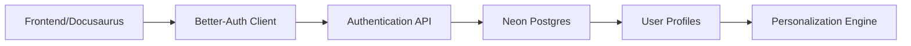

# User Authentication with Better-Auth

**Bonus Feature** | **Points**: 50

This feature implements user authentication using [Better-Auth](https://www.better-auth.com/), allowing personalized learning experiences.

## Overview

User authentication enables:
- **User Profiles**: Store learning progress and preferences
- **Personalized Content**: Adapt content based on background
- **Progress Tracking**: Monitor chapter completion
- **Saved Conversations**: Persistent chatbot history

## Implementation Status

🚧 **In Development**

This feature is planned for future implementation. It includes:

1. **Better-Auth Integration**
   - Email/password authentication
   - OAuth providers (Google, GitHub)
   - Session management
   - Secure token handling

2. **User Profile Creation**
   - Background profiling questions at signup:
     - Programming experience level
     - Prior robotics experience
     - Familiarity with ROS 2
     - Primary learning goal
     - Available hardware (simulation/Jetson/full lab)

3. **Database Schema** (Neon Postgres)
   ```sql
   CREATE TABLE users (
     id UUID PRIMARY KEY,
     email VARCHAR(255) UNIQUE NOT NULL,
     hashed_password TEXT,
     created_at TIMESTAMP DEFAULT NOW()
   );

   CREATE TABLE user_profiles (
     user_id UUID REFERENCES users(id),
     programming_level VARCHAR(50),
     robotics_experience VARCHAR(50),
     ros2_familiarity VARCHAR(50),
     learning_goal TEXT,
     hardware_access VARCHAR(100),
     updated_at TIMESTAMP DEFAULT NOW()
   );

   CREATE TABLE progress (
     user_id UUID REFERENCES users(id),
     chapter_id VARCHAR(100),
     completed BOOLEAN DEFAULT FALSE,
     completed_at TIMESTAMP
   );
   ```

## Architecture



## Planned Features

### 1. Signup Flow
- User enters email and password
- Presents background questionnaire
- Creates profile in database
- Generates session token

### 2. Signin Flow
- User provides credentials
- Validates against database
- Creates session
- Loads user profile

### 3. Profile Dashboard
- View learning progress
- Update preferences
- Track completed chapters
- View chatbot conversation history

### 4. OAuth Integration
- Google Sign-In
- GitHub Sign-In
- One-click authentication

## Security Considerations

- Passwords hashed with bcrypt
- Secure session tokens (JWT)
- HTTP-only cookies
- CSRF protection
- Rate limiting on auth endpoints
- Input validation and sanitization

## Implementation Guide

When implementing this feature:

1. Install Better-Auth:
   ```bash
   npm install better-auth
   ```

2. Configure Better-Auth client in `src/components/AuthProvider.tsx`

3. Create signup/signin pages in `src/pages/`

4. Integrate with Neon Postgres for user storage

5. Add authentication middleware to protected routes

6. Implement profile questionnaire component

## Next Steps

To enable this feature:
1. Set up Neon Postgres database
2. Configure Better-Auth with OAuth credentials
3. Implement authentication UI components
4. Test signup/signin flows
5. Integrate with personalization feature

## Resources

- [Better-Auth Documentation](https://www.better-auth.com/docs)
- [Neon Postgres](https://neon.tech/)
- [JWT Best Practices](https://tools.ietf.org/html/rfc8725)

---

*This feature is part of the bonus features for the Panaversity Hackathon (50 points).*
