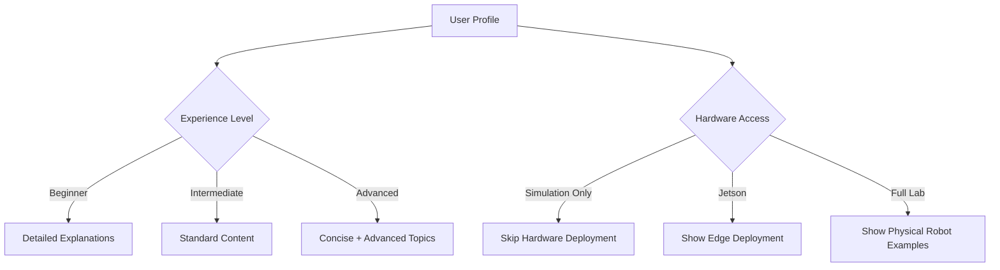

# Content Personalization

**Bonus Feature** | **Points**: 50

This feature adapts textbook content based on user background and experience level.

## Overview

Content personalization provides:
- **Adaptive Explanations**: Match detail level to user experience
- **Customized Examples**: Relevant to user's background
- **Difficulty Adjustment**: Skip basics or add advanced topics
- **Hardware-Specific**: Show relevant examples based on available hardware

## Implementation Status

🚧 **In Development**

## How It Works

### User Profile Analysis

Based on signup questionnaire:
- **Programming Experience**: Beginner / Intermediate / Advanced
- **Robotics Background**: None / Academic / Professional
- **ROS 2 Familiarity**: None / Basic / Intermediate / Expert
- **Learning Goal**: Understanding / Hands-on / Career
- **Hardware**: Simulation only / Jetson / Full lab

### Personalization Logic



## Personalization Examples

### For Beginners
```markdown
# ROS 2 Topics

Topics are like mailboxes where nodes can send and receive messages.

**Think of it like this**: Imagine a bulletin board in an office.
Anyone can post messages (publish) and anyone can read them (subscribe).
In ROS 2, topics work the same way!

**Step-by-step example**:
1. Create a publisher node...
2. Create a subscriber node...
3. Run both and see the messages...

[Detailed 10-step tutorial with screenshots]
```

### For Advanced Users
```markdown
# ROS 2 Topics

Topics use DDS pub-sub pattern with configurable QoS.

**Quick reference**:
```python
publisher = node.create_publisher(String, '/topic', qos_profile)
subscription = node.create_subscription(String, '/topic', callback, qos_profile)
```

**Performance considerations**:
- Use best_effort for high-frequency data
- Tune history depth based on processing latency

[Link to advanced optimization techniques]
```

## Implementation Approach

### Option 1: Static Personalization (Simpler)
- Pre-generate 3 versions of each chapter (beginner/intermediate/advanced)
- Toggle button at chapter start: "Show Beginner / Standard / Advanced"
- Cache personalized versions per profile type

### Option 2: Dynamic Personalization (Better)
- Use GPT-4 to adapt content on-demand
- Cache personalized chapters per user
- Prompt engineering for consistent quality

```python
def personalize_content(chapter_content, user_profile):
    prompt = f"""
    Adapt this robotics textbook chapter for a user with:
    - Programming: {user_profile.programming_level}
    - Robotics: {user_profile.robotics_experience}
    - ROS 2: {user_profile.ros2_familiarity}

    Adjust:
    - Explanation detail (more for beginners, less for experts)
    - Code examples (annotated for beginners, concise for experts)
    - Skip prerequisites they already know
    - Add advanced challenges for experts

    Original content:
    {chapter_content}

    Personalized content:
    """

    return openai.ChatCompletion.create(
        model="gpt-4",
        messages=[{"role": "user", "content": prompt}],
        max_tokens=4000
    )
```

## UI Components

### Personalization Button

At the top of each chapter:

```
[🎯 Personalize This Chapter]
```

Clicking shows:
- "Adapting content to your profile..."
- Personalized content replaces original
- Toggle back to "Show Original"

### Profile Settings

In user dashboard:
```
Your Learning Profile:
☑ Programming: Advanced
☑ Robotics: Academic
☑ ROS 2: Basic
☑ Goal: Career transition
☑ Hardware: Jetson Orin

[Update Profile] [Reset Personalization]
```

## Personalization Rules

| Profile | Content Adjustments |
|---------|---------------------|
| **Beginner** | More analogies, step-by-step, verbose code comments, screenshots |
| **Intermediate** | Standard content, practical tips, real-world examples |
| **Advanced** | Concise explanations, performance tips, research papers, challenges |
| **No ROS 2** | Extra setup guidance, ROS 2 basics recap |
| **Simulation Only** | Skip hardware deployment sections, focus on cloud |
| **Has Jetson** | Include edge deployment examples, optimization tips |

## Caching Strategy

To minimize API costs:
1. Generate personalized version once per user per chapter
2. Store in database with `(user_id, chapter_id, personalized_content)`
3. Serve from cache on subsequent visits
4. Invalidate cache when user updates profile
5. LLM calls only for new personalizations (~$0.02 per chapter)

## Technical Implementation

### Backend API
```python
@app.post("/api/personalize/chapter")
async def personalize_chapter(
    chapter_id: str,
    user_id: str,
    db: Session = Depends(get_db)
):
    # Check cache
    cached = get_cached_personalization(user_id, chapter_id)
    if cached:
        return cached

    # Get user profile
    profile = get_user_profile(user_id)

    # Get original chapter content
    chapter = get_chapter_content(chapter_id)

    # Personalize with GPT-4
    personalized = personalize_with_llm(chapter, profile)

    # Cache result
    cache_personalization(user_id, chapter_id, personalized)

    return personalized
```

### Frontend Component
```tsx
function PersonalizationButton({ chapterId }) {
  const [personalized, setPersonalized] = useState(false);
  const [loading, setLoading] = useState(false);

  const handlePersonalize = async () => {
    setLoading(true);
    const response = await fetch('/api/personalize/chapter', {
      method: 'POST',
      body: JSON.stringify({ chapter_id: chapterId, user_id: userId })
    });
    const data = await response.json();
    setPersonalized(data.content);
    setLoading(false);
  };

  return (
    <button onClick={handlePersonalize}>
      {loading ? 'Personalizing...' : '🎯 Personalize This Chapter'}
    </button>
  );
}
```

## Cost Estimation

- GPT-4 API: ~$0.02 per chapter personalization
- 12 chapters × 100 users = $24 total
- With caching, most users hit cache after first generation

## Next Steps

To implement:
1. Add personalization button UI component
2. Create personalization API endpoint
3. Implement GPT-4 prompt engineering
4. Set up caching in Neon Postgres
5. Test with different profile types
6. Optimize prompts for quality and cost

## Resources

- [OpenAI GPT-4 API](https://platform.openai.com/docs/api-reference)
- [Prompt Engineering Guide](https://www.promptingguide.ai/)

---

*This feature is part of the bonus features for the Panaversity Hackathon (50 points).*
