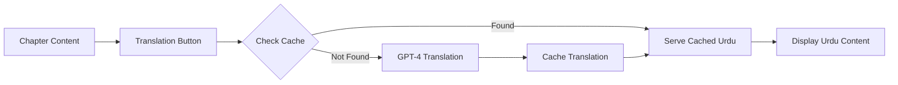

# Urdu Translation Support

**Bonus Feature** | **Points**: 50

This feature provides Urdu translation for all textbook content, making Physical AI education accessible to Urdu-speaking students.

## Overview

Translation support enables:
- **Full Chapter Translation**: Translate entire chapters to Urdu
- **Technical Term Preservation**: Keep technical terms in English
- **Code Comment Translation**: Translate comments, keep code
- **Toggle Interface**: Easy switch between English and Urdu

## Implementation Status

🚧 **In Development**

## How It Works

### Translation Button

At the top of each chapter:

```
[English 🇬🇧] [اردو 🇵🇰]
```

Click "اردو" to translate the entire chapter to Urdu.

### Translation Rules

1. **Technical Terms**: Keep in English
   - ROS 2, URDF, Gazebo, Isaac Sim, Nav2
   - Python, C++, YAML, XML
   - Variable names and function names

2. **Code Blocks**: Keep unchanged
   - Only translate code comments
   - Keep all code syntax as-is

3. **Diagrams**: Keep English labels
   - (Urdu labels optional if feasible)

4. **Mathematical Notation**: Universal, keep as-is

## Example Translation

### Original (English):
```markdown
## ROS 2 Topics

Topics are communication channels in ROS 2. Nodes publish messages
to topics, and other nodes subscribe to receive those messages.

```python
# Create a publisher
publisher = node.create_publisher(String, '/hello_topic', 10)

# Publish a message
msg = String()
msg.data = 'Hello ROS 2!'
publisher.publish(msg)
```
```

### Translated (Urdu):
```markdown
## ROS 2 Topics

Topics ROS 2 میں communication channels ہیں۔ Nodes topics پر messages publish کرتے ہیں،
اور دوسرے nodes ان messages کو receive کرنے کے لیے subscribe کرتے ہیں۔

```python
# Publisher بنائیں
publisher = node.create_publisher(String, '/hello_topic', 10)

# Message publish کریں
msg = String()
msg.data = 'Hello ROS 2!'
publisher.publish(msg)
```
```

## Technical Implementation

### Option 1: GPT-4 Translation (Recommended)

Use GPT-4 with specialized prompts:

```python
def translate_to_urdu(chapter_content):
    prompt = f"""
    Translate this robotics textbook chapter from English to Urdu.

    IMPORTANT RULES:
    1. Keep technical terms in English: ROS 2, URDF, Gazebo, Python, etc.
    2. Keep all code blocks unchanged except comments
    3. Keep mathematical formulas as-is
    4. Use natural Urdu with mixed English technical terms
    5. Preserve markdown formatting

    English chapter:
    {chapter_content}

    Urdu translation:
    """

    response = openai.ChatCompletion.create(
        model="gpt-4",
        messages=[{"role": "user", "content": prompt}],
        max_tokens=4000,
        temperature=0.3  # Lower for consistent technical translation
    )

    return response.choices[0].message.content
```

### Option 2: Google Translate API

Cheaper but lower quality for technical content:

```python
from google.cloud import translate_v2

def translate_to_urdu(text):
    translator = translate_v2.Client()
    result = translator.translate(
        text,
        target_language='ur',
        source_language='en'
    )
    return result['translatedText']
```

## Architecture



## Caching Strategy

To minimize costs and improve performance:

```sql
CREATE TABLE translations (
  chapter_id VARCHAR(100) PRIMARY KEY,
  language VARCHAR(10),
  translated_content TEXT,
  created_at TIMESTAMP DEFAULT NOW(),
  updated_at TIMESTAMP DEFAULT NOW()
);

CREATE INDEX idx_translations_chapter_lang
ON translations(chapter_id, language);
```

**Strategy**:
1. Translate each chapter once (on first request)
2. Cache in database
3. Serve from cache for all subsequent requests
4. Invalidate cache only when chapter content updates

**Cost**: ~$0.10 per chapter × 12 chapters = $1.20 one-time cost

## UI Components

### Translation Toggle

```tsx
function TranslationToggle({ chapterId, content }) {
  const [language, setLanguage] = useState('en');
  const [urduContent, setUrduContent] = useState(null);
  const [loading, setLoading] = useState(false);

  const handleTranslate = async () => {
    setLoading(true);
    const response = await fetch('/api/translate/chapter', {
      method: 'POST',
      headers: { 'Content-Type': 'application/json' },
      body: JSON.stringify({
        chapter_id: chapterId,
        target_language: 'ur'
      })
    });
    const data = await response.json();
    setUrduContent(data.translated_content);
    setLanguage('ur');
    setLoading(false);
  };

  return (
    <div className="translation-toggle">
      <button
        onClick={() => setLanguage('en')}
        className={language === 'en' ? 'active' : ''}
      >
        English 🇬🇧
      </button>
      <button
        onClick={handleTranslate}
        className={language === 'ur' ? 'active' : ''}
        disabled={loading}
      >
        {loading ? 'ترجمہ ہو رہا ہے...' : 'اردو 🇵🇰'}
      </button>

      {language === 'ur' && urduContent && (
        <div className="urdu-content" dir="rtl">
          {urduContent}
        </div>
      )}
      {language === 'en' && (
        <div className="english-content">
          {content}
        </div>
      )}
    </div>
  );
}
```

### CSS for RTL Support

```css
.urdu-content {
  direction: rtl;
  text-align: right;
  font-family: 'Noto Nastaliq Urdu', 'Jameel Noori Nastaleeq', serif;
  font-size: 1.1em;
  line-height: 2;
}

.urdu-content code {
  direction: ltr;
  text-align: left;
  font-family: 'Fira Code', 'Consolas', monospace;
}
```

## Backend API

```python
from fastapi import APIRouter, HTTPException
from pydantic import BaseModel

router = APIRouter()

class TranslationRequest(BaseModel):
    chapter_id: str
    target_language: str

@router.post("/api/translate/chapter")
async def translate_chapter(request: TranslationRequest):
    # Check cache
    cached = get_cached_translation(
        request.chapter_id,
        request.target_language
    )
    if cached:
        return {"translated_content": cached}

    # Get original content
    chapter_content = get_chapter_content(request.chapter_id)

    # Translate with GPT-4
    translated = translate_to_urdu(chapter_content)

    # Cache result
    cache_translation(
        request.chapter_id,
        request.target_language,
        translated
    )

    return {"translated_content": translated}
```

## Translation Quality

### Sample GPT-4 Prompt for High Quality

```
You are an expert technical translator specializing in robotics and AI education.

Translate this English robotics textbook chapter to Urdu while maintaining:
1. Technical accuracy
2. Natural Urdu flow
3. Educational clarity

STRICT RULES:
- Keep these terms in English: ROS 2, URDF, Gazebo, Python, C++, SLAM, IMU, LIDAR
- Keep code blocks completely unchanged except comments
- Keep mathematical formulas as-is
- Use Romanized technical terms naturally mixed with Urdu
- Preserve markdown formatting exactly

Example:
"ROS 2 nodes communicate via topics" →
"ROS 2 nodes topics کے ذریعے communicate کرتے ہیں"

Now translate this chapter:
[CHAPTER_CONTENT]
```

## Quality Assurance

1. **Test Translation**: Verify with Urdu-speaking reviewers
2. **Technical Accuracy**: Ensure technical terms preserved correctly
3. **Code Integrity**: Verify all code blocks unchanged
4. **Formatting**: Check markdown rendering in Urdu
5. **RTL Layout**: Test right-to-left display

## Next Steps

To implement:
1. Add translation toggle button component
2. Create translation API endpoint
3. Set up translation caching in database
4. Configure GPT-4 with translation prompts
5. Add Urdu font support in CSS
6. Test RTL layout thoroughly
7. Get native Urdu speaker feedback

## Resources

- [OpenAI GPT-4 for Translation](https://platform.openai.com/docs)
- [Urdu Fonts for Web](https://fonts.google.com/?query=urdu)
- [RTL Layout Best Practices](https://rtlstyling.com/)
- [Unicode Urdu Character Set](https://www.unicode.org/charts/PDF/U0600.pdf)

---

*This feature is part of the bonus features for the Panaversity Hackathon (50 points).*
