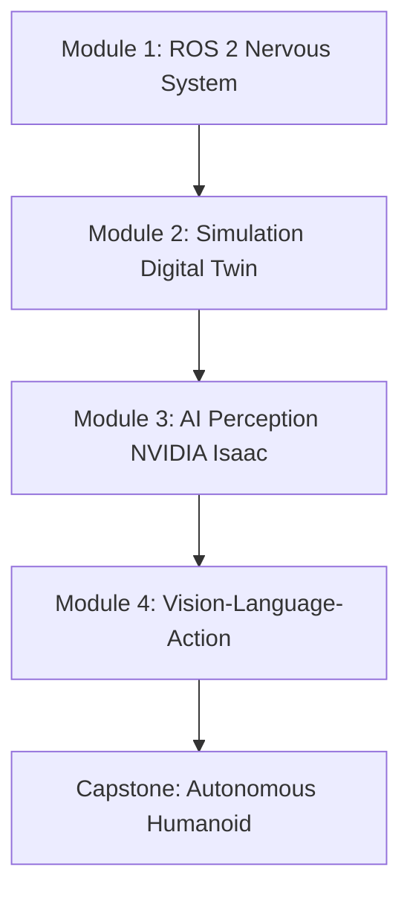

# Chapter 1: Introduction to Physical AI and Embodied Intelligence

**Week 1** | **Duration**: 3-4 hours | **Complexity**: Beginner

---

## Learning Objectives

By the end of this chapter, you will be able to:

1. **Define** Physical AI and contrast it with digital AI systems
2. **Understand** embodied intelligence and its importance for robotics
3. **Identify** key challenges in Physical AI (perception, actuation, real-time constraints)
4. **Recognize** the current humanoid robotics landscape and major players
5. **Explain** why humanoid robots are poised to excel in human-centered environments

---

## Introduction

The future of AI extends beyond digital spaces into the physical world. While Large Language Models (LLMs) and AI agents operate in purely digital domains—processing text, generating images, making recommendations—**Physical AI** must bridge the gap between computation and reality.

**Physical AI** refers to AI systems that:
- Operate in the real world with physical embodiment
- Perceive through sensors (cameras, LIDAR, touch)
- Act through actuators (motors, grippers, wheels)
- Understand and obey physical laws (gravity, friction, inertia)
- Interact with humans and objects in 3D space

This course focuses on the most challenging and promising form of Physical AI: **humanoid robots**.

---

## 1. From Digital AI to Physical AI

### 1.1 Digital AI: The Current State

Digital AI systems like ChatGPT, Midjourney, and AlphaGo operate in:
- **Text space**: Generating and understanding language
- **Image space**: Creating and classifying images
- **Game space**: Playing chess, Go, or video games

**Characteristics**:
- ✅ No physical consequences of errors
- ✅ Instant "reset" capability
- ✅ Perfect reproducibility
- ✅ Abundant training data
- ❌ No understanding of physical reality

### 1.2 Physical AI: The Next Frontier

Physical AI systems like humanoid robots must operate in:
- **3D physical space**: Navigate real-world environments
- **Real-time**: React to dynamic, unpredictable situations
- **With consequences**: Errors can cause damage or injury

**Characteristics**:
- ❌ Physical consequences of errors (costly, dangerous)
- ❌ Cannot simply "reset" the world
- ❌ Hardware variability and degradation
- ✅ Rich sensory data (vision, touch, proprioception)
- ✅ Ability to manipulate the world

### 1.3 The Sim-to-Real Gap

One of the biggest challenges in Physical AI is the **sim-to-real gap**:


**Why the gap exists**:
- Simulations approximate physics (friction, contact dynamics)
- Real sensors have noise and latency
- Real actuators have delays and imprecision
- Unexpected environmental factors (wind, uneven surfaces, lighting)

**Solutions** (covered in Modules 2-3):
- Domain randomization
- Photorealistic simulation (NVIDIA Isaac Sim)
- Sim-to-real transfer techniques
- Continuous learning from real-world experience

---

## 2. Embodied Intelligence

### 2.1 What is Embodied Intelligence?

**Embodied intelligence** is the idea that intelligence emerges from the interaction between:
1. **Brain** (computation, planning, decision-making)
2. **Body** (sensors, actuators, physical form)
3. **Environment** (the physical world)

> "Intelligence is not just in the brain—it's distributed across the brain-body-environment system."

### 2.2 Why Embodiment Matters

Consider these tasks:
- **Grasping a fragile egg**: Requires force feedback, not just vision
- **Walking on uneven terrain**: Requires proprioception (body awareness)
- **Opening an unknown door**: Requires tactile exploration and adaptation

Pure digital AI cannot solve these without embodiment.

### 2.3 Humanoid Advantage

Why humanoids specifically?

1. **Human-Centered World**: Our buildings, tools, and furniture are designed for humans
2. **Abundant Training Data**: Billions of hours of human movement data exist (videos, motion capture)
3. **Intuitive for Humans**: Easier to predict and understand humanoid behavior
4. **Versatility**: Can perform any task humans can (in theory)

<!-- Humanoid Robot Anatomy Diagram -->

---

## 3. The Humanoid Robotics Landscape

### 3.1 Current Major Players

| Company/Lab | Robot | Key Features |
|-------------|-------|--------------|
| **Boston Dynamics** | Atlas | Dynamic locomotion, parkour, backflips |
| **Tesla** | Optimus (Gen 2) | Mass production focus, affordable ($20-30k target) |
| **Unitree** | H1 / G1 | Affordable ($90k / $16k), open SDK, research-friendly |
| **Figure AI** | Figure 01 | Commercial deployment focus, warehouse automation |
| **Agility Robotics** | Digit | Bipedal delivery robot, commercial trials |
| **1X Technologies** | NEO | Human-like design, teleoperation, safe human interaction |

### 3.2 Key Technical Challenges

Physical AI faces unique challenges compared to digital AI:

#### **Perception**
- **Problem**: Noisy, incomplete sensor data
- **Solution**: Sensor fusion (LIDAR + cameras + IMU)
- **Module Coverage**: Module 2 (Sensors), Module 3 (Isaac ROS)

#### **Actuation**
- **Problem**: Motors have delays, torque limits, and wear
- **Solution**: Model-based control, PID tuning, whole-body control
- **Module Coverage**: Module 2 (Gazebo Controllers), Module 4 (Kinematics)

#### **Real-Time Computation**
- **Problem**: Must react in milliseconds, not seconds
- **Solution**: Edge AI (NVIDIA Jetson), hardware acceleration, efficient algorithms
- **Module Coverage**: Module 3 (Isaac ROS)

#### **Safety**
- **Problem**: Robots can hurt humans or damage property
- **Solution**: Force limits, emergency stops, collision avoidance
- **Module Coverage**: Module 2 (Simulation Safety), Module 4 (Human-Robot Interaction)

#### **Generalization**
- **Problem**: Robots fail in novel situations
- **Solution**: Large-scale training data, foundation models, continuous learning
- **Module Coverage**: Module 4 (Vision-Language-Action)

---

## 4. Sensor Systems Overview

Physical AI systems perceive the world through sensors. Here are the key types:

### 4.1 Vision Sensors

**RGB Cameras**
- **Purpose**: Color images for object detection, scene understanding
- **Example**: Webcam, industrial cameras
- **Data**: 1920x1080 images at 30 FPS

**Depth Cameras (RGB-D)**
- **Purpose**: Distance to every pixel (3D perception)
- **Example**: Intel RealSense D435i, Microsoft Kinect
- **Data**: RGB + depth map (point clouds)

**LIDAR (Light Detection and Ranging)**
- **Purpose**: Precise distance measurements in 360° or 3D
- **Example**: Velodyne, Ouster, solid-state LIDAR
- **Data**: Point clouds (millions of 3D points)

### 4.2 Inertial Sensors

**IMU (Inertial Measurement Unit)**
- **Accelerometer**: Measures linear acceleration
- **Gyroscope**: Measures angular velocity
- **Purpose**: Balance, orientation, motion estimation

### 4.3 Force and Tactile Sensors

**Force/Torque Sensors**
- **Purpose**: Measure forces during contact (grasping, pushing)
- **Location**: Wrists, ankles, gripper fingers

**Tactile Sensors**
- **Purpose**: Detect contact, pressure distribution, texture
- **Example**: Robot fingertips with pressure arrays

### 4.4 Proprioception

**Joint Encoders**
- **Purpose**: Measure joint angles (robot's "body awareness")
- **Essential for**: Kinematics, control, collision avoidance

---

## 5. Why Humanoid Robots Matter Now

### 5.1 Technological Convergence

Three trends have made humanoid robots feasible:

1. **AI Foundation Models** (2020s)
   - LLMs for natural language understanding (GPT-4, Claude)
   - Vision-Language Models for scene understanding (CLIP, BLIP)
   - Vision-Language-Action (VLA) models for robotic control

2. **Simulation at Scale** (2018-present)
   - Photorealistic simulation (NVIDIA Isaac Sim)
   - Massive parallelization (train 1000s of robots simultaneously)
   - Sim-to-real transfer improvements

3. **Edge AI Hardware** (2020s)
   - NVIDIA Jetson Orin (275 TOPS at 15W)
   - Affordable, powerful edge compute for real-time inference

### 5.2 Economic Drivers

- **Labor Shortage**: Aging populations, dangerous jobs
- **Cost Reduction**: Humanoid hardware costs dropping 10x in 5 years
- **Market Size**: $38 billion projected by 2035 (Goldman Sachs)

### 5.3 Application Areas

- **Manufacturing**: Assembly, inspection, material handling
- **Logistics**: Warehouse picking, delivery
- **Healthcare**: Elder care, patient assistance, surgery assistance
- **Service**: Hospitality, retail, cleaning
- **Hazardous Environments**: Disaster response, nuclear plants, space

---

## 6. Course Roadmap: From Zero to Autonomous Humanoid

This course will take you through the complete stack:



### Module 1: The Robotic Nervous System (Weeks 1-5)
- ROS 2 architecture and communication
- Python robotics programming
- URDF robot descriptions

### Module 2: The Digital Twin (Weeks 6-7)
- Gazebo and Unity simulation
- Sensor simulation (LIDAR, cameras, IMU)
- Robot control and physics

### Module 3: The AI-Robot Brain (Weeks 8-10)
- NVIDIA Isaac Sim and Isaac ROS
- Hardware-accelerated perception (VSLAM)
- Navigation with Nav2

### Module 4: Vision-Language-Action (Weeks 11-13)
- Humanoid kinematics and locomotion
- Manipulation and grasping
- LLM integration for voice commands
- **Capstone**: Autonomous humanoid with voice-to-action

---

## 7. The Capstone Project Preview

By the end of this course, you will build an **Autonomous Humanoid** that:

1. 🎤 **Listens** to voice commands ("Go to the kitchen and bring me a cup")
2. 🧠 **Plans** using an LLM (GPT-4 translates to robot actions)
3. 🚶 **Navigates** using VSLAM and Nav2 (avoids obstacles)
4. 👁️ **Perceives** objects using computer vision (YOLO, depth cameras)
5. 🤖 **Manipulates** objects with MoveIt2 (inverse kinematics, grasping)
6. 🗣️ **Confirms** task completion with text-to-speech

This will be a simulated robot (Gazebo or Isaac Sim), but the principles transfer directly to real hardware.

---

## 8. Ethical Considerations

As we build increasingly capable physical AI, we must consider:

### 8.1 Safety
- Robots can cause physical harm
- Must have emergency stops, force limits, collision avoidance
- Safety-first design philosophy

### 8.2 Privacy
- Cameras and microphones record private spaces
- Must secure sensor data, obtain consent
- Privacy-preserving perception techniques

### 8.3 Job Displacement
- Humanoid robots may automate human jobs
- Need for retraining programs, social safety nets
- Focus on augmenting humans, not replacing them

### 8.4 Autonomy and Control
- Who is responsible when a robot makes a mistake?
- Need for transparency, explainability, human oversight

**Principle**: *"With great power comes great responsibility."*

---

## 9. Hands-On: Environment Verification

Let's verify your environment is ready for the course.

### Step 1: Check Python and ROS 2

```bash
python3 --version  # Should be 3.10+
ros2 --version     # Should be ROS 2 Humble or Iron
```

### Step 2: Run Verification Script

```bash
cd ~/physical-ai-textbook/code_examples/module-1/chapter-01
chmod +x check_environment.sh
./check_environment.sh
```

### Step 3: Launch Gazebo

```bash
gazebo  # or gz sim
```

If Gazebo launches successfully, you're ready to proceed!

---

## Summary

In this chapter, you learned:

✅ **Physical AI** bridges computation and reality, requiring embodiment
✅ **Embodied intelligence** emerges from brain-body-environment interaction
✅ **Humanoid robots** are ideal for human-centered environments
✅ **Key challenges**: Perception, actuation, real-time computation, safety
✅ **Current landscape**: Boston Dynamics, Tesla, Unitree, Figure AI
✅ **Course structure**: ROS 2 → Simulation → Isaac → VLA → Capstone

---

## Exercises

### Exercise 1: Reflection (10 minutes)
Write a short paragraph answering:
- Why are humanoid robots harder to build than digital AI systems?
- What is one application of Physical AI that excites you?

### Exercise 2: Research (20 minutes)
Watch videos of three humanoid robots:
- Boston Dynamics Atlas
- Tesla Optimus Gen 2
- Unitree H1

Compare their locomotion, manipulation, and use cases.

### Exercise 3: Environment Setup (30 minutes)
Complete the environment verification:
- Run `check_environment.sh`
- Launch Gazebo and explore the interface
- Take a screenshot and note any issues

---

## Assessment

Take the [Chapter 1 Quiz](../../assessments/module-1/chapter-01-quiz.md) (10 questions, 80% to pass).

---

## Additional Resources

- **Paper**: ["Embodied Intelligence via Learning and Evolution"](https://arxiv.org/abs/2102.02202) (Gupta et al., 2021)
- **Video**: [Boston Dynamics Atlas Parkour](https://www.youtube.com/watch?v=tF4DML7FIWk)
- **Article**: ["The Embodied Intelligence of the Octopus"](https://aeon.co/essays/the-octopus-is-a-lesson-in-embodied-intelligence)
- **Blog**: [NVIDIA Isaac Robotics Platform](https://developer.nvidia.com/isaac-ros)

---

## Next Chapter

Ready to dive into physics? Proceed to [Chapter 2: ROS 2 Communication](./02-ros2-communication.md).

---

*This chapter is part of the Physical AI & Humanoid Robotics textbook, developed using Claude Code and Spec-Kit Plus.*
