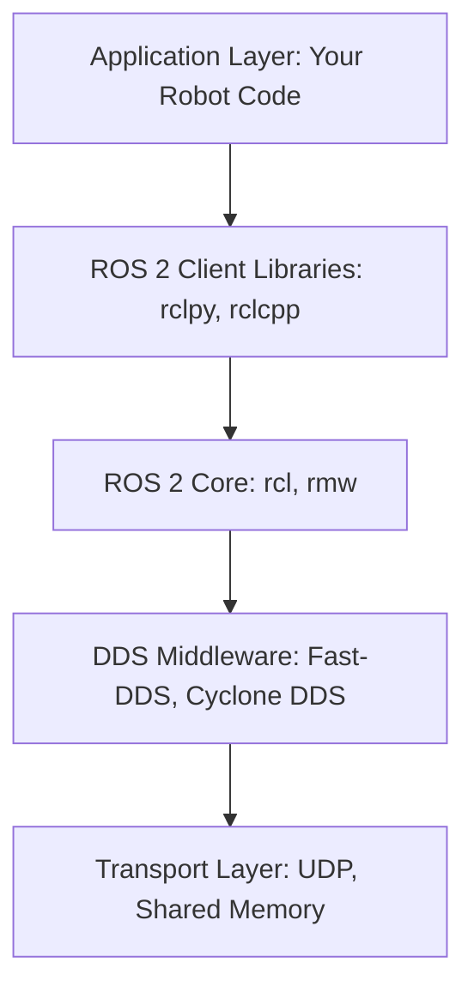
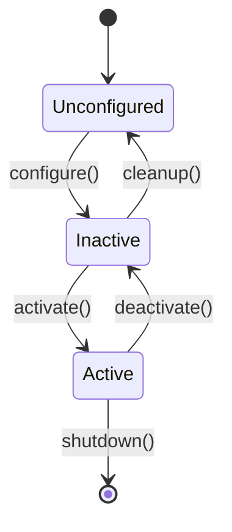
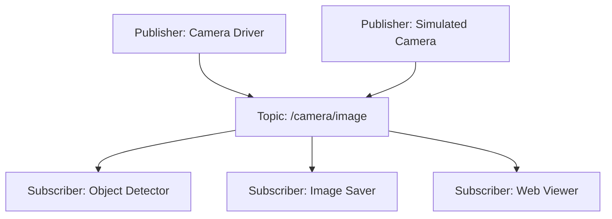

# Chapter 1: ROS 2 Fundamentals

**Week 3** | **Duration**: 4-5 hours | **Complexity**: Beginner to Intermediate

---

## Learning Objectives

By the end of this chapter, you will be able to:

1. **Understand** the ROS 2 architecture and its core design principles
2. **Explain** the pub-sub model and how nodes communicate via topics
3. **Install** ROS 2 Humble and configure a development workspace
4. **Create** your first ROS 2 Python node with publishers and subscribers
5. **Launch** and debug ROS 2 nodes using command-line tools
6. **Visualize** ROS 2 communication graphs and monitor topics

---

## Introduction

The Robot Operating System (ROS) is the de facto standard middleware for robotics development. ROS 2, the second generation, addresses the limitations of ROS 1 by providing:

- **Real-time capabilities** for safety-critical applications
- **Multi-platform support** (Linux, Windows, macOS)
- **Production-grade security** with DDS (Data Distribution Service)
- **Improved performance** and scalability
- **Better tooling** and development experience

Think of ROS 2 as the **nervous system** of your robot—it connects sensors, actuators, AI models, and control systems into a coherent, distributed system.

> "ROS 2 is not an operating system—it's a middleware layer that provides tools and libraries for building robot applications."

---

## 1. ROS 2 Architecture Overview

### 1.1 The Layered Architecture

ROS 2 follows a layered design:



**Layers Explained**:

1. **Application Layer**: Your robot code (Python/C++ nodes)
2. **Client Libraries**: `rclpy` (Python), `rclcpp` (C++)
3. **ROS 2 Core**: `rcl` (ROS Client Library), `rmw` (ROS Middleware Interface)
4. **DDS Layer**: Data Distribution Service (e.g., Fast-DDS, Cyclone DDS)
5. **Transport**: UDP/TCP network or shared memory for inter-process communication

### 1.2 Why DDS?

ROS 2 uses **DDS (Data Distribution Service)** as its communication backbone:

- **Decentralized**: No master node (unlike ROS 1)
- **Discovery**: Nodes automatically find each other on the network
- **QoS Policies**: Configure reliability, latency, and durability
- **Industry Standard**: Used in aerospace, defense, industrial automation

### 1.3 Core Concepts

| Concept | Description | Analogy |
|---------|-------------|---------|
| **Node** | A single executable process (e.g., camera driver, motion planner) | A person in an organization |
| **Topic** | Named bus for data streaming (many-to-many) | A radio station frequency |
| **Publisher** | Sends messages to a topic | A radio transmitter |
| **Subscriber** | Receives messages from a topic | A radio receiver |
| **Message** | Data structure (e.g., `sensor_msgs/Image`) | The content of a radio broadcast |
| **Package** | Collection of nodes, libraries, and config files | A software module or library |

---

## 2. Nodes: The Building Blocks

### 2.1 What is a Node?

A **node** is a single-purpose computational process. Good design practice:
- **One node = One responsibility** (e.g., camera driver, object detector, motor controller)
- Nodes communicate only through ROS 2 mechanisms (topics, services, actions)

**Example System**:


### 2.2 Node Lifecycle

ROS 2 nodes can have managed lifecycles (optional):



**States**:
- **Unconfigured**: Node created but not ready
- **Inactive**: Configured but not processing data
- **Active**: Fully operational
- **Finalized**: Cleanly shut down

Most simple nodes skip lifecycle management and go directly to "Active".

### 2.3 Node Naming and Namespaces

Nodes have unique names and can be organized in namespaces:

```bash
# Default namespace
/camera_node

# With namespace
/robot1/sensors/camera_node
/robot2/sensors/camera_node
```

This allows running multiple robots or sensor suites without name conflicts.

---

## 3. Topics and the Publish-Subscribe Model

### 3.1 The Pub-Sub Pattern

Topics enable **decoupled communication**:

- Publishers don't know who (if anyone) is listening
- Subscribers don't know who is publishing
- Multiple publishers and subscribers can use the same topic

**Analogy**: A podcast (topic) where creators (publishers) upload episodes, and listeners (subscribers) download them—no direct connection required.



### 3.2 Message Types

Messages are defined in `.msg` files and compiled into Python/C++ classes.

**Common Message Types**:

| Package | Message | Purpose |
|---------|---------|---------|
| `std_msgs` | `String`, `Int32`, `Float64` | Simple data types |
| `sensor_msgs` | `Image`, `LaserScan`, `Imu` | Sensor data |
| `geometry_msgs` | `Twist`, `Pose`, `PoseStamped` | Motion and position |
| `nav_msgs` | `Odometry`, `Path` | Navigation data |

**Example Message Definition** (`geometry_msgs/msg/Twist`):
```
# Linear velocity
geometry_msgs/Vector3 linear
  float64 x
  float64 y
  float64 z

# Angular velocity
geometry_msgs/Vector3 angular
  float64 x
  float64 y
  float64 z
```

### 3.3 Topic Naming Conventions

Good topic names are:
- **Descriptive**: `/camera/color/image_raw` not `/img`
- **Hierarchical**: `/robot/sensors/lidar/scan`
- **Lowercase with underscores**: `/joint_states` not `/JointStates`

**Standard Topics** (from REP-144):
- `/camera/image_raw`: Unprocessed camera images
- `/camera/camera_info`: Camera calibration data
- `/scan`: 2D LIDAR data
- `/cmd_vel`: Velocity commands (geometry_msgs/Twist)
- `/odom`: Odometry (nav_msgs/Odometry)

---

## 4. Installation and Workspace Setup

### 4.1 Installing ROS 2 Humble (Ubuntu 22.04)

**Prerequisites**:
```bash
# Update system
sudo apt update && sudo apt upgrade -y

# Set locale
sudo apt install locales
sudo locale-gen en_US en_US.UTF-8
sudo update-locale LC_ALL=en_US.UTF-8 LANG=en_US.UTF-8
export LANG=en_US.UTF-8
```

**Add ROS 2 Repository**:
```bash
# Add ROS 2 GPG key
sudo apt install software-properties-common
sudo add-apt-repository universe
sudo apt update && sudo apt install curl -y
sudo curl -sSL https://raw.githubusercontent.com/ros/rosdistro/master/ros.key \
  -o /usr/share/keyrings/ros-archive-keyring.gpg

# Add repository to sources list
echo "deb [arch=$(dpkg --print-architecture) \
  signed-by=/usr/share/keyrings/ros-archive-keyring.gpg] \
  http://packages.ros.org/ros2/ubuntu \
  $(. /etc/os-release && echo $UBUNTU_CODENAME) main" \
  | sudo tee /etc/apt/sources.list.d/ros2.list > /dev/null
```

**Install ROS 2 Humble**:
```bash
sudo apt update
sudo apt install ros-humble-desktop -y  # Full desktop installation

# Or minimal (no GUI tools)
# sudo apt install ros-humble-ros-base -y
```

**Install Development Tools**:
```bash
sudo apt install python3-colcon-common-extensions python3-rosdep -y

# Initialize rosdep (dependency manager)
sudo rosdep init
rosdep update
```

**Source ROS 2**:
```bash
echo "source /opt/ros/humble/setup.bash" >> ~/.bashrc
source ~/.bashrc
```

**Verify Installation**:
```bash
ros2 --version
# Output: ros2 cli version 0.18.x
```

### 4.2 Creating a ROS 2 Workspace

A workspace is a directory containing ROS 2 packages.

**Standard Workspace Structure**:
```
~/ros2_ws/
├── src/              # Source code (your packages)
├── build/            # Build artifacts (generated)
├── install/          # Installed files (generated)
└── log/              # Build logs (generated)
```

**Create Workspace**:
```bash
mkdir -p ~/ros2_ws/src
cd ~/ros2_ws

# Build empty workspace
colcon build

# Source the workspace
source install/setup.bash
```

**Overlay Concept**:
Your workspace **overlays** the base ROS 2 installation, meaning your packages take precedence.

```bash
# /opt/ros/humble (underlay)
# ~/ros2_ws (overlay)
```

### 4.3 Workspace Management Tips

**Add to .bashrc** (for permanent sourcing):
```bash
echo "source ~/ros2_ws/install/setup.bash" >> ~/.bashrc
```

**Colcon Build Options**:
```bash
# Build specific packages
colcon build --packages-select my_package

# Build with symbolic links (Python development)
colcon build --symlink-install

# Parallel build with 4 jobs
colcon build --parallel-workers 4
```

**Clean Workspace**:
```bash
rm -rf build/ install/ log/
colcon build
```

---

## 5. Creating Your First ROS 2 Python Node

### 5.1 Create a Package

```bash
cd ~/ros2_ws/src

# Create package with rclpy dependency
ros2 pkg create --build-type ament_python \
  --node-name hello_node \
  my_first_package \
  --dependencies rclpy
```

**Package Structure**:
```
my_first_package/
├── my_first_package/
│   ├── __init__.py
│   └── hello_node.py       # Our node
├── package.xml             # Package metadata
├── setup.py                # Python setup file
├── setup.cfg               # Configuration
└── resource/
    └── my_first_package    # Marker file
```

### 5.2 Writing a Simple Publisher Node

Edit `my_first_package/hello_node.py`:

```python
#!/usr/bin/env python3
import rclpy
from rclpy.node import Node
from std_msgs.msg import String


class HelloPublisher(Node):
    """A simple publisher node that sends greetings."""

    def __init__(self):
        super().__init__('hello_publisher')

        # Create publisher
        self.publisher_ = self.create_publisher(String, 'hello_topic', 10)

        # Create timer (1 Hz = once per second)
        self.timer = self.create_timer(1.0, self.timer_callback)

        self.counter = 0
        self.get_logger().info('Hello Publisher has started!')

    def timer_callback(self):
        """Called every second to publish a message."""
        msg = String()
        msg.data = f'Hello World! Count: {self.counter}'

        self.publisher_.publish(msg)
        self.get_logger().info(f'Publishing: "{msg.data}"')

        self.counter += 1


def main(args=None):
    # Initialize ROS 2
    rclpy.init(args=args)

    # Create node instance
    node = HelloPublisher()

    try:
        # Keep node running
        rclpy.spin(node)
    except KeyboardInterrupt:
        pass
    finally:
        # Cleanup
        node.destroy_node()
        rclpy.shutdown()


if __name__ == '__main__':
    main()
```

**Key Concepts**:
- **`Node`**: Base class for all ROS 2 nodes
- **`create_publisher()`**: Creates a publisher with message type, topic name, and QoS depth
- **`create_timer()`**: Executes a callback at regular intervals
- **`get_logger()`**: ROS 2 logging system
- **`rclpy.spin()`**: Keeps the node alive and processes callbacks

### 5.3 Writing a Subscriber Node

Create `my_first_package/listener_node.py`:

```python
#!/usr/bin/env python3
import rclpy
from rclpy.node import Node
from std_msgs.msg import String


class HelloSubscriber(Node):
    """A simple subscriber node that listens to greetings."""

    def __init__(self):
        super().__init__('hello_subscriber')

        # Create subscription
        self.subscription = self.create_subscription(
            String,
            'hello_topic',
            self.listener_callback,
            10
        )

        self.get_logger().info('Hello Subscriber has started!')

    def listener_callback(self, msg):
        """Called whenever a message is received."""
        self.get_logger().info(f'I heard: "{msg.data}"')


def main(args=None):
    rclpy.init(args=args)
    node = HelloSubscriber()

    try:
        rclpy.spin(node)
    except KeyboardInterrupt:
        pass
    finally:
        node.destroy_node()
        rclpy.shutdown()


if __name__ == '__main__':
    main()
```

### 5.4 Registering Nodes in setup.py

Edit `setup.py`:

```python
from setuptools import find_packages, setup

package_name = 'my_first_package'

setup(
    name=package_name,
    version='0.0.1',
    packages=find_packages(exclude=['test']),
    data_files=[
        ('share/ament_index/resource_index/packages',
            ['resource/' + package_name]),
        ('share/' + package_name, ['package.xml']),
    ],
    install_requires=['setuptools'],
    zip_safe=True,
    maintainer='your_name',
    maintainer_email='your_email@example.com',
    description='My first ROS 2 package',
    license='Apache-2.0',
    tests_require=['pytest'],
    entry_points={
        'console_scripts': [
            'hello_node = my_first_package.hello_node:main',
            'listener_node = my_first_package.listener_node:main',
        ],
    },
)
```

### 5.5 Building and Running

**Build**:
```bash
cd ~/ros2_ws
colcon build --packages-select my_first_package
source install/setup.bash
```

**Run Publisher** (Terminal 1):
```bash
ros2 run my_first_package hello_node
```

**Expected Output**:
```
[INFO] [hello_publisher]: Hello Publisher has started!
[INFO] [hello_publisher]: Publishing: "Hello World! Count: 0"
[INFO] [hello_publisher]: Publishing: "Hello World! Count: 1"
[INFO] [hello_publisher]: Publishing: "Hello World! Count: 2"
...
```

**Run Subscriber** (Terminal 2):
```bash
ros2 run my_first_package listener_node
```

**Expected Output**:
```
[INFO] [hello_subscriber]: Hello Subscriber has started!
[INFO] [hello_subscriber]: I heard: "Hello World! Count: 2"
[INFO] [hello_subscriber]: I heard: "Hello World! Count: 3"
...
```

**Congratulations!** You've created your first ROS 2 pub-sub system.

---

## 6. ROS 2 Command-Line Tools

### 6.1 Essential Commands

**List Running Nodes**:
```bash
ros2 node list
# Output:
# /hello_publisher
# /hello_subscriber
```

**Get Node Info**:
```bash
ros2 node info /hello_publisher
# Shows publishers, subscribers, services, actions
```

**List Topics**:
```bash
ros2 topic list
# Output:
# /hello_topic
# /parameter_events
# /rosout
```

**Echo Topic Messages**:
```bash
ros2 topic echo /hello_topic
# Shows live messages
```

**Get Topic Info**:
```bash
ros2 topic info /hello_topic
# Shows publishers, subscribers, message type
```

**Publish from Command Line**:
```bash
ros2 topic pub /hello_topic std_msgs/msg/String "data: 'Test message'"
```

**Show Topic Rate**:
```bash
ros2 topic hz /hello_topic
# Output: average rate: 1.000 Hz
```

### 6.2 Introspection Tools

**Show Message Definition**:
```bash
ros2 interface show std_msgs/msg/String
# Output:
# string data
```

**List All Interfaces**:
```bash
ros2 interface list
```

**View Computation Graph**:
```bash
rqt_graph
```

This opens a GUI showing nodes and topic connections:
```
[hello_publisher] --(/hello_topic)--> [hello_subscriber]
```

### 6.3 Debugging Commands

**Check for Errors**:
```bash
ros2 wtf
# "What's The Fault?" - diagnostic tool
```

**Log Level**:
```bash
# Change log level at runtime
ros2 run my_first_package hello_node --ros-args --log-level DEBUG
```

**Record Topics** (rosbag):
```bash
ros2 bag record /hello_topic
# Creates rosbag file with recorded messages

# Playback
ros2 bag play <bagfile_name>
```

---

## 7. Practical Example: Robot Velocity Controller

Let's build a practical example: a node that publishes velocity commands.

### 7.1 Create Velocity Publisher

Create `my_first_package/velocity_publisher.py`:

```python
#!/usr/bin/env python3
import rclpy
from rclpy.node import Node
from geometry_msgs.msg import Twist
import math


class VelocityPublisher(Node):
    """Publishes velocity commands in a circle pattern."""

    def __init__(self):
        super().__init__('velocity_publisher')

        # Declare parameters
        self.declare_parameter('linear_speed', 0.5)  # m/s
        self.declare_parameter('angular_speed', 0.5)  # rad/s
        self.declare_parameter('publish_rate', 10.0)  # Hz

        # Get parameters
        self.linear_speed = self.get_parameter('linear_speed').value
        self.angular_speed = self.get_parameter('angular_speed').value
        rate = self.get_parameter('publish_rate').value

        # Create publisher
        self.publisher_ = self.create_publisher(Twist, '/cmd_vel', 10)

        # Create timer
        self.timer = self.create_timer(1.0 / rate, self.timer_callback)

        self.get_logger().info(f'Velocity Publisher started')
        self.get_logger().info(f'Linear: {self.linear_speed} m/s, '
                               f'Angular: {self.angular_speed} rad/s')

    def timer_callback(self):
        """Publish velocity command."""
        msg = Twist()
        msg.linear.x = self.linear_speed
        msg.angular.z = self.angular_speed

        self.publisher_.publish(msg)


def main(args=None):
    rclpy.init(args=args)
    node = VelocityPublisher()

    try:
        rclpy.spin(node)
    except KeyboardInterrupt:
        # Stop robot on exit
        stop_msg = Twist()
        node.publisher_.publish(stop_msg)
        node.get_logger().info('Shutting down, robot stopped')
    finally:
        node.destroy_node()
        rclpy.shutdown()


if __name__ == '__main__':
    main()
```

### 7.2 Create Velocity Monitor

Create `my_first_package/velocity_monitor.py`:

```python
#!/usr/bin/env python3
import rclpy
from rclpy.node import Node
from geometry_msgs.msg import Twist
import math


class VelocityMonitor(Node):
    """Monitors velocity commands and logs statistics."""

    def __init__(self):
        super().__init__('velocity_monitor')

        self.subscription = self.create_subscription(
            Twist,
            '/cmd_vel',
            self.velocity_callback,
            10
        )

        self.msg_count = 0
        self.total_linear = 0.0
        self.total_angular = 0.0

        # Log statistics every 5 seconds
        self.stats_timer = self.create_timer(5.0, self.log_statistics)

        self.get_logger().info('Velocity Monitor started')

    def velocity_callback(self, msg):
        """Process received velocity command."""
        self.msg_count += 1
        self.total_linear += abs(msg.linear.x)
        self.total_angular += abs(msg.angular.z)

        # Calculate speed magnitude
        speed = math.sqrt(msg.linear.x**2 + msg.linear.y**2 + msg.linear.z**2)

        self.get_logger().info(
            f'Velocity: linear={msg.linear.x:.2f} m/s, '
            f'angular={msg.angular.z:.2f} rad/s, '
            f'speed={speed:.2f} m/s',
            throttle_duration_sec=1.0  # Log at most once per second
        )

    def log_statistics(self):
        """Log statistics."""
        if self.msg_count > 0:
            avg_linear = self.total_linear / self.msg_count
            avg_angular = self.total_angular / self.msg_count

            self.get_logger().info(
                f'Statistics: {self.msg_count} messages received, '
                f'avg linear={avg_linear:.2f} m/s, '
                f'avg angular={avg_angular:.2f} rad/s'
            )


def main(args=None):
    rclpy.init(args=args)
    node = VelocityMonitor()

    try:
        rclpy.spin(node)
    except KeyboardInterrupt:
        pass
    finally:
        node.destroy_node()
        rclpy.shutdown()


if __name__ == '__main__':
    main()
```

### 7.3 Register and Test

Update `setup.py`:
```python
entry_points={
    'console_scripts': [
        'hello_node = my_first_package.hello_node:main',
        'listener_node = my_first_package.listener_node:main',
        'velocity_publisher = my_first_package.velocity_publisher:main',
        'velocity_monitor = my_first_package.velocity_monitor:main',
    ],
},
```

**Build and Run**:
```bash
cd ~/ros2_ws
colcon build --packages-select my_first_package --symlink-install
source install/setup.bash

# Terminal 1: Publisher
ros2 run my_first_package velocity_publisher

# Terminal 2: Monitor
ros2 run my_first_package velocity_monitor

# Terminal 3: Inspect topic
ros2 topic echo /cmd_vel
```

**Run with Parameters**:
```bash
ros2 run my_first_package velocity_publisher \
  --ros-args -p linear_speed:=1.0 -p angular_speed:=0.2
```

---

## 8. Best Practices

### 8.1 Node Design

**Do**:
- One node = one responsibility
- Use clear, descriptive names
- Handle shutdown gracefully (cleanup resources)
- Use parameters for configuration
- Log important events

**Don't**:
- Create monolithic nodes
- Use global variables
- Ignore errors silently
- Hard-code values

### 8.2 Topic Design

**Do**:
- Use standard message types when possible
- Follow REP-144 naming conventions
- Keep topic names lowercase with underscores
- Use hierarchical namespaces

**Don't**:
- Create custom messages unnecessarily
- Use vague topic names (`/data`, `/info`)
- Publish at excessive rates

### 8.3 Code Organization

**Good Package Structure**:
```
my_robot_package/
├── my_robot_package/
│   ├── __init__.py
│   ├── drivers/          # Hardware drivers
│   ├── controllers/      # Control algorithms
│   ├── utils/            # Helper functions
│   └── nodes/            # ROS 2 node scripts
├── launch/               # Launch files
├── config/               # YAML config files
├── test/                 # Unit tests
├── package.xml
└── setup.py
```

---

## Summary

In this chapter, you learned:

✅ **ROS 2 Architecture**: Layered design with DDS middleware
✅ **Core Concepts**: Nodes, topics, publishers, subscribers, messages
✅ **Installation**: ROS 2 Humble on Ubuntu 22.04
✅ **Workspace Setup**: Creating and managing ROS 2 workspaces
✅ **Python Nodes**: Writing publishers and subscribers with rclpy
✅ **CLI Tools**: ros2 node, ros2 topic, rqt_graph for debugging
✅ **Best Practices**: Node design, topic naming, code organization

**Key Takeaway**: ROS 2 provides a robust foundation for building modular, distributed robotic systems. The pub-sub model enables loose coupling between components, making systems easier to develop, test, and maintain.

---

## Exercises

### Exercise 1: Modify the Hello Publisher (20 minutes)
Modify `hello_node.py` to:
1. Accept a parameter for the publishing rate (default: 1 Hz)
2. Accept a parameter for a custom greeting message
3. Publish a timestamp with each message

**Hint**: Use `self.declare_parameter()` and `self.get_clock().now()`.

### Exercise 2: Create a Counter Node (30 minutes)
Create a node that:
1. Subscribes to `/increment_topic` (std_msgs/Bool)
2. Increments an internal counter when receiving `True`
3. Publishes the current count to `/counter_value` (std_msgs/Int32) at 2 Hz
4. Logs the count every 5 increments

### Exercise 3: Robot Safety Monitor (45 minutes)
Create a safety monitor that:
1. Subscribes to `/cmd_vel` (geometry_msgs/Twist)
2. Checks if velocities exceed safe limits (e.g., 2.0 m/s linear, 1.0 rad/s angular)
3. Publishes `/safety_alert` (std_msgs/String) when limits are exceeded
4. Logs warnings with the current velocity values

### Exercise 4: Multi-Node System (60 minutes)
Build a complete system:
1. **Sensor Simulator**: Publishes random "sensor readings" (Float64) at 10 Hz
2. **Data Filter**: Subscribes to sensor data, applies moving average filter, publishes filtered data
3. **Threshold Detector**: Subscribes to filtered data, publishes alerts when threshold exceeded
4. **Logger Node**: Subscribes to alerts and logs them with timestamps

Visualize the system with `rqt_graph`.

---

## Assessment

Test your knowledge:

1. What are the advantages of ROS 2 over ROS 1?
2. Explain the difference between a publisher and a subscriber.
3. What is the purpose of QoS (Quality of Service) policies?
4. How do you pass parameters to a ROS 2 node?
5. What is the difference between `rclpy.spin()` and `rclpy.spin_once()`?

Take the [Chapter 1 Quiz](../../assessments/module-1/chapter-01-quiz.md) (15 questions, 80% to pass).

---

## Additional Resources

- **ROS 2 Documentation**: [docs.ros.org](https://docs.ros.org/en/humble/)
- **ROS 2 Tutorials**: [ROS 2 Humble Tutorials](https://docs.ros.org/en/humble/Tutorials.html)
- **rclpy API**: [rclpy API Reference](https://docs.ros2.org/humble/api/rclpy/)
- **Book**: "A Concise Introduction to Robot Programming with ROS2" by Francisco Martín Rico
- **Video**: [ROS 2 Basics Playlist](https://www.youtube.com/playlist?list=PLLSegLrePWgJudpPUof4-nVFHGkB62Izy)
- **GitHub**: [ROS 2 Examples](https://github.com/ros2/examples)

---

## Next Chapter

Ready to explore advanced communication patterns? Proceed to [Chapter 2: ROS 2 Communication Patterns](./02-ros2-communication.md) to learn about services, actions, and parameters.

---

*This chapter is part of the Physical AI & Humanoid Robotics textbook. All code examples are available in the [companion repository](https://github.com/panaversity/physical-ai-textbook).*
