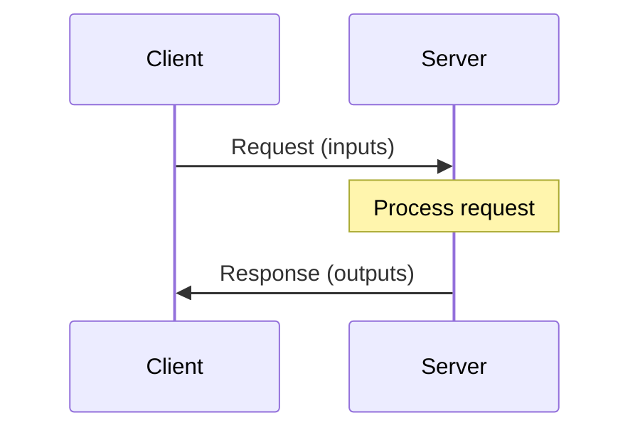
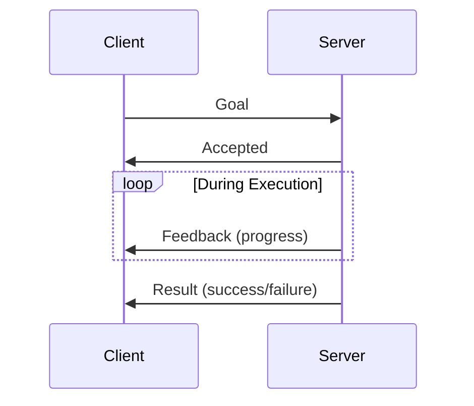
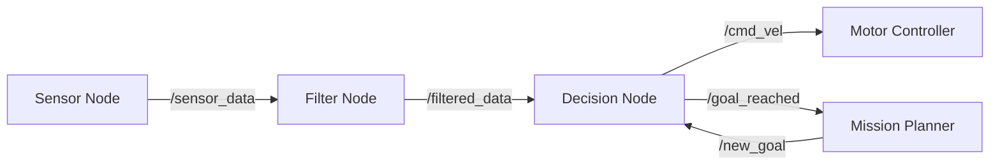

# Chapter 2: ROS 2 Communication Patterns

**Week 4** | **Duration**: 4-5 hours | **Complexity**: Intermediate

---

## Learning Objectives

By the end of this chapter, you will be able to:

1. **Implement** ROS 2 services for request-response communication
2. **Create** actions for long-running, preemptable tasks with feedback
3. **Configure** nodes using parameters and parameter files
4. **Apply** Quality of Service (QoS) policies for reliable communication
5. **Design** multi-node robotic systems with appropriate communication patterns
6. **Debug** complex ROS 2 systems using introspection tools

---

## Introduction

While topics (pub-sub) are excellent for continuous data streams like sensor readings, robotics requires additional communication patterns:

- **Services**: "Can you calculate the inverse kinematics for this pose?" (request-response)
- **Actions**: "Navigate to this location" (long-running task with feedback and cancellation)
- **Parameters**: "What's your maximum velocity?" (runtime configuration)

Think of these as different ways humans communicate:
- **Topics**: Broadcasting (radio, TV)
- **Services**: Asking a question (phone call)
- **Actions**: Delegating a task with status updates (project management)
- **Parameters**: Configuration settings (preferences, settings menu)

---

## 1. Services: Synchronous Request-Response

### 1.1 What are Services?

A **service** enables synchronous request-response communication between nodes:



**Characteristics**:
- **Synchronous**: Client waits for response
- **One-to-one**: One request to one server (not many-to-many like topics)
- **Stateless**: Each request is independent
- **Blocking**: Client blocks until response received (or timeout)

**Use Cases**:
- Mathematical computations (inverse kinematics)
- State queries ("Is the robot stopped?")
- Hardware control ("Open gripper", "Turn on LED")
- Configuration ("Reset odometry")

### 1.2 Service vs Topic: When to Use What?

| Aspect | Topic | Service |
|--------|-------|---------|
| **Communication** | Many-to-many | One-to-one |
| **Timing** | Asynchronous | Synchronous |
| **Data Flow** | Continuous stream | Request-response |
| **Use Case** | Sensor data, status | Calculations, commands |
| **Example** | Camera images | Compute path |

**Rule of Thumb**: If you need an answer immediately, use a service. If you're streaming data, use a topic.

### 1.3 Service Types

Services are defined in `.srv` files with two parts:

**Example** (`example_interfaces/srv/AddTwoInts.srv`):
```
# Request
int64 a
int64 b
---
# Response
int64 sum
```

**Common Service Types**:

| Package | Service | Purpose |
|---------|---------|---------|
| `std_srvs` | `SetBool`, `Trigger` | Simple services |
| `example_interfaces` | `AddTwoInts` | Learning examples |
| `nav2_msgs` | `LoadMap`, `ClearCostmap` | Navigation services |
| `moveit_msgs` | `GetPositionIK`, `GetPlanningScene` | Manipulation |

### 1.4 Creating a Service Server

**Example: Add Two Numbers Service**

Create `my_first_package/add_server.py`:

```python
#!/usr/bin/env python3
import rclpy
from rclpy.node import Node
from example_interfaces.srv import AddTwoInts


class AddTwoIntsServer(Node):
    """Service server that adds two integers."""

    def __init__(self):
        super().__init__('add_two_ints_server')

        # Create service
        self.srv = self.create_service(
            AddTwoInts,
            'add_two_ints',
            self.add_callback
        )

        self.get_logger().info('Add Two Ints Server is ready')

    def add_callback(self, request, response):
        """Handle service requests."""
        # Process request
        response.sum = request.a + request.b

        # Log
        self.get_logger().info(
            f'Request: {request.a} + {request.b} = {response.sum}'
        )

        return response


def main(args=None):
    rclpy.init(args=args)
    node = AddTwoIntsServer()

    try:
        rclpy.spin(node)
    except KeyboardInterrupt:
        pass
    finally:
        node.destroy_node()
        rclpy.shutdown()


if __name__ == '__main__':
    main()
```

### 1.5 Creating a Service Client

Create `my_first_package/add_client.py`:

```python
#!/usr/bin/env python3
import sys
import rclpy
from rclpy.node import Node
from example_interfaces.srv import AddTwoInts


class AddTwoIntsClient(Node):
    """Service client that requests addition."""

    def __init__(self):
        super().__init__('add_two_ints_client')

        # Create client
        self.client = self.create_client(AddTwoInts, 'add_two_ints')

        # Wait for service to be available
        while not self.client.wait_for_service(timeout_sec=1.0):
            self.get_logger().info('Service not available, waiting...')

        self.get_logger().info('Service is available')

    def send_request(self, a, b):
        """Send request to service."""
        # Create request
        request = AddTwoInts.Request()
        request.a = a
        request.b = b

        # Call service asynchronously
        self.future = self.client.call_async(request)

        self.get_logger().info(f'Requesting: {a} + {b}')


def main(args=None):
    rclpy.init(args=args)

    # Get command-line arguments
    if len(sys.argv) != 3:
        print('Usage: add_client <a> <b>')
        return

    a = int(sys.argv[1])
    b = int(sys.argv[2])

    # Create client and send request
    node = AddTwoIntsClient()
    node.send_request(a, b)

    # Wait for response
    while rclpy.ok():
        rclpy.spin_once(node)
        if node.future.done():
            try:
                response = node.future.result()
                node.get_logger().info(f'Result: {response.sum}')
            except Exception as e:
                node.get_logger().error(f'Service call failed: {e}')
            break

    node.destroy_node()
    rclpy.shutdown()


if __name__ == '__main__':
    main()
```

### 1.6 Running Services

**Build and Source**:
```bash
cd ~/ros2_ws
colcon build --packages-select my_first_package --symlink-install
source install/setup.bash
```

**Run Server** (Terminal 1):
```bash
ros2 run my_first_package add_server
```

**Run Client** (Terminal 2):
```bash
ros2 run my_first_package add_client 10 20
# Output: Result: 30
```

**Call Service from Command Line**:
```bash
ros2 service call /add_two_ints example_interfaces/srv/AddTwoInts "{a: 5, b: 7}"
# Output: sum: 12
```

**List Services**:
```bash
ros2 service list
# Output:
# /add_two_ints
```

**Service Info**:
```bash
ros2 service type /add_two_ints
# Output: example_interfaces/srv/AddTwoInts
```

---

## 2. Actions: Long-Running Tasks with Feedback

### 2.1 What are Actions?

**Actions** are for long-running tasks that provide:
- **Feedback**: Progress updates during execution
- **Result**: Final outcome when complete
- **Cancellation**: Ability to stop mid-execution



**Characteristics**:
- **Asynchronous**: Client doesn't block
- **Preemptable**: Can be cancelled mid-execution
- **Stateful**: Tracks execution state (pending, active, succeeded, aborted)
- **With Feedback**: Periodic progress updates

**Use Cases**:
- Navigation ("Go to kitchen")
- Manipulation ("Pick and place object")
- Long computations ("Generate path")
- Multi-step operations ("Inspect all rooms")

### 2.2 Action vs Service vs Topic

| Feature | Topic | Service | Action |
|---------|-------|---------|--------|
| **Duration** | Continuous | Instant | Long-running |
| **Feedback** | No | No | Yes |
| **Cancellation** | N/A | No | Yes |
| **Example** | Sensor data | IK solver | Navigation |

### 2.3 Action Definition

Actions are defined in `.action` files with three parts:

**Example** (`example_interfaces/action/Fibonacci.action`):
```
# Goal: What we want to achieve
int32 order
---
# Result: Final outcome
int32[] sequence
---
# Feedback: Progress updates
int32[] partial_sequence
```

**Common Action Types**:

| Package | Action | Purpose |
|---------|--------|---------|
| `nav2_msgs` | `NavigateToPose` | Navigate to goal pose |
| `control_msgs` | `FollowJointTrajectory` | Execute joint trajectory |
| `moveit_msgs` | `MoveGroup` | Plan and execute motion |

### 2.4 Creating an Action Server

**Example: Fibonacci Sequence Generator**

Create `my_first_package/fibonacci_server.py`:

```python
#!/usr/bin/env python3
import time
import rclpy
from rclpy.action import ActionServer
from rclpy.node import Node
from example_interfaces.action import Fibonacci


class FibonacciActionServer(Node):
    """Action server that generates Fibonacci sequences."""

    def __init__(self):
        super().__init__('fibonacci_action_server')

        # Create action server
        self._action_server = ActionServer(
            self,
            Fibonacci,
            'fibonacci',
            self.execute_callback
        )

        self.get_logger().info('Fibonacci Action Server is ready')

    def execute_callback(self, goal_handle):
        """Execute the action."""
        self.get_logger().info(f'Executing goal: order={goal_handle.request.order}')

        # Initialize feedback and result
        feedback_msg = Fibonacci.Feedback()
        feedback_msg.partial_sequence = [0, 1]

        # Generate Fibonacci sequence
        for i in range(1, goal_handle.request.order):
            # Check if cancellation requested
            if goal_handle.is_cancel_requested:
                goal_handle.canceled()
                self.get_logger().info('Goal canceled')
                return Fibonacci.Result()

            # Calculate next Fibonacci number
            feedback_msg.partial_sequence.append(
                feedback_msg.partial_sequence[i] +
                feedback_msg.partial_sequence[i - 1]
            )

            # Publish feedback
            self.get_logger().info(
                f'Feedback: {feedback_msg.partial_sequence}'
            )
            goal_handle.publish_feedback(feedback_msg)

            # Simulate work (1 second per step)
            time.sleep(1)

        # Mark goal as succeeded
        goal_handle.succeed()

        # Return result
        result = Fibonacci.Result()
        result.sequence = feedback_msg.partial_sequence

        self.get_logger().info(f'Goal succeeded: {result.sequence}')

        return result


def main(args=None):
    rclpy.init(args=args)
    node = FibonacciActionServer()

    try:
        rclpy.spin(node)
    except KeyboardInterrupt:
        pass
    finally:
        node.destroy_node()
        rclpy.shutdown()


if __name__ == '__main__':
    main()
```

### 2.5 Creating an Action Client

Create `my_first_package/fibonacci_client.py`:

```python
#!/usr/bin/env python3
import sys
import rclpy
from rclpy.action import ActionClient
from rclpy.node import Node
from example_interfaces.action import Fibonacci


class FibonacciActionClient(Node):
    """Action client that requests Fibonacci sequences."""

    def __init__(self):
        super().__init__('fibonacci_action_client')

        # Create action client
        self._action_client = ActionClient(
            self,
            Fibonacci,
            'fibonacci'
        )

    def send_goal(self, order):
        """Send goal to action server."""
        # Wait for server
        self.get_logger().info('Waiting for action server...')
        self._action_client.wait_for_server()

        # Create goal
        goal_msg = Fibonacci.Goal()
        goal_msg.order = order

        self.get_logger().info(f'Sending goal: order={order}')

        # Send goal asynchronously
        self._send_goal_future = self._action_client.send_goal_async(
            goal_msg,
            feedback_callback=self.feedback_callback
        )

        self._send_goal_future.add_done_callback(self.goal_response_callback)

    def goal_response_callback(self, future):
        """Handle goal acceptance/rejection."""
        goal_handle = future.result()

        if not goal_handle.accepted:
            self.get_logger().info('Goal rejected')
            return

        self.get_logger().info('Goal accepted')

        # Get result asynchronously
        self._get_result_future = goal_handle.get_result_async()
        self._get_result_future.add_done_callback(self.get_result_callback)

    def get_result_callback(self, future):
        """Handle final result."""
        result = future.result().result
        self.get_logger().info(f'Result: {result.sequence}')

        # Shutdown
        rclpy.shutdown()

    def feedback_callback(self, feedback_msg):
        """Handle feedback updates."""
        feedback = feedback_msg.feedback
        self.get_logger().info(f'Received feedback: {feedback.partial_sequence}')


def main(args=None):
    rclpy.init(args=args)

    # Get order from command line
    if len(sys.argv) != 2:
        print('Usage: fibonacci_client <order>')
        return

    order = int(sys.argv[1])

    # Create client and send goal
    node = FibonacciActionClient()
    node.send_goal(order)

    # Keep node alive
    rclpy.spin(node)


if __name__ == '__main__':
    main()
```

### 2.6 Running Actions

**Run Server** (Terminal 1):
```bash
ros2 run my_first_package fibonacci_server
```

**Run Client** (Terminal 2):
```bash
ros2 run my_first_package fibonacci_client 10
# Output:
# Received feedback: [0, 1, 1]
# Received feedback: [0, 1, 1, 2]
# Received feedback: [0, 1, 1, 2, 3]
# ...
# Result: [0, 1, 1, 2, 3, 5, 8, 13, 21, 34, 55]
```

**Action CLI Commands**:
```bash
# List actions
ros2 action list

# Get action info
ros2 action info /fibonacci

# Send goal from command line
ros2 action send_goal /fibonacci example_interfaces/action/Fibonacci "{order: 5}" --feedback
```

---

## 3. Parameters: Runtime Configuration

### 3.1 What are Parameters?

**Parameters** are node configuration values that can be:
- Set at launch time
- Changed at runtime
- Saved and loaded from YAML files

**Characteristics**:
- **Per-node**: Each node has its own parameter namespace
- **Typed**: Int, double, string, bool, arrays
- **Dynamic**: Can be changed without restarting node
- **Persistent**: Can be saved to files

**Use Cases**:
- Robot dimensions (wheelbase, height)
- Algorithm tuning (PID gains, thresholds)
- Hardware configuration (serial ports, IP addresses)
- Behavior settings (max velocity, timeout values)

### 3.2 Parameter Types

| Type | Example |
|------|---------|
| **Integer** | `max_retries: 3` |
| **Double** | `velocity_limit: 1.5` |
| **String** | `robot_name: "atlas"` |
| **Boolean** | `use_simulation: true` |
| **Array** | `joint_names: ["j1", "j2"]` |

### 3.3 Using Parameters in Nodes

Create `my_first_package/configurable_robot.py`:

```python
#!/usr/bin/env python3
import rclpy
from rclpy.node import Node
from geometry_msgs.msg import Twist
from rcl_interfaces.msg import ParameterDescriptor


class ConfigurableRobot(Node):
    """Robot with configurable parameters."""

    def __init__(self):
        super().__init__('configurable_robot')

        # Declare parameters with defaults and descriptions
        self.declare_parameter(
            'max_linear_velocity',
            1.0,
            ParameterDescriptor(description='Maximum linear velocity in m/s')
        )

        self.declare_parameter(
            'max_angular_velocity',
            1.0,
            ParameterDescriptor(description='Maximum angular velocity in rad/s')
        )

        self.declare_parameter(
            'robot_name',
            'my_robot',
            ParameterDescriptor(description='Name of the robot')
        )

        self.declare_parameter(
            'enable_safety_limits',
            True,
            ParameterDescriptor(description='Enable velocity safety limits')
        )

        # Get initial parameter values
        self.update_parameters()

        # Create subscriber
        self.subscription = self.create_subscription(
            Twist,
            '/cmd_vel_input',
            self.velocity_callback,
            10
        )

        # Create publisher
        self.publisher = self.create_publisher(Twist, '/cmd_vel', 10)

        # Add callback for parameter changes
        self.add_on_set_parameters_callback(self.parameter_callback)

        self.get_logger().info(f'{self.robot_name} is ready')
        self.get_logger().info(f'Max velocities: linear={self.max_linear}, angular={self.max_angular}')

    def update_parameters(self):
        """Update internal state from parameters."""
        self.max_linear = self.get_parameter('max_linear_velocity').value
        self.max_angular = self.get_parameter('max_angular_velocity').value
        self.robot_name = self.get_parameter('robot_name').value
        self.safety_enabled = self.get_parameter('enable_safety_limits').value

    def parameter_callback(self, params):
        """Called when parameters are changed."""
        for param in params:
            self.get_logger().info(f'Parameter changed: {param.name} = {param.value}')

        # Update internal state
        self.update_parameters()

        # Accept all changes
        from rcl_interfaces.msg import SetParametersResult
        return SetParametersResult(successful=True)

    def velocity_callback(self, msg):
        """Process velocity commands with safety limits."""
        output = Twist()

        if self.safety_enabled:
            # Apply safety limits
            output.linear.x = max(min(msg.linear.x, self.max_linear), -self.max_linear)
            output.angular.z = max(min(msg.angular.z, self.max_angular), -self.max_angular)

            if output.linear.x != msg.linear.x or output.angular.z != msg.angular.z:
                self.get_logger().warn(
                    f'Velocity limited: ({msg.linear.x:.2f}, {msg.angular.z:.2f}) -> '
                    f'({output.linear.x:.2f}, {output.angular.z:.2f})',
                    throttle_duration_sec=1.0
                )
        else:
            output = msg

        self.publisher.publish(output)


def main(args=None):
    rclpy.init(args=args)
    node = ConfigurableRobot()

    try:
        rclpy.spin(node)
    except KeyboardInterrupt:
        pass
    finally:
        node.destroy_node()
        rclpy.shutdown()


if __name__ == '__main__':
    main()
```

### 3.4 Parameter Files

Create `config/robot_config.yaml`:

```yaml
configurable_robot:
  ros__parameters:
    max_linear_velocity: 2.0
    max_angular_velocity: 1.5
    robot_name: "atlas"
    enable_safety_limits: true
```

**Load Parameters from File**:
```bash
ros2 run my_first_package configurable_robot \
  --ros-args --params-file config/robot_config.yaml
```

### 3.5 Parameter CLI Commands

```bash
# List node parameters
ros2 param list /configurable_robot

# Get parameter value
ros2 param get /configurable_robot max_linear_velocity

# Set parameter value
ros2 param set /configurable_robot max_linear_velocity 3.0

# Dump all parameters to file
ros2 param dump /configurable_robot > params.yaml

# Load parameters from file
ros2 param load /configurable_robot params.yaml
```

---

## 4. Quality of Service (QoS) Policies

### 4.1 What is QoS?

**Quality of Service (QoS)** policies control how messages are delivered:

- **Reliability**: Best-effort vs. guaranteed delivery
- **Durability**: Transient-local vs. volatile (for late-joining subscribers)
- **History**: Keep last N messages vs. keep all
- **Lifespan**: How long messages are valid
- **Deadline**: Maximum time between messages

### 4.2 QoS Presets

ROS 2 provides common QoS presets:

| Preset | Use Case | Reliability | Durability | History |
|--------|----------|-------------|------------|---------|
| **Sensor Data** | High-frequency streams (cameras, LIDAR) | Best-effort | Volatile | Keep last 1 |
| **System Default** | Most topics | Reliable | Volatile | Keep last 10 |
| **Services** | Request-response | Reliable | Volatile | Keep last 10 |
| **Parameters** | Configuration | Reliable | Transient-local | Keep all |

### 4.3 Reliability: Best-Effort vs Reliable

**Best-Effort** (UDP-like):
- May lose messages
- Lower latency
- Use for: High-frequency sensor data where old data becomes irrelevant

**Reliable** (TCP-like):
- Guarantees delivery (with retries)
- Higher latency
- Use for: Commands, critical state updates

### 4.4 Durability: Volatile vs Transient-Local

**Volatile**:
- New subscribers don't receive old messages
- Use for: Real-time sensor data

**Transient-Local**:
- New subscribers receive last N messages
- Use for: Map data, configuration

### 4.5 Using Custom QoS

```python
from rclpy.qos import QoSProfile, ReliabilityPolicy, HistoryPolicy, DurabilityPolicy

# Create custom QoS profile
qos_profile = QoSProfile(
    reliability=ReliabilityPolicy.BEST_EFFORT,
    durability=DurabilityPolicy.VOLATILE,
    history=HistoryPolicy.KEEP_LAST,
    depth=1
)

# Use with publisher
self.publisher = self.create_publisher(
    Image,
    '/camera/image_raw',
    qos_profile
)

# Use with subscription
self.subscription = self.create_subscription(
    Image,
    '/camera/image_raw',
    self.callback,
    qos_profile
)
```

**QoS Presets**:
```python
from rclpy.qos import qos_profile_sensor_data, qos_profile_system_default

# Sensor data (best-effort, volatile)
self.publisher = self.create_publisher(
    LaserScan,
    '/scan',
    qos_profile_sensor_data
)

# System default (reliable)
self.publisher = self.create_publisher(
    String,
    '/status',
    qos_profile_system_default
)
```

### 4.6 QoS Compatibility

Publishers and subscribers must have **compatible** QoS:

| Publisher | Subscriber | Compatible? |
|-----------|------------|-------------|
| Reliable | Reliable | Yes |
| Reliable | Best-effort | Yes |
| Best-effort | Reliable | **No** |
| Best-effort | Best-effort | Yes |

**Debugging QoS Issues**:
```bash
ros2 topic info /my_topic -v
# Shows QoS settings of all publishers and subscribers
```

---

## 5. Building Multi-Node Systems

### 5.1 System Design Principles

**Modularity**: Separate concerns
- Perception (sensors)
- Processing (algorithms)
- Control (actuators)
- Coordination (high-level logic)

**Loose Coupling**: Nodes shouldn't know about each other's internals

**Clear Interfaces**: Well-defined message types and topic names

### 5.2 Example: Autonomous Robot System

Let's build a complete system:



**Sensor Simulator** (`sensor_simulator.py`):
```python
#!/usr/bin/env python3
import rclpy
from rclpy.node import Node
from std_msgs.msg import Float64
import random


class SensorSimulator(Node):
    """Simulates noisy sensor readings."""

    def __init__(self):
        super().__init__('sensor_simulator')

        self.declare_parameter('publish_rate', 10.0)
        self.declare_parameter('noise_level', 0.1)

        rate = self.get_parameter('publish_rate').value
        self.noise = self.get_parameter('noise_level').value

        self.publisher = self.create_publisher(Float64, '/sensor_data', 10)
        self.timer = self.create_timer(1.0 / rate, self.publish_data)

        self.value = 0.0
        self.get_logger().info('Sensor Simulator started')

    def publish_data(self):
        """Publish simulated sensor data."""
        # Simulate drifting value with noise
        self.value += 0.01
        noisy_value = self.value + random.gauss(0, self.noise)

        msg = Float64()
        msg.data = noisy_value
        self.publisher.publish(msg)


def main(args=None):
    rclpy.init(args=args)
    node = SensorSimulator()
    rclpy.spin(node)
    node.destroy_node()
    rclpy.shutdown()


if __name__ == '__main__':
    main()
```

**Data Filter** (`data_filter.py`):
```python
#!/usr/bin/env python3
import rclpy
from rclpy.node import Node
from std_msgs.msg import Float64
from collections import deque


class DataFilter(Node):
    """Applies moving average filter."""

    def __init__(self):
        super().__init__('data_filter')

        self.declare_parameter('window_size', 5)
        window_size = self.get_parameter('window_size').value

        self.buffer = deque(maxlen=window_size)

        self.subscription = self.create_subscription(
            Float64,
            '/sensor_data',
            self.filter_callback,
            10
        )

        self.publisher = self.create_publisher(Float64, '/filtered_data', 10)

        self.get_logger().info(f'Data Filter started (window={window_size})')

    def filter_callback(self, msg):
        """Apply moving average filter."""
        self.buffer.append(msg.data)

        if len(self.buffer) > 0:
            filtered_value = sum(self.buffer) / len(self.buffer)

            output = Float64()
            output.data = filtered_value
            self.publisher.publish(output)


def main(args=None):
    rclpy.init(args=args)
    node = DataFilter()
    rclpy.spin(node)
    node.destroy_node()
    rclpy.shutdown()


if __name__ == '__main__':
    main()
```

### 5.3 Launch Files

Create `launch/robot_system.launch.py`:

```python
from launch import LaunchDescription
from launch_ros.actions import Node


def generate_launch_description():
    """Launch complete robot system."""

    return LaunchDescription([
        # Sensor simulator
        Node(
            package='my_first_package',
            executable='sensor_simulator',
            name='sensor_simulator',
            parameters=[{
                'publish_rate': 10.0,
                'noise_level': 0.1
            }]
        ),

        # Data filter
        Node(
            package='my_first_package',
            executable='data_filter',
            name='data_filter',
            parameters=[{
                'window_size': 5
            }]
        ),

        # Additional nodes...
    ])
```

**Run Launch File**:
```bash
ros2 launch my_first_package robot_system.launch.py
```

---

## Summary

In this chapter, you learned:

✅ **Services**: Synchronous request-response for calculations and commands
✅ **Actions**: Long-running tasks with feedback and cancellation
✅ **Parameters**: Runtime configuration with type safety and persistence
✅ **QoS Policies**: Control reliability, durability, and message history
✅ **Multi-Node Systems**: Design patterns for modular robotic systems
✅ **Launch Files**: Start multiple nodes with configuration

**Key Takeaways**:
- Use **topics** for continuous data streams
- Use **services** for quick request-response
- Use **actions** for long-running tasks with feedback
- Use **parameters** for configuration
- Choose **QoS policies** based on your data characteristics

---

## Exercises

### Exercise 1: Distance Calculator Service (30 minutes)
Create a service that:
1. Takes two 2D points (x1, y1, x2, y2)
2. Returns the Euclidean distance
3. Define custom service type `CalculateDistance.srv`

### Exercise 2: Countdown Action (45 minutes)
Create an action that:
1. Takes a starting number as goal
2. Counts down to zero (1 second per step)
3. Publishes current count as feedback
4. Returns final count as result
5. Supports cancellation

### Exercise 3: Parameter-Driven LED Controller (45 minutes)
Create a node that:
1. Has parameters for LED color (R, G, B) and blink rate
2. Publishes LED state to `/led_command` topic
3. Updates when parameters change at runtime
4. Create YAML config file with presets

### Exercise 4: Complete Sensor Pipeline (60 minutes)
Build a 4-node system:
1. **Sensor**: Publishes random temperature readings
2. **Filter**: Moving average (configurable window)
3. **Threshold Detector**: Service to set threshold, publishes alerts
4. **Data Logger**: Action to record data for N seconds
5. Create launch file to start all nodes

---

## Assessment

1. When should you use a service instead of a topic?
2. What's the difference between actions and services?
3. Explain the three QoS reliability policies.
4. How do you make parameters persistent across node restarts?
5. What happens if a publisher uses "best-effort" QoS and a subscriber uses "reliable"?

Take the [Chapter 2 Quiz](../../assessments/module-1/chapter-02-quiz.md) (15 questions, 80% to pass).

---

## Additional Resources

- **ROS 2 Services**: [docs.ros.org/en/humble/Tutorials/Services](https://docs.ros.org/en/humble/Tutorials/Beginner-CLI-Tools/Understanding-ROS2-Services/Understanding-ROS2-Services.html)
- **ROS 2 Actions**: [docs.ros.org/en/humble/Tutorials/Actions](https://docs.ros.org/en/humble/Tutorials/Beginner-CLI-Tools/Understanding-ROS2-Actions/Understanding-ROS2-Actions.html)
- **ROS 2 Parameters**: [docs.ros.org/en/humble/Tutorials/Parameters](https://docs.ros.org/en/humble/Tutorials/Beginner-CLI-Tools/Understanding-ROS2-Parameters/Understanding-ROS2-Parameters.html)
- **QoS Documentation**: [docs.ros.org/en/humble/Concepts/About-Quality-of-Service-Settings](https://docs.ros.org/en/humble/Concepts/About-Quality-of-Service-Settings.html)

---

## Next Chapter

Ready to describe robots? Proceed to [Chapter 3: URDF and Robot Description](./03-urdf-robot-description.md) to learn how to model robot structure.

---

*This chapter is part of the Physical AI & Humanoid Robotics textbook. All code examples are available in the [companion repository](https://github.com/panaversity/physical-ai-textbook).*
