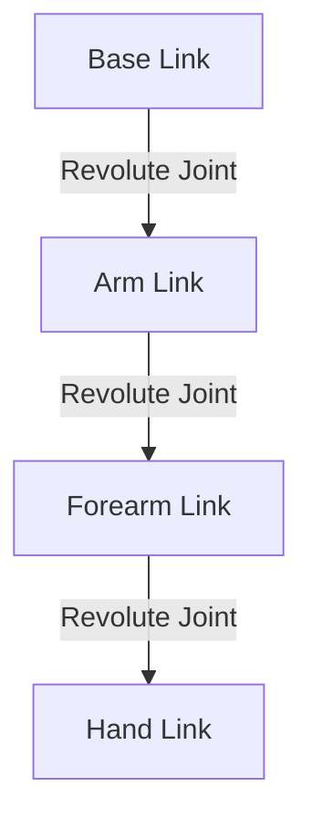

# Chapter 3: URDF and Robot Description

**Week 5** | **Duration**: 4-5 hours | **Complexity**: Intermediate

---

## Learning Objectives

By the end of this chapter, you will be able to:

1. **Understand** URDF (Unified Robot Description Format) structure and syntax
2. **Define** robot links, joints, and their relationships
3. **Specify** visual, collision, and inertial properties
4. **Use** Xacro to create modular, reusable robot descriptions
5. **Visualize** robot models in RViz2
6. **Describe** a humanoid robot's kinematic structure
7. **Debug** URDF files and validate robot descriptions

---

## Introduction

Before a robot can move, simulate, or perceive its environment, ROS 2 needs to know:
- What is the robot's physical structure?
- How do its parts connect?
- What are its dimensions and mass properties?
- What sensors and actuators does it have?

**URDF (Unified Robot Description Format)** is the standard XML-based format for describing robots in ROS. Think of it as a robot's "blueprint" that:
- Defines the **skeleton** (kinematic chain)
- Specifies **appearance** (visual meshes, colors)
- Describes **physics** (collision shapes, inertia)
- Documents **sensors and actuators**

> "URDF is to robots what HTML is to web pages—a structured description that software can parse and render."

---

## 1. URDF Fundamentals

### 1.1 Core Components

Every URDF file consists of two main elements:

**Links**: Rigid bodies (physical parts)
- Base, torso, arms, legs, head, wheels
- Have visual appearance, collision geometry, inertial properties

**Joints**: Connections between links
- Define how links move relative to each other
- Types: fixed, revolute (hinge), prismatic (slider), continuous



### 1.2 Minimal URDF Example

**Simple Two-Link Robot**:

```xml
<?xml version="1.0"?>
<robot name="simple_robot">

  <!-- Base link -->
  <link name="base_link">
    <visual>
      <geometry>
        <box size="0.6 0.4 0.2"/>
      </geometry>
      <material name="blue">
        <color rgba="0 0 0.8 1"/>
      </material>
    </visual>
  </link>

  <!-- Arm link -->
  <link name="arm_link">
    <visual>
      <geometry>
        <cylinder length="0.5" radius="0.05"/>
      </geometry>
      <material name="red">
        <color rgba="0.8 0 0 1"/>
      </material>
    </visual>
  </link>

  <!-- Joint connecting base to arm -->
  <joint name="base_to_arm" type="revolute">
    <parent link="base_link"/>
    <child link="arm_link"/>
    <origin xyz="0 0 0.1" rpy="0 0 0"/>
    <axis xyz="0 0 1"/>
    <limit lower="-1.57" upper="1.57" effort="10" velocity="1"/>
  </joint>

</robot>
```

**Key Concepts**:
- `<robot>`: Root element with robot name
- `<link>`: Physical components
- `<joint>`: Connections with parent/child relationships
- `<origin>`: Position (xyz) and orientation (rpy = roll-pitch-yaw)
- `<axis>`: Rotation/translation axis
- `<limit>`: Joint constraints (range, effort, velocity)

### 1.3 Coordinate Frames

Each link has its own coordinate frame:
- **X-axis** (red): Forward
- **Y-axis** (green): Left
- **Z-axis** (blue): Up

**Convention** (REP-103):
- Base frame typically called `base_link`
- Z-axis points up (against gravity)
- X-axis points forward

---

## 2. Links: Describing Physical Components

### 2.1 Link Structure

A link has three main properties:

```xml
<link name="my_link">
  <visual>     <!-- What it looks like -->
  <collision>  <!-- What it collides with -->
  <inertial>   <!-- How it moves (physics) -->
</link>
```

### 2.2 Visual Properties

**Purpose**: Define appearance for visualization (RViz2, Gazebo)

**Primitive Shapes**:
```xml
<visual>
  <geometry>
    <!-- Box -->
    <box size="1.0 0.5 0.2"/>  <!-- length width height -->

    <!-- Cylinder -->
    <cylinder length="0.5" radius="0.1"/>

    <!-- Sphere -->
    <sphere radius="0.15"/>
  </geometry>

  <material name="orange">
    <color rgba="1.0 0.5 0 1"/>  <!-- R G B A -->
  </material>
</visual>
```

**Mesh Files** (for complex shapes):
```xml
<visual>
  <geometry>
    <mesh filename="package://my_robot_description/meshes/arm.stl" scale="1 1 1"/>
  </geometry>
</visual>
```

**Supported Mesh Formats**:
- STL (stereolithography)
- DAE (COLLADA)
- OBJ (Wavefront)

### 2.3 Collision Properties

**Purpose**: Define shapes for collision detection (simpler than visual for performance)

```xml
<collision>
  <geometry>
    <!-- Usually simplified geometry -->
    <cylinder length="0.5" radius="0.12"/>  <!-- Slightly larger than visual -->
  </geometry>
</collision>
```

**Best Practices**:
- Use simple primitives (box, cylinder, sphere)
- Collision shapes should **enclose** visual shapes
- Fewer polygons = faster simulation

### 2.4 Inertial Properties

**Purpose**: Define mass distribution for physics simulation

```xml
<inertial>
  <mass value="2.5"/>  <!-- kg -->

  <!-- Center of mass offset from link origin -->
  <origin xyz="0 0 0.1" rpy="0 0 0"/>

  <!-- Inertia tensor (3x3 matrix, represented as 6 values) -->
  <inertia
    ixx="0.01" ixy="0.0" ixz="0.0"
    iyy="0.01" iyz="0.0"
    izz="0.01"/>
</inertial>
```

**Calculating Inertia**:

For common shapes:

**Box** (mass `m`, dimensions `x, y, z`):
```
ixx = (1/12) * m * (y² + z²)
iyy = (1/12) * m * (x² + z²)
izz = (1/12) * m * (x² + y²)
```

**Cylinder** (mass `m`, radius `r`, height `h`, axis along Z):
```
ixx = (1/12) * m * (3*r² + h²)
iyy = (1/12) * m * (3*r² + h²)
izz = (1/2) * m * r²
```

**Sphere** (mass `m`, radius `r`):
```
ixx = iyy = izz = (2/5) * m * r²
```

**Example: 2kg Cylindrical Arm** (r=0.05m, h=0.5m):
```xml
<inertial>
  <mass value="2.0"/>
  <inertia
    ixx="0.042" ixy="0" ixz="0"
    iyy="0.042" iyz="0"
    izz="0.0025"/>
</inertial>
```

---

## 3. Joints: Connecting Links

### 3.1 Joint Types

| Type | Description | Use Case |
|------|-------------|----------|
| **fixed** | No movement | Attach sensors, cameras |
| **revolute** | Rotation with limits | Elbow, knee, shoulder |
| **continuous** | Unlimited rotation | Wheels, propellers |
| **prismatic** | Linear sliding | Elevators, grippers |
| **floating** | 6-DOF (xyz + rpy) | Humanoid base in simulation |
| **planar** | 2D plane movement | Mobile base (x, y, θ) |

### 3.2 Revolute Joint (Most Common)

**Example: Elbow Joint**

```xml
<joint name="elbow_joint" type="revolute">
  <!-- Parent link (upper arm) -->
  <parent link="upper_arm_link"/>

  <!-- Child link (forearm) -->
  <child link="forearm_link"/>

  <!-- Joint position relative to parent frame -->
  <origin xyz="0 0 0.3" rpy="0 0 0"/>

  <!-- Rotation axis (Y-axis for elbow) -->
  <axis xyz="0 1 0"/>

  <!-- Joint limits -->
  <limit
    lower="0"           <!-- Minimum angle (radians) -->
    upper="2.617"       <!-- Maximum angle (150 degrees) -->
    effort="50"         <!-- Max torque (Nm) -->
    velocity="2.0"/>    <!-- Max angular velocity (rad/s) -->

  <!-- Dynamics (optional) -->
  <dynamics damping="0.7" friction="0.0"/>
</joint>
```

**Key Parameters**:
- `lower`/`upper`: Joint range (radians)
- `effort`: Maximum torque/force the joint can exert
- `velocity`: Maximum speed
- `damping`: Resistance proportional to velocity
- `friction`: Constant resistance

### 3.3 Continuous Joint

**Example: Wheel Joint**

```xml
<joint name="wheel_joint" type="continuous">
  <parent link="base_link"/>
  <child link="wheel_link"/>
  <origin xyz="0.15 0 0" rpy="-1.57 0 0"/>  <!-- Rotate 90° for wheel orientation -->
  <axis xyz="0 0 1"/>
  <limit effort="10" velocity="5.0"/>  <!-- No lower/upper for continuous -->
</joint>
```

### 3.4 Prismatic Joint

**Example: Linear Actuator**

```xml
<joint name="lift_joint" type="prismatic">
  <parent link="base_link"/>
  <child link="platform_link"/>
  <origin xyz="0 0 0.2" rpy="0 0 0"/>
  <axis xyz="0 0 1"/>  <!-- Move along Z-axis -->
  <limit
    lower="0"
    upper="0.5"        <!-- 50 cm travel -->
    effort="100"       <!-- Max force (N) -->
    velocity="0.5"/>   <!-- Max speed (m/s) -->
</joint>
```

### 3.5 Fixed Joint

**Example: Camera Mount**

```xml
<joint name="camera_joint" type="fixed">
  <parent link="head_link"/>
  <child link="camera_link"/>
  <origin xyz="0.05 0 0.1" rpy="0 0 0"/>
  <!-- No axis or limits for fixed joints -->
</joint>
```

---

## 4. Complete Humanoid Arm Example

Let's build a 4-DOF humanoid arm with shoulder, elbow, and wrist joints.

### 4.1 URDF Structure

```xml
<?xml version="1.0"?>
<robot name="humanoid_arm">

  <!-- Base (torso attachment) -->
  <link name="torso_link">
    <visual>
      <geometry>
        <box size="0.4 0.3 0.6"/>
      </geometry>
      <material name="grey">
        <color rgba="0.5 0.5 0.5 1"/>
      </material>
    </visual>
    <collision>
      <geometry>
        <box size="0.4 0.3 0.6"/>
      </geometry>
    </collision>
    <inertial>
      <mass value="5.0"/>
      <inertia ixx="0.195" ixy="0" ixz="0" iyy="0.145" iyz="0" izz="0.08"/>
    </inertial>
  </link>

  <!-- Shoulder Link -->
  <link name="shoulder_link">
    <visual>
      <geometry>
        <sphere radius="0.08"/>
      </geometry>
      <material name="red">
        <color rgba="0.8 0 0 1"/>
      </material>
    </visual>
    <collision>
      <geometry>
        <sphere radius="0.08"/>
      </geometry>
    </collision>
    <inertial>
      <mass value="0.5"/>
      <inertia ixx="0.00128" ixy="0" ixz="0" iyy="0.00128" iyz="0" izz="0.00128"/>
    </inertial>
  </link>

  <!-- Shoulder Joint (Pitch) -->
  <joint name="shoulder_pitch_joint" type="revolute">
    <parent link="torso_link"/>
    <child link="shoulder_link"/>
    <origin xyz="0 0.2 0.2" rpy="0 0 0"/>
    <axis xyz="0 1 0"/>
    <limit lower="-1.57" upper="3.14" effort="50" velocity="2.0"/>
  </joint>

  <!-- Upper Arm Link -->
  <link name="upper_arm_link">
    <visual>
      <origin xyz="0 0 -0.15" rpy="0 0 0"/>
      <geometry>
        <cylinder length="0.3" radius="0.05"/>
      </geometry>
      <material name="blue">
        <color rgba="0 0 0.8 1"/>
      </material>
    </visual>
    <collision>
      <origin xyz="0 0 -0.15" rpy="0 0 0"/>
      <geometry>
        <cylinder length="0.3" radius="0.06"/>
      </geometry>
    </collision>
    <inertial>
      <mass value="1.5"/>
      <origin xyz="0 0 -0.15" rpy="0 0 0"/>
      <inertia ixx="0.0115" ixy="0" ixz="0" iyy="0.0115" iyz="0" izz="0.00225"/>
    </inertial>
  </link>

  <!-- Shoulder Joint (Roll) -->
  <joint name="shoulder_roll_joint" type="revolute">
    <parent link="shoulder_link"/>
    <child link="upper_arm_link"/>
    <origin xyz="0 0 0" rpy="0 0 0"/>
    <axis xyz="1 0 0"/>
    <limit lower="-1.57" upper="1.57" effort="40" velocity="2.0"/>
  </joint>

  <!-- Forearm Link -->
  <link name="forearm_link">
    <visual>
      <origin xyz="0 0 -0.125" rpy="0 0 0"/>
      <geometry>
        <cylinder length="0.25" radius="0.04"/>
      </geometry>
      <material name="green">
        <color rgba="0 0.8 0 1"/>
      </material>
    </visual>
    <collision>
      <origin xyz="0 0 -0.125" rpy="0 0 0"/>
      <geometry>
        <cylinder length="0.25" radius="0.05"/>
      </geometry>
    </collision>
    <inertial>
      <mass value="1.0"/>
      <origin xyz="0 0 -0.125" rpy="0 0 0"/>
      <inertia ixx="0.0053" ixy="0" ixz="0" iyy="0.0053" iyz="0" izz="0.0008"/>
    </inertial>
  </link>

  <!-- Elbow Joint -->
  <joint name="elbow_joint" type="revolute">
    <parent link="upper_arm_link"/>
    <child link="forearm_link"/>
    <origin xyz="0 0 -0.3" rpy="0 0 0"/>
    <axis xyz="0 1 0"/>
    <limit lower="0" upper="2.617" effort="30" velocity="2.0"/>
  </joint>

  <!-- Hand Link -->
  <link name="hand_link">
    <visual>
      <origin xyz="0 0 -0.05" rpy="0 0 0"/>
      <geometry>
        <box size="0.08 0.12 0.1"/>
      </geometry>
      <material name="beige">
        <color rgba="0.9 0.8 0.7 1"/>
      </material>
    </visual>
    <collision>
      <origin xyz="0 0 -0.05" rpy="0 0 0"/>
      <geometry>
        <box size="0.08 0.12 0.1"/>
      </geometry>
    </collision>
    <inertial>
      <mass value="0.5"/>
      <origin xyz="0 0 -0.05" rpy="0 0 0"/>
      <inertia ixx="0.00083" ixy="0" ixz="0" iyy="0.00067" iyz="0" izz="0.00053"/>
    </inertial>
  </link>

  <!-- Wrist Joint -->
  <joint name="wrist_joint" type="revolute">
    <parent link="forearm_link"/>
    <child link="hand_link"/>
    <origin xyz="0 0 -0.25" rpy="0 0 0"/>
    <axis xyz="0 0 1"/>
    <limit lower="-1.57" upper="1.57" effort="10" velocity="2.0"/>
  </joint>

</robot>
```

### 4.2 Save and Check URDF

Save as `humanoid_arm.urdf`, then validate:

```bash
check_urdf humanoid_arm.urdf
```

**Expected Output**:
```
robot name is: humanoid_arm
---------- Successfully Parsed XML ---------------
root Link: torso_link has 1 child(ren)
    child(1):  shoulder_link
        child(1):  upper_arm_link
            child(1):  forearm_link
                child(1):  hand_link
```

### 4.3 Visualize Joint Tree

```bash
urdf_to_graphiz humanoid_arm.urdf
# Generates PDF showing link-joint tree
```

---

## 5. Xacro: Modular Robot Descriptions

### 5.1 Why Xacro?

**Problems with plain URDF**:
- Repetitive code (4 identical wheels = 4x the code)
- Hard to maintain
- No variables or math
- No conditional logic

**Xacro** (XML Macros) adds:
- **Variables**: `${wheel_radius}`
- **Math**: `${wheel_radius * 2}`
- **Macros**: Reusable templates
- **Includes**: Split into multiple files
- **Conditional logic**: `<xacro:if>`

### 5.2 Basic Xacro Syntax

**Variables**:
```xml
<xacro:property name="wheel_radius" value="0.1"/>
<xacro:property name="wheel_width" value="0.05"/>

<link name="wheel">
  <visual>
    <geometry>
      <cylinder length="${wheel_width}" radius="${wheel_radius}"/>
    </geometry>
  </visual>
</link>
```

**Math**:
```xml
<xacro:property name="PI" value="3.14159265359"/>
<origin xyz="0 0 0" rpy="0 ${PI/2} 0"/>  <!-- Rotate 90 degrees -->
```

### 5.3 Macros for Repeated Components

**Wheel Macro**:
```xml
<robot xmlns:xacro="http://www.ros.org/wiki/xacro" name="my_robot">

  <!-- Define macro -->
  <xacro:macro name="wheel" params="prefix x_pos y_pos">
    <link name="${prefix}_wheel_link">
      <visual>
        <geometry>
          <cylinder length="0.05" radius="0.1"/>
        </geometry>
        <material name="black">
          <color rgba="0.1 0.1 0.1 1"/>
        </material>
      </visual>
      <collision>
        <geometry>
          <cylinder length="0.05" radius="0.1"/>
        </geometry>
      </collision>
      <inertial>
        <mass value="2.0"/>
        <inertia ixx="0.0052" ixy="0" ixz="0" iyy="0.0052" iyz="0" izz="0.01"/>
      </inertial>
    </link>

    <joint name="${prefix}_wheel_joint" type="continuous">
      <parent link="base_link"/>
      <child link="${prefix}_wheel_link"/>
      <origin xyz="${x_pos} ${y_pos} 0" rpy="-1.57 0 0"/>
      <axis xyz="0 0 1"/>
      <limit effort="10" velocity="5.0"/>
    </joint>
  </xacro:macro>

  <!-- Base link -->
  <link name="base_link">
    <visual>
      <geometry>
        <box size="0.6 0.4 0.2"/>
      </geometry>
      <material name="blue">
        <color rgba="0 0 0.8 1"/>
      </material>
    </visual>
  </link>

  <!-- Instantiate wheels -->
  <xacro:wheel prefix="front_left"  x_pos="0.2"  y_pos="0.3"/>
  <xacro:wheel prefix="front_right" x_pos="0.2"  y_pos="-0.3"/>
  <xacro:wheel prefix="rear_left"   x_pos="-0.2" y_pos="0.3"/>
  <xacro:wheel prefix="rear_right"  x_pos="-0.2" y_pos="-0.3"/>

</robot>
```

**Generate URDF from Xacro**:
```bash
xacro robot.urdf.xacro > robot.urdf
```

### 5.4 Humanoid Arm with Xacro

**`humanoid_arm.urdf.xacro`**:

```xml
<?xml version="1.0"?>
<robot xmlns:xacro="http://www.ros.org/wiki/xacro" name="humanoid_arm">

  <!-- Properties -->
  <xacro:property name="PI" value="3.14159265359"/>
  <xacro:property name="shoulder_mass" value="0.5"/>
  <xacro:property name="upper_arm_length" value="0.3"/>
  <xacro:property name="forearm_length" value="0.25"/>

  <!-- Inertia calculation macros -->
  <xacro:macro name="cylinder_inertia" params="mass radius length">
    <inertial>
      <mass value="${mass}"/>
      <inertia
        ixx="${(1/12) * mass * (3*radius*radius + length*length)}"
        ixy="0" ixz="0"
        iyy="${(1/12) * mass * (3*radius*radius + length*length)}"
        iyz="0"
        izz="${(1/2) * mass * radius * radius}"/>
    </inertial>
  </xacro:macro>

  <!-- Arm segment macro -->
  <xacro:macro name="arm_segment" params="name length radius mass color">
    <link name="${name}_link">
      <visual>
        <origin xyz="0 0 ${-length/2}" rpy="0 0 0"/>
        <geometry>
          <cylinder length="${length}" radius="${radius}"/>
        </geometry>
        <material name="${color}">
          <color rgba="${color == 'blue' ? '0 0 0.8 1' : '0 0.8 0 1'}"/>
        </material>
      </visual>
      <collision>
        <origin xyz="0 0 ${-length/2}" rpy="0 0 0"/>
        <geometry>
          <cylinder length="${length}" radius="${radius * 1.2}"/>
        </geometry>
      </collision>
      <xacro:cylinder_inertia mass="${mass}" radius="${radius}" length="${length}"/>
    </link>
  </xacro:macro>

  <!-- Base torso link -->
  <link name="torso_link">
    <visual>
      <geometry>
        <box size="0.4 0.3 0.6"/>
      </geometry>
      <material name="grey">
        <color rgba="0.5 0.5 0.5 1"/>
      </material>
    </visual>
  </link>

  <!-- Use macros -->
  <xacro:arm_segment name="upper_arm" length="${upper_arm_length}" radius="0.05" mass="1.5" color="blue"/>
  <xacro:arm_segment name="forearm" length="${forearm_length}" radius="0.04" mass="1.0" color="green"/>

  <!-- Joints -->
  <joint name="shoulder_joint" type="revolute">
    <parent link="torso_link"/>
    <child link="upper_arm_link"/>
    <origin xyz="0 0.2 0.2" rpy="0 0 0"/>
    <axis xyz="0 1 0"/>
    <limit lower="${-PI/2}" upper="${PI}" effort="50" velocity="2.0"/>
  </joint>

  <joint name="elbow_joint" type="revolute">
    <parent link="upper_arm_link"/>
    <child link="forearm_link"/>
    <origin xyz="0 0 ${-upper_arm_length}" rpy="0 0 0"/>
    <axis xyz="0 1 0"/>
    <limit lower="0" upper="${2.617}" effort="30" velocity="2.0"/>
  </joint>

</robot>
```

**Advantages**:
- Change `upper_arm_length` once, propagates everywhere
- Inertia calculated automatically
- Easy to create left/right arm by changing parameters

---

## 6. Visualizing in RViz2

### 6.1 Create Robot Description Package

```bash
cd ~/ros2_ws/src
ros2 pkg create --build-type ament_cmake humanoid_description
cd humanoid_description
mkdir urdf launch rviz meshes
```

**Package Structure**:
```
humanoid_description/
├── urdf/
│   └── humanoid_arm.urdf.xacro
├── launch/
│   └── display.launch.py
├── rviz/
│   └── urdf_config.rviz
├── meshes/
│   └── (STL/DAE files)
├── CMakeLists.txt
└── package.xml
```

### 6.2 Create Launch File

**`launch/display.launch.py`**:

```python
import os
from launch import LaunchDescription
from launch.actions import DeclareLaunchArgument
from launch.substitutions import LaunchConfiguration, Command
from launch_ros.actions import Node
from launch_ros.substitutions import FindPackageShare


def generate_launch_description():
    # Package name
    pkg_share = FindPackageShare('humanoid_description').find('humanoid_description')

    # Path to URDF file
    urdf_file = os.path.join(pkg_share, 'urdf', 'humanoid_arm.urdf.xacro')

    # Process xacro to URDF
    robot_description = Command(['xacro ', urdf_file])

    # Launch arguments
    use_sim_time = LaunchConfiguration('use_sim_time', default='false')

    return LaunchDescription([
        # Declare launch arguments
        DeclareLaunchArgument(
            'use_sim_time',
            default_value='false',
            description='Use simulation time'
        ),

        # Robot State Publisher
        Node(
            package='robot_state_publisher',
            executable='robot_state_publisher',
            name='robot_state_publisher',
            output='screen',
            parameters=[{
                'robot_description': robot_description,
                'use_sim_time': use_sim_time
            }]
        ),

        # Joint State Publisher GUI
        Node(
            package='joint_state_publisher_gui',
            executable='joint_state_publisher_gui',
            name='joint_state_publisher_gui',
            output='screen'
        ),

        # RViz2
        Node(
            package='rviz2',
            executable='rviz2',
            name='rviz2',
            output='screen',
            arguments=['-d', os.path.join(pkg_share, 'rviz', 'urdf_config.rviz')]
        )
    ])
```

### 6.3 Update CMakeLists.txt

```cmake
cmake_minimum_required(VERSION 3.8)
project(humanoid_description)

# Find dependencies
find_package(ament_cmake REQUIRED)

# Install directories
install(DIRECTORY
  urdf
  launch
  rviz
  meshes
  DESTINATION share/${PROJECT_NAME}
)

ament_package()
```

### 6.4 Build and Launch

```bash
cd ~/ros2_ws
colcon build --packages-select humanoid_description
source install/setup.bash

ros2 launch humanoid_description display.launch.py
```

**What Opens**:
1. **RViz2**: Visualizes robot model
2. **Joint State Publisher GUI**: Sliders to move joints

### 6.5 RViz2 Configuration

In RViz2:
1. Set **Fixed Frame** to `torso_link`
2. Add **RobotModel** display
3. Add **TF** display (shows coordinate frames)
4. Use sliders to move joints and see motion

**Save Configuration**:
- File → Save Config As → `rviz/urdf_config.rviz`

---

## 7. Humanoid Robot Full Structure

### 7.1 Humanoid Kinematic Chain

A bipedal humanoid typically has:

```
                  Head
                   |
              Neck Joint
                   |
                 Torso
        /          |          \
  Left Arm    Waist Joint   Right Arm
       |          |              |
  (4-7 DOF)   Pelvis        (4-7 DOF)
              /    \
         Left Leg  Right Leg
          (6 DOF)   (6 DOF)
```

**Total DOF** (Degrees of Freedom): 20-40 joints

### 7.2 Simplified Humanoid Structure

**Key Components**:

| Part | Joints | DOF | Notes |
|------|--------|-----|-------|
| **Head** | Neck (pan, tilt) | 2 | For gaze control |
| **Torso** | Waist (optional) | 0-3 | Bending, twisting |
| **Arm** | Shoulder (3), elbow (1), wrist (2-3) | 6-7 | Per arm |
| **Hand** | Fingers | 5-12 | Per hand (often simplified) |
| **Leg** | Hip (3), knee (1), ankle (2) | 6 | Per leg |

### 7.3 Example: Simplified Humanoid URDF Structure

```xml
<robot name="simple_humanoid">
  <!-- Base -->
  <link name="base_link"/>  <!-- Floating base -->

  <!-- Pelvis -->
  <link name="pelvis"/>
  <joint name="base_to_pelvis" type="fixed">
    <parent link="base_link"/>
    <child link="pelvis"/>
  </joint>

  <!-- Torso -->
  <link name="torso"/>
  <joint name="waist_joint" type="revolute">
    <parent link="pelvis"/>
    <child link="torso"/>
    <axis xyz="0 0 1"/>  <!-- Rotation around vertical -->
  </joint>

  <!-- Left Leg -->
  <link name="left_hip"/>
  <joint name="left_hip_yaw" type="revolute">
    <parent link="pelvis"/>
    <child link="left_hip"/>
    <axis xyz="0 0 1"/>
  </joint>

  <link name="left_thigh"/>
  <joint name="left_hip_pitch" type="revolute">
    <parent link="left_hip"/>
    <child link="left_thigh"/>
    <axis xyz="0 1 0"/>
  </joint>

  <link name="left_shin"/>
  <joint name="left_knee" type="revolute">
    <parent link="left_thigh"/>
    <child link="left_shin"/>
    <axis xyz="0 1 0"/>
  </joint>

  <link name="left_foot"/>
  <joint name="left_ankle" type="revolute">
    <parent link="left_shin"/>
    <child link="left_foot"/>
    <axis xyz="0 1 0"/>
  </joint>

  <!-- Right Leg (mirror of left) -->
  <!-- ... -->

  <!-- Arms (similar structure) -->
  <!-- ... -->
</robot>
```

### 7.4 Using Xacro for Full Humanoid

**Modular Approach**:

```xml
<!-- main.urdf.xacro -->
<robot xmlns:xacro="http://www.ros.org/wiki/xacro" name="humanoid">

  <!-- Include sub-files -->
  <xacro:include filename="$(find humanoid_description)/urdf/torso.xacro"/>
  <xacro:include filename="$(find humanoid_description)/urdf/arm.xacro"/>
  <xacro:include filename="$(find humanoid_description)/urdf/leg.xacro"/>
  <xacro:include filename="$(find humanoid_description)/urdf/materials.xacro"/>

  <!-- Base -->
  <link name="base_link"/>

  <!-- Instantiate components -->
  <xacro:torso parent="base_link"/>
  <xacro:arm prefix="left" parent="torso" reflect="1"/>
  <xacro:arm prefix="right" parent="torso" reflect="-1"/>
  <xacro:leg prefix="left" parent="pelvis" reflect="1"/>
  <xacro:leg prefix="right" parent="pelvis" reflect="-1"/>

</robot>
```

---

## 8. Debugging and Best Practices

### 8.1 Common URDF Errors

**1. Mass/Inertia Issues**:
```
Error: Link has zero or negative mass
```
**Fix**: Ensure all links have `<inertial>` with positive mass.

**2. Self-Collisions**:
```
Warning: Collision shapes overlap
```
**Fix**: Check collision geometry placement and size.

**3. Disconnected Links**:
```
Error: Link 'xyz' has no parent
```
**Fix**: Ensure all links (except root) are connected by joints.

**4. Invalid Joint Limits**:
```
Error: lower > upper in joint limits
```
**Fix**: Verify `lower < upper` in revolute/prismatic joints.

### 8.2 Validation Tools

**Check URDF Syntax**:
```bash
check_urdf robot.urdf
```

**Convert Xacro to URDF**:
```bash
xacro robot.urdf.xacro > robot.urdf
```

**Visualize Joint Tree**:
```bash
urdf_to_graphiz robot.urdf
evince robot.pdf
```

**Check Mass Properties**:
```bash
gz sdf -p robot.urdf > robot.sdf
# View mass, inertia, center of mass
```

### 8.3 Best Practices

**Do**:
- Use Xacro for modularity
- Follow REP-103 coordinate conventions
- Use realistic inertia values
- Simplify collision geometries
- Name links/joints clearly (`left_shoulder_pitch`)
- Include sensors and cameras in URDF

**Don't**:
- Use zero or negative mass
- Make collision shapes too complex
- Ignore joint limits
- Hard-code values (use Xacro properties)
- Forget to source workspace after building

---

## Summary

In this chapter, you learned:

✅ **URDF Structure**: Links, joints, and their relationships
✅ **Link Properties**: Visual, collision, and inertial definitions
✅ **Joint Types**: Fixed, revolute, continuous, prismatic
✅ **Inertia Calculations**: Mass properties for realistic physics
✅ **Xacro**: Macros, variables, and modular robot descriptions
✅ **RViz2 Visualization**: Displaying and manipulating robot models
✅ **Humanoid Structure**: Kinematic chains for bipedal robots
✅ **Debugging**: Validation tools and best practices

**Key Takeaway**: URDF is the foundation for simulation, visualization, and control. A well-defined robot description enables accurate physics simulation, proper kinematics, and reliable sensor placement.

---

## Exercises

### Exercise 1: Simple Mobile Robot (30 minutes)
Create a URDF for a differential drive robot:
1. Rectangular base (0.6m × 0.4m × 0.2m)
2. Two drive wheels (0.1m radius)
3. Two caster wheels (spheres, 0.05m radius)
4. Mass properties for all links
5. Visualize in RViz2

### Exercise 2: 2-Link Robotic Arm (45 minutes)
Build a planar 2-link arm:
1. Fixed base
2. Link 1: 0.5m length
3. Link 2: 0.3m length
4. Two revolute joints (limits: -180° to 180°)
5. Add end-effector (gripper) as fixed link
6. Use Xacro for link macro

### Exercise 3: Humanoid Leg (60 minutes)
Create a 6-DOF humanoid leg:
1. Hip joint: 3 DOF (yaw, roll, pitch)
2. Knee joint: 1 DOF (pitch, 0° to 150°)
3. Ankle joint: 2 DOF (pitch, roll)
4. Proper mass distribution
5. Realistic joint limits
6. Visualize and test joint motion

### Exercise 4: Full Humanoid Upper Body (90 minutes)
Design a humanoid upper body:
1. Torso with pelvis and chest
2. Two arms (4 DOF each: shoulder 2, elbow 1, wrist 1)
3. Head with 2-DOF neck
4. Use Xacro macros for left/right arms
5. Add cameras to head
6. Create parameter file for joint limits
7. Launch in RViz2 with joint sliders

**Bonus**: Add mesh files for realistic appearance.

---

## Assessment

1. What are the three main properties of a URDF link?
2. Explain the difference between visual and collision geometry.
3. How do you calculate the inertia tensor for a cylinder?
4. What's the advantage of using Xacro over plain URDF?
5. Why is the inertial property important for simulation?

Take the [Chapter 3 Quiz](../../assessments/module-1/chapter-03-quiz.md) (15 questions, 80% to pass).

---

## Additional Resources

- **URDF Tutorial**: [docs.ros.org/en/humble/Tutorials/URDF](https://docs.ros.org/en/humble/Tutorials/Intermediate/URDF/URDF-Main.html)
- **Xacro Documentation**: [wiki.ros.org/xacro](http://wiki.ros.org/xacro)
- **RViz2 User Guide**: [docs.ros.org/en/humble/Tutorials/RViz2](https://docs.ros.org/en/humble/Tutorials/Intermediate/RViz/RViz-Main.html)
- **REP-103**: [ROS Coordinate Frames](https://www.ros.org/reps/rep-0103.html)
- **Inertia Calculator**: [Online Tool](https://amesweb.info/inertia/mass-moment-of-inertia-calculator.aspx)
- **Example URDFs**: [github.com/ros/urdf_tutorial](https://github.com/ros/urdf_tutorial)

---

## Next Steps

Congratulations on completing Module 1! You now have a solid foundation in ROS 2 fundamentals.

**Module 1 Recap**:
- Chapter 1: ROS 2 architecture, nodes, topics, pub-sub
- Chapter 2: Services, actions, parameters, QoS
- Chapter 3: URDF, robot description, visualization

**Next Module**: [Module 2: The Digital Twin (Gazebo & Unity)](../module-2/01-gazebo-simulation.md)

In Module 2, you'll learn to:
- Simulate robots in Gazebo with realistic physics
- Create environments and spawn objects
- Simulate sensors (LIDAR, cameras, IMU)
- Control robots in simulation

---

*This chapter is part of the Physical AI & Humanoid Robotics textbook. All code examples and URDF files are available in the [companion repository](https://github.com/panaversity/physical-ai-textbook).*
