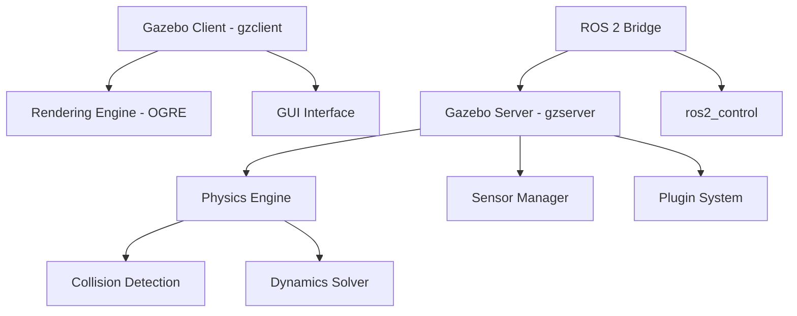

# Chapter 1: Gazebo Simulation

**Week 6** | **Duration**: 5-6 hours | **Complexity**: Intermediate

---

## Learning Objectives

By the end of this chapter, you will be able to:

1. **Install** and configure Gazebo for ROS 2 integration
2. **Create** custom simulation worlds using SDF (Simulation Description Format)
3. **Understand** physics engines and configure gravity, friction, and collision properties
4. **Spawn** robots dynamically in Gazebo environments
5. **Integrate** Gazebo plugins with ROS 2 for sensor and actuator control
6. **Debug** simulations using Gazebo's introspection tools

---

## Introduction

Simulation is the foundation of modern robotics development. Before deploying code to expensive hardware, we test algorithms in **digital twins**—virtual replicas of robots and environments. **Gazebo** is the industry-standard open-source robotics simulator, providing:

- **High-fidelity physics** simulation with collision detection
- **Sensor simulation** (LIDAR, cameras, IMUs, force/torque sensors)
- **ROS 2 native integration** for seamless development
- **Plugin architecture** for custom behaviors
- **Distributed simulation** across multiple machines

> "Test your robot a thousand times in simulation before you deploy it once in the real world."

**Why Gazebo?**
- Used by Boston Dynamics, NASA, DARPA Robotics Challenge teams
- Simulates real-world physics (inertia, friction, gravity)
- Free and open-source
- Extensive model library (robots, sensors, environments)

---

## 1. Gazebo Architecture

### 1.1 Gazebo Components

Gazebo consists of several interconnected components:



**Key Components**:

1. **Gazebo Server (`gzserver`)**:
   - Runs the physics engine
   - Manages sensors and plugins
   - Can run headless (no GUI) for batch simulations

2. **Gazebo Client (`gzclient`)**:
   - 3D visualization using OGRE rendering engine
   - GUI for interaction (moving objects, adjusting lighting)
   - Optional (can run server-only for performance)

3. **ROS 2 Bridge**:
   - `gazebo_ros` packages
   - Translates ROS 2 topics/services to Gazebo messages
   - Provides spawn/delete services

4. **Plugin System**:
   - Extend Gazebo functionality
   - Sensor plugins (camera, LIDAR, IMU)
   - Model plugins (differential drive, gripper control)
   - World plugins (custom physics, environmental effects)

### 1.2 SDF vs URDF

Gazebo uses two description formats:

| Format | Purpose | Use Case |
|--------|---------|----------|
| **URDF** | Robot description (ROS native) | Defining robot structure, joints, links |
| **SDF** | World and model description (Gazebo native) | Simulation environments, advanced physics |

**Key Differences**:
- URDF: Limited to single robots, no world elements
- SDF: Supports multiple robots, worlds, physics engines, sensors

**Conversion**: URDF files are automatically converted to SDF by Gazebo.

### 1.3 Physics Engines

Gazebo supports multiple physics backends:

| Engine | Strengths | Best For |
|--------|-----------|----------|
| **ODE** (Default) | Fast, stable | General robotics, mobile robots |
| **Bullet** | Accurate collisions | Manipulation, complex contacts |
| **DART** | Kinematic chains | Humanoids, articulated robots |
| **Simbody** | Biomechanics | Human-robot interaction |

For humanoid robotics, we typically use **DART** or **Bullet** for better handling of multi-body dynamics.

---

## 2. Installation and Setup

### 2.1 Installing Gazebo for ROS 2 Humble

**Prerequisites**:
```bash
# Ensure ROS 2 Humble is installed
source /opt/ros/humble/setup.bash
```

**Install Gazebo Classic (11.x)**:
```bash
# Install Gazebo 11 (Gazebo Classic)
sudo apt update
sudo apt install gazebo11 libgazebo11-dev -y

# Install ROS 2 Gazebo packages
sudo apt install ros-humble-gazebo-ros-pkgs \
  ros-humble-gazebo-ros2-control \
  ros-humble-gazebo-plugins -y
```

**Verify Installation**:
```bash
# Check Gazebo version
gazebo --version
# Output: Gazebo multi-robot simulator, version 11.x

# Test Gazebo launch
gazebo --verbose
```

You should see the Gazebo GUI with an empty world.

### 2.2 Understanding Gazebo Ignition (Future)

**Note**: Gazebo Ignition (now called "Gazebo" or "New Gazebo") is the next-generation simulator. For ROS 2 Humble, we use **Gazebo Classic** due to better integration. However, migration to Ignition Fortress/Garden is ongoing.

**Differences**:
- Gazebo Classic: Stable, mature, better ROS 2 Humble support
- Gazebo Ignition: Modern architecture, better performance, still maturing

For this course, we focus on **Gazebo Classic 11.x**.

### 2.3 Workspace Setup

Create a workspace for simulation:

```bash
mkdir -p ~/ros2_ws/src/my_gazebo_world
cd ~/ros2_ws/src/my_gazebo_world

# Create package
ros2 pkg create --build-type ament_cmake my_gazebo_world \
  --dependencies gazebo_ros gazebo_plugins
```

**Directory Structure**:
```
my_gazebo_world/
├── worlds/           # SDF world files
├── models/           # Custom robot/object models
├── launch/           # Launch files
├── config/           # Configuration files
├── CMakeLists.txt
└── package.xml
```

---

## 3. Creating Simulation Worlds

### 3.1 Basic World File

SDF (Simulation Description Format) defines the simulation environment.

Create `worlds/empty.world`:

```xml
<?xml version="1.0"?>
<sdf version="1.6">
  <world name="default">

    <!-- Physics settings -->
    <physics type="ode">
      <max_step_size>0.001</max_step_size>
      <real_time_factor>1</real_time_factor>
      <real_time_update_rate>1000</real_time_update_rate>
    </physics>

    <!-- Lighting -->
    <light name="sun" type="directional">
      <cast_shadows>true</cast_shadows>
      <pose>0 0 10 0 0 0</pose>
      <diffuse>0.8 0.8 0.8 1</diffuse>
      <specular>0.2 0.2 0.2 1</specular>
      <attenuation>
        <range>1000</range>
      </attenuation>
      <direction>-0.5 0.1 -0.9</direction>
    </light>

    <!-- Ground plane -->
    <include>
      <uri>model://ground_plane</uri>
    </include>

    <!-- Scene settings -->
    <scene>
      <ambient>0.4 0.4 0.4 1</ambient>
      <background>0.7 0.7 0.7 1</background>
      <shadows>true</shadows>
    </scene>

    <!-- Gravity -->
    <gravity>0 0 -9.81</gravity>

    <!-- Magnetic field (for IMU simulation) -->
    <magnetic_field>6e-06 2.3e-05 -4.2e-05</magnetic_field>

  </world>
</sdf>
```

**Key Elements**:
- **`<physics>`**: Simulation timestep and real-time factor
- **`<light>`**: Scene lighting (directional, point, spot)
- **`<include>`**: Import pre-built models
- **`<gravity>`**: Gravitational acceleration (m/s²)
- **`<scene>`**: Visual settings (ambient light, shadows)

### 3.2 Advanced World: Warehouse Environment

Create `worlds/warehouse.world`:

```xml
<?xml version="1.0"?>
<sdf version="1.6">
  <world name="warehouse">

    <physics type="ode">
      <max_step_size>0.001</max_step_size>
      <real_time_update_rate>1000</real_time_update_rate>
    </physics>

    <!-- Lighting -->
    <light name="sun" type="directional">
      <cast_shadows>true</cast_shadows>
      <pose>0 0 10 0 0 0</pose>
      <diffuse>1 1 1 1</diffuse>
      <specular>0.1 0.1 0.1 1</specular>
      <direction>-0.5 0.5 -1</direction>
    </light>

    <!-- Ground -->
    <include>
      <uri>model://ground_plane</uri>
    </include>

    <!-- Warehouse walls -->
    <model name="wall_north">
      <static>true</static>
      <pose>0 5 1 0 0 0</pose>
      <link name="link">
        <collision name="collision">
          <geometry>
            <box>
              <size>10 0.2 2</size>
            </box>
          </geometry>
        </collision>
        <visual name="visual">
          <geometry>
            <box>
              <size>10 0.2 2</size>
            </box>
          </geometry>
          <material>
            <ambient>0.7 0.7 0.7 1</ambient>
            <diffuse>0.7 0.7 0.7 1</diffuse>
          </material>
        </visual>
      </link>
    </model>

    <!-- Obstacle: Box -->
    <model name="box1">
      <pose>2 2 0.5 0 0 0</pose>
      <link name="link">
        <inertial>
          <mass>5.0</mass>
          <inertia>
            <ixx>0.083</ixx>
            <iyy>0.083</iyy>
            <izz>0.083</izz>
          </inertia>
        </inertial>
        <collision name="collision">
          <geometry>
            <box>
              <size>1 1 1</size>
            </box>
          </geometry>
        </collision>
        <visual name="visual">
          <geometry>
            <box>
              <size>1 1 1</size>
            </box>
          </geometry>
          <material>
            <ambient>0.8 0.2 0.2 1</ambient>
            <diffuse>0.8 0.2 0.2 1</diffuse>
          </material>
        </visual>
      </link>
    </model>

    <!-- Obstacle: Cylinder -->
    <model name="cylinder1">
      <pose>-2 -2 0.5 0 0 0</pose>
      <link name="link">
        <inertial>
          <mass>3.0</mass>
        </inertial>
        <collision name="collision">
          <geometry>
            <cylinder>
              <radius>0.3</radius>
              <length>1.0</length>
            </cylinder>
          </geometry>
        </collision>
        <visual name="visual">
          <geometry>
            <cylinder>
              <radius>0.3</radius>
              <length>1.0</length>
            </cylinder>
          </geometry>
          <material>
            <ambient>0.2 0.2 0.8 1</ambient>
          </material>
        </visual>
      </link>
    </model>

    <gravity>0 0 -9.81</gravity>

  </world>
</sdf>
```

**New Elements**:
- **`<static>`**: Objects don't move (infinite mass)
- **`<inertial>`**: Mass and inertia tensor
- **`<collision>`**: Collision geometry (physics engine)
- **`<visual>`**: Visual geometry (rendering engine)

**Pro Tip**: Collision geometry can be simpler than visual geometry for performance.

### 3.3 Launch File for Worlds

Create `launch/warehouse_world.launch.py`:

```python
#!/usr/bin/env python3
import os
from ament_index_python.packages import get_package_share_directory
from launch import LaunchDescription
from launch.actions import ExecuteProcess, IncludeLaunchDescription
from launch.launch_description_sources import PythonLaunchDescriptionSource
from launch_ros.actions import Node


def generate_launch_description():
    # Get package directory
    pkg_dir = get_package_share_directory('my_gazebo_world')

    # Path to world file
    world_file = os.path.join(pkg_dir, 'worlds', 'warehouse.world')

    # Gazebo launch
    gazebo = ExecuteProcess(
        cmd=['gazebo', '--verbose', world_file, '-s', 'libgazebo_ros_factory.so'],
        output='screen'
    )

    return LaunchDescription([
        gazebo
    ])
```

**Build and Launch**:
```bash
cd ~/ros2_ws
colcon build --packages-select my_gazebo_world
source install/setup.bash

ros2 launch my_gazebo_world warehouse_world.launch.py
```

---

## 4. Physics Simulation

### 4.1 Understanding Physics Parameters

**Key Physics Parameters**:

```xml
<physics type="ode">
  <!-- Timestep: smaller = more accurate, slower -->
  <max_step_size>0.001</max_step_size>

  <!-- Real-time factor: 1.0 = real-time, 2.0 = 2x speed -->
  <real_time_factor>1.0</real_time_factor>

  <!-- Update rate: how often physics runs (Hz) -->
  <real_time_update_rate>1000</real_time_update_rate>

  <!-- Solver parameters -->
  <ode>
    <solver>
      <type>quick</type>
      <iters>50</iters>
      <sor>1.3</sor>
    </solver>
    <constraints>
      <cfm>0.0</cfm>
      <erp>0.2</erp>
      <contact_max_correcting_vel>100.0</contact_max_correcting_vel>
      <contact_surface_layer>0.001</contact_surface_layer>
    </constraints>
  </ode>
</physics>
```

**Parameter Tuning**:
- **`max_step_size`**: 0.001s (1ms) is standard; smaller for fast dynamics
- **`iters`**: More iterations = stable but slower (30-100 typical)
- **`cfm`** (Constraint Force Mixing): 0.0 for rigid contacts, >0 for soft
- **`erp`** (Error Reduction Parameter): How quickly to correct errors (0.1-0.8)

### 4.2 Material Properties: Friction and Restitution

Define contact physics between surfaces:

```xml
<model name="ball">
  <link name="link">
    <collision name="collision">
      <geometry>
        <sphere>
          <radius>0.1</radius>
        </sphere>
      </geometry>
      <!-- Surface properties -->
      <surface>
        <friction>
          <ode>
            <mu>1.0</mu>      <!-- Friction coefficient (0-1+) -->
            <mu2>1.0</mu2>    <!-- Secondary friction -->
          </ode>
        </friction>
        <contact>
          <ode>
            <kp>1000000.0</kp>  <!-- Stiffness (N/m) -->
            <kd>1.0</kd>        <!-- Damping (N·s/m) -->
          </ode>
        </contact>
        <bounce>
          <restitution_coefficient>0.8</restitution_coefficient>
          <threshold>0.01</threshold>
        </bounce>
      </surface>
    </collision>
  </link>
</model>
```

**Friction (`mu`) Examples**:
- **0.0**: Ice (no friction)
- **0.5**: Metal on metal
- **1.0**: Rubber on concrete
- **1.5+**: High-grip rubber

**Restitution Coefficient**:
- **0.0**: Perfectly inelastic (no bounce)
- **0.5**: Moderate bounce
- **1.0**: Perfectly elastic (full energy return)

### 4.3 Collision Detection

**Collision Geometry Best Practices**:

```xml
<!-- BAD: Complex mesh for collision -->
<collision name="collision">
  <geometry>
    <mesh>
      <uri>model://complex_robot.dae</uri>
    </mesh>
  </geometry>
</collision>

<!-- GOOD: Simple primitive for collision -->
<collision name="collision">
  <geometry>
    <box>
      <size>0.5 0.3 0.2</size>
    </box>
  </geometry>
</collision>

<!-- BEST: Compound shapes -->
<collision name="collision_body">
  <geometry>
    <box><size>0.5 0.3 0.2</size></box>
  </geometry>
</collision>
<collision name="collision_arm">
  <pose>0.3 0 0 0 0 0</pose>
  <geometry>
    <cylinder>
      <radius>0.05</radius>
      <length>0.4</length>
    </cylinder>
  </geometry>
</collision>
```

**Pro Tips**:
- Use primitives (box, sphere, cylinder) for collisions
- Use high-resolution meshes only for visuals
- Compound shapes: Multiple simple colliders

### 4.4 Gravity and Custom Forces

**Custom Gravity** (e.g., moon simulation):
```xml
<world name="moon">
  <gravity>0 0 -1.62</gravity>  <!-- Moon gravity: 1/6 of Earth -->
</world>
```

**Zero Gravity** (space simulation):
```xml
<gravity>0 0 0</gravity>
```

**Wind Plugin** (custom forces):
```xml
<plugin name="wind_plugin" filename="libgazebo_ros_wind.so">
  <wind_direction>1 0 0</wind_direction>
  <wind_magnitude>5.0</wind_magnitude>
</plugin>
```

---

## 5. Spawning Robots in Gazebo

### 5.1 Using the Spawn Service

ROS 2 provides a service to spawn models:

```bash
# Spawn a model from SDF
ros2 service call /spawn_entity gazebo_msgs/srv/SpawnEntity \
  '{name: "my_robot", xml: "$(cat robot.sdf)"}'
```

### 5.2 Spawn Script (Python)

Create `scripts/spawn_robot.py`:

```python
#!/usr/bin/env python3
import rclpy
from rclpy.node import Node
from gazebo_msgs.srv import SpawnEntity
from ament_index_python.packages import get_package_share_directory
import os


class RobotSpawner(Node):
    """Spawns a robot in Gazebo."""

    def __init__(self):
        super().__init__('robot_spawner')

        # Create client
        self.client = self.create_client(SpawnEntity, '/spawn_entity')

        # Wait for service
        while not self.client.wait_for_service(timeout_sec=1.0):
            self.get_logger().info('Waiting for /spawn_entity service...')

        self.get_logger().info('Spawn service available!')

    def spawn_robot(self, robot_name, sdf_file, x=0.0, y=0.0, z=0.5):
        """Spawn robot at given position."""

        # Read SDF file
        with open(sdf_file, 'r') as f:
            robot_xml = f.read()

        # Create request
        request = SpawnEntity.Request()
        request.name = robot_name
        request.xml = robot_xml
        request.robot_namespace = robot_name
        request.initial_pose.position.x = x
        request.initial_pose.position.y = y
        request.initial_pose.position.z = z

        # Call service
        self.get_logger().info(f'Spawning {robot_name} at ({x}, {y}, {z})')
        future = self.client.call_async(request)

        rclpy.spin_until_future_complete(self, future)

        if future.result() is not None:
            self.get_logger().info(f'Successfully spawned {robot_name}')
            return True
        else:
            self.get_logger().error(f'Failed to spawn {robot_name}')
            return False


def main(args=None):
    rclpy.init(args=args)
    spawner = RobotSpawner()

    # Get robot model path
    pkg_dir = get_package_share_directory('my_gazebo_world')
    robot_sdf = os.path.join(pkg_dir, 'models', 'simple_robot', 'model.sdf')

    # Spawn robot
    spawner.spawn_robot('my_robot', robot_sdf, x=0.0, y=0.0, z=0.5)

    spawner.destroy_node()
    rclpy.shutdown()


if __name__ == '__main__':
    main()
```

### 5.3 Launch File with Robot Spawning

Create `launch/spawn_robot.launch.py`:

```python
#!/usr/bin/env python3
import os
from ament_index_python.packages import get_package_share_directory
from launch import LaunchDescription
from launch.actions import ExecuteProcess
from launch_ros.actions import Node


def generate_launch_description():
    pkg_dir = get_package_share_directory('my_gazebo_world')
    world_file = os.path.join(pkg_dir, 'worlds', 'warehouse.world')
    robot_sdf = os.path.join(pkg_dir, 'models', 'simple_robot', 'model.sdf')

    # Start Gazebo
    gazebo = ExecuteProcess(
        cmd=['gazebo', '--verbose', world_file, '-s', 'libgazebo_ros_factory.so'],
        output='screen'
    )

    # Spawn robot
    spawn_robot = Node(
        package='gazebo_ros',
        executable='spawn_entity.py',
        arguments=['-entity', 'my_robot', '-file', robot_sdf, '-x', '0', '-y', '0', '-z', '0.5'],
        output='screen'
    )

    return LaunchDescription([
        gazebo,
        spawn_robot
    ])
```

**Launch**:
```bash
ros2 launch my_gazebo_world spawn_robot.launch.py
```

---

## 6. Gazebo Plugins for ROS 2

### 6.1 Common Gazebo Plugins

Plugins extend Gazebo functionality and bridge to ROS 2.

**Plugin Types**:
1. **World Plugins**: Modify world physics/environment
2. **Model Plugins**: Control robot behavior
3. **Sensor Plugins**: Publish sensor data to ROS 2
4. **Visual Plugins**: Custom rendering

### 6.2 Differential Drive Plugin

Add to robot SDF:

```xml
<model name="mobile_robot">
  <link name="base_link">
    <!-- ... link definition ... -->
  </link>

  <!-- Left wheel -->
  <link name="left_wheel">
    <!-- ... wheel definition ... -->
  </link>

  <!-- Right wheel -->
  <link name="right_wheel">
    <!-- ... wheel definition ... -->
  </link>

  <!-- Joints connecting wheels to base -->
  <joint name="left_wheel_joint" type="revolute">
    <parent>base_link</parent>
    <child>left_wheel</child>
    <axis>
      <xyz>0 1 0</xyz>
    </axis>
  </joint>

  <joint name="right_wheel_joint" type="revolute">
    <parent>base_link</parent>
    <child>right_wheel</child>
    <axis>
      <xyz>0 1 0</xyz>
    </axis>
  </joint>

  <!-- Differential drive plugin -->
  <plugin name="differential_drive" filename="libgazebo_ros_diff_drive.so">
    <!-- ROS 2 namespace -->
    <ros>
      <namespace>/my_robot</namespace>
    </ros>

    <!-- Wheel joints -->
    <left_joint>left_wheel_joint</left_joint>
    <right_joint>right_wheel_joint</right_joint>

    <!-- Physical parameters -->
    <wheel_separation>0.4</wheel_separation>
    <wheel_diameter>0.2</wheel_diameter>

    <!-- Command topic -->
    <command_topic>cmd_vel</command_topic>

    <!-- Odometry -->
    <publish_odom>true</publish_odom>
    <publish_odom_tf>true</publish_odom_tf>
    <odometry_topic>odom</odometry_topic>
    <odometry_frame>odom</odometry_frame>
    <robot_base_frame>base_link</robot_base_frame>

    <!-- Update rate -->
    <update_rate>50</update_rate>
  </plugin>
</model>
```

**Control the Robot**:
```bash
# Publish velocity commands
ros2 topic pub /my_robot/cmd_vel geometry_msgs/msg/Twist \
  "{linear: {x: 0.5, y: 0, z: 0}, angular: {x: 0, y: 0, z: 0.5}}"

# Monitor odometry
ros2 topic echo /my_robot/odom
```

### 6.3 Joint State Publisher Plugin

For robot arm simulation:

```xml
<plugin name="gazebo_ros_joint_state_publisher"
        filename="libgazebo_ros_joint_state_publisher.so">
  <ros>
    <namespace>/my_robot</namespace>
  </ros>
  <update_rate>50</update_rate>
  <joint_name>joint1</joint_name>
  <joint_name>joint2</joint_name>
  <joint_name>joint3</joint_name>
</plugin>
```

Publishes to `/joint_states` topic (sensor_msgs/JointState).

### 6.4 ROS 2 Control Integration

For advanced control (PID, trajectory following):

```xml
<plugin name="gazebo_ros2_control" filename="libgazebo_ros2_control.so">
  <robot_param>robot_description</robot_param>
  <robot_param_node>robot_state_publisher</robot_param_node>
  <parameters>$(find my_robot)/config/controllers.yaml</parameters>
</plugin>
```

**Controller Configuration** (`config/controllers.yaml`):
```yaml
controller_manager:
  ros__parameters:
    update_rate: 100  # Hz

    joint_state_broadcaster:
      type: joint_state_broadcaster/JointStateBroadcaster

    diff_drive_controller:
      type: diff_drive_controller/DiffDriveController

diff_drive_controller:
  ros__parameters:
    left_wheel_names: ["left_wheel_joint"]
    right_wheel_names: ["right_wheel_joint"]

    wheel_separation: 0.4
    wheel_radius: 0.1

    publish_rate: 50.0
    odom_frame_id: odom
    base_frame_id: base_link
```

---

## 7. Debugging and Introspection

### 7.1 Gazebo GUI Tools

**Camera Controls**:
- **Translate**: Click and drag
- **Rotate**: Shift + Click and drag
- **Zoom**: Scroll wheel

**Useful GUI Panels**:
- **World**: View/modify models
- **Insert**: Add pre-built models
- **Layers**: Toggle visual/collision rendering
- **Topic Visualization**: Monitor ROS 2 topics

### 7.2 Command-Line Introspection

**List Models**:
```bash
gz model --list
```

**Get Model Pose**:
```bash
gz model --model-name my_robot --pose
```

**Set Model Pose**:
```bash
gz model --model-name my_robot --pose "1.0 2.0 0.5 0 0 0"
```

**Pause/Unpause Simulation**:
```bash
gz world --pause 1   # Pause
gz world --pause 0   # Unpause
```

### 7.3 ROS 2 Services for Gazebo Control

**List Gazebo Services**:
```bash
ros2 service list | grep gazebo
```

**Common Services**:
```bash
# Pause simulation
ros2 service call /pause_physics std_srvs/srv/Empty

# Unpause simulation
ros2 service call /unpause_physics std_srvs/srv/Empty

# Reset simulation
ros2 service call /reset_simulation std_srvs/srv/Empty

# Reset world (keep models, reset poses)
ros2 service call /reset_world std_srvs/srv/Empty

# Get model state
ros2 service call /get_model_state gazebo_msgs/srv/GetModelState \
  "{model_name: 'my_robot'}"

# Set model state
ros2 service call /set_model_state gazebo_msgs/srv/SetModelState \
  "{model_state: {model_name: 'my_robot', pose: {position: {x: 1, y: 2, z: 0.5}}}}"
```

### 7.4 Performance Profiling

**Check Real-Time Factor**:
```bash
gz stats
# Output: Factor[1.00] SimTime[10.50] RealTime[10.50]
```

- **Factor < 1.0**: Simulation slower than real-time (bottleneck)
- **Factor = 1.0**: Real-time simulation
- **Factor > 1.0**: Simulation faster than real-time

**Optimization Tips**:
- Reduce `max_step_size` only if needed
- Use simple collision geometries
- Disable shadows if not needed
- Run headless (no GUI) for batch simulations

---

## Summary

In this chapter, you learned:

✅ **Gazebo Architecture**: Server/client model, physics engines, plugin system
✅ **World Creation**: SDF format, lighting, physics configuration
✅ **Physics Simulation**: Gravity, friction, collision detection, material properties
✅ **Robot Spawning**: Programmatic spawning via ROS 2 services
✅ **Gazebo Plugins**: Differential drive, joint state publisher, ros2_control integration
✅ **Debugging Tools**: GUI introspection, command-line tools, ROS 2 services

**Key Takeaway**: Gazebo provides a high-fidelity physics simulation environment that enables safe, repeatable testing of robotic algorithms before hardware deployment. Understanding SDF, physics parameters, and plugin integration is essential for effective simulation-based development.

---

## Exercises

### Exercise 1: Create a Custom World (30 minutes)
Create a world with:
1. A 10x10 meter ground plane with custom texture
2. Four walls forming an enclosed area
3. Three obstacles (mix of boxes, cylinders, spheres)
4. Custom lighting (two point lights at corners)
5. Modified gravity (Mars: 3.71 m/s²)

Launch the world and verify collision detection works.

### Exercise 2: Spawn Multiple Robots (45 minutes)
Modify the spawn script to:
1. Spawn 3 robots at different positions
2. Give each robot a unique namespace
3. Verify each robot has independent `/cmd_vel` and `/odom` topics
4. Control all robots simultaneously from command line

### Exercise 3: Material Properties Experiment (45 minutes)
Create two balls with different materials:
1. Ball A: High friction (μ=1.5), low restitution (0.2)
2. Ball B: Low friction (μ=0.1), high restitution (0.9)

Spawn them on a ramp and observe behavior differences. Document your findings.

### Exercise 4: Build a Differential Drive Robot (90 minutes)
Create a complete robot SDF with:
1. Rectangular base (0.5m x 0.3m x 0.1m)
2. Two wheels (0.1m radius, 0.4m separation)
3. Caster wheel for stability
4. Differential drive plugin
5. Appropriate inertial properties

Test the robot by publishing `/cmd_vel` commands. Record odometry data and compare to commanded velocities.

---

## Assessment

Test your knowledge:

1. What is the difference between SDF and URDF?
2. Explain the role of `max_step_size` in physics simulation.
3. What is the purpose of separate collision and visual geometries?
4. How do you spawn a robot programmatically in Gazebo?
5. What is the real-time factor, and what does a value less than 1.0 indicate?
6. Describe the difference between static and dynamic models.
7. How do friction and restitution coefficients affect object behavior?

---

## Additional Resources

- **Gazebo Documentation**: [gazebosim.org/docs](http://gazebosim.org/docs)
- **SDF Specification**: [sdformat.org/spec](http://sdformat.org/spec)
- **Gazebo ROS 2 Integration**: [github.com/ros-simulation/gazebo_ros_pkgs](https://github.com/ros-simulation/gazebo_ros_pkgs)
- **Tutorial**: [Classic Gazebo Tutorials](https://classic.gazebosim.org/tutorials)
- **Model Database**: [github.com/osrf/gazebo_models](https://github.com/osrf/gazebo_models)
- **Book**: "Gazebo Simulator" by Lentin Joseph

---

## Next Chapter

Ready to simulate sensors? Proceed to [Chapter 2: Sensor Simulation](./02-sensor-simulation.md) to learn about LIDAR, cameras, IMUs, and sensor data processing in ROS 2.

---

*This chapter is part of the Physical AI & Humanoid Robotics textbook. All code examples are available in the [companion repository](https://github.com/panaversity/physical-ai-textbook).*
