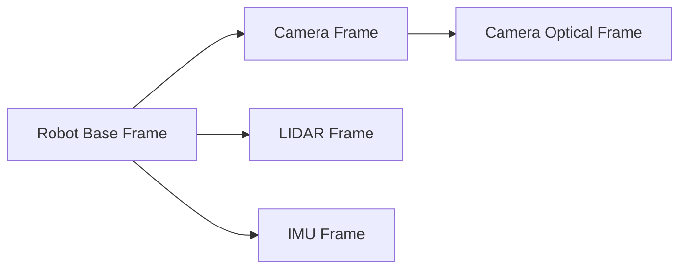
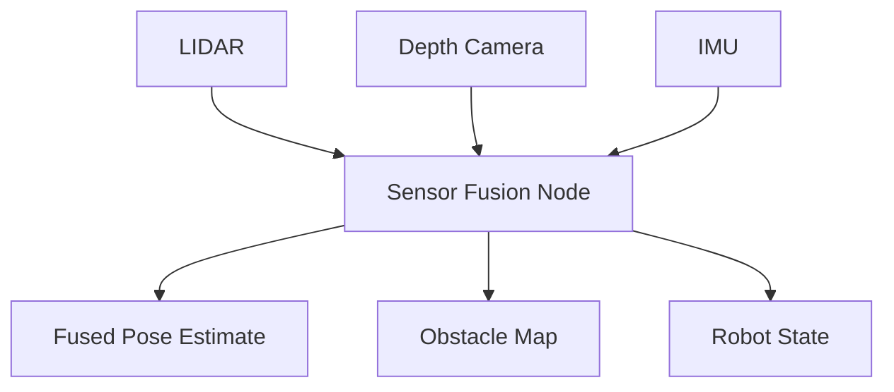

# Chapter 2: Sensor Simulation

**Week 6-7** | **Duration**: 5-6 hours | **Complexity**: Intermediate to Advanced

---

## Learning Objectives

By the end of this chapter, you will be able to:

1. **Configure** LIDAR, depth cameras, and IMU sensors in Gazebo
2. **Process** sensor data in ROS 2 nodes using appropriate message types
3. **Visualize** point clouds and images using RViz2 and custom tools
4. **Implement** sensor fusion to combine data from multiple sources
5. **Calibrate** simulated cameras and understand intrinsic/extrinsic parameters
6. **Optimize** sensor configurations for performance and accuracy

---

## Introduction

Robots perceive the world through sensors—their **eyes, ears, and sense of touch**. In Physical AI, sensor simulation is critical because:

- **Cost-effective testing**: No need for expensive hardware during development
- **Repeatability**: Same conditions every time (no weather, lighting variations)
- **Safety**: Test edge cases without damaging equipment
- **Synthetic data generation**: Train AI models on simulated sensor data

Gazebo simulates the most important robotics sensors:
- **LIDAR (Light Detection and Ranging)**: Distance measurements via laser scanning
- **Depth Cameras**: RGB-D images (color + depth)
- **IMU (Inertial Measurement Unit)**: Acceleration and angular velocity
- **RGB Cameras**: Standard vision sensors
- **Force/Torque Sensors**: Contact sensing

> "A robot is only as intelligent as its sensors allow it to perceive."

---

## 1. Sensor Fundamentals

### 1.1 Sensor Types and Use Cases

| Sensor | Data Type | Primary Use | Typical Range |
|--------|-----------|-------------|---------------|
| **LIDAR** | Point cloud | Mapping, obstacle detection | 0.1m - 100m |
| **Depth Camera** | RGB-D image | Close-range 3D vision | 0.5m - 10m |
| **RGB Camera** | 2D image | Object recognition, tracking | Limited by optics |
| **IMU** | Acceleration, gyro | Orientation, dead reckoning | N/A (internal) |
| **GPS** | Global position | Outdoor localization | Global |
| **Force/Torque** | Force vector | Manipulation, contact | N/A |

### 1.2 Sensor Coordinate Frames

Each sensor has its own coordinate frame (origin and orientation):



**Standard Convention**:
- **X-axis**: Forward
- **Y-axis**: Left
- **Z-axis**: Up

**Camera Optical Frame** (computer vision convention):
- **Z-axis**: Forward (into scene)
- **X-axis**: Right
- **Y-axis**: Down

**TF Tree** (Transform Tree): ROS 2 maintains transforms between all frames.

### 1.3 ROS 2 Sensor Message Types

| Sensor | ROS 2 Message Type | Package |
|--------|-------------------|---------|
| LIDAR | `sensor_msgs/LaserScan` (2D) or `sensor_msgs/PointCloud2` (3D) | `sensor_msgs` |
| Depth Camera | `sensor_msgs/Image` (depth), `sensor_msgs/PointCloud2` | `sensor_msgs` |
| RGB Camera | `sensor_msgs/Image`, `sensor_msgs/CameraInfo` | `sensor_msgs` |
| IMU | `sensor_msgs/Imu` | `sensor_msgs` |
| GPS | `sensor_msgs/NavSatFix` | `sensor_msgs` |

---

## 2. LIDAR Simulation

### 2.1 2D LIDAR (LaserScan)

2D LIDAR measures distances in a plane (commonly used in mobile robots).

**Add to Robot SDF**:

```xml
<model name="mobile_robot">
  <!-- Base link definition -->
  <link name="base_link">
    <!-- ... -->
  </link>

  <!-- LIDAR sensor link -->
  <link name="lidar_link">
    <pose>0.2 0 0.15 0 0 0</pose>  <!-- Mount position -->
    <inertial>
      <mass>0.1</mass>
      <inertia>
        <ixx>0.0001</ixx>
        <iyy>0.0001</iyy>
        <izz>0.0001</izz>
      </inertia>
    </inertial>
    <visual name="visual">
      <geometry>
        <cylinder>
          <radius>0.05</radius>
          <length>0.07</length>
        </cylinder>
      </geometry>
      <material>
        <ambient>0.1 0.1 0.1 1</ambient>
      </material>
    </visual>
    <sensor name="lidar" type="ray">
      <always_on>true</always_on>
      <update_rate>10</update_rate>
      <visualize>true</visualize>
      <pose>0 0 0.03 0 0 0</pose>

      <ray>
        <scan>
          <horizontal>
            <samples>360</samples>              <!-- Number of rays -->
            <resolution>1</resolution>
            <min_angle>-3.14159</min_angle>     <!-- -180 degrees -->
            <max_angle>3.14159</max_angle>      <!-- +180 degrees -->
          </horizontal>
        </scan>
        <range>
          <min>0.12</min>                       <!-- Minimum range (m) -->
          <max>10.0</max>                       <!-- Maximum range (m) -->
          <resolution>0.01</resolution>         <!-- Range resolution (m) -->
        </range>
        <noise>
          <type>gaussian</type>
          <mean>0.0</mean>
          <stddev>0.01</stddev>                 <!-- 1cm standard deviation -->
        </noise>
      </ray>

      <!-- ROS 2 Plugin -->
      <plugin name="gazebo_ros_laser_controller" filename="libgazebo_ros_ray_sensor.so">
        <ros>
          <namespace>/mobile_robot</namespace>
          <remapping>~/out:=scan</remapping>
        </ros>
        <output_type>sensor_msgs/LaserScan</output_type>
        <frame_name>lidar_link</frame_name>
      </plugin>
    </sensor>
  </link>

  <!-- Joint connecting LIDAR to base -->
  <joint name="lidar_joint" type="fixed">
    <parent>base_link</parent>
    <child>lidar_link</child>
  </joint>
</model>
```

**Key Parameters**:
- **`samples`**: Number of rays per scan (more = denser, slower)
- **`min_angle` / `max_angle`**: Field of view (radians)
- **`min` / `max` (range)**: Detection range
- **`noise`**: Realistic sensor noise (Gaussian)
- **`update_rate`**: Scans per second (Hz)

### 2.2 Processing LaserScan Data

Create `scripts/lidar_processor.py`:

```python
#!/usr/bin/env python3
import rclpy
from rclpy.node import Node
from sensor_msgs.msg import LaserScan
import numpy as np


class LidarProcessor(Node):
    """Processes LIDAR data for obstacle detection."""

    def __init__(self):
        super().__init__('lidar_processor')

        # Subscribe to LIDAR
        self.subscription = self.create_subscription(
            LaserScan,
            '/mobile_robot/scan',
            self.lidar_callback,
            10
        )

        # Parameters
        self.declare_parameter('min_obstacle_distance', 0.5)  # meters
        self.min_distance = self.get_parameter('min_obstacle_distance').value

        self.get_logger().info(f'LIDAR Processor started (min distance: {self.min_distance}m)')

    def lidar_callback(self, msg):
        """Process LIDAR scan."""
        # Convert LaserScan to numpy array
        ranges = np.array(msg.ranges)

        # Filter out invalid readings (inf, nan)
        valid_ranges = ranges[np.isfinite(ranges)]

        if len(valid_ranges) == 0:
            self.get_logger().warn('No valid LIDAR readings')
            return

        # Find closest obstacle
        min_range = np.min(valid_ranges)
        min_idx = np.argmin(ranges)
        min_angle = msg.angle_min + min_idx * msg.angle_increment

        # Convert to degrees
        angle_deg = np.degrees(min_angle)

        self.get_logger().info(
            f'Closest obstacle: {min_range:.2f}m at {angle_deg:.1f}°',
            throttle_duration_sec=1.0
        )

        # Check for collision risk
        if min_range < self.min_distance:
            self.get_logger().warn(
                f'COLLISION RISK! Obstacle at {min_range:.2f}m',
                throttle_duration_sec=0.5
            )

        # Segment obstacles (clustering)
        obstacles = self.detect_obstacles(ranges, msg.angle_min, msg.angle_increment)
        self.get_logger().debug(f'Detected {len(obstacles)} obstacles')

    def detect_obstacles(self, ranges, angle_min, angle_increment, threshold=0.1):
        """Cluster LIDAR points into obstacles."""
        obstacles = []
        current_obstacle = []

        for i, r in enumerate(ranges):
            if not np.isfinite(r):
                continue

            if len(current_obstacle) == 0:
                current_obstacle.append((i, r))
            else:
                # Check distance to previous point
                prev_idx, prev_range = current_obstacle[-1]
                angle_diff = (i - prev_idx) * angle_increment
                distance = np.sqrt(r**2 + prev_range**2 - 2*r*prev_range*np.cos(angle_diff))

                if distance < threshold:
                    current_obstacle.append((i, r))
                else:
                    # Start new obstacle
                    if len(current_obstacle) > 3:  # Minimum points
                        obstacles.append(current_obstacle)
                    current_obstacle = [(i, r)]

        # Add last obstacle
        if len(current_obstacle) > 3:
            obstacles.append(current_obstacle)

        return obstacles


def main(args=None):
    rclpy.init(args=args)
    node = LidarProcessor()

    try:
        rclpy.spin(node)
    except KeyboardInterrupt:
        pass
    finally:
        node.destroy_node()
        rclpy.shutdown()


if __name__ == '__main__':
    main()
```

**Test**:
```bash
# Launch Gazebo with robot
ros2 launch my_gazebo_world spawn_robot.launch.py

# Run LIDAR processor
ros2 run my_gazebo_world lidar_processor

# Visualize in RViz2
rviz2
# Add: LaserScan display, topic: /mobile_robot/scan
```

### 2.3 3D LIDAR (PointCloud2)

For 3D LIDAR (e.g., Velodyne, Ouster):

```xml
<sensor name="velodyne" type="ray">
  <always_on>true</always_on>
  <update_rate>10</update_rate>
  <visualize>false</visualize>

  <ray>
    <scan>
      <horizontal>
        <samples>360</samples>
        <resolution>1</resolution>
        <min_angle>-3.14159</min_angle>
        <max_angle>3.14159</max_angle>
      </horizontal>
      <vertical>
        <samples>32</samples>              <!-- Vertical layers -->
        <resolution>1</resolution>
        <min_angle>-0.2618</min_angle>     <!-- -15 degrees -->
        <max_angle>0.2618</max_angle>      <!-- +15 degrees -->
      </vertical>
    </scan>
    <range>
      <min>0.9</min>
      <max>100.0</max>
      <resolution>0.01</resolution>
    </range>
    <noise>
      <type>gaussian</type>
      <mean>0.0</mean>
      <stddev>0.01</stddev>
    </noise>
  </ray>

  <plugin name="gazebo_ros_velodyne" filename="libgazebo_ros_ray_sensor.so">
    <ros>
      <namespace>/mobile_robot</namespace>
      <remapping>~/out:=velodyne_points</remapping>
    </ros>
    <output_type>sensor_msgs/PointCloud2</output_type>
    <frame_name>velodyne_link</frame_name>
  </plugin>
</sensor>
```

---

## 3. Depth Camera Simulation

### 3.1 RGB-D Camera Configuration

Depth cameras (e.g., Intel RealSense, Kinect) provide color + depth.

```xml
<link name="camera_link">
  <pose>0.15 0 0.2 0 0 0</pose>
  <inertial>
    <mass>0.1</mass>
  </inertial>
  <visual name="visual">
    <geometry>
      <box><size>0.03 0.1 0.03</size></box>
    </geometry>
  </visual>

  <!-- RGB Camera -->
  <sensor name="camera" type="camera">
    <always_on>true</always_on>
    <update_rate>30</update_rate>
    <visualize>true</visualize>
    <camera>
      <horizontal_fov>1.047</horizontal_fov>  <!-- 60 degrees -->
      <image>
        <width>640</width>
        <height>480</height>
        <format>R8G8B8</format>
      </image>
      <clip>
        <near>0.1</near>
        <far>100</far>
      </clip>
      <noise>
        <type>gaussian</type>
        <mean>0.0</mean>
        <stddev>0.007</stddev>
      </noise>
    </camera>

    <plugin name="camera_controller" filename="libgazebo_ros_camera.so">
      <ros>
        <namespace>/mobile_robot</namespace>
      </ros>
      <camera_name>camera</camera_name>
      <frame_name>camera_link_optical</frame_name>
    </plugin>
  </sensor>

  <!-- Depth Camera -->
  <sensor name="depth_camera" type="depth">
    <always_on>true</always_on>
    <update_rate>30</update_rate>
    <visualize>false</visualize>
    <camera>
      <horizontal_fov>1.047</horizontal_fov>
      <image>
        <width>640</width>
        <height>480</height>
        <format>R8G8B8</format>
      </image>
      <clip>
        <near>0.5</near>
        <far>10.0</far>
      </clip>
      <noise>
        <type>gaussian</type>
        <mean>0.0</mean>
        <stddev>0.01</stddev>
      </noise>
    </camera>

    <plugin name="depth_camera_controller" filename="libgazebo_ros_camera.so">
      <ros>
        <namespace>/mobile_robot</namespace>
      </ros>
      <camera_name>depth_camera</camera_name>
      <frame_name>camera_link_optical</frame_name>
      <hack_baseline>0.07</hack_baseline>
      <min_depth>0.5</min_depth>
      <max_depth>10.0</max_depth>
    </plugin>
  </sensor>
</link>

<!-- Optical frame (camera convention: Z forward, X right, Y down) -->
<link name="camera_link_optical">
  <pose>0.15 0 0.2 -1.57079 0 -1.57079</pose>
</link>

<joint name="camera_joint" type="fixed">
  <parent>base_link</parent>
  <child>camera_link</child>
</joint>

<joint name="camera_optical_joint" type="fixed">
  <parent>camera_link</parent>
  <child>camera_link_optical</child>
</joint>
```

**Published Topics**:
- `/mobile_robot/camera/image_raw`: RGB image
- `/mobile_robot/camera/camera_info`: Camera intrinsics
- `/mobile_robot/depth_camera/image_raw`: Depth image
- `/mobile_robot/depth_camera/points`: Point cloud (PointCloud2)

### 3.2 Processing Depth Images

Create `scripts/depth_processor.py`:

```python
#!/usr/bin/env python3
import rclpy
from rclpy.node import Node
from sensor_msgs.msg import Image
from cv_bridge import CvBridge
import cv2
import numpy as np


class DepthProcessor(Node):
    """Processes depth camera data."""

    def __init__(self):
        super().__init__('depth_processor')

        self.bridge = CvBridge()

        # Subscribe to depth image
        self.subscription = self.create_subscription(
            Image,
            '/mobile_robot/depth_camera/image_raw',
            self.depth_callback,
            10
        )

        self.get_logger().info('Depth Processor started')

    def depth_callback(self, msg):
        """Process depth image."""
        try:
            # Convert ROS Image to OpenCV format
            depth_image = self.bridge.imgmsg_to_cv2(msg, desired_encoding='32FC1')

            # Get image dimensions
            height, width = depth_image.shape

            # Compute statistics
            valid_depths = depth_image[np.isfinite(depth_image)]
            if len(valid_depths) == 0:
                return

            min_depth = np.min(valid_depths)
            max_depth = np.max(valid_depths)
            mean_depth = np.mean(valid_depths)

            self.get_logger().info(
                f'Depth: min={min_depth:.2f}m, max={max_depth:.2f}m, mean={mean_depth:.2f}m',
                throttle_duration_sec=1.0
            )

            # Find closest point
            min_idx = np.unravel_index(np.argmin(depth_image, axis=None), depth_image.shape)
            closest_u, closest_v = min_idx[1], min_idx[0]

            self.get_logger().info(
                f'Closest pixel: ({closest_u}, {closest_v}) at {min_depth:.2f}m',
                throttle_duration_sec=1.0
            )

            # Visualize (normalize to 0-255 for display)
            depth_normalized = cv2.normalize(depth_image, None, 0, 255, cv2.NORM_MINMAX)
            depth_display = depth_normalized.astype(np.uint8)
            depth_colormap = cv2.applyColorMap(depth_display, cv2.COLORMAP_JET)

            # Draw closest point
            cv2.circle(depth_colormap, (closest_u, closest_v), 5, (0, 255, 0), -1)

            cv2.imshow('Depth Image', depth_colormap)
            cv2.waitKey(1)

        except Exception as e:
            self.get_logger().error(f'Error processing depth image: {str(e)}')


def main(args=None):
    rclpy.init(args=args)
    node = DepthProcessor()

    try:
        rclpy.spin(node)
    except KeyboardInterrupt:
        pass
    finally:
        cv2.destroyAllWindows()
        node.destroy_node()
        rclpy.shutdown()


if __name__ == '__main__':
    main()
```

**Dependencies**:
```bash
sudo apt install ros-humble-cv-bridge python3-opencv
```

### 3.3 Point Cloud Processing

Processing PointCloud2 messages:

```python
#!/usr/bin/env python3
import rclpy
from rclpy.node import Node
from sensor_msgs.msg import PointCloud2
import sensor_msgs_py.point_cloud2 as pc2
import numpy as np


class PointCloudProcessor(Node):
    """Processes point cloud data."""

    def __init__(self):
        super().__init__('pointcloud_processor')

        self.subscription = self.create_subscription(
            PointCloud2,
            '/mobile_robot/depth_camera/points',
            self.pointcloud_callback,
            10
        )

        self.get_logger().info('PointCloud Processor started')

    def pointcloud_callback(self, msg):
        """Process point cloud."""
        # Extract XYZ points
        points = []
        for point in pc2.read_points(msg, field_names=("x", "y", "z"), skip_nans=True):
            points.append([point[0], point[1], point[2]])

        if len(points) == 0:
            return

        points_array = np.array(points)

        # Compute statistics
        num_points = len(points_array)
        mean_point = np.mean(points_array, axis=0)

        # Find closest point to robot (assuming robot at origin)
        distances = np.linalg.norm(points_array, axis=1)
        min_distance = np.min(distances)
        closest_point = points_array[np.argmin(distances)]

        self.get_logger().info(
            f'Points: {num_points}, Mean: {mean_point}, Closest: {closest_point} ({min_distance:.2f}m)',
            throttle_duration_sec=1.0
        )

        # Detect ground plane (RANSAC)
        ground_points, obstacle_points = self.segment_ground(points_array)
        self.get_logger().info(
            f'Ground: {len(ground_points)} points, Obstacles: {len(obstacle_points)} points',
            throttle_duration_sec=2.0
        )

    def segment_ground(self, points, threshold=0.05):
        """Simple ground plane segmentation."""
        # Assume ground is at z ≈ 0 (relative to camera)
        # This is a simplified version; use RANSAC for robustness
        ground_mask = np.abs(points[:, 2]) < threshold
        ground_points = points[ground_mask]
        obstacle_points = points[~ground_mask]

        return ground_points, obstacle_points


def main(args=None):
    rclpy.init(args=args)
    node = PointCloudProcessor()

    try:
        rclpy.spin(node)
    except KeyboardInterrupt:
        pass
    finally:
        node.destroy_node()
        rclpy.shutdown()


if __name__ == '__main__':
    main()
```

---

## 4. IMU Simulation

### 4.1 IMU Configuration

IMU (Inertial Measurement Unit) measures linear acceleration and angular velocity.

```xml
<link name="imu_link">
  <pose>0 0 0.05 0 0 0</pose>  <!-- Center of robot base -->
  <inertial>
    <mass>0.01</mass>
  </inertial>

  <sensor name="imu_sensor" type="imu">
    <always_on>true</always_on>
    <update_rate>100</update_rate>
    <visualize>false</visualize>

    <imu>
      <!-- Angular velocity (gyroscope) -->
      <angular_velocity>
        <x>
          <noise type="gaussian">
            <mean>0.0</mean>
            <stddev>0.009</stddev>
            <bias_mean>0.00075</bias_mean>
            <bias_stddev>0.0000008</bias_stddev>
          </noise>
        </x>
        <y>
          <noise type="gaussian">
            <mean>0.0</mean>
            <stddev>0.009</stddev>
            <bias_mean>0.00075</bias_mean>
            <bias_stddev>0.0000008</bias_stddev>
          </noise>
        </y>
        <z>
          <noise type="gaussian">
            <mean>0.0</mean>
            <stddev>0.009</stddev>
            <bias_mean>0.00075</bias_mean>
            <bias_stddev>0.0000008</bias_stddev>
          </noise>
        </z>
      </angular_velocity>

      <!-- Linear acceleration (accelerometer) -->
      <linear_acceleration>
        <x>
          <noise type="gaussian">
            <mean>0.0</mean>
            <stddev>0.017</stddev>
            <bias_mean>0.1</bias_mean>
            <bias_stddev>0.001</bias_stddev>
          </noise>
        </x>
        <y>
          <noise type="gaussian">
            <mean>0.0</mean>
            <stddev>0.017</stddev>
            <bias_mean>0.1</bias_mean>
            <bias_stddev>0.001</bias_stddev>
          </noise>
        </y>
        <z>
          <noise type="gaussian">
            <mean>0.0</mean>
            <stddev>0.017</stddev>
            <bias_mean>0.1</bias_mean>
            <bias_stddev>0.001</bias_stddev>
          </noise>
        </z>
      </linear_acceleration>
    </imu>

    <plugin name="imu_plugin" filename="libgazebo_ros_imu_sensor.so">
      <ros>
        <namespace>/mobile_robot</namespace>
        <remapping>~/out:=imu</remapping>
      </ros>
      <frame_name>imu_link</frame_name>
      <initial_orientation_as_reference>false</initial_orientation_as_reference>
    </plugin>
  </sensor>
</link>

<joint name="imu_joint" type="fixed">
  <parent>base_link</parent>
  <child>imu_link</child>
</joint>
```

**IMU Message** (`sensor_msgs/Imu`):
```yaml
orientation: {x, y, z, w}           # Quaternion
angular_velocity: {x, y, z}         # rad/s
linear_acceleration: {x, y, z}      # m/s²
```

### 4.2 Processing IMU Data

```python
#!/usr/bin/env python3
import rclpy
from rclpy.node import Node
from sensor_msgs.msg import Imu
import numpy as np
from scipy.spatial.transform import Rotation


class ImuProcessor(Node):
    """Processes IMU data."""

    def __init__(self):
        super().__init__('imu_processor')

        self.subscription = self.create_subscription(
            Imu,
            '/mobile_robot/imu',
            self.imu_callback,
            10
        )

        self.get_logger().info('IMU Processor started')

    def imu_callback(self, msg):
        """Process IMU data."""
        # Orientation (quaternion)
        quat = [msg.orientation.x, msg.orientation.y,
                msg.orientation.z, msg.orientation.w]

        # Convert quaternion to Euler angles (roll, pitch, yaw)
        rotation = Rotation.from_quat(quat)
        euler = rotation.as_euler('xyz', degrees=True)
        roll, pitch, yaw = euler

        # Angular velocity
        gyro = [msg.angular_velocity.x, msg.angular_velocity.y, msg.angular_velocity.z]
        gyro_magnitude = np.linalg.norm(gyro)

        # Linear acceleration
        accel = [msg.linear_acceleration.x, msg.linear_acceleration.y, msg.linear_acceleration.z]
        accel_magnitude = np.linalg.norm(accel)

        self.get_logger().info(
            f'Orientation: roll={roll:.1f}°, pitch={pitch:.1f}°, yaw={yaw:.1f}° | '
            f'Gyro: {gyro_magnitude:.3f} rad/s | Accel: {accel_magnitude:.2f} m/s²',
            throttle_duration_sec=1.0
        )

        # Detect significant motion
        if gyro_magnitude > 0.5:  # rad/s threshold
            self.get_logger().warn('Significant rotation detected!')

        if accel_magnitude > 12.0:  # m/s² threshold (including gravity)
            self.get_logger().warn('Significant acceleration detected!')


def main(args=None):
    rclpy.init(args=args)
    node = ImuProcessor()

    try:
        rclpy.spin(node)
    except KeyboardInterrupt:
        pass
    finally:
        node.destroy_node()
        rclpy.shutdown()


if __name__ == '__main__':
    main()
```

---

## 5. Sensor Fusion

### 5.1 Why Sensor Fusion?

Single sensors have limitations:
- **LIDAR**: No color, expensive
- **Cameras**: No direct depth, lighting-dependent
- **IMU**: Drift over time

**Sensor Fusion**: Combine multiple sensors for robust perception.



### 5.2 Simple Sensor Fusion Example

Combine LIDAR and IMU for better localization:

```python
#!/usr/bin/env python3
import rclpy
from rclpy.node import Node
from sensor_msgs.msg import LaserScan, Imu
from geometry_msgs.msg import PoseStamped
import numpy as np
from scipy.spatial.transform import Rotation


class SensorFusionNode(Node):
    """Fuses LIDAR and IMU data for localization."""

    def __init__(self):
        super().__init__('sensor_fusion')

        # Subscribers
        self.lidar_sub = self.create_subscription(
            LaserScan, '/mobile_robot/scan', self.lidar_callback, 10
        )
        self.imu_sub = self.create_subscription(
            Imu, '/mobile_robot/imu', self.imu_callback, 10
        )

        # Publisher
        self.pose_pub = self.create_publisher(PoseStamped, '/fused_pose', 10)

        # State
        self.current_orientation = None
        self.latest_lidar = None

        # Timer for fusion
        self.timer = self.create_timer(0.1, self.fusion_callback)  # 10 Hz

        self.get_logger().info('Sensor Fusion Node started')

    def lidar_callback(self, msg):
        """Store latest LIDAR data."""
        self.latest_lidar = msg

    def imu_callback(self, msg):
        """Store latest IMU orientation."""
        self.current_orientation = msg.orientation

    def fusion_callback(self):
        """Fuse sensor data and publish pose."""
        if self.current_orientation is None or self.latest_lidar is None:
            return

        # Create fused pose
        pose_msg = PoseStamped()
        pose_msg.header.stamp = self.get_clock().now().to_msg()
        pose_msg.header.frame_id = 'map'

        # Orientation from IMU
        pose_msg.pose.orientation = self.current_orientation

        # Position estimation from LIDAR (simplified)
        # In reality, use algorithms like scan matching or ICP
        ranges = np.array(self.latest_lidar.ranges)
        valid_ranges = ranges[np.isfinite(ranges)]

        if len(valid_ranges) > 0:
            # Use closest obstacle as a simple position indicator
            min_range = np.min(valid_ranges)

            # Convert IMU quaternion to yaw
            quat = [self.current_orientation.x, self.current_orientation.y,
                    self.current_orientation.z, self.current_orientation.w]
            rotation = Rotation.from_quat(quat)
            euler = rotation.as_euler('xyz')
            yaw = euler[2]

            # Estimate position (this is a toy example)
            pose_msg.pose.position.x = min_range * np.cos(yaw)
            pose_msg.pose.position.y = min_range * np.sin(yaw)
            pose_msg.pose.position.z = 0.0

        self.pose_pub.publish(pose_msg)


def main(args=None):
    rclpy.init(args=args)
    node = SensorFusionNode()

    try:
        rclpy.spin(node)
    except KeyboardInterrupt:
        pass
    finally:
        node.destroy_node()
        rclpy.shutdown()


if __name__ == '__main__':
    main()
```

### 5.3 Advanced Fusion: Robot Localization

Use `robot_localization` package for production-grade fusion:

```bash
sudo apt install ros-humble-robot-localization
```

**Configuration** (`config/ekf.yaml`):
```yaml
ekf_filter_node:
  ros__parameters:
    frequency: 30.0
    sensor_timeout: 0.1
    two_d_mode: true

    map_frame: map
    odom_frame: odom
    base_link_frame: base_link
    world_frame: odom

    # IMU input
    imu0: /mobile_robot/imu
    imu0_config: [false, false, false,   # x, y, z position
                  false, false, true,    # roll, pitch, yaw orientation
                  false, false, false,   # x, y, z velocity
                  false, false, true,    # roll, pitch, yaw angular velocity
                  true, true, true]      # x, y, z linear acceleration

    # Odometry input
    odom0: /mobile_robot/odom
    odom0_config: [true, true, false,    # x, y, z position
                   false, false, true,   # roll, pitch, yaw orientation
                   true, true, false,    # x, y, z velocity
                   false, false, true,   # roll, pitch, yaw angular velocity
                   false, false, false]  # x, y, z linear acceleration
```

Launch:
```python
from launch_ros.actions import Node

Node(
    package='robot_localization',
    executable='ekf_node',
    name='ekf_filter_node',
    output='screen',
    parameters=[os.path.join(pkg_dir, 'config', 'ekf.yaml')]
)
```

---

## 6. Camera Calibration

### 6.1 Camera Intrinsics

**Intrinsic Matrix** (K):
```
[ fx  0  cx ]
[  0 fy  cy ]
[  0  0   1 ]
```

- **fx, fy**: Focal lengths (pixels)
- **cx, cy**: Principal point (image center)

**Distortion Coefficients** (k1, k2, p1, p2, k3):
- Correct for lens distortion

### 6.2 Camera Info Topic

Published by camera plugins:

```bash
ros2 topic echo /mobile_robot/camera/camera_info
```

**Output**:
```yaml
header:
  frame_id: camera_link_optical
height: 480
width: 640
distortion_model: plumb_bob
d: [0.0, 0.0, 0.0, 0.0, 0.0]  # No distortion in sim
k: [554.25, 0.0, 320.5, 0.0, 554.25, 240.5, 0.0, 0.0, 1.0]
```

### 6.3 Projecting 3D Points to Image

```python
import numpy as np

def project_point_to_image(point_3d, camera_matrix):
    """Project 3D point to 2D image coordinates."""
    # point_3d: [x, y, z] in camera frame
    # camera_matrix: 3x3 intrinsic matrix K

    # Homogeneous coordinates
    point_hom = np.array([point_3d[0], point_3d[1], point_3d[2]])

    # Project
    image_hom = camera_matrix @ point_hom

    # Normalize
    u = image_hom[0] / image_hom[2]
    v = image_hom[1] / image_hom[2]

    return int(u), int(v)

# Example
K = np.array([
    [554.25, 0.0, 320.5],
    [0.0, 554.25, 240.5],
    [0.0, 0.0, 1.0]
])

point = [2.0, 0.5, 5.0]  # 5m ahead, 0.5m to right
u, v = project_point_to_image(point, K)
print(f"Image coordinates: ({u}, {v})")
```

---

## Summary

In this chapter, you learned:

✅ **LIDAR Simulation**: 2D/3D LIDAR configuration, LaserScan processing, obstacle detection
✅ **Depth Cameras**: RGB-D sensor setup, depth image processing, point cloud handling
✅ **IMU Sensors**: Accelerometer/gyroscope simulation, orientation estimation
✅ **Sensor Fusion**: Combining multiple sensors for robust perception
✅ **Camera Calibration**: Intrinsic parameters, projection, camera_info topics
✅ **ROS 2 Integration**: Processing sensor messages, visualization in RViz2

**Key Takeaway**: Simulated sensors provide realistic data for algorithm development. Understanding sensor characteristics, noise models, and fusion techniques is essential for building robust robotic systems.

---

## Exercises

### Exercise 1: LIDAR-Based Wall Following (60 minutes)
Create a node that:
1. Subscribes to `/scan` (LaserScan)
2. Detects walls on the left side of the robot
3. Publishes `/cmd_vel` to maintain 0.5m distance from wall
4. Handles corners and gaps in walls

### Exercise 2: Depth-Based Obstacle Avoidance (60 minutes)
Create a node that:
1. Subscribes to depth camera point cloud
2. Segments obstacles from ground plane
3. Publishes `/cmd_vel` to navigate around obstacles
4. Stops if obstacle < 0.3m ahead

### Exercise 3: IMU-Based Orientation Tracking (45 minutes)
Create a node that:
1. Subscribes to `/imu`
2. Tracks cumulative rotation (integrate angular velocity)
3. Compares integrated orientation with IMU orientation
4. Logs drift over time

### Exercise 4: Multi-Sensor Obstacle Detection (90 minutes)
Create a fusion node that:
1. Subscribes to LIDAR, depth camera, and IMU
2. Creates a unified obstacle map (2D grid)
3. Publishes OccupancyGrid message
4. Visualizes in RViz2 with color-coded confidence

---

## Assessment

Test your knowledge:

1. What is the difference between LaserScan and PointCloud2 messages?
2. How do you convert a ROS Image message to OpenCV format?
3. What is the purpose of camera calibration?
4. Explain the role of noise parameters in sensor simulation.
5. What is sensor fusion, and why is it important?
6. How do you extract the yaw angle from an IMU quaternion?

---

## Additional Resources

- **sensor_msgs Documentation**: [ROS 2 sensor_msgs](https://github.com/ros2/common_interfaces/tree/humble/sensor_msgs)
- **cv_bridge Tutorial**: [ROS 2 cv_bridge](https://github.com/ros-perception/vision_opencv)
- **robot_localization**: [github.com/cra-ros-pkg/robot_localization](https://github.com/cra-ros-pkg/robot_localization)
- **PointCloud Library (PCL)**: [pointclouds.org](https://pointclouds.org/)
- **Camera Calibration**: [OpenCV Calibration Tutorial](https://docs.opencv.org/4.x/dc/dbb/tutorial_py_calibration.html)

---

## Next Chapter

Ready to explore high-fidelity rendering? Proceed to [Chapter 3: Unity Integration](./03-unity-integration.md) to learn about Unity for photorealistic simulation and ROS 2 integration.

---

*This chapter is part of the Physical AI & Humanoid Robotics textbook. All code examples are available in the [companion repository](https://github.com/panaversity/physical-ai-textbook).*
