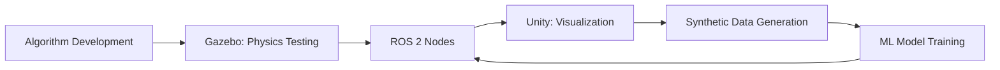
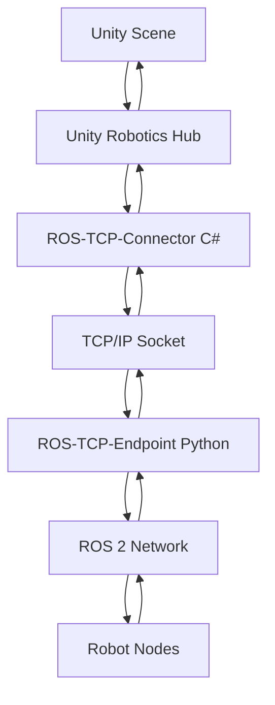
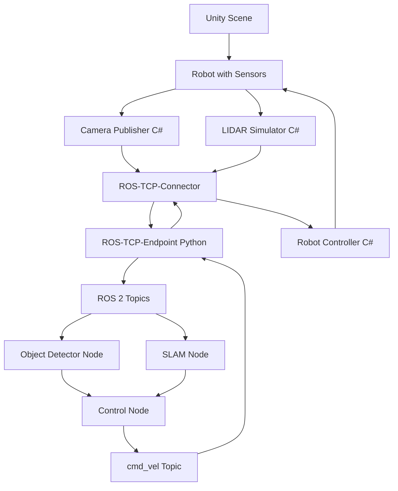

# Chapter 3: Unity Integration

**Week 7** | **Duration**: 4-5 hours | **Complexity**: Intermediate to Advanced

---

## Learning Objectives

By the end of this chapter, you will be able to:

1. **Understand** Unity's role in robotics simulation and visualization
2. **Install** Unity and Unity Robotics Hub for ROS 2 integration
3. **Create** photorealistic environments for robot simulation
4. **Configure** the ROS-TCP-Connector for bidirectional communication
5. **Compare** Gazebo and Unity for different simulation needs
6. **Deploy** a complete Unity-ROS 2 integration pipeline

---

## Introduction

While Gazebo excels at **physics simulation**, **Unity** is a professional game engine that brings **photorealism** to robotics:

- **High-fidelity graphics**: Ray tracing, global illumination, realistic materials
- **Asset ecosystem**: Massive library of 3D models, textures, environments
- **Performance**: Optimized rendering pipeline for real-time graphics
- **Cross-platform**: Windows, Linux, macOS, mobile, VR/AR
- **ML integration**: Unity ML-Agents for reinforcement learning

**Use Case Split**:
- **Gazebo**: Physics-accurate simulation, sensor testing, control algorithms
- **Unity**: Synthetic data generation, human-robot interaction, visualization, AI training

> "Unity turns your robot simulation into a visually stunning, publishable demo."

**Real-World Applications**:
- **Computer vision training**: Generate labeled synthetic images
- **HRI (Human-Robot Interaction)**: Realistic environments with humans
- **Teleoperation interfaces**: High-quality visualization for remote operators
- **Marketing/demos**: Professional-grade robot showcases

---

## 1. Unity vs Gazebo: The Great Divide

### 1.1 Feature Comparison

| Feature | Gazebo | Unity | Winner |
|---------|--------|-------|--------|
| **Physics Accuracy** | Excellent (ODE, Bullet, DART) | Good (PhysX, custom) | Gazebo |
| **Graphics Quality** | Basic (OGRE) | Photorealistic (HDRP) | Unity |
| **Sensor Simulation** | Native (LIDAR, depth, IMU) | Via plugins | Gazebo |
| **Asset Library** | Limited (mainly robots) | Massive (environments, props) | Unity |
| **Learning Curve** | Moderate (XML, CLI) | Steeper (GUI, C#) | Gazebo |
| **ROS Integration** | Native | Via bridge (ROS-TCP) | Gazebo |
| **ML Training** | Limited | Unity ML-Agents | Unity |
| **Performance** | CPU-heavy | GPU-optimized | Unity |
| **Cost** | Free, open-source | Free (Personal), paid (Pro) | Tie |

### 1.2 When to Use Each

**Use Gazebo When**:
- Testing control algorithms (PID, MPC)
- Simulating sensor noise and physics edge cases
- Integrating tightly with ROS 2 ecosystem
- Prioritizing simulation accuracy over visuals

**Use Unity When**:
- Generating synthetic datasets for computer vision
- Creating demos for non-technical audiences
- Training agents with reinforcement learning (ML-Agents)
- Simulating human-robot interaction scenarios
- Building teleoperation interfaces

**Use Both Together** (Ideal Workflow):


### 1.3 Architecture Overview

**Unity-ROS 2 Communication**:



**Key Components**:
1. **Unity Robotics Hub**: Unity packages for ROS integration
2. **ROS-TCP-Connector**: Unity plugin (C#) that serializes ROS messages
3. **ROS-TCP-Endpoint**: ROS 2 node (Python) that bridges TCP to ROS topics
4. **Message Generation**: Auto-generate C# classes from ROS 2 message definitions

---

## 2. Installation and Setup

### 2.1 Install Unity Hub and Unity Editor

**1. Download Unity Hub**:
- Visit [unity.com/download](https://unity.com/download)
- Download Unity Hub for your OS (Windows/Linux/macOS)

**2. Install Unity Hub**:
```bash
# Linux
chmod +x UnityHub.AppImage
./UnityHub.AppImage
```

**3. Install Unity Editor**:
- Open Unity Hub
- Go to **Installs** → **Install Editor**
- Choose **Unity 2021.3 LTS** (Long Term Support) or **2022.3 LTS**
- Select modules:
  - **Linux Build Support** (if on Windows/macOS)
  - **Documentation**

**4. Create Unity Account** (free):
- Required for Personal license
- Sign up at [id.unity.com](https://id.unity.com/)

### 2.2 Install Unity Robotics Hub

**Method 1: Unity Package Manager (Recommended)**

1. Create a new Unity project:
   - Open Unity Hub → **New Project**
   - Template: **3D (URP)** (Universal Render Pipeline)
   - Name: `RobotSimulation`

2. Open Unity Editor

3. Install packages:
   - **Window** → **Package Manager**
   - Click **+** (top-left) → **Add package from git URL**
   - Add these URLs (one at a time):

```
https://github.com/Unity-Technologies/ROS-TCP-Connector.git?path=/com.unity.robotics.ros-tcp-connector
https://github.com/Unity-Technologies/URDF-Importer.git?path=/com.unity.robotics.urdf-importer
https://github.com/Unity-Technologies/Visualizations.git?path=/com.unity.robotics.visualizations
```

**Method 2: Clone Repository**:
```bash
cd ~/UnityProjects/RobotSimulation
git clone https://github.com/Unity-Technologies/Unity-Robotics-Hub.git
```

Then import as local package in Unity.

### 2.3 Install ROS-TCP-Endpoint (ROS 2 Side)

```bash
cd ~/ros2_ws/src

# Clone ROS-TCP-Endpoint
git clone https://github.com/Unity-Technologies/ROS-TCP-Endpoint.git

# Build
cd ~/ros2_ws
colcon build --packages-select ros_tcp_endpoint
source install/setup.bash
```

### 2.4 Configure Connection

**1. Unity Settings**:
- **Robotics** → **ROS Settings**
- Protocol: **ROS 2**
- ROS IP Address: `127.0.0.1` (localhost) or your ROS machine IP
- ROS Port: `10000` (default)

**2. Launch ROS-TCP-Endpoint**:
```bash
ros2 run ros_tcp_endpoint default_server_endpoint --ros-args -p ROS_IP:=0.0.0.0
```

**Expected Output**:
```
[INFO] [ros_tcp_endpoint]: Starting server on 0.0.0.0:10000
[INFO] [ros_tcp_endpoint]: Waiting for Unity connection...
```

**3. Test Connection**:
- In Unity, click **Robotics** → **ROS Settings** → **Test Connection**
- Should show: "Connection successful!"

---

## 3. Creating a Unity Scene

### 3.1 Basic Scene Setup

**1. Create Ground Plane**:
- **GameObject** → **3D Object** → **Plane**
- Name: `Ground`
- Scale: `(10, 1, 10)` for 100m² area
- Add material: Create **Material** → Name: `GroundMaterial` → Assign texture

**2. Add Lighting**:
- **GameObject** → **Light** → **Directional Light** (sun)
- Rotation: `(50, -30, 0)` for natural lighting
- Add **Light** → **Point Light** for indoor scenes

**3. Add Camera**:
- Default **Main Camera** is already in scene
- Position: `(0, 5, -10)` for overhead view
- Rotation: `(30, 0, 0)` to look down

**4. Add Obstacles**:
- **GameObject** → **3D Object** → **Cube** (walls, obstacles)
- Use **ProBuilder** (free package) for complex geometry

### 3.2 Importing URDF Robot Models

Unity Robotics Hub includes a URDF importer:

**1. Export URDF from ROS**:
```bash
# If you have a robot description package
cd ~/ros2_ws/src/my_robot_description
# Copy URDF and meshes to Unity project
```

**2. Import in Unity**:
- **Assets** → **Import Robot from URDF**
- Choose URDF file
- Import settings:
  - **Axis Type**: Y Axis
  - **Mesh Decomposer**: VHACD (for collision)

**3. Add Articulation Body**:
Unity uses **Articulation Body** for robot joints (similar to ROS joints):
- Automatically created by URDF importer
- Configure joint limits, damping, friction

### 3.3 Creating Photorealistic Environments

**1. Install HDRP (High Definition Render Pipeline)**:
- **Window** → **Package Manager**
- Search: **High Definition RP**
- Install

**2. Convert Project to HDRP**:
- **Edit** → **Render Pipeline** → **HD Render Pipeline Wizard**
- Follow steps to upgrade project

**3. Add HDRI Skybox** (realistic sky):
- Download free HDRIs from [polyhaven.com](https://polyhaven.com/hdris)
- Import to Unity: **Assets** → **Import New Asset**
- **Window** → **Rendering** → **Lighting**
- **Environment** → **Skybox Material** → Assign HDRI

**4. Add Realistic Materials**:
- Use **PBR (Physically Based Rendering)** materials
- Free assets: [Unity Asset Store](https://assetstore.unity.com/)
- Example: Search "warehouse" for industrial environments

**5. Post-Processing**:
- Add **Volume** component to scene
- Enable: **Bloom**, **Ambient Occlusion**, **Motion Blur**, **Depth of Field**

**Result**: Photorealistic scene comparable to AAA games.

---

## 4. ROS 2 Communication

### 4.1 Publishing from Unity to ROS 2

**Scenario**: Send robot position from Unity to ROS 2.

**1. Create C# Script** (`RobotPositionPublisher.cs`):
```csharp
using UnityEngine;
using Unity.Robotics.ROSTCPConnector;
using RosMessageTypes.Geometry;

public class RobotPositionPublisher : MonoBehaviour
{
    ROSConnection ros;
    public string topicName = "unity/robot_position";
    public float publishRate = 10.0f; // Hz

    private float timeElapsed;

    void Start()
    {
        // Get ROS connection
        ros = ROSConnection.GetOrCreateInstance();
        ros.RegisterPublisher<PointMsg>(topicName);
    }

    void Update()
    {
        timeElapsed += Time.deltaTime;

        if (timeElapsed > 1.0f / publishRate)
        {
            // Get robot position
            Vector3 position = transform.position;

            // Create ROS message
            PointMsg msg = new PointMsg(
                position.x,
                position.y,
                position.z
            );

            // Publish
            ros.Publish(topicName, msg);

            timeElapsed = 0;
        }
    }
}
```

**2. Attach Script**:
- Select robot GameObject in Unity
- **Add Component** → **Robot Position Publisher**

**3. Test in ROS 2**:
```bash
# Launch endpoint
ros2 run ros_tcp_endpoint default_server_endpoint

# Echo topic
ros2 topic echo /unity/robot_position
```

### 4.2 Subscribing in Unity to ROS 2

**Scenario**: Receive velocity commands from ROS 2 and move robot in Unity.

**1. Create C# Script** (`RobotController.cs`):
```csharp
using UnityEngine;
using Unity.Robotics.ROSTCPConnector;
using RosMessageTypes.Geometry;

public class RobotController : MonoBehaviour
{
    ROSConnection ros;
    public string topicName = "cmd_vel";
    public float moveSpeed = 1.0f;
    public float rotateSpeed = 100.0f;

    private Vector3 currentLinearVel;
    private float currentAngularVel;

    void Start()
    {
        ros = ROSConnection.GetOrCreateInstance();
        ros.Subscribe<TwistMsg>(topicName, ReceiveVelocity);
    }

    void ReceiveVelocity(TwistMsg msg)
    {
        // Store velocity commands
        currentLinearVel = new Vector3(
            (float)msg.linear.x,
            (float)msg.linear.y,
            (float)msg.linear.z
        );

        currentAngularVel = (float)msg.angular.z;
    }

    void FixedUpdate()
    {
        // Apply linear velocity
        transform.Translate(
            currentLinearVel * moveSpeed * Time.fixedDeltaTime,
            Space.Self
        );

        // Apply angular velocity
        transform.Rotate(
            0,
            currentAngularVel * rotateSpeed * Time.fixedDeltaTime,
            0,
            Space.Self
        );
    }
}
```

**2. Attach Script**:
- Select robot GameObject
- **Add Component** → **Robot Controller**

**3. Test from ROS 2**:
```bash
# Publish velocity command
ros2 topic pub /cmd_vel geometry_msgs/msg/Twist \
  "{linear: {x: 0.5, y: 0, z: 0}, angular: {x: 0, y: 0, z: 0.5}}"
```

Robot should move in Unity!

### 4.3 Service Calls

**Unity calls ROS 2 service** (e.g., spawn object):

```csharp
using Unity.Robotics.ROSTCPConnector;
using RosMessageTypes.Gazebo;

public class ObjectSpawner : MonoBehaviour
{
    ROSConnection ros;

    void Start()
    {
        ros = ROSConnection.GetOrCreateInstance();
    }

    public void SpawnCube()
    {
        SpawnEntityRequest request = new SpawnEntityRequest();
        request.name = "cube1";
        request.xml = "...";  // SDF/URDF string

        ros.SendServiceMessage<SpawnEntityResponse>(
            "spawn_entity",
            request,
            OnSpawnResponse
        );
    }

    void OnSpawnResponse(SpawnEntityResponse response)
    {
        if (response.success)
        {
            Debug.Log("Object spawned successfully!");
        }
        else
        {
            Debug.LogError("Spawn failed: " + response.status_message);
        }
    }
}
```

---

## 5. Sensor Simulation in Unity

### 5.1 Camera Sensor

**1. Add Camera to Robot**:
- **GameObject** → **Camera**
- Parent to robot
- Position: `(0.2, 0.15, 0)` (front of robot)

**2. Publish Camera Images to ROS 2**:

```csharp
using UnityEngine;
using Unity.Robotics.ROSTCPConnector;
using RosMessageTypes.Sensor;

public class CameraPublisher : MonoBehaviour
{
    ROSConnection ros;
    public string topicName = "camera/image_raw";
    public Camera cam;
    public int width = 640;
    public int height = 480;
    public float publishRate = 30.0f;

    private RenderTexture renderTexture;
    private Texture2D texture2D;
    private float timeElapsed;

    void Start()
    {
        ros = ROSConnection.GetOrCreateInstance();
        ros.RegisterPublisher<ImageMsg>(topicName);

        renderTexture = new RenderTexture(width, height, 24);
        cam.targetTexture = renderTexture;
        texture2D = new Texture2D(width, height, TextureFormat.RGB24, false);
    }

    void Update()
    {
        timeElapsed += Time.deltaTime;

        if (timeElapsed > 1.0f / publishRate)
        {
            PublishImage();
            timeElapsed = 0;
        }
    }

    void PublishImage()
    {
        // Render camera to texture
        RenderTexture.active = renderTexture;
        texture2D.ReadPixels(new Rect(0, 0, width, height), 0, 0);
        texture2D.Apply();

        // Convert to ROS message
        ImageMsg msg = new ImageMsg();
        msg.header.frame_id = "camera_link";
        msg.header.stamp.sec = (int)Time.time;
        msg.height = (uint)height;
        msg.width = (uint)width;
        msg.encoding = "rgb8";
        msg.step = (uint)(width * 3);
        msg.data = texture2D.GetRawTextureData();

        ros.Publish(topicName, msg);
    }
}
```

**3. View in ROS 2**:
```bash
ros2 topic list | grep camera
ros2 run rqt_image_view rqt_image_view /camera/image_raw
```

### 5.2 Depth Camera

Unity supports depth rendering:

```csharp
using UnityEngine;

[RequireComponent(typeof(Camera))]
public class DepthCamera : MonoBehaviour
{
    private Camera cam;
    private RenderTexture depthTexture;

    void Start()
    {
        cam = GetComponent<Camera>();
        cam.depthTextureMode = DepthTextureMode.Depth;

        depthTexture = new RenderTexture(640, 480, 24, RenderTextureFormat.Depth);
        cam.SetTargetBuffers(depthTexture.colorBuffer, depthTexture.depthBuffer);
    }

    // Publish depth as ROS Image (similar to CameraPublisher)
}
```

### 5.3 LIDAR Simulation

Use raycasting to simulate LIDAR:

```csharp
using UnityEngine;
using Unity.Robotics.ROSTCPConnector;
using RosMessageTypes.Sensor;

public class LidarSimulator : MonoBehaviour
{
    ROSConnection ros;
    public string topicName = "scan";
    public int numRays = 360;
    public float maxRange = 10.0f;
    public float scanRate = 10.0f;

    private float timeElapsed;

    void Start()
    {
        ros = ROSConnection.GetOrCreateInstance();
        ros.RegisterPublisher<LaserScanMsg>(topicName);
    }

    void Update()
    {
        timeElapsed += Time.deltaTime;

        if (timeElapsed > 1.0f / scanRate)
        {
            PublishScan();
            timeElapsed = 0;
        }
    }

    void PublishScan()
    {
        float angleMin = -Mathf.PI;
        float angleMax = Mathf.PI;
        float angleIncrement = (angleMax - angleMin) / numRays;

        float[] ranges = new float[numRays];

        for (int i = 0; i < numRays; i++)
        {
            float angle = angleMin + i * angleIncrement;
            Vector3 direction = new Vector3(Mathf.Cos(angle), 0, Mathf.Sin(angle));

            RaycastHit hit;
            if (Physics.Raycast(transform.position, transform.TransformDirection(direction), out hit, maxRange))
            {
                ranges[i] = hit.distance;
            }
            else
            {
                ranges[i] = float.PositiveInfinity;
            }
        }

        // Create LaserScan message
        LaserScanMsg msg = new LaserScanMsg();
        msg.header.frame_id = "lidar_link";
        msg.angle_min = angleMin;
        msg.angle_max = angleMax;
        msg.angle_increment = angleIncrement;
        msg.range_min = 0.1f;
        msg.range_max = maxRange;
        msg.ranges = ranges;

        ros.Publish(topicName, msg);
    }
}
```

**Visualize in RViz2**:
```bash
rviz2
# Add: LaserScan display, topic: /scan
```

---

## 6. Complete Example: Unity-ROS 2 Pipeline

### 6.1 System Architecture



### 6.2 Launch File

Create `launch/unity_ros2_bridge.launch.py`:

```python
#!/usr/bin/env python3
from launch import LaunchDescription
from launch_ros.actions import Node


def generate_launch_description():
    return LaunchDescription([
        # ROS-TCP-Endpoint
        Node(
            package='ros_tcp_endpoint',
            executable='default_server_endpoint',
            name='unity_bridge',
            parameters=[{
                'ROS_IP': '0.0.0.0',
                'ROS_TCP_PORT': 10000
            }],
            output='screen'
        ),

        # Example: Object detector
        Node(
            package='my_robot_vision',
            executable='object_detector',
            name='object_detector',
            remappings=[
                ('image', '/camera/image_raw')
            ],
            output='screen'
        ),

        # Example: Robot controller
        Node(
            package='my_robot_control',
            executable='navigation_node',
            name='navigation',
            output='screen'
        )
    ])
```

**Launch**:
```bash
ros2 launch my_unity_package unity_ros2_bridge.launch.py
```

### 6.3 Performance Optimization

**Unity Side**:
- Use **Occlusion Culling** (don't render hidden objects)
- Reduce **Shadow Distance**
- Use **LOD (Level of Detail)** for distant objects
- Limit **Physics Update Rate** (Edit → Project Settings → Time)

**ROS 2 Side**:
- Publish images at lower rates (10-15 Hz instead of 30 Hz)
- Compress images before sending (use `image_transport`)
- Use **QoS profiles** for reliability vs. performance trade-offs

---

## 7. Synthetic Data Generation

### 7.1 Why Synthetic Data?

Training computer vision models requires **millions of labeled images**. Unity can generate:
- **Bounding boxes** for object detection
- **Semantic segmentation** masks
- **Depth maps**
- **Instance segmentation**

**Unity Perception Package**:
```
https://github.com/Unity-Technologies/com.unity.perception
```

### 7.2 Example: Label Objects for Detection

```csharp
using UnityEngine;
using UnityEngine.Perception.GroundTruth;

public class LabelSetup : MonoBehaviour
{
    void Start()
    {
        // Add label to object
        Labeling labeling = gameObject.AddComponent<Labeling>();
        labeling.labels.Add("robot");
    }
}
```

**Capture Dataset**:
- Use **Perception Camera** component
- Configure **Labelers** (BoundingBox2D, Semantic Segmentation)
- Run simulation → Dataset saved to disk

---

## Summary

In this chapter, you learned:

✅ **Unity Fundamentals**: Role in robotics, comparison with Gazebo
✅ **Installation**: Unity Hub, Unity Editor, Unity Robotics Hub
✅ **ROS 2 Integration**: ROS-TCP-Connector, bidirectional communication
✅ **Scene Creation**: Photorealistic environments, URDF import, HDRP
✅ **Sensor Simulation**: Cameras, LIDAR, depth sensors in Unity
✅ **Complete Pipeline**: Unity-ROS 2 workflow for simulation and visualization
✅ **Synthetic Data**: Generating labeled datasets for ML training

**Key Takeaway**: Unity complements Gazebo by providing high-fidelity visualization and synthetic data generation capabilities. The Unity Robotics Hub enables seamless integration with ROS 2, making it possible to leverage Unity's graphics power while maintaining the robustness of the ROS 2 ecosystem.

---

## Exercises

### Exercise 1: Create a Warehouse Environment (45 minutes)
Build a Unity scene with:
1. Warehouse floor (textured concrete)
2. Shelving units (use free Asset Store models)
3. Pallets and boxes as obstacles
4. HDRP lighting setup
5. Main camera positioned for robot's-eye view

### Exercise 2: Implement Two-Way Communication (60 minutes)
Create a system where:
1. Unity publishes robot position at 10 Hz
2. ROS 2 node processes position and sends velocity commands
3. Unity subscribes to `/cmd_vel` and moves robot
4. Log round-trip latency

### Exercise 3: Multi-Camera Setup (45 minutes)
Add to your Unity robot:
1. Front-facing RGB camera (640x480)
2. Depth camera (same position)
3. Rear-facing camera (360x240)
4. Publish all camera streams to separate ROS 2 topics
5. View all streams simultaneously in `rqt_image_view`

### Exercise 4: LIDAR-Based Navigation (90 minutes)
Implement a complete navigation system:
1. Add LIDAR to Unity robot (360 rays, 10m range)
2. Publish LaserScan to ROS 2
3. Create ROS 2 node for obstacle avoidance
4. Node publishes `/cmd_vel` to avoid obstacles
5. Unity robot follows commands autonomously
6. Test in complex environment

---

## Assessment

Test your knowledge:

1. When should you use Unity instead of Gazebo for robotics simulation?
2. What is the role of the ROS-TCP-Endpoint in Unity-ROS 2 integration?
3. How do you convert a Unity Transform position to a ROS geometry_msgs/Point?
4. What is HDRP, and why is it useful for robotics visualization?
5. Explain the difference between Unity's Articulation Body and Rigidbody.
6. How can Unity be used to generate synthetic training data for computer vision?
7. What are the performance trade-offs when publishing high-resolution images from Unity to ROS 2?

---

## Additional Resources

- **Unity Robotics Hub**: [github.com/Unity-Technologies/Unity-Robotics-Hub](https://github.com/Unity-Technologies/Unity-Robotics-Hub)
- **Unity Learn**: [learn.unity.com](https://learn.unity.com/)
- **ROS-TCP-Connector**: [github.com/Unity-Technologies/ROS-TCP-Connector](https://github.com/Unity-Technologies/ROS-TCP-Connector)
- **Unity Perception**: [github.com/Unity-Technologies/com.unity.perception](https://github.com/Unity-Technologies/com.unity.perception)
- **Unity Asset Store**: [assetstore.unity.com](https://assetstore.unity.com/)
- **Tutorial**: [Unity Robotics Tutorials](https://github.com/Unity-Technologies/Unity-Robotics-Hub/blob/main/tutorials/README.md)
- **Paper**: "Synthetic Data Generation with Unity Perception" (Unity Technologies)

---

## Next Steps

You've completed **Module 2: The Digital Twin (Gazebo & Unity)**! You can now:
- Simulate robots in high-fidelity physics environments (Gazebo)
- Process sensor data from LIDAR, cameras, and IMUs
- Create photorealistic visualizations with Unity
- Bridge Unity and ROS 2 for bidirectional communication

**Next Module**: Proceed to **Module 3: The AI-Robot Brain (NVIDIA Isaac)** to learn about hardware-accelerated perception, VSLAM, and advanced navigation for humanoid robots.

---

*This chapter is part of the Physical AI & Humanoid Robotics textbook. All code examples are available in the [companion repository](https://github.com/panaversity/physical-ai-textbook).*
