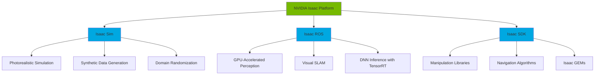
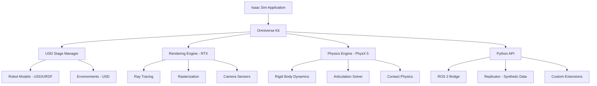
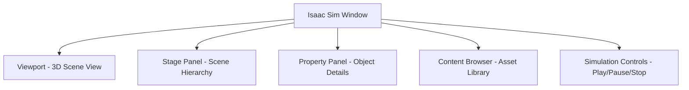

# Chapter 1: NVIDIA Isaac Sim Introduction

**Week 8** | **Duration**: 5-6 hours | **Complexity**: Intermediate to Advanced

---

## Learning Objectives

By the end of this chapter, you will be able to:

1. **Understand** the NVIDIA Isaac ecosystem and its role in Physical AI development
2. **Install** NVIDIA Omniverse and Isaac Sim on Ubuntu 22.04
3. **Navigate** the USD (Universal Scene Description) format for robotics simulation
4. **Create** your first photorealistic simulation environment in Isaac Sim
5. **Import** and convert URDF robot models to USD format
6. **Compare** Isaac Sim advantages over Gazebo for humanoid robotics applications

---

## Introduction

**NVIDIA Isaac Sim** represents a quantum leap in robotics simulation technology. While Gazebo provides solid physics simulation, Isaac Sim brings **photorealistic rendering**, **RTX-accelerated ray tracing**, **synthetic data generation**, and **GPU-parallelized physics** to the robotics world.

Think of Isaac Sim as the bridge between virtual training and real-world deployment. It's built on **NVIDIA Omniverse**, a platform for 3D collaboration and simulation that leverages:

- **RTX Real-Time Ray Tracing**: Photorealistic lighting and shadows
- **PhysX 5**: GPU-accelerated rigid body and soft body physics
- **USD (Universal Scene Description)**: Industry-standard 3D scene format from Pixar
- **Synthetic Data Generation**: Create massive labeled datasets for AI training
- **Multi-Robot Simulation**: Scale to hundreds of robots in parallel

> "Isaac Sim is not just a simulator—it's a complete synthetic data generation platform for training AI models that operate in the physical world."

**Why Isaac Sim for Humanoid Robotics?**

Humanoids require:
- **Complex multi-body dynamics** (20+ degrees of freedom)
- **Visual perception** trained on diverse scenarios
- **Sim-to-real transfer** with minimal domain gap
- **Photorealistic rendering** for vision-based control

Isaac Sim excels in all these areas.

---

## 1. The NVIDIA Isaac Ecosystem

### 1.1 Three Pillars of Isaac



**1. Isaac Sim**: Virtual world creation and robot simulation
**2. Isaac ROS**: Hardware-accelerated ROS 2 packages for perception and navigation
**3. Isaac SDK**: Libraries and tools for robot control and AI

### 1.2 Isaac Sim Architecture



**Key Components**:

1. **Omniverse Kit**: Application framework built on USD
2. **RTX Rendering**: Real-time ray tracing and path tracing
3. **PhysX 5**: NVIDIA's physics engine optimized for GPUs
4. **Replicator**: Tool for generating synthetic training data
5. **ROS 2 Bridge**: Seamless integration with ROS 2 ecosystem

### 1.3 USD: The Universal Scene Description

USD (Universal Scene Description) is Pixar's open-source framework for 3D content creation and interchange.

**Why USD for Robotics?**

| Feature | Benefit |
|---------|---------|
| **Composition** | Combine multiple files into single scene |
| **Layering** | Non-destructive edits and overrides |
| **Variants** | Multiple configurations (sensor setups, robot versions) |
| **Performance** | Lazy loading, efficient memory management |
| **Industry Standard** | Used in film, gaming, automotive, robotics |

**USD File Types**:

```python
# .usd  - Binary or ASCII container
# .usda - ASCII (human-readable, version control friendly)
# .usdc - Binary (compact, fast loading)
# .usdz - Packaged archive (all assets in one file)
```

**USD vs URDF**:

| Aspect | URDF | USD |
|--------|------|-----|
| **Purpose** | Robot description | Universal 3D scenes |
| **Format** | XML | Custom (ASCII/Binary) |
| **Composition** | Single file | Multi-file layering |
| **Physics** | Basic joints/links | Advanced materials, articulations |
| **Rendering** | Minimal | Full PBR, textures, lighting |
| **Ecosystem** | ROS-specific | Film, games, robotics, automotive |

**Good News**: Isaac Sim can import URDF and convert to USD automatically!

---

## 2. Hardware Requirements

### 2.1 Minimum Requirements

Isaac Sim is **GPU-intensive**. Your hardware needs:

| Component | Minimum | Recommended |
|-----------|---------|-------------|
| **GPU** | NVIDIA RTX 2070 (8GB VRAM) | RTX 4070 Ti / 4080 (12-16GB VRAM) |
| **CPU** | Intel i7 (10th gen) | Intel i7 (13th gen+) or AMD Ryzen 9 |
| **RAM** | 32 GB | 64 GB DDR5 |
| **Storage** | 50 GB SSD | 100 GB NVMe SSD |
| **OS** | Ubuntu 22.04 LTS | Ubuntu 22.04 LTS |

**Critical**: You **MUST** have an NVIDIA **RTX GPU** (20-series or newer). GTX cards and AMD GPUs are **not supported**.

**Why RTX is Required**:
- **RT Cores**: Hardware ray tracing acceleration
- **Tensor Cores**: AI inference and denoising
- **CUDA Compute Capability**: 7.0+ for PhysX GPU acceleration

### 2.2 Cloud Alternatives

If you don't have RTX hardware:

**AWS EC2 G5 Instances**:
```bash
# Instance type: g5.xlarge or g5.2xlarge
# GPU: NVIDIA A10G (24 GB VRAM)
# Cost: ~$1.00-$1.50 per hour (on-demand)
```

**NVIDIA Omniverse Cloud**:
- Access Isaac Sim via browser
- Pre-configured environment
- Pay-as-you-go pricing

### 2.3 Checking Your System

```bash
# Check GPU
nvidia-smi

# Check CUDA version (should be 11.8+)
nvcc --version

# Check driver version (should be 525+)
nvidia-smi | grep "Driver Version"

# Check Vulkan support
vulkaninfo --summary
```

---

## 3. Installation

### 3.1 Installing NVIDIA Drivers

**Install Latest NVIDIA Drivers** (525+):

```bash
# Add graphics drivers PPA
sudo add-apt-repository ppa:graphics-drivers/ppa
sudo apt update

# Install driver (check latest version)
sudo apt install nvidia-driver-535 -y

# Reboot
sudo reboot

# Verify installation
nvidia-smi
```

**Expected Output**:
```
+-----------------------------------------------------------------------------+
| NVIDIA-SMI 535.xx       Driver Version: 535.xx       CUDA Version: 12.2    |
|-------------------------------+----------------------+----------------------+
| GPU  Name        Persistence-M| Bus-Id        Disp.A | Volatile Uncorr. ECC |
| Fan  Temp  Perf  Pwr:Usage/Cap|         Memory-Usage | GPU-Util  Compute M. |
|===============================+======================+======================|
|   0  NVIDIA GeForce ...  Off  | 00000000:01:00.0  On |                  N/A |
```

### 3.2 Installing NVIDIA Omniverse

**Step 1: Download Omniverse Launcher**

```bash
# Download launcher
cd ~/Downloads
wget https://install.launcher.omniverse.nvidia.com/installers/omniverse-launcher-linux.AppImage

# Make executable
chmod +x omniverse-launcher-linux.AppImage

# Run launcher
./omniverse-launcher-linux.AppImage
```

**Step 2: Sign In**
- Create NVIDIA account (free)
- Sign in to Omniverse Launcher

**Step 3: Install Nucleus** (Optional but Recommended)
- Nucleus is a collaboration and asset database server
- Install "Nucleus Workstation" from EXCHANGE tab
- Default installation is sufficient for single-user setup

### 3.3 Installing Isaac Sim

**Via Omniverse Launcher**:

1. Navigate to **EXCHANGE** tab
2. Find **Isaac Sim**
3. Click **INSTALL** (downloads ~20 GB)
4. Choose installation directory (default: `~/.local/share/ov/pkg/isaac_sim-*`)
5. Wait for installation to complete (~15-30 minutes)

**Command-Line Installation** (Alternative):

```bash
# Set installation directory
export ISAAC_SIM_PATH="$HOME/.local/share/ov/pkg/isaac_sim-2023.1.1"

# Create directory
mkdir -p ~/.local/share/ov/pkg

# Download Isaac Sim (requires NVIDIA account token)
# Use Omniverse Launcher GUI method instead for simplicity
```

**Verify Installation**:

```bash
# Add to PATH (add to ~/.bashrc)
export ISAAC_SIM_PATH="$HOME/.local/share/ov/pkg/isaac_sim-2023.1.1"
export PATH="$ISAAC_SIM_PATH:$PATH"

# Launch Isaac Sim
cd $ISAAC_SIM_PATH
./isaac-sim.sh
```

**First Launch**:
- Takes 2-5 minutes (shader compilation)
- Creates cache in `~/.cache/ov/`
- Opens Isaac Sim GUI

### 3.4 Installing Isaac Sim Python Environment

Isaac Sim includes its own Python 3.10 environment:

```bash
# Locate Python
cd $ISAAC_SIM_PATH

# Isaac Sim's Python
./python.sh --version
# Output: Python 3.10.x

# Install additional packages
./python.sh -m pip install opencv-python matplotlib numpy
```

**ROS 2 Integration Setup**:

```bash
# Source ROS 2
source /opt/ros/humble/setup.bash

# Run Isaac Sim with ROS 2 support
cd $ISAAC_SIM_PATH
./python.sh -m isaacsim.extsman.enableext ROS2_bridge
```

---

## 4. First Simulation in Isaac Sim

### 4.1 Exploring the Interface

Launch Isaac Sim:
```bash
./isaac-sim.sh
```

**Main Interface Components**:



**Key Panels**:

1. **Viewport**: 3D visualization
   - Left-click drag: Rotate camera
   - Right-click drag: Pan camera
   - Scroll: Zoom

2. **Stage**: Scene hierarchy (like a file tree)
   - Shows all objects (prims) in scene
   - Parent-child relationships

3. **Property**: Selected object properties
   - Transform (position, rotation, scale)
   - Physics properties
   - Rendering materials

4. **Content**: Asset browser
   - Pre-built robots, props, environments
   - NVIDIA assets library

### 4.2 Creating a Simple Scene

**Step 1: Add Ground Plane**

1. Click **Create** → **Physics** → **Ground Plane**
2. Ground plane appears at origin

**Step 2: Add a Cube**

1. Click **Create** → **Mesh** → **Cube**
2. Cube spawns at origin (inside ground)

**Step 3: Position Cube**

1. Select cube in Stage panel
2. In Property panel, find **Transform**
3. Set **Translate** → Z = 1.0 (1 meter above ground)

**Step 4: Add Physics**

1. With cube selected, click **Add** → **Physics** → **Rigid Body Preset**
2. Cube now has physics (will fall when simulation runs)

**Step 5: Run Simulation**

1. Click **Play** button (triangle icon) or press **Spacebar**
2. Cube falls and lands on ground
3. Click **Stop** to reset

**Congratulations!** You've created your first physics simulation in Isaac Sim.

### 4.3 Adding a Robot

**Using Pre-built Robots**:

1. Open **Content** panel
2. Navigate to **Isaac/Robots/**
3. Find **Franka** (robotic arm)
4. Drag **franka.usd** into viewport
5. Robot appears in scene

**Alternative: Menu Method**

1. **Isaac Utils** → **Load Robot** → Select robot from list

**Inspect Robot**:

1. Select robot in Stage panel
2. Expand hierarchy to see links and joints
3. Notice **Articulation Root** component (PhysX articulated body)

### 4.4 Controlling the Robot

**Manual Joint Control**:

1. Select robot in Stage
2. Find joint in hierarchy (e.g., `panda_joint1`)
3. In Property panel, find **Drive** properties
4. Adjust **Target Position** slider
5. Press **Play** to see joint move

**Python Script Control** (we'll explore in detail later):

```python
import omni.isaac.core.utils.stage as stage_utils
from omni.isaac.core.articulations import Articulation

# Get robot
robot = Articulation("/World/Franka")
robot.initialize()

# Set joint positions (radians)
joint_positions = [0.0, -0.785, 0.0, -2.356, 0.0, 1.571, 0.785]
robot.set_joint_positions(joint_positions)
```

---

## 5. Importing URDF to USD

### 5.1 Why Convert URDF to USD?

Your existing ROS 2 robots are defined in URDF. Isaac Sim uses USD. **The Bridge**: Isaac Sim's URDF importer.

**What the Importer Does**:
- Converts XML URDF to USD format
- Maps ROS joints to PhysX articulations
- Converts meshes (STL, DAE) to USD geometry
- Sets up physics and collision properties

### 5.2 Preparing Your URDF

**Example: Simple Mobile Robot** (`my_robot.urdf`)

```xml
<?xml version="1.0"?>
<robot name="simple_robot">

  <!-- Base Link -->
  <link name="base_link">
    <visual>
      <geometry>
        <box size="0.5 0.3 0.2"/>
      </geometry>
      <material name="blue">
        <color rgba="0.2 0.2 0.8 1.0"/>
      </material>
    </visual>
    <collision>
      <geometry>
        <box size="0.5 0.3 0.2"/>
      </geometry>
    </collision>
    <inertial>
      <mass value="10.0"/>
      <inertia ixx="0.1" ixy="0.0" ixz="0.0"
               iyy="0.1" iyz="0.0" izz="0.1"/>
    </inertial>
  </link>

  <!-- Wheel Links -->
  <link name="wheel_left">
    <visual>
      <geometry>
        <cylinder radius="0.1" length="0.05"/>
      </geometry>
      <material name="black">
        <color rgba="0.1 0.1 0.1 1.0"/>
      </material>
    </visual>
    <collision>
      <geometry>
        <cylinder radius="0.1" length="0.05"/>
      </geometry>
    </collision>
    <inertial>
      <mass value="0.5"/>
      <inertia ixx="0.01" ixy="0.0" ixz="0.0"
               iyy="0.01" iyz="0.0" izz="0.01"/>
    </inertial>
  </link>

  <!-- Joint -->
  <joint name="wheel_left_joint" type="continuous">
    <parent link="base_link"/>
    <child link="wheel_left"/>
    <origin xyz="0.0 0.175 -0.1" rpy="0 0 0"/>
    <axis xyz="0 1 0"/>
  </joint>

  <!-- Repeat for right wheel -->

</robot>
```

### 5.3 Importing URDF via GUI

**Method 1: Isaac Utils Menu**

1. **Isaac Utils** → **URDF Importer**
2. Dialog opens
3. **URDF File**: Browse to your `.urdf` file
4. **Import Options**:
   - **Fix Base Link**: Check if robot is static (not free-floating)
   - **Import Inertia**: Check (recommended)
   - **Merge Fixed Joints**: Check for optimization
   - **Self Collision**: Uncheck (enable later if needed)
5. Click **Import**
6. Robot appears in scene as USD

**Method 2: Python Script**

Create `import_urdf.py`:

```python
import omni
from omni.isaac.core.utils.extensions import enable_extension

# Enable URDF extension
enable_extension("omni.isaac.urdf")

import omni.isaac.urdf as urdf_importer

# Import settings
import_config = urdf_importer.ImportConfig()
import_config.merge_fixed_joints = True
import_config.convex_decomp = False
import_config.import_inertia_tensor = True
import_config.fix_base = False  # True for fixed-base robots

# Import URDF
success, prim_path = urdf_importer.import_urdf(
    urdf_path="/path/to/my_robot.urdf",
    import_config=import_config,
    prim_path="/World/MyRobot"
)

if success:
    print(f"Robot imported successfully at {prim_path}")
else:
    print("Import failed")
```

**Run Script**:
```bash
cd $ISAAC_SIM_PATH
./python.sh /path/to/import_urdf.py
```

### 5.4 Verifying the Imported Robot

**Checklist**:

1. **Visual Appearance**: Does the robot look correct?
2. **Joint Hierarchy**: Expand robot in Stage, verify all joints present
3. **Physics**: Select robot, check for **Articulation Root** component
4. **Collision Shapes**: In Viewport, enable **Show → Physics → Collision Meshes**
5. **Test Motion**: Run simulation, apply forces to test physics

**Common Issues**:

| Problem | Solution |
|---------|----------|
| Robot explodes on simulation start | Inertia values too low, increase mass |
| Joints don't move | Check joint type (continuous, revolute) and limits |
| Mesh not visible | Verify mesh file paths in URDF are correct |
| Robot falls through ground | Enable collision on ground plane |

### 5.5 Saving as USD

Once imported and verified:

1. **File** → **Save As**
2. Choose **USD Binary (.usdc)** or **USD ASCII (.usda)**
3. Save to `~/isaac_sim_assets/robots/my_robot.usdc`

**Now you can reuse this USD file** without re-importing URDF each time.

---

## 6. Isaac Sim vs Gazebo

### 6.1 Feature Comparison

| Feature | Gazebo Classic | Isaac Sim |
|---------|---------------|-----------|
| **Rendering** | OGRE (basic) | RTX Ray Tracing (photorealistic) |
| **Physics** | ODE/Bullet/DART (CPU) | PhysX 5 (GPU-accelerated) |
| **Robot Format** | URDF/SDF | USD (imports URDF) |
| **Sensors** | Basic LIDAR, camera, IMU | RTX LIDAR, RTX cameras, synthetic data |
| **Performance** | Single-threaded | Massively parallel (GPU) |
| **Synthetic Data** | Limited | Built-in (Replicator) |
| **Domain Randomization** | Manual | Automated |
| **Multi-Robot** | Limited (few robots) | Scalable (hundreds) |
| **License** | Open-source | Free (closed-source) |
| **Learning Curve** | Moderate | Steep |

### 6.2 When to Use Gazebo

**Use Gazebo When**:
- Simple mobile robot projects
- CPU-only hardware
- Teaching basic ROS 2 concepts
- Need open-source solution
- Community-driven development important

### 6.3 When to Use Isaac Sim

**Use Isaac Sim When**:
- Training vision-based AI models
- Humanoid or complex robots (20+ DOF)
- Need photorealistic rendering
- Generating synthetic training data
- Sim-to-real transfer critical
- GPU hardware available (RTX)

### 6.4 Hybrid Approach

**Best Practice**: Start with Gazebo for prototyping, migrate to Isaac Sim for:
- Vision system development
- Large-scale data generation
- Final sim-to-real validation

---

## 7. Practical Example: Warehouse Robot

Let's build a complete example: importing a warehouse robot and testing in Isaac Sim.

### 7.1 Create URDF Package

```bash
cd ~/ros2_ws/src
ros2 pkg create --build-type ament_cmake warehouse_robot \
  --dependencies urdf xacro

mkdir -p warehouse_robot/urdf
mkdir -p warehouse_robot/meshes
```

### 7.2 Define Robot URDF

Create `warehouse_robot/urdf/warehouse_robot.urdf.xacro`:

```xml
<?xml version="1.0"?>
<robot xmlns:xacro="http://www.ros.org/wiki/xacro" name="warehouse_robot">

  <!-- Properties -->
  <xacro:property name="wheel_radius" value="0.15"/>
  <xacro:property name="wheel_width" value="0.08"/>
  <xacro:property name="base_length" value="0.8"/>
  <xacro:property name="base_width" value="0.6"/>
  <xacro:property name="base_height" value="0.3"/>

  <!-- Base Link -->
  <link name="base_link">
    <visual>
      <geometry>
        <box size="${base_length} ${base_width} ${base_height}"/>
      </geometry>
      <material name="robot_blue">
        <color rgba="0.2 0.4 0.8 1.0"/>
      </material>
    </visual>
    <collision>
      <geometry>
        <box size="${base_length} ${base_width} ${base_height}"/>
      </geometry>
    </collision>
    <inertial>
      <mass value="50.0"/>
      <inertia ixx="2.0" ixy="0.0" ixz="0.0"
               iyy="2.5" iyz="0.0" izz="3.0"/>
    </inertial>
  </link>

  <!-- Wheel Macro -->
  <xacro:macro name="wheel" params="name x y">
    <link name="${name}_wheel">
      <visual>
        <geometry>
          <cylinder radius="${wheel_radius}" length="${wheel_width}"/>
        </geometry>
        <material name="black">
          <color rgba="0.1 0.1 0.1 1.0"/>
        </material>
      </visual>
      <collision>
        <geometry>
          <cylinder radius="${wheel_radius}" length="${wheel_width}"/>
        </geometry>
      </collision>
      <inertial>
        <mass value="2.0"/>
        <inertia ixx="0.02" ixy="0.0" ixz="0.0"
                 iyy="0.02" iyz="0.0" izz="0.02"/>
      </inertial>
    </link>

    <joint name="${name}_wheel_joint" type="continuous">
      <parent link="base_link"/>
      <child link="${name}_wheel"/>
      <origin xyz="${x} ${y} ${-base_height/2}" rpy="${pi/2} 0 0"/>
      <axis xyz="0 0 1"/>
      <limit effort="10.0" velocity="5.0"/>
    </joint>
  </xacro:macro>

  <!-- Instantiate Wheels -->
  <xacro:wheel name="front_left"  x="${base_length/4}"  y="${base_width/2 + wheel_width/2}"/>
  <xacro:wheel name="front_right" x="${base_length/4}"  y="${-(base_width/2 + wheel_width/2)}"/>
  <xacro:wheel name="rear_left"   x="${-base_length/4}" y="${base_width/2 + wheel_width/2}"/>
  <xacro:wheel name="rear_right"  x="${-base_length/4}" y="${-(base_width/2 + wheel_width/2)}"/>

  <!-- Sensor Mount (for camera/LIDAR) -->
  <link name="sensor_mount">
    <visual>
      <geometry>
        <box size="0.1 0.1 0.2"/>
      </geometry>
      <material name="sensor_gray">
        <color rgba="0.5 0.5 0.5 1.0"/>
      </material>
    </visual>
    <inertial>
      <mass value="0.5"/>
      <inertia ixx="0.001" ixy="0.0" ixz="0.0"
               iyy="0.001" iyz="0.0" izz="0.001"/>
    </inertial>
  </link>

  <joint name="sensor_mount_joint" type="fixed">
    <parent link="base_link"/>
    <child link="sensor_mount"/>
    <origin xyz="${base_length/2} 0 ${base_height/2 + 0.1}" rpy="0 0 0"/>
  </joint>

</robot>
```

### 7.3 Generate URDF from Xacro

```bash
cd ~/ros2_ws
colcon build --packages-select warehouse_robot

# Generate URDF
source install/setup.bash
xacro ~/ros2_ws/src/warehouse_robot/urdf/warehouse_robot.urdf.xacro > \
  ~/ros2_ws/src/warehouse_robot/urdf/warehouse_robot.urdf
```

### 7.4 Import to Isaac Sim

**Python Script** (`load_warehouse_robot.py`):

```python
#!/usr/bin/env python3
import omni
from omni.isaac.core import SimulationContext
from omni.isaac.core.utils.stage import create_new_stage
import omni.isaac.urdf as urdf_importer

# Create new stage
create_new_stage()

# Create simulation context
simulation_context = SimulationContext(stage_units_in_meters=1.0)

# Add ground plane
from omni.isaac.core.utils.prims import create_prim
create_prim(
    "/World/GroundPlane",
    "Xform",
    position=[0, 0, 0],
)
from omni.isaac.core.utils.prims import define_prim
ground = define_prim("/World/GroundPlane/CollisionPlane", "Plane")

# Import config
config = urdf_importer.ImportConfig()
config.merge_fixed_joints = False
config.import_inertia_tensor = True
config.fix_base = False
config.make_default_prim = False

# Import robot
urdf_path = "/home/user/ros2_ws/src/warehouse_robot/urdf/warehouse_robot.urdf"
success, prim_path = urdf_importer.import_urdf(
    urdf_path=urdf_path,
    import_config=config,
    prim_path="/World/WarehouseRobot"
)

if success:
    print(f"✓ Robot imported: {prim_path}")

    # Position robot above ground
    from omni.isaac.core.utils.xforms import set_xform_position
    set_xform_position(prim_path, [0, 0, 0.5])

    # Start simulation
    simulation_context.reset()
    simulation_context.play()

    print("Simulation running. Press Ctrl+C to exit.")

    # Keep alive
    import time
    while True:
        simulation_context.step()
        time.sleep(0.01)
else:
    print("✗ Import failed")
```

**Run**:
```bash
cd $ISAAC_SIM_PATH
./python.sh /path/to/load_warehouse_robot.py
```

### 7.5 Adding Sensors

**RTX LIDAR** (GPU-accelerated):

```python
from omni.isaac.core.sensors import RangeSensor

# Create LIDAR sensor
lidar = RangeSensor(
    prim_path="/World/WarehouseRobot/sensor_mount/Lidar",
    name="lidar",
    min_range=0.4,
    max_range=10.0,
    rotation_rate=20.0,  # 20 Hz
    horizontal_fov=360.0,
    horizontal_resolution=0.5,  # 0.5 degree resolution
    high_lod=True,
    yaw_offset=0.0,
)

# Get scan data
scan = lidar.get_current_frame()
print(f"LIDAR points: {len(scan['data'])}")
```

**RTX Camera**:

```python
from omni.isaac.core.sensors import Camera

camera = Camera(
    prim_path="/World/WarehouseRobot/sensor_mount/Camera",
    name="rgb_camera",
    resolution=(1280, 720),
    position=[0.1, 0, 0.2],
    orientation=[0, 0, 0, 1],
)

# Get image
rgb = camera.get_rgba()
print(f"Image shape: {rgb.shape}")
```

---

## 8. Best Practices

### 8.1 Performance Optimization

**DO**:
- Use GPU physics (PhysX) for articulated robots
- Enable **RTX Real-Time** mode for interactive work
- Use **RTX Interactive (Path Traced)** for final renders
- Limit scene complexity (< 1000 physics objects)
- Use LOD (Level of Detail) meshes

**DON'T**:
- Enable ray tracing shadows on all objects
- Use high-poly meshes for collision (use simple shapes)
- Run multiple simulations on single GPU
- Ignore VRAM usage (monitor with `nvidia-smi`)

### 8.2 USD Best Practices

**DO**:
- Use relative asset paths
- Organize assets in clear folder structure
- Version control `.usda` files (human-readable)
- Use composition for reusable components
- Document custom properties

**DON'T**:
- Hardcode absolute paths
- Embed large textures directly (reference externally)
- Modify system USD files
- Overwrite original imported assets

### 8.3 Debugging

**Common Issues**:

| Problem | Solution |
|---------|----------|
| Slow simulation | Reduce physics substeps, simplify colliders |
| Robot explodes | Increase joint damping, check inertia values |
| Black screen | Update GPU drivers, check RTX support |
| URDF import fails | Validate XML, check mesh file paths |
| High VRAM usage | Reduce texture resolution, use instancing |

**Useful Commands**:

```bash
# Check GPU usage
watch -n 1 nvidia-smi

# Clear cache (if simulation broken)
rm -rf ~/.cache/ov/
rm -rf ~/.cache/nvidia/GLCache

# Check logs
tail -f ~/.nvidia-omniverse/logs/Isaac-Sim/*/kit_*.log
```

---

## Summary

In this chapter, you learned:

✅ **Isaac Ecosystem**: Isaac Sim, Isaac ROS, and Isaac SDK work together for Physical AI
✅ **Hardware Requirements**: RTX GPU mandatory, 32GB+ RAM recommended
✅ **Installation**: Omniverse Launcher → Isaac Sim installation process
✅ **USD Format**: Pixar's Universal Scene Description for 3D robotics scenes
✅ **URDF Import**: Converting ROS 2 robots to USD format
✅ **Isaac vs Gazebo**: When to use photorealistic simulation vs traditional physics sim
✅ **Practical Skills**: Created warehouse robot, imported to Isaac Sim, added sensors

**Key Takeaway**: Isaac Sim bridges the gap between simulation and reality through photorealistic rendering, GPU-accelerated physics, and synthetic data generation—essential for training humanoid robots that operate in human environments.

---

## Exercises

### Exercise 1: Customize Warehouse Robot (30 minutes)
Modify the warehouse robot URDF to:
1. Add a third caster wheel at the back for stability
2. Change base dimensions to 1.0m x 0.8m
3. Add a laser_scan frame at the top front
4. Import to Isaac Sim and verify physics

**Hint**: Use `<joint type="fixed">` for caster wheel.

### Exercise 2: Multi-Robot Scene (45 minutes)
Create a scene with:
1. Import warehouse robot at position (0, 0, 0.5)
2. Import same robot at position (2, 0, 0.5)
3. Add 5 obstacles (boxes) randomly placed
4. Run simulation and observe both robots falling

**Bonus**: Add different colors to distinguish robots.

### Exercise 3: Sensor Visualization (60 minutes)
Add sensors to your robot:
1. RTX LIDAR with 360-degree FoV
2. RGB camera facing forward
3. Depth camera on sensor mount
4. Write Python script to:
   - Capture and save LIDAR scan as image
   - Capture RGB frame and display
   - Print depth camera min/max range

**Hint**: Use `matplotlib` to visualize LIDAR data.

### Exercise 4: URDF Debugging (45 minutes)
Intentionally break your URDF:
1. Set one wheel mass to 0.001 kg (too light)
2. Remove inertia from base_link
3. Set joint limits backwards (upper < lower)
4. Import to Isaac Sim and document errors
5. Fix each error and explain solution

**Goal**: Learn to debug common URDF issues.

---

## Assessment

Test your knowledge:

1. What are the three main components of the NVIDIA Isaac platform?
2. Why is USD preferred over URDF for complex simulations?
3. What is the minimum GPU requirement for Isaac Sim and why?
4. Explain the difference between PhysX and ODE physics engines.
5. What are the advantages of RTX ray tracing for robot perception?
6. How does Isaac Sim generate synthetic training data?
7. What is the purpose of the Replicator tool?
8. When would you choose Gazebo over Isaac Sim?

Take the [Chapter 1 Quiz](../../assessments/module-3/chapter-01-quiz.md) (15 questions, 80% to pass).

---

## Additional Resources

- **Isaac Sim Documentation**: [docs.omniverse.nvidia.com/isaacsim](https://docs.omniverse.nvidia.com/isaacsim/latest/index.html)
- **USD Tutorials**: [openusd.org](https://openusd.org/release/index.html)
- **NVIDIA PhysX**: [gameworksdocs.nvidia.com](https://gameworksdocs.nvidia.com/PhysX/4.1/documentation/physxguide/Index.html)
- **Isaac Sim GitHub Examples**: [github.com/NVIDIA-Omniverse/IsaacGymEnvs](https://github.com/NVIDIA-Omniverse/IsaacGymEnvs)
- **YouTube**: [NVIDIA Isaac Sim Tutorials](https://www.youtube.com/playlist?list=PL3jK4xNnlCVf1SzxjCm7ZxDBNl9QYyV8X)
- **Forum**: [forums.developer.nvidia.com/isaac](https://forums.developer.nvidia.com/c/omniverse/isaac-sim/326)

---

## Next Chapter

Ready to accelerate perception with GPUs? Proceed to [Chapter 2: Isaac ROS Perception](./02-isaac-ros-perception.md) to learn about hardware-accelerated SLAM, object detection, and deploying to Jetson edge devices.

---

*This chapter is part of the Physical AI & Humanoid Robotics textbook. All code examples are available in the [companion repository](https://github.com/panaversity/physical-ai-textbook).*
