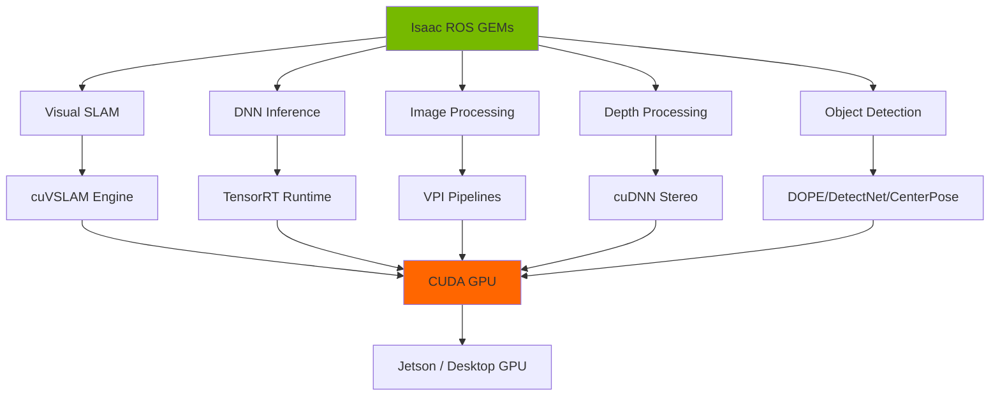
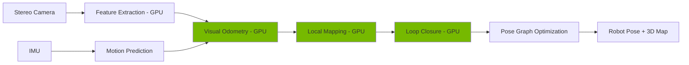
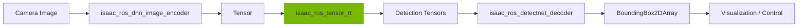

# Chapter 2: Isaac ROS Perception

**Week 9** | **Duration**: 5-6 hours | **Complexity**: Advanced

---

## Learning Objectives

By the end of this chapter, you will be able to:

1. **Understand** the Isaac ROS GEMs architecture and GPU acceleration advantages
2. **Install** and configure Isaac ROS packages on Ubuntu 22.04
3. **Implement** Visual SLAM (Simultaneous Localization and Mapping) using Isaac VSLAM
4. **Deploy** hardware-accelerated DNN inference with TensorRT
5. **Integrate** object detection pipelines for real-time perception
6. **Deploy** perception stacks to NVIDIA Jetson edge devices

---

## Introduction

Traditional ROS 2 perception nodes run on CPUs, creating bottlenecks when processing high-resolution images, depth data, and running deep learning models. **Isaac ROS** solves this by moving perception algorithms to the GPU, achieving:

- **10-100x performance improvement** over CPU implementations
- **Lower latency** (< 50ms) for vision-based control
- **Higher throughput** (30+ FPS on high-resolution streams)
- **Energy efficiency** on edge devices (Jetson)

Isaac ROS provides **GEMs** (Graph-Execution Modules)—hardware-accelerated ROS 2 nodes that leverage:

- **CUDA**: Parallel computing on NVIDIA GPUs
- **TensorRT**: Optimized deep learning inference
- **VPI (Vision Programming Interface)**: Accelerated computer vision
- **cuDNN**: GPU-accelerated neural networks

> "Isaac ROS transforms perception from a CPU bottleneck into a GPU-accelerated pipeline capable of real-time performance on humanoid robots."

**Why This Matters for Humanoids**:
Humanoid robots need to:
- Navigate complex indoor environments (SLAM)
- Recognize objects and people (detection)
- Grasp and manipulate items (pose estimation)
- React in real-time (< 100ms latency)

All these require **fast, efficient perception**—Isaac ROS delivers.

---

## 1. Isaac ROS Architecture

### 1.1 The Isaac ROS Stack



**Key Components**:

1. **Isaac ROS GEMs**: Pre-built ROS 2 nodes (C++ with Python interfaces)
2. **Acceleration Libraries**: TensorRT, CUDA, VPI, cuVSLAM
3. **Hardware**: NVIDIA GPUs (RTX desktops, Jetson edge devices)

### 1.2 Isaac ROS GEMs Catalog

| GEM | Purpose | Use Case |
|-----|---------|----------|
| **isaac_ros_visual_slam** | Visual SLAM using stereo/mono cameras | Localization, mapping |
| **isaac_ros_dnn_inference** | TensorRT-accelerated deep learning | Object detection, segmentation |
| **isaac_ros_image_proc** | GPU image processing (resize, rectify) | Pre-processing for perception |
| **isaac_ros_apriltag** | AprilTag detection | Fiducial markers, calibration |
| **isaac_ros_nvblox** | 3D reconstruction and mapping | Navigation, obstacle avoidance |
| **isaac_ros_pose_estimation** | 6-DOF object pose estimation | Manipulation, grasping |
| **isaac_ros_stereo_depth** | Stereo depth estimation | 3D perception |

### 1.3 Performance Comparison

**Benchmark: Object Detection (ResNet50, 1280x720 image)**

| Platform | CPU (ROS 2) | GPU (Isaac ROS) | Speedup |
|----------|-------------|-----------------|---------|
| Desktop (RTX 4080) | 250 ms | 8 ms | **31x** |
| Jetson Orin Nano | 800 ms | 25 ms | **32x** |
| Jetson Xavier NX | 1200 ms | 40 ms | **30x** |

**Latency Breakdown**:
```
CPU Pipeline:  Image → Decode (CPU) → Preprocess (CPU) → Inference (CPU) → Postprocess (CPU) → Output
                 ↓        ↓              ↓                   ↓                  ↓
               20ms     50ms           30ms                 100ms              50ms         = 250ms

GPU Pipeline:  Image → GPU → Preprocess → Inference → Postprocess → Output
                 ↓      ↓        ↓            ↓            ↓
                2ms    1ms      2ms          2ms          1ms                  = 8ms
```

---

## 2. Installation and Setup

### 2.1 System Requirements

**Desktop Workstation**:
- Ubuntu 22.04 LTS
- ROS 2 Humble
- NVIDIA GPU with CUDA Compute Capability 7.0+ (RTX 20-series or newer)
- CUDA 11.8+
- Docker (recommended for dependency management)

**Jetson Edge Device**:
- Jetson Orin Nano / NX / AGX (recommended)
- JetPack 5.1+ (includes ROS 2, CUDA, TensorRT)
- 32GB+ storage (SD card or NVMe)

### 2.2 Installing Isaac ROS (Docker Method)

Isaac ROS uses Docker containers for reproducible builds with all dependencies pre-installed.

**Step 1: Install Docker**

```bash
# Install Docker
sudo apt update
sudo apt install docker.io -y

# Add user to docker group
sudo usermod -aG docker $USER

# Reboot to apply group changes
sudo reboot
```

**Step 2: Install NVIDIA Container Toolkit**

```bash
# Add NVIDIA Docker repository
distribution=$(. /etc/os-release;echo $ID$VERSION_ID)
curl -s -L https://nvidia.github.io/nvidia-docker/gpgkey | sudo apt-key add -
curl -s -L https://nvidia.github.io/nvidia-docker/$distribution/nvidia-docker.list | \
  sudo tee /etc/apt/sources.list.d/nvidia-docker.list

# Install nvidia-docker2
sudo apt update
sudo apt install nvidia-docker2 -y

# Restart Docker
sudo systemctl restart docker

# Test GPU access in Docker
docker run --rm --gpus all nvidia/cuda:11.8.0-base-ubuntu22.04 nvidia-smi
```

**Step 3: Clone Isaac ROS Repository**

```bash
mkdir -p ~/workspaces/isaac_ros/src
cd ~/workspaces/isaac_ros/src

# Clone Isaac ROS common
git clone https://github.com/NVIDIA-ISAAC-ROS/isaac_ros_common.git

# Clone specific GEMs (we'll add Visual SLAM first)
git clone https://github.com/NVIDIA-ISAAC-ROS/isaac_ros_visual_slam.git
```

**Step 4: Build Docker Image**

```bash
cd ~/workspaces/isaac_ros/src/isaac_ros_common
./scripts/run_dev.sh
```

This builds and runs a Docker container with:
- ROS 2 Humble
- CUDA 11.8
- TensorRT 8.5
- All Isaac ROS dependencies

**Inside Container**: You'll see a prompt like:
```
user@isaac_ros-dev:~/workspaces/isaac_ros$
```

### 2.3 Installing Isaac ROS (Native Method - Advanced)

For Jetson or native Ubuntu installation:

**Install Dependencies**:

```bash
sudo apt update
sudo apt install -y \
  python3-pip \
  python3-rosdep \
  python3-colcon-common-extensions \
  libboost-all-dev \
  libeigen3-dev \
  libceres-dev

# Install CUDA toolkit (if not already installed)
# For desktop: Install from NVIDIA CUDA website
# For Jetson: Included in JetPack
```

**Install TensorRT**:

```bash
# Desktop
# Download from: https://developer.nvidia.com/tensorrt
# Follow installation instructions

# Jetson
# Already included in JetPack
```

**Build Isaac ROS from Source**:

```bash
cd ~/workspaces/isaac_ros
source /opt/ros/humble/setup.bash

# Install dependencies
rosdep install --from-paths src --ignore-src -r -y

# Build
colcon build --symlink-install

# Source workspace
source install/setup.bash
```

---

## 3. Visual SLAM with Isaac VSLAM

### 3.1 What is Visual SLAM?

**SLAM (Simultaneous Localization and Mapping)**: The robot simultaneously:
1. **Localizes** itself (Where am I?)
2. **Builds a map** of the environment (What does the world look like?)

**Visual SLAM (VSLAM)**: Uses camera images instead of LIDAR.

**Isaac VSLAM** uses:
- **Stereo cameras** (preferred) or **monocular + IMU**
- **cuVSLAM engine**: GPU-accelerated SLAM algorithm
- **ORB features**: Oriented FAST and Rotated BRIEF descriptors
- **Bundle adjustment**: Optimizes camera poses and 3D points



### 3.2 Hardware Setup: Stereo Camera

**Recommended Cameras**:
- **Intel RealSense D435i** / D455: Stereo + IMU ($349-$399)
- **ZED 2** / ZED 2i: Stereo + IMU, higher resolution ($449-$599)
- **OAK-D**: Stereo + AI accelerator ($299)

**Connect Camera**:
```bash
# Install RealSense SDK
sudo apt install ros-humble-realsense2-camera -y

# Test camera
ros2 run realsense2_camera realsense2_camera_node
```

**Verify Topics**:
```bash
ros2 topic list | grep camera
# /camera/color/image_raw
# /camera/depth/image_rect_raw
# /camera/infra1/image_rect_raw  # Left stereo
# /camera/infra2/image_rect_raw  # Right stereo
# /camera/imu
```

### 3.3 Running Isaac VSLAM

**Launch File** (`vslam_realsense.launch.py`):

```python
#!/usr/bin/env python3
from launch import LaunchDescription
from launch_ros.actions import Node
from launch.actions import IncludeLaunchDescription
from launch.launch_description_sources import PythonLaunchDescriptionSource
from ament_index_python.packages import get_package_share_directory
import os


def generate_launch_description():
    # RealSense camera launch
    realsense_launch = IncludeLaunchDescription(
        PythonLaunchDescriptionSource(
            os.path.join(
                get_package_share_directory('realsense2_camera'),
                'launch',
                'rs_launch.py'
            )
        ),
        launch_arguments={
            'enable_infra1': 'true',
            'enable_infra2': 'true',
            'enable_depth': 'false',  # VSLAM uses stereo, not depth
            'enable_gyro': 'true',
            'enable_accel': 'true',
            'unite_imu_method': '1',
        }.items()
    )

    # Isaac Visual SLAM node
    visual_slam_node = Node(
        package='isaac_ros_visual_slam',
        executable='isaac_ros_visual_slam',
        name='isaac_ros_visual_slam',
        parameters=[{
            'enable_rectified_pose': True,
            'denoise_input_images': False,
            'rectified_images': True,
            'enable_debug_mode': False,
            'debug_dump_path': '/tmp/cuvslam',
            'enable_slam_visualization': True,
            'enable_observations_view': True,
            'enable_landmarks_view': True,
            'map_frame': 'map',
            'odom_frame': 'odom',
            'base_frame': 'base_link',
            'input_left_camera_frame': 'camera_infra1_frame',
            'input_right_camera_frame': 'camera_infra2_frame',
            'input_imu_frame': 'camera_imu_frame',
        }],
        remappings=[
            ('stereo_camera/left/image', '/camera/infra1/image_rect_raw'),
            ('stereo_camera/right/image', '/camera/infra2/image_rect_raw'),
            ('stereo_camera/left/camera_info', '/camera/infra1/camera_info'),
            ('stereo_camera/right/camera_info', '/camera/infra2/camera_info'),
            ('visual_slam/imu', '/camera/imu'),
        ],
        output='screen'
    )

    return LaunchDescription([
        realsense_launch,
        visual_slam_node,
    ])
```

**Run VSLAM**:

```bash
# In Docker container (if using Docker method)
cd ~/workspaces/isaac_ros
source install/setup.bash

ros2 launch isaac_ros_visual_slam vslam_realsense.launch.py
```

**Expected Topics**:

```bash
ros2 topic list
# /visual_slam/tracking/odometry       # Robot pose estimate
# /visual_slam/tracking/vo_pose        # Visual odometry pose
# /visual_slam/tracking/vo_path        # Path traveled
# /visual_slam/status                  # SLAM status
# /visual_slam/vis/landmarks_cloud     # 3D map points
```

### 3.4 Visualizing SLAM in RViz

```bash
# Open RViz
ros2 run rviz2 rviz2

# Add displays:
# 1. TF - shows coordinate frames
# 2. Odometry - /visual_slam/tracking/odometry
# 3. Path - /visual_slam/tracking/vo_path
# 4. PointCloud2 - /visual_slam/vis/landmarks_cloud
# 5. Camera - /camera/color/image_raw

# Set Fixed Frame: "map"
```

**Move the camera around** (walk through your room). You'll see:
- Green path showing camera trajectory
- Point cloud showing 3D landmarks
- Real-time pose updates

### 3.5 VSLAM Performance Tuning

**Parameters**:

```yaml
# config/vslam_params.yaml
/**:
  ros__parameters:
    # Image processing
    num_cameras: 2  # Stereo = 2
    min_num_images: 4  # Minimum images to start SLAM

    # Feature extraction
    num_feature_points: 400  # Features per image (higher = slower, more accurate)

    # Mapping
    enable_localization_n_mapping: true
    enable_observations_view: true
    enable_landmarks_view: true
    enable_slam_visualization: true

    # Performance
    max_frame_rate: 30.0  # FPS limit

    # Loop closure
    enable_loop_closure: true
    loop_closure_frequency: 1.0  # Hz
```

**Troubleshooting**:

| Problem | Solution |
|---------|----------|
| No pose estimates | Check camera topics publishing, verify calibration |
| Drift over time | Enable loop closure, add IMU |
| Tracking lost | Improve lighting, reduce motion speed |
| Low FPS | Reduce `num_feature_points`, lower resolution |
| GPU memory error | Reduce image resolution, disable visualizations |

---

## 4. DNN Inference with TensorRT

### 4.1 What is TensorRT?

**TensorRT**: NVIDIA's inference optimizer and runtime for deep learning.

**How It Works**:
1. Takes trained model (PyTorch, TensorFlow, ONNX)
2. Optimizes for target GPU (kernel fusion, precision calibration)
3. Generates optimized engine file
4. Runs inference with minimal latency

**Optimizations**:
- **Layer Fusion**: Combines multiple ops into single kernel
- **Precision Calibration**: FP32 → FP16 → INT8 quantization
- **Kernel Auto-Tuning**: Selects fastest implementation
- **Dynamic Tensor Memory**: Efficient memory allocation

**Speedup Example**:
```
PyTorch (FP32):     100 ms
TensorRT (FP16):     15 ms  [6.7x faster]
TensorRT (INT8):      8 ms  [12.5x faster]
```

### 4.2 Object Detection with Isaac ROS DNN Inference

We'll use **PeopleNet** model (detects people) from NVIDIA NGC.

**Architecture**:



**Step 1: Download Pre-trained Model**

```bash
# Inside Isaac ROS container
cd ~/workspaces/isaac_ros

# Create models directory
mkdir -p models/peoplenet

# Download PeopleNet (from NVIDIA NGC)
# You need NGC API key: https://catalog.ngc.nvidia.com/

# Alternative: Use provided script
cd src/isaac_ros_dnn_inference/isaac_ros_dnn_inference/scripts
./download_peoplenet.sh ~/workspaces/isaac_ros/models/peoplenet
```

**Step 2: Launch File** (`detectnet_people.launch.py`):

```python
#!/usr/bin/env python3
from launch import LaunchDescription
from launch_ros.actions Node, ComposableNodeContainer
from launch_ros.descriptions import ComposableNode
import os


def generate_launch_description():
    model_dir = os.path.expanduser('~/workspaces/isaac_ros/models/peoplenet')

    # DNN inference pipeline as composable nodes (zero-copy)
    container = ComposableNodeContainer(
        name='detectnet_container',
        namespace='',
        package='rclcpp_components',
        executable='component_container',
        composable_node_descriptions=[
            # 1. Encode image to tensor
            ComposableNode(
                package='isaac_ros_dnn_image_encoder',
                plugin='nvidia::isaac_ros::dnn_inference::DnnImageEncoderNode',
                name='dnn_image_encoder',
                parameters=[{
                    'network_image_width': 960,
                    'network_image_height': 544,
                    'image_mean': [0.485, 0.456, 0.406],
                    'image_stddev': [0.229, 0.224, 0.225],
                }],
                remappings=[
                    ('image', '/camera/color/image_raw'),
                    ('camera_info', '/camera/color/camera_info'),
                ]
            ),
            # 2. TensorRT inference
            ComposableNode(
                package='isaac_ros_tensor_rt',
                plugin='nvidia::isaac_ros::dnn_inference::TensorRTNode',
                name='tensor_rt',
                parameters=[{
                    'model_file_path': f'{model_dir}/resnet34_peoplenet_int8.onnx',
                    'engine_file_path': f'{model_dir}/resnet34_peoplenet_int8.plan',
                    'input_tensor_names': ['input_tensor'],
                    'input_binding_names': ['input_1'],
                    'output_tensor_names': ['output_cov', 'output_bbox'],
                    'output_binding_names': ['output_cov/Sigmoid', 'output_bbox/BiasAdd'],
                    'verbose': False,
                    'force_engine_update': False,
                }]
            ),
            # 3. Decode detections
            ComposableNode(
                package='isaac_ros_detectnet',
                plugin='nvidia::isaac_ros::detectnet::DetectNetDecoderNode',
                name='detectnet_decoder',
                parameters=[{
                    'label_list': ['person'],
                    'confidence_threshold': 0.35,
                    'enable_confidence_threshold': True,
                }]
            ),
        ],
        output='screen'
    )

    # Visualization (optional)
    visualizer = Node(
        package='isaac_ros_detectnet',
        executable='isaac_ros_detectnet_visualizer.py',
        name='detectnet_visualizer',
        remappings=[
            ('image', '/camera/color/image_raw'),
            ('detections', '/detections'),
        ]
    )

    return LaunchDescription([
        container,
        visualizer,
    ])
```

**Step 3: Run Detection**

```bash
ros2 launch isaac_ros_detectnet detectnet_people.launch.py
```

**Output Topics**:

```bash
ros2 topic echo /detections
# vision_msgs/msg/Detection2DArray
# detections:
#   - bbox: {center: {x: 640, y: 360}, size_x: 200, size_y: 400}
#     results:
#       - hypothesis: {class_id: "person", score: 0.92}
```

### 4.3 Custom Object Detection Model

**Convert Your Own PyTorch Model**:

```python
import torch
import torch.onnx

# Load trained model
model = torch.load('my_detector.pth')
model.eval()

# Create dummy input (batch=1, channels=3, height=544, width=960)
dummy_input = torch.randn(1, 3, 544, 960).cuda()

# Export to ONNX
torch.onnx.export(
    model,
    dummy_input,
    "my_detector.onnx",
    export_params=True,
    opset_version=17,
    input_names=['input'],
    output_names=['boxes', 'scores', 'classes'],
    dynamic_axes={
        'input': {0: 'batch_size'},
        'boxes': {0: 'batch_size'},
        'scores': {0: 'batch_size'},
        'classes': {0: 'batch_size'},
    }
)
```

**Convert ONNX to TensorRT Engine**:

```bash
# Inside Isaac ROS container
trtexec \
  --onnx=my_detector.onnx \
  --saveEngine=my_detector.plan \
  --fp16 \
  --workspace=4096 \
  --verbose

# --fp16: Use FP16 precision (faster)
# --workspace: GPU memory in MB
```

**Deploy in Isaac ROS**: Update `model_file_path` and `engine_file_path` in launch file.

---

## 5. Perception Pipeline Integration

### 5.1 Combined VSLAM + Object Detection

Let's build a complete perception stack:

```python
#!/usr/bin/env python3
from launch import LaunchDescription
from launch_ros.actions import Node, ComposableNodeContainer
from launch.actions import IncludeLaunchDescription
from launch_ros.descriptions import ComposableNode


def generate_launch_description():
    # 1. Camera driver
    camera = Node(
        package='realsense2_camera',
        executable='realsense2_camera_node',
        parameters=[{
            'enable_color': True,
            'enable_depth': True,
            'enable_infra1': True,
            'enable_infra2': True,
            'enable_gyro': True,
            'enable_accel': True,
        }]
    )

    # 2. Visual SLAM
    vslam = Node(
        package='isaac_ros_visual_slam',
        executable='isaac_ros_visual_slam',
        parameters=[{
            'enable_rectified_pose': True,
            'map_frame': 'map',
            'odom_frame': 'odom',
            'base_frame': 'base_link',
        }],
        remappings=[
            ('stereo_camera/left/image', '/camera/infra1/image_rect_raw'),
            ('stereo_camera/right/image', '/camera/infra2/image_rect_raw'),
        ]
    )

    # 3. Object detection pipeline
    detection_container = ComposableNodeContainer(
        name='detection_container',
        namespace='',
        package='rclcpp_components',
        executable='component_container',
        composable_node_descriptions=[
            ComposableNode(
                package='isaac_ros_dnn_image_encoder',
                plugin='nvidia::isaac_ros::dnn_inference::DnnImageEncoderNode',
                name='dnn_encoder',
                parameters=[{
                    'network_image_width': 960,
                    'network_image_height': 544,
                }],
                remappings=[('image', '/camera/color/image_raw')]
            ),
            ComposableNode(
                package='isaac_ros_tensor_rt',
                plugin='nvidia::isaac_ros::dnn_inference::TensorRTNode',
                name='tensor_rt',
                parameters=[{
                    'model_file_path': '/models/peoplenet.onnx',
                    'engine_file_path': '/models/peoplenet.plan',
                }]
            ),
            ComposableNode(
                package='isaac_ros_detectnet',
                plugin='nvidia::isaac_ros::detectnet::DetectNetDecoderNode',
                name='detectnet_decoder',
                parameters=[{
                    'confidence_threshold': 0.4,
                }]
            ),
        ]
    )

    # 4. Fusion node (combines SLAM pose + detections)
    fusion = Node(
        package='perception_fusion',
        executable='slam_detection_fusion',
        parameters=[{
            'detection_timeout': 0.5,  # seconds
        }],
        remappings=[
            ('odometry', '/visual_slam/tracking/odometry'),
            ('detections', '/detections'),
            ('fused_detections', '/perception/objects'),
        ]
    )

    return LaunchDescription([
        camera,
        vslam,
        detection_container,
        fusion,
    ])
```

### 5.2 Performance Monitoring

**Create Monitoring Node** (`perception_monitor.py`):

```python
#!/usr/bin/env python3
import rclpy
from rclpy.node import Node
from nav_msgs.msg import Odometry
from vision_msgs.msg import Detection2DArray
import time


class PerceptionMonitor(Node):
    def __init__(self):
        super().__init__('perception_monitor')

        self.odom_times = []
        self.detection_times = []

        self.create_subscription(
            Odometry,
            '/visual_slam/tracking/odometry',
            self.odom_callback,
            10
        )

        self.create_subscription(
            Detection2DArray,
            '/detections',
            self.detection_callback,
            10
        )

        self.create_timer(5.0, self.report_stats)

    def odom_callback(self, msg):
        self.odom_times.append(time.time())

    def detection_callback(self, msg):
        self.detection_times.append(time.time())
        self.get_logger().info(
            f'Detected {len(msg.detections)} objects'
        )

    def report_stats(self):
        # Calculate FPS
        if len(self.odom_times) > 1:
            odom_fps = len(self.odom_times) / 5.0
            self.get_logger().info(f'VSLAM FPS: {odom_fps:.1f}')

        if len(self.detection_times) > 1:
            det_fps = len(self.detection_times) / 5.0
            self.get_logger().info(f'Detection FPS: {det_fps:.1f}')

        # Reset counters
        self.odom_times.clear()
        self.detection_times.clear()


def main():
    rclpy.init()
    node = PerceptionMonitor()
    rclpy.spin(node)
    rclpy.shutdown()


if __name__ == '__main__':
    main()
```

---

## 6. Deploying to NVIDIA Jetson

### 6.1 Jetson Setup

**Flash JetPack 5.1+**:

1. Download **NVIDIA SDK Manager** on Ubuntu host PC
2. Connect Jetson via USB-C (recovery mode)
3. Flash JetPack 5.1.2 (includes Ubuntu 22.04, ROS 2 Humble, CUDA, TensorRT)

**Verify Installation**:

```bash
# On Jetson
jtop  # System monitor (install: sudo pip3 install jetson-stats)

# Check versions
dpkg -l | grep cuda
dpkg -l | grep tensorrt
ros2 --version
```

### 6.2 Installing Isaac ROS on Jetson

**Method 1: Docker (Recommended)**

```bash
# Clone Isaac ROS
mkdir -p ~/workspaces/isaac_ros/src
cd ~/workspaces/isaac_ros/src
git clone https://github.com/NVIDIA-ISAAC-ROS/isaac_ros_common.git

# Build and run container
cd isaac_ros_common
./scripts/run_dev.sh
```

**Method 2: Native Build**

```bash
cd ~/workspaces/isaac_ros
source /opt/ros/humble/setup.bash

# Install dependencies
rosdep install --from-paths src --ignore-src -y

# Build (use all cores)
colcon build --symlink-install --parallel-workers $(nproc)

source install/setup.bash
```

### 6.3 Optimizing for Jetson

**Set Power Mode** (Jetson Orin Nano):

```bash
# Maximum performance (15W mode)
sudo nvpmodel -m 0

# Enable max clocks
sudo jetson_clocks
```

**Reduce Memory Usage**:

```yaml
# config/jetson_params.yaml
/**:
  ros__parameters:
    # Visual SLAM
    num_feature_points: 200  # Reduced from 400
    max_frame_rate: 15.0     # Lower FPS

    # DNN Inference
    network_image_width: 640  # Reduced from 960
    network_image_height: 480 # Reduced from 544
```

**Monitor Performance**:

```bash
# GPU/CPU/Memory usage
jtop

# Thermal throttling
watch -n 1 'cat /sys/devices/virtual/thermal/thermal_zone*/temp'
```

### 6.4 Real-World Deployment Example

**Robot Configuration** (`jetson_robot.yaml`):

```yaml
robot:
  hardware:
    camera: "realsense_d435i"
    compute: "jetson_orin_nano"
    motors: "dynamixel_xl330"

  perception:
    vslam:
      enabled: true
      max_fps: 15
    object_detection:
      enabled: true
      model: "peoplenet_int8"
      confidence: 0.5

  performance:
    power_mode: "max"  # 15W
    gpu_freq: "max"
    cpu_freq: "max"
```

**Launch on Jetson**:

```bash
ros2 launch humanoid_perception jetson_deployment.launch.py \
  config:=jetson_robot.yaml
```

---

## 7. Best Practices

### 7.1 Performance Optimization

**DO**:
- Use composable nodes (zero-copy communication)
- Enable TensorRT FP16 or INT8 precision
- Use GPU image encoding/decoding
- Batch process multiple images when possible
- Profile with `nvprof` or Nsight Systems

**DON'T**:
- Copy images between CPU/GPU unnecessarily
- Run multiple inference models in parallel (GPU contention)
- Use high-resolution images without downsampling
- Ignore thermal throttling on Jetson

### 7.2 Debugging GPU Pipelines

**Check GPU Utilization**:

```bash
# Desktop
nvidia-smi dmon -s u

# Jetson
jtop
```

**Profile CUDA Kernels**:

```bash
nsys profile --stats=true \
  ros2 run isaac_ros_tensor_rt tensor_rt_node
```

**Common Issues**:

| Problem | Solution |
|---------|----------|
| Low GPU usage | Increase batch size, check CPU bottleneck |
| High latency | Enable zero-copy, reduce image resolution |
| OOM (Out of Memory) | Reduce model size, lower resolution, use INT8 |
| Slow first inference | TensorRT engine building (cache it) |

---

## Summary

In this chapter, you learned:

✅ **Isaac ROS Architecture**: GPU-accelerated ROS 2 nodes (GEMs) for perception
✅ **Visual SLAM**: cuVSLAM for real-time localization and mapping
✅ **TensorRT Inference**: 10-100x faster object detection on GPUs
✅ **Perception Pipelines**: Integrating SLAM + detection + depth
✅ **Jetson Deployment**: Running Isaac ROS on edge devices
✅ **Performance Optimization**: Memory management, FPS tuning, power modes

**Key Takeaway**: Isaac ROS moves perception from CPU bottleneck to GPU acceleration, enabling real-time humanoid robot perception at 30+ FPS with minimal latency—critical for responsive Physical AI systems.

---

## Exercises

### Exercise 1: Benchmark VSLAM Performance (30 minutes)
Record a rosbag with your camera moving through a room:
1. Run Isaac VSLAM and record topics
2. Measure average FPS and tracking accuracy
3. Compare with CPU-based ORB-SLAM3
4. Document performance difference

**Deliverable**: Markdown report with FPS comparison table.

### Exercise 2: Train Custom Detector (90 minutes)
Train a custom object detector:
1. Collect 200 images of a specific object (mug, book, etc.)
2. Label with CVAT or Roboflow
3. Train YOLOv8 model (20 epochs)
4. Export to ONNX → TensorRT
5. Deploy in Isaac ROS pipeline

**Hint**: Use `ultralytics` Python package.

### Exercise 3: Multi-Camera Fusion (60 minutes)
Implement multi-camera object detection:
1. Set up two cameras (or one camera, two launch files)
2. Run detection on both streams
3. Write fusion node to combine detections
4. Remove duplicates (same object seen by both cameras)
5. Visualize in RViz

**Bonus**: Add 3D position estimation using depth.

### Exercise 4: Jetson Power Optimization (45 minutes)
Deploy perception stack on Jetson and optimize:
1. Measure FPS and power consumption at different nvpmodel modes
2. Test with reduced image resolution (640x480, 320x240)
3. Compare INT8 vs FP16 vs FP32 inference
4. Create power/performance curve graph

**Deliverable**: CSV data + matplotlib plot.

---

## Assessment

Test your knowledge:

1. What are Isaac ROS GEMs and why are they faster than CPU nodes?
2. Explain how TensorRT optimizes neural networks for inference.
3. What is the difference between Visual Odometry and Visual SLAM?
4. Why use stereo cameras instead of monocular cameras for VSLAM?
5. How does INT8 quantization reduce inference time?
6. What is the purpose of composable nodes in ROS 2?
7. Compare Jetson Orin Nano vs Xavier NX for perception tasks.
8. What causes thermal throttling on Jetson and how to prevent it?

Take the [Chapter 2 Quiz](../../assessments/module-3/chapter-02-quiz.md) (15 questions, 80% to pass).

---

## Additional Resources

- **Isaac ROS Documentation**: [nvidia-isaac-ros.github.io](https://nvidia-isaac-ros.github.io/index.html)
- **TensorRT Documentation**: [docs.nvidia.com/deeplearning/tensorrt](https://docs.nvidia.com/deeplearning/tensorrt/developer-guide/index.html)
- **Jetson Developer Zone**: [developer.nvidia.com/embedded/jetson](https://developer.nvidia.com/embedded/jetson)
- **cuVSLAM Paper**: [NVIDIA Research](https://research.nvidia.com/publication/2022-03_cuvslam-open-source-gpu-accelerated-visual-slam)
- **NGC Model Zoo**: [catalog.ngc.nvidia.com](https://catalog.ngc.nvidia.com/models)
- **Isaac ROS GitHub**: [github.com/NVIDIA-ISAAC-ROS](https://github.com/NVIDIA-ISAAC-ROS)

---

## Next Chapter

Ready to navigate autonomous humanoids? Proceed to [Chapter 3: Navigation with Nav2](./03-nav2-navigation.md) to learn about path planning, costmaps, and integrating Isaac VSLAM with the Nav2 stack for bipedal locomotion.

---

*This chapter is part of the Physical AI & Humanoid Robotics textbook. All code examples are available in the [companion repository](https://github.com/panaversity/physical-ai-textbook).*
