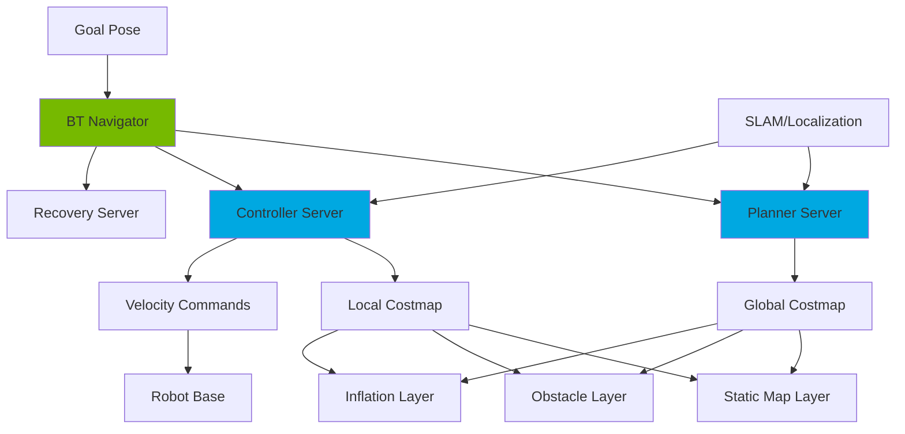
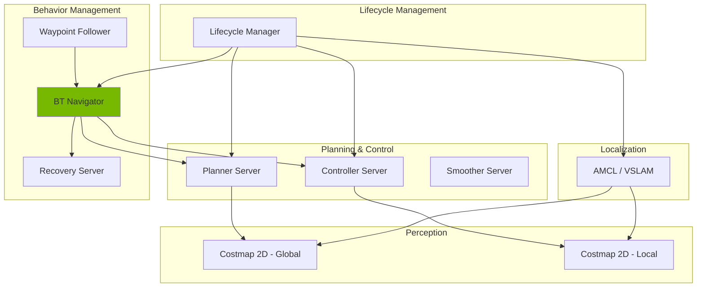
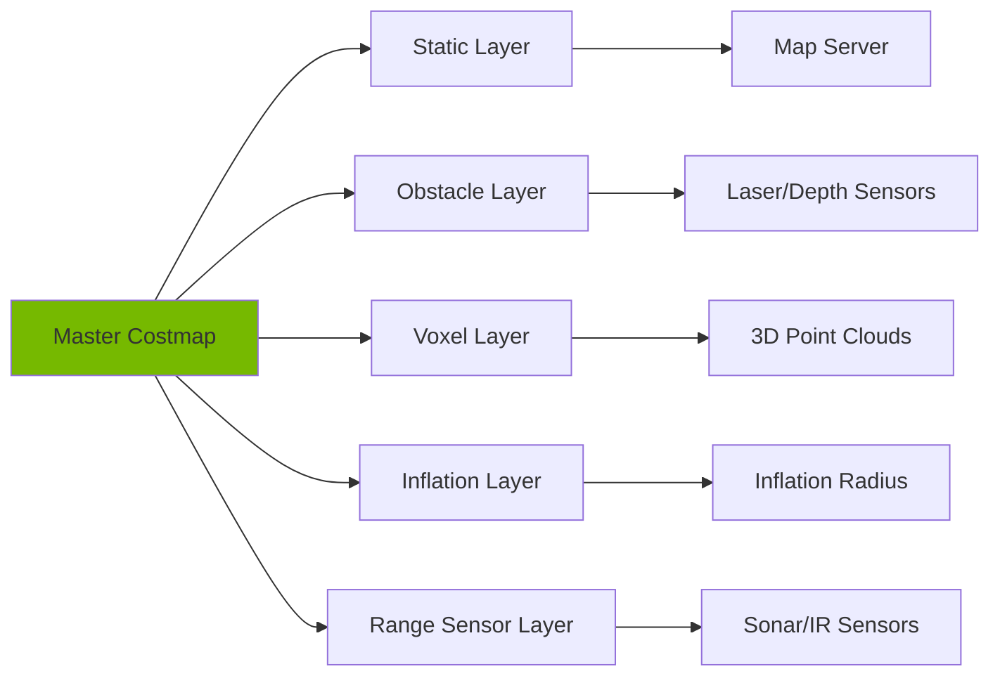

# Chapter 3: Navigation with Nav2

**Week 10** | **Duration**: 6-7 hours | **Complexity**: Advanced

---

## Learning Objectives

By the end of this chapter, you will be able to:

1. **Understand** the Nav2 (Navigation2) stack architecture and its components
2. **Implement** path planning algorithms including A* and RRT for humanoid robots
3. **Configure** costmaps for dynamic obstacle avoidance in human environments
4. **Integrate** Isaac VSLAM with Nav2 for localization-based navigation
5. **Deploy** waypoint navigation for bipedal humanoid locomotion
6. **Tune** navigation parameters for stability and efficiency

---

## Introduction

**Navigation2 (Nav2)** is the next-generation navigation framework for ROS 2, enabling autonomous robots to move from point A to point B while avoiding obstacles. While Nav2 was originally designed for wheeled mobile robots, it's increasingly used for **humanoid robots** with adaptations for:

- **Bipedal locomotion** (walking instead of wheel commands)
- **Dynamic balancing** during navigation
- **Human-aware path planning** (social navigation)
- **Multi-floor navigation** (stairs, ramps)

Nav2 provides a complete navigation stack:



> "Nav2 transforms a robot from a remote-controlled toy into an autonomous agent capable of navigating complex, dynamic environments."

**Why Nav2 for Humanoids?**

Humanoids navigating human spaces must:
- **Avoid moving people** (dynamic obstacles)
- **Follow social conventions** (don't cut through personal space)
- **Navigate narrow spaces** (doorways, hallways)
- **Adapt to terrain changes** (carpet, tile, slopes)

Nav2 provides the flexibility to implement these behaviors through plugins and behavior trees.

---

## 1. Nav2 Architecture

### 1.1 Core Components



**1. Planner Server**: Computes global path from start to goal
   - Algorithms: NavFn (Dijkstra), Smac Planner (A*, Hybrid-A*, State Lattice)
   - Output: Sequence of waypoints (path)

**2. Controller Server**: Generates velocity commands to follow path
   - Algorithms: DWB (Dynamic Window Approach), TEB (Timed Elastic Band), RPP (Regulated Pure Pursuit)
   - Output: `cmd_vel` (linear and angular velocities)

**3. Smoother Server**: Refines path for smoother motion
   - Algorithms: Simple Smoother, Constrained Smoother
   - Output: Smoothed path with reduced curvature

**4. Recovery Server**: Handles failures (stuck, no path found)
   - Behaviors: Spin, Back up, Wait, Clear costmap

**5. BT Navigator**: Orchestrates navigation using Behavior Trees
   - Flexible logic: If path blocked → replan → if still blocked → recovery

**6. Costmap 2D**: 2D occupancy grid with obstacle information
   - Global: Static map + obstacles (entire known environment)
   - Local: Dynamic obstacles around robot (rolling window)

### 1.2 Costmap Layers



**Layer Types**:

1. **Static Map Layer**: Pre-built map (walls, furniture)
2. **Obstacle Layer**: Dynamic obstacles from sensors
3. **Voxel Layer**: 3D obstacles collapsed to 2D
4. **Inflation Layer**: Adds "buffer zone" around obstacles
5. **Custom Layers**: Semantic zones (e.g., "no-go zones")

**Cost Values** (0-254):
- **0 (FREE_SPACE)**: Safe to traverse
- **1-127**: Increasing cost (prefer to avoid)
- **128-252**: Inscribed (robot footprint collides)
- **253 (INSCRIBED)**: Robot center at obstacle edge
- **254 (LETHAL)**: Definite collision

### 1.3 Behavior Trees in Nav2

Nav2 uses **Behavior Trees (BT)** for navigation logic instead of hard-coded state machines.

**Example BT**:

```xml
<root main_tree_to_execute="MainTree">
  <BehaviorTree ID="MainTree">
    <PipelineSequence name="NavigateWithReplanning">
      <RateController hz="1.0">
        <ComputePathToPose goal="{goal}" path="{path}"/>
      </RateController>
      <FollowPath path="{path}"/>
    </PipelineSequence>
  </BehaviorTree>
</root>
```

**Advantages**:
- **Modularity**: Swap behaviors without rewriting code
- **Visualization**: XML trees are human-readable
- **Extensibility**: Add custom behaviors (e.g., "wait for person to pass")

---

## 2. Installation and Setup

### 2.1 Installing Nav2

**Ubuntu 22.04 + ROS 2 Humble**:

```bash
# Install Nav2
sudo apt update
sudo apt install ros-humble-navigation2 \
  ros-humble-nav2-bringup \
  ros-humble-turtlebot3-* -y

# Install visualization tools
sudo apt install ros-humble-rviz2 \
  ros-humble-rqt-robot-steering -y
```

**Verify Installation**:

```bash
ros2 pkg list | grep nav2
# nav2_amcl
# nav2_behavior_tree
# nav2_bt_navigator
# nav2_controller
# nav2_costmap_2d
# nav2_planner
# ...
```

### 2.2 Workspace Setup

```bash
mkdir -p ~/nav2_ws/src
cd ~/nav2_ws/src

# Create navigation package
ros2 pkg create --build-type ament_cmake humanoid_navigation \
  --dependencies nav2_common nav2_bringup tf2_ros

# Directory structure
mkdir -p humanoid_navigation/{launch,config,maps,params,behavior_trees}
```

### 2.3 Simulate with TurtleBot3 (Testing)

Before deploying to humanoid, test with TurtleBot3 simulator:

```bash
# Set TurtleBot3 model
export TURTLEBOT3_MODEL=waffle

# Launch Gazebo world
ros2 launch turtlebot3_gazebo turtlebot3_world.launch.py

# Launch Nav2 (new terminal)
ros2 launch turtlebot3_navigation2 navigation2.launch.py use_sim_time:=True

# Open RViz (new terminal)
ros2 launch turtlebot3_navigation2 rviz_launch.py
```

**In RViz**:
1. Click **"2D Pose Estimate"** → Click on map to set initial pose
2. Click **"Nav2 Goal"** → Click destination
3. Watch robot navigate autonomously!

---

## 3. Path Planning Algorithms

### 3.1 NavFn Planner (Dijkstra's Algorithm)

**NavFn** uses Dijkstra's algorithm to find shortest path.

**How It Works**:
1. Start from goal position
2. Propagate cost wave outward (like ripples in water)
3. Each cell stores distance to goal
4. Trace path from start by following decreasing cost

**Advantages**:
- Guaranteed to find optimal path (if one exists)
- Simple to implement
- No parameters to tune

**Disadvantages**:
- Slow for large maps (O(n²))
- Doesn't consider robot kinematics
- Generates jagged paths

**Configuration** (`navfn_params.yaml`):

```yaml
planner_server:
  ros__parameters:
    planner_plugins: ["GridBased"]
    GridBased:
      plugin: "nav2_navfn_planner/NavfnPlanner"
      tolerance: 0.5  # Goal tolerance (meters)
      use_astar: false  # Use Dijkstra
      allow_unknown: true  # Navigate through unknown space
```

### 3.2 Smac Planner (A* and Hybrid-A*)

**Smac Planner** uses A* with kinematic constraints for more realistic paths.

**A* Algorithm**:
```
f(n) = g(n) + h(n)

g(n) = cost from start to node n
h(n) = heuristic (estimated cost from n to goal)
f(n) = total estimated cost

Algorithm:
1. Add start to open list
2. While open list not empty:
   a. Pop node with lowest f(n)
   b. If node is goal, reconstruct path
   c. For each neighbor:
      - Calculate g(n) and f(n)
      - Add to open list if better path
```

**Hybrid-A*** (for humanoids):
- Considers robot's orientation and footprint
- Generates smooth, drivable paths
- Supports lattice-based planning (discrete motion primitives)

**Configuration** (`smac_params.yaml`):

```yaml
planner_server:
  ros__parameters:
    expected_planner_frequency: 20.0
    planner_plugins: ["GridBased"]

    GridBased:
      plugin: "nav2_smac_planner/SmacPlannerHybrid"
      downsample_costmap: false
      downsampling_factor: 1
      tolerance: 0.25
      allow_unknown: true
      max_iterations: 1000000
      max_on_approach_iterations: 1000
      max_planning_time: 5.0

      # Motion model
      motion_model_for_search: "DUBIN"  # Options: DUBIN, REEDS_SHEPP, STATE_LATTICE
      angle_quantization_bins: 72  # 5-degree resolution
      analytic_expansion_ratio: 3.5
      analytic_expansion_max_length: 3.0

      # Penalties
      reverse_penalty: 2.0  # Penalize backing up
      change_penalty: 0.0
      non_straight_penalty: 1.2
      cost_penalty: 2.0

      # Smoothing
      smooth_path: true
      smoother:
        max_iterations: 1000
        w_smooth: 0.3
        w_data: 0.2
        tolerance: 1e-10
```

### 3.3 RRT (Rapidly-Exploring Random Tree)

**RRT** explores space by randomly sampling points and connecting them.

**Algorithm**:
```
1. Start with tree containing only start node
2. Repeat until goal reached:
   a. Sample random point in space
   b. Find nearest node in tree
   c. Extend tree toward sample (up to step size)
   d. If collision-free, add to tree
3. Connect goal to tree
4. Backtrack from goal to start
```

**Advantages**:
- Handles complex, high-dimensional spaces
- Probabilistically complete (will find path if one exists)
- Fast in open environments

**Disadvantages**:
- Non-optimal paths
- Requires post-processing smoothing
- Poor performance in narrow passages

**RRT* (Optimal RRT)**:
- Rewires tree to find shorter paths
- Converges to optimal solution over time

**Implementation** (Custom Plugin):

```cpp
// Custom RRT planner plugin for Nav2
#include "nav2_core/global_planner.hpp"

class RRTPlanner : public nav2_core::GlobalPlanner
{
public:
  void configure(/* ... */) override {
    step_size_ = 0.5;  // meters
    goal_tolerance_ = 0.25;
    max_iterations_ = 10000;
  }

  nav_msgs::msg::Path createPlan(
    const geometry_msgs::msg::PoseStamped & start,
    const geometry_msgs::msg::PoseStamped & goal) override
  {
    // RRT implementation
    std::vector<Node> tree;
    tree.push_back(Node(start));

    for (int i = 0; i < max_iterations_; ++i) {
      Node random = sampleRandomNode();
      Node nearest = findNearestNode(tree, random);
      Node new_node = extend(nearest, random, step_size_);

      if (isCollisionFree(nearest, new_node)) {
        tree.push_back(new_node);

        if (distance(new_node, goal) < goal_tolerance_) {
          return reconstructPath(tree, new_node);
        }
      }
    }

    return nav_msgs::msg::Path();  // No path found
  }
};
```

---

## 4. Costmap Configuration

### 4.1 Global Costmap

Covers entire known map, used for long-term planning.

**Configuration** (`global_costmap_params.yaml`):

```yaml
global_costmap:
  global_costmap:
    ros__parameters:
      update_frequency: 1.0  # Hz
      publish_frequency: 1.0
      global_frame: map
      robot_base_frame: base_link
      use_sim_time: True

      # Map type
      rolling_window: false  # Static map
      width: 50  # meters (only if rolling_window: true)
      height: 50
      resolution: 0.05  # meters per pixel

      # Plugins (layers)
      plugins: ["static_layer", "obstacle_layer", "inflation_layer"]

      # Static layer (pre-built map)
      static_layer:
        plugin: "nav2_costmap_2d::StaticLayer"
        map_subscribe_transient_local: True

      # Obstacle layer (from sensors)
      obstacle_layer:
        plugin: "nav2_costmap_2d::ObstacleLayer"
        enabled: True
        observation_sources: scan
        scan:
          topic: /scan
          max_obstacle_height: 2.0
          clearing: True
          marking: True
          data_type: "LaserScan"
          raytrace_max_range: 10.0
          raytrace_min_range: 0.0
          obstacle_max_range: 8.0
          obstacle_min_range: 0.0

      # Inflation layer (safety buffer)
      inflation_layer:
        plugin: "nav2_costmap_2d::InflationLayer"
        cost_scaling_factor: 3.0  # Exponential decay rate
        inflation_radius: 0.55  # meters (robot radius + safety margin)

      # Footprint
      robot_radius: 0.3  # For circular robot (humanoid approximation)
      # OR for complex footprint:
      # footprint: [[-0.3, -0.2], [-0.3, 0.2], [0.3, 0.2], [0.3, -0.2]]
```

### 4.2 Local Costmap

Small rolling window around robot, used for obstacle avoidance.

**Configuration** (`local_costmap_params.yaml`):

```yaml
local_costmap:
  local_costmap:
    ros__parameters:
      update_frequency: 5.0  # Higher frequency for dynamic obstacles
      publish_frequency: 2.0
      global_frame: odom
      robot_base_frame: base_link
      use_sim_time: True

      # Rolling window
      rolling_window: true
      width: 5  # 5x5 meter window
      height: 5
      resolution: 0.05

      plugins: ["voxel_layer", "inflation_layer"]

      # Voxel layer (3D obstacles → 2D)
      voxel_layer:
        plugin: "nav2_costmap_2d::VoxelLayer"
        enabled: True
        publish_voxel_map: True
        origin_z: 0.0
        z_resolution: 0.05
        z_voxels: 16  # 0.8m height
        max_obstacle_height: 2.0
        mark_threshold: 0
        observation_sources: pointcloud
        pointcloud:
          topic: /camera/depth/points
          max_obstacle_height: 2.0
          clearing: True
          marking: True
          data_type: "PointCloud2"
          raytrace_max_range: 3.0
          raytrace_min_range: 0.0
          obstacle_max_range: 2.5
          obstacle_min_range: 0.0

      inflation_layer:
        plugin: "nav2_costmap_2d::InflationLayer"
        cost_scaling_factor: 5.0
        inflation_radius: 0.55

      robot_radius: 0.3
```

### 4.3 Humanoid-Specific Footprint

Humanoids have non-circular footprints (two feet):

```yaml
# Humanoid footprint (simplified bounding box)
footprint: [
  [-0.15, -0.25],  # Back-left
  [-0.15,  0.25],  # Back-right
  [ 0.15,  0.25],  # Front-right
  [ 0.15, -0.25]   # Front-left
]

# OR individual foot polygons
footprint_left: [[-0.1, 0.1], [-0.1, 0.25], [0.1, 0.25], [0.1, 0.1]]
footprint_right: [[-0.1, -0.25], [-0.1, -0.1], [0.1, -0.1], [0.1, -0.25]]
```

### 4.4 Visualizing Costmaps

In RViz:
1. Add → By topic → `/global_costmap/costmap` → Map
2. Add → By topic → `/local_costmap/costmap` → Map

**Color Scheme**:
- **White**: Free space (cost 0)
- **Light blue**: Low cost (1-127)
- **Dark blue**: Inscribed (128-252)
- **Black**: Lethal obstacle (253-254)

---

## 5. Integrating Isaac VSLAM with Nav2

### 5.1 Localization Methods

Nav2 requires pose estimation (robot's position in map). Options:

| Method | Input | Accuracy | CPU/GPU | Use Case |
|--------|-------|----------|---------|----------|
| **AMCL** | LIDAR + map | High | Low CPU | Wheeled robots, static maps |
| **Isaac VSLAM** | Stereo camera | Very High | High GPU | Vision-based, dynamic environments |
| **Robot Localization** | IMU + wheel odom | Medium | Low CPU | Sensor fusion |

For humanoids with stereo cameras, **Isaac VSLAM** is ideal.

### 5.2 Nav2 + Isaac VSLAM Launch File

**File**: `nav2_isaac_vslam.launch.py`

```python
#!/usr/bin/env python3
from launch import LaunchDescription
from launch_ros.actions import Node
from launch.actions import IncludeLaunchDescription
from launch.launch_description_sources import PythonLaunchDescriptionSource
from ament_index_python.packages import get_package_share_directory
import os


def generate_launch_description():
    nav2_bringup_dir = get_package_share_directory('nav2_bringup')
    humanoid_nav_dir = get_package_share_directory('humanoid_navigation')

    # 1. Isaac Visual SLAM
    vslam = Node(
        package='isaac_ros_visual_slam',
        executable='isaac_ros_visual_slam',
        name='isaac_ros_visual_slam',
        parameters=[{
            'enable_rectified_pose': True,
            'map_frame': 'map',
            'odom_frame': 'odom',
            'base_frame': 'base_link',
            'enable_slam_visualization': True,
            'enable_observations_view': True,
        }],
        remappings=[
            ('stereo_camera/left/image', '/camera/infra1/image_rect_raw'),
            ('stereo_camera/right/image', '/camera/infra2/image_rect_raw'),
            ('stereo_camera/left/camera_info', '/camera/infra1/camera_info'),
            ('stereo_camera/right/camera_info', '/camera/infra2/camera_info'),
        ],
        output='screen'
    )

    # 2. Nav2 Stack
    nav2 = IncludeLaunchDescription(
        PythonLaunchDescriptionSource(
            os.path.join(nav2_bringup_dir, 'launch', 'navigation_launch.py')
        ),
        launch_arguments={
            'params_file': os.path.join(humanoid_nav_dir, 'config', 'nav2_params.yaml'),
            'use_sim_time': 'False',
        }.items()
    )

    # 3. Map Server (if using pre-built map)
    map_server = Node(
        package='nav2_map_server',
        executable='map_server',
        name='map_server',
        parameters=[{
            'yaml_filename': os.path.join(humanoid_nav_dir, 'maps', 'office_map.yaml'),
            'use_sim_time': False,
        }],
        output='screen'
    )

    # 4. Lifecycle manager
    lifecycle_manager = Node(
        package='nav2_lifecycle_manager',
        executable='lifecycle_manager',
        name='lifecycle_manager_navigation',
        parameters=[{
            'autostart': True,
            'node_names': ['map_server']
        }],
        output='screen'
    )

    return LaunchDescription([
        vslam,
        map_server,
        lifecycle_manager,
        nav2,
    ])
```

### 5.3 Synchronizing TF Frames

Nav2 requires proper TF tree:

```
map
 └─ odom
     └─ base_link
         ├─ camera_link
         └─ sensors...
```

**TF Publishers**:
- **Isaac VSLAM**: Publishes `map → odom` transform
- **Robot State Publisher**: Publishes `base_link → camera_link` (from URDF)
- **Nav2**: Uses these transforms for localization

**Verify TF Tree**:

```bash
# View TF tree
ros2 run tf2_tools view_frames

# Check specific transform
ros2 run tf2_ros tf2_echo map base_link
```

### 5.4 Creating a Map with Isaac VSLAM

**Option 1: SLAM Mapping** (create map while navigating):

```bash
# Run Isaac VSLAM
ros2 launch humanoid_navigation isaac_vslam_mapping.launch.py

# Drive robot around (teleoperation)
ros2 run teleop_twist_keyboard teleop_twist_keyboard

# Save map
ros2 run nav2_map_server map_saver_cli -f ~/maps/office_map
```

**Option 2: Use Pre-built Map**: Load existing map with Map Server (see launch file above).

---

## 6. Controller Configuration

### 6.1 DWB Controller (Dynamic Window Approach)

**DWB** generates velocity commands by simulating trajectories forward in time.

**Algorithm**:
1. Sample velocity space (vx, vy, vtheta)
2. For each sample, simulate trajectory forward (1-2 seconds)
3. Score trajectory based on:
   - Distance to goal
   - Distance to obstacles
   - Path alignment
   - Oscillation
4. Select best trajectory
5. Send velocity command

**Configuration** (`dwb_params.yaml`):

```yaml
controller_server:
  ros__parameters:
    controller_frequency: 20.0  # Hz
    min_x_velocity_threshold: 0.001
    min_y_velocity_threshold: 0.5
    min_theta_velocity_threshold: 0.001
    failure_tolerance: 0.3
    progress_checker_plugin: "progress_checker"
    goal_checker_plugins: ["general_goal_checker"]
    controller_plugins: ["FollowPath"]

    # Progress checker
    progress_checker:
      plugin: "nav2_controller::SimpleProgressChecker"
      required_movement_radius: 0.5
      movement_time_allowance: 10.0

    # Goal checker
    general_goal_checker:
      stateful: True
      plugin: "nav2_controller::SimpleGoalChecker"
      xy_goal_tolerance: 0.15  # meters
      yaw_goal_tolerance: 0.15  # radians

    # DWB controller
    FollowPath:
      plugin: "dwb_core::DWBLocalPlanner"
      debug_trajectory_details: True
      min_vel_x: 0.0
      min_vel_y: 0.0
      max_vel_x: 0.5  # Humanoid walking speed (m/s)
      max_vel_y: 0.0  # No strafing
      max_vel_theta: 1.0  # rad/s
      min_speed_xy: 0.0
      max_speed_xy: 0.5
      min_speed_theta: 0.0

      # Acceleration limits
      acc_lim_x: 0.3  # m/s²
      acc_lim_y: 0.0
      acc_lim_theta: 1.0  # rad/s²
      decel_lim_x: -0.3
      decel_lim_y: 0.0
      decel_lim_theta: -1.0

      # Trajectory sampling
      vx_samples: 20
      vy_samples: 0
      vtheta_samples: 20
      sim_time: 1.7  # seconds
      discretize_by_time: false
      linear_granularity: 0.05
      angular_granularity: 0.025

      # Critics (scoring functions)
      critics: [
        "RotateToGoal",
        "Oscillation",
        "BaseObstacle",
        "GoalAlign",
        "PathAlign",
        "PathDist",
        "GoalDist"
      ]

      BaseObstacle.scale: 0.02
      PathAlign.scale: 32.0
      PathAlign.forward_point_distance: 0.1
      GoalAlign.scale: 24.0
      GoalAlign.forward_point_distance: 0.1
      PathDist.scale: 32.0
      GoalDist.scale: 24.0
      RotateToGoal.scale: 32.0
      RotateToGoal.slowing_factor: 5.0
      RotateToGoal.lookahead_time: -1.0
```

### 6.2 Regulated Pure Pursuit (RPP)

**RPP** is simpler and smoother than DWB, following path directly.

**Algorithm**:
1. Find "lookahead point" on path ahead of robot
2. Calculate curvature to reach that point
3. Regulate speed based on curvature and obstacles

**Best For**: Smooth, wide-open paths (not tight spaces).

**Configuration** (`rpp_params.yaml`):

```yaml
controller_server:
  ros__parameters:
    controller_plugins: ["FollowPath"]

    FollowPath:
      plugin: "nav2_regulated_pure_pursuit_controller::RegulatedPurePursuitController"
      desired_linear_vel: 0.4  # m/s
      lookahead_dist: 0.6  # meters
      min_lookahead_dist: 0.3
      max_lookahead_dist: 1.0
      lookahead_time: 1.5  # seconds
      rotate_to_heading_angular_vel: 1.0
      transform_tolerance: 0.1
      use_velocity_scaled_lookahead_dist: false
      min_approach_linear_velocity: 0.05
      approach_velocity_scaling_dist: 0.6
      use_collision_detection: true
      max_allowed_time_to_collision_up_to_carrot: 1.0
      use_regulated_linear_velocity_scaling: true
      use_cost_regulated_linear_velocity_scaling: false
      regulated_linear_scaling_min_radius: 0.9
      regulated_linear_scaling_min_speed: 0.25
      use_rotate_to_heading: true
      allow_reversing: false  # Humanoids don't walk backward
      rotate_to_heading_min_angle: 0.785
      max_angular_accel: 3.2
      max_robot_pose_search_dist: 10.0
```

---

## 7. Waypoint Navigation

### 7.1 Waypoint Follower

**Waypoint navigation**: Robot visits sequence of goals (A → B → C → D).

**Use Cases**:
- Patrol routes (security robot)
- Delivery tasks (fetch coffee, return to desk)
- Inspection (check multiple rooms)

**Launch Waypoint Follower**:

```bash
ros2 launch nav2_bringup navigation_launch.py
```

**Send Waypoints** (Python):

```python
#!/usr/bin/env python3
import rclpy
from rclpy.node import Node
from nav2_msgs.action import FollowWaypoints
from geometry_msgs.msg import PoseStamped
from rclpy.action import ActionClient


class WaypointNavigator(Node):
    def __init__(self):
        super().__init__('waypoint_navigator')
        self.action_client = ActionClient(
            self, FollowWaypoints, 'follow_waypoints'
        )

    def send_waypoints(self, waypoints):
        goal_msg = FollowWaypoints.Goal()
        goal_msg.poses = waypoints

        self.get_logger().info(f'Sending {len(waypoints)} waypoints...')
        self.action_client.wait_for_server()
        send_goal_future = self.action_client.send_goal_async(goal_msg)
        send_goal_future.add_done_callback(self.goal_response_callback)

    def goal_response_callback(self, future):
        goal_handle = future.result()
        if not goal_handle.accepted:
            self.get_logger().error('Waypoint goal rejected')
            return

        self.get_logger().info('Waypoint goal accepted, navigating...')
        result_future = goal_handle.get_result_async()
        result_future.add_done_callback(self.get_result_callback)

    def get_result_callback(self, future):
        result = future.result().result
        self.get_logger().info(f'Navigation complete! Missed waypoints: {result.missed_waypoints}')


def create_waypoint(x, y, theta):
    pose = PoseStamped()
    pose.header.frame_id = 'map'
    pose.header.stamp = rclpy.time.Time().to_msg()
    pose.pose.position.x = x
    pose.pose.position.y = y
    pose.pose.position.z = 0.0

    # Convert yaw to quaternion
    import math
    pose.pose.orientation.w = math.cos(theta / 2.0)
    pose.pose.orientation.z = math.sin(theta / 2.0)

    return pose


def main():
    rclpy.init()
    navigator = WaypointNavigator()

    # Define waypoints (x, y, theta)
    waypoints = [
        create_waypoint(2.0, 0.0, 0.0),
        create_waypoint(2.0, 2.0, 1.57),
        create_waypoint(0.0, 2.0, 3.14),
        create_waypoint(0.0, 0.0, -1.57),
    ]

    navigator.send_waypoints(waypoints)

    rclpy.spin(navigator)
    rclpy.shutdown()


if __name__ == '__main__':
    main()
```

**Run**:

```bash
ros2 run humanoid_navigation waypoint_navigator
```

### 7.2 Dynamic Waypoint Generation

Generate waypoints from semantic map:

```python
class SemanticWaypointPlanner(Node):
    def __init__(self):
        super().__init__('semantic_waypoint_planner')
        self.semantic_map = self.load_semantic_map('office_map_semantic.yaml')

    def plan_inspection_route(self):
        """Visit all rooms in order."""
        waypoints = []
        for room in self.semantic_map['rooms']:
            entrance = room['entrance_pose']
            center = room['center_pose']

            # Go to entrance, then center
            waypoints.append(self.create_pose(entrance))
            waypoints.append(self.create_pose(center))

        return waypoints

    def plan_delivery_route(self, start, destination):
        """Navigate from start to destination via safe corridors."""
        # Use A* on semantic graph
        path = self.astar_semantic(start, destination)

        waypoints = []
        for node in path:
            waypoints.append(self.semantic_map['nodes'][node]['pose'])

        return waypoints
```

---

## 8. Humanoid-Specific Adaptations

### 8.1 Bipedal Locomotion Controller

Nav2 outputs `cmd_vel` (linear/angular velocities). Humanoids need **step commands**.

**Velocity to Step Converter**:

```python
#!/usr/bin/env python3
import rclpy
from rclpy.node import Node
from geometry_msgs.msg import Twist
from humanoid_msgs.msg import StepCommand  # Custom message


class VelocityToStepConverter(Node):
    def __init__(self):
        super().__init__('velocity_to_step_converter')

        self.subscription = self.create_subscription(
            Twist, '/cmd_vel', self.cmd_vel_callback, 10
        )

        self.step_publisher = self.create_publisher(
            StepCommand, '/step_command', 10
        )

        self.step_length = 0.2  # meters
        self.step_width = 0.1
        self.step_time = 0.6  # seconds per step

    def cmd_vel_callback(self, msg):
        linear_x = msg.linear.x
        angular_z = msg.angular.z

        step_cmd = StepCommand()

        if abs(linear_x) < 0.01 and abs(angular_z) < 0.01:
            # Stand still
            step_cmd.action = 'stand'
        elif abs(angular_z) > 0.1:
            # Turn in place
            step_cmd.action = 'turn'
            step_cmd.turn_angle = angular_z * self.step_time
        else:
            # Walk forward/backward
            step_cmd.action = 'walk'
            step_cmd.step_length = linear_x * self.step_time
            step_cmd.step_width = self.step_width

        self.step_publisher.publish(step_cmd)
        self.get_logger().info(f'Step command: {step_cmd.action}')


def main():
    rclpy.init()
    node = VelocityToStepConverter()
    rclpy.spin(node)
    rclpy.shutdown()


if __name__ == '__main__':
    main()
```

### 8.2 Dynamic Balance Constraints

Humanoids must maintain balance while navigating.

**Stability Checker**:

```python
class StabilityChecker(Node):
    def __init__(self):
        super().__init__('stability_checker')

        # Subscribe to IMU
        self.imu_sub = self.create_subscription(
            Imu, '/imu', self.imu_callback, 10
        )

        # Publish safety override
        self.override_pub = self.create_publisher(
            Twist, '/cmd_vel_override', 10
        )

        self.max_tilt = 0.3  # radians (17 degrees)

    def imu_callback(self, msg):
        # Extract roll and pitch
        roll, pitch = self.quaternion_to_rpy(msg.orientation)

        if abs(roll) > self.max_tilt or abs(pitch) > self.max_tilt:
            self.get_logger().warn('Unstable! Stopping robot.')

            # Override velocity to stop
            stop_cmd = Twist()
            self.override_pub.publish(stop_cmd)

    def quaternion_to_rpy(self, q):
        import math
        # Convert quaternion to roll, pitch, yaw
        roll = math.atan2(
            2.0 * (q.w * q.x + q.y * q.z),
            1.0 - 2.0 * (q.x**2 + q.y**2)
        )
        pitch = math.asin(2.0 * (q.w * q.y - q.z * q.x))
        return roll, pitch
```

---

## 9. Practical Example: Office Delivery Robot

### 9.1 Scenario

Humanoid robot navigates office to deliver coffee from kitchen to desk.

**Tasks**:
1. Start at desk (0, 0)
2. Navigate to kitchen (5, 5)
3. Wait for coffee (30 seconds)
4. Navigate back to desk (0, 0)

### 9.2 Complete Launch File

**File**: `office_delivery.launch.py`

```python
#!/usr/bin/env python3
from launch import LaunchDescription
from launch_ros.actions import Node
from ament_index_python.packages import get_package_share_directory
import os


def generate_launch_description():
    pkg_dir = get_package_share_directory('humanoid_navigation')

    # Nav2
    nav2 = Node(
        package='nav2_bringup',
        executable='bringup_launch.py',
        parameters=[os.path.join(pkg_dir, 'config', 'nav2_params.yaml')],
    )

    # Isaac VSLAM
    vslam = Node(
        package='isaac_ros_visual_slam',
        executable='isaac_ros_visual_slam',
    )

    # Delivery mission
    delivery_mission = Node(
        package='humanoid_navigation',
        executable='office_delivery_mission',
        parameters=[{
            'kitchen_pose': [5.0, 5.0, 0.0],
            'desk_pose': [0.0, 0.0, 0.0],
            'wait_time': 30.0,
        }]
    )

    return LaunchDescription([vslam, nav2, delivery_mission])
```

### 9.3 Mission Logic

**File**: `office_delivery_mission.py`

```python
#!/usr/bin/env python3
import rclpy
from rclpy.node import Node
from nav2_msgs.action import NavigateToPose
from rclpy.action import ActionClient
import time


class DeliveryMission(Node):
    def __init__(self):
        super().__init__('delivery_mission')

        self.nav_client = ActionClient(self, NavigateToPose, 'navigate_to_pose')

        # Parameters
        self.declare_parameter('kitchen_pose', [5.0, 5.0, 0.0])
        self.declare_parameter('desk_pose', [0.0, 0.0, 0.0])
        self.declare_parameter('wait_time', 30.0)

        self.kitchen = self.get_parameter('kitchen_pose').value
        self.desk = self.get_parameter('desk_pose').value
        self.wait_time = self.get_parameter('wait_time').value

        # Start mission
        self.execute_mission()

    def execute_mission(self):
        self.get_logger().info('Starting delivery mission...')

        # Step 1: Navigate to kitchen
        self.get_logger().info('Navigating to kitchen...')
        self.navigate_to(self.kitchen)

        # Step 2: Wait for coffee
        self.get_logger().info(f'Waiting {self.wait_time} seconds for coffee...')
        time.sleep(self.wait_time)

        # Step 3: Navigate back to desk
        self.get_logger().info('Returning to desk...')
        self.navigate_to(self.desk)

        self.get_logger().info('Mission complete!')

    def navigate_to(self, pose):
        goal_msg = NavigateToPose.Goal()
        goal_msg.pose.header.frame_id = 'map'
        goal_msg.pose.pose.position.x = pose[0]
        goal_msg.pose.pose.position.y = pose[1]
        goal_msg.pose.pose.orientation.w = 1.0  # Simplified

        self.nav_client.wait_for_server()
        send_goal_future = self.nav_client.send_goal_async(goal_msg)
        rclpy.spin_until_future_complete(self, send_goal_future)

        goal_handle = send_goal_future.result()
        if not goal_handle.accepted:
            self.get_logger().error('Navigation goal rejected')
            return

        result_future = goal_handle.get_result_async()
        rclpy.spin_until_future_complete(self, result_future)

        self.get_logger().info('Navigation complete')


def main():
    rclpy.init()
    node = DeliveryMission()
    rclpy.spin(node)
    rclpy.shutdown()


if __name__ == '__main__':
    main()
```

---

## Summary

In this chapter, you learned:

✅ **Nav2 Architecture**: Planner, controller, costmaps, behavior trees
✅ **Path Planning**: A*, Hybrid-A*, RRT algorithms for humanoid navigation
✅ **Costmap Configuration**: Static, obstacle, voxel, and inflation layers
✅ **Isaac VSLAM Integration**: GPU-accelerated localization with Nav2
✅ **Waypoint Navigation**: Sequential goal execution for complex missions
✅ **Humanoid Adaptations**: Converting velocities to bipedal step commands

**Key Takeaway**: Nav2 provides a flexible, modular navigation stack that, with proper configuration and humanoid-specific adaptations, enables autonomous bipedal robots to navigate complex human environments safely and efficiently.

---

## Exercises

### Exercise 1: Tune Costmap Parameters (45 minutes)
Experiment with costmap tuning:
1. Change inflation radius (0.3m, 0.5m, 0.8m)
2. Observe path changes in RViz
3. Test navigation through narrow doorway
4. Find optimal radius for your environment

**Deliverable**: Document with screenshots and analysis.

### Exercise 2: Implement RRT* Planner (120 minutes)
Create custom RRT* planner plugin:
1. Implement basic RRT algorithm
2. Add rewiring logic for optimality
3. Test in complex environment with obstacles
4. Compare path cost with Smac Planner

**Hint**: Use `nav2_core::GlobalPlanner` base class.

### Exercise 3: Social Navigation (90 minutes)
Add "social awareness" to navigation:
1. Detect people using Isaac ROS object detection
2. Add custom costmap layer with higher cost near people
3. Test: Robot gives people wider berth
4. Visualize social costmap layer

**Bonus**: Add "wait for person to pass" behavior.

### Exercise 4: Multi-Floor Navigation (60 minutes)
Implement elevator navigation:
1. Create waypoints: Office (floor 1) → Elevator → Kitchen (floor 2)
2. Add custom behavior: "Call Elevator"
3. Switch maps when changing floors
4. Navigate to final destination

**Hint**: Use `map_server` to load different floor maps.

---

## Assessment

Test your knowledge:

1. Explain the difference between global and local costmaps.
2. What is the advantage of Hybrid-A* over standard A*?
3. How does the inflation layer improve navigation safety?
4. Why use behavior trees instead of state machines?
5. What transform does Isaac VSLAM publish for Nav2?
6. Compare DWB and Regulated Pure Pursuit controllers.
7. How would you adapt Nav2 for a bipedal humanoid?
8. What causes oscillation in DWB controller and how to fix it?

Take the [Chapter 3 Quiz](../../assessments/module-3/chapter-03-quiz.md) (15 questions, 80% to pass).

---

## Additional Resources

- **Nav2 Documentation**: [navigation.ros.org](https://navigation.ros.org/)
- **Nav2 GitHub**: [github.com/ros-planning/navigation2](https://github.com/ros-planning/navigation2)
- **Behavior Trees**: [behaviortree.dev](https://www.behaviortree.dev/)
- **Costmap 2D**: [wiki.ros.org/costmap_2d](http://wiki.ros.org/costmap_2d)
- **Nav2 Tutorials**: [navigation.ros.org/tutorials](https://navigation.ros.org/tutorials/index.html)
- **Paper**: "The Marathon: Robust Behavior Tree-based Autonomy for ROS 2" (IEEE)

---

## Module 3 Summary

Congratulations! You've completed **Module 3: The AI-Robot Brain (NVIDIA Isaac)**. You now understand:

- **Isaac Sim**: Photorealistic simulation with RTX ray tracing and PhysX
- **Isaac ROS**: GPU-accelerated perception (VSLAM, object detection, depth processing)
- **Nav2**: Autonomous navigation with path planning and obstacle avoidance
- **Integration**: Combining Isaac ecosystem with ROS 2 for complete humanoid autonomy

**Next Steps**: Proceed to [Module 4: Vision-Language-Action (VLA)](../module-4/01-voice-to-action.md) to learn how to connect LLMs to your humanoid robot for natural language control—the final piece of the Physical AI puzzle!

---

*This chapter is part of the Physical AI & Humanoid Robotics textbook. All code examples are available in the [companion repository](https://github.com/panaversity/physical-ai-textbook).*
