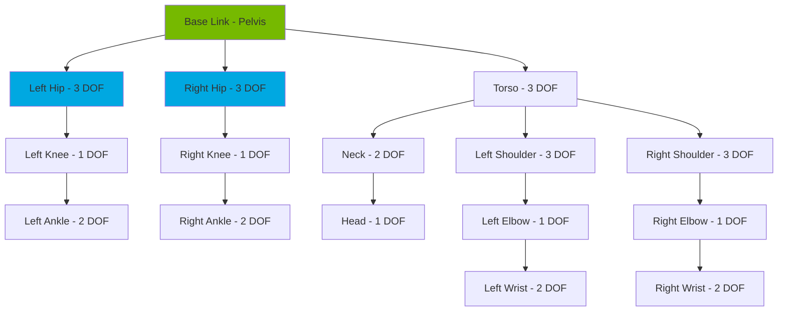
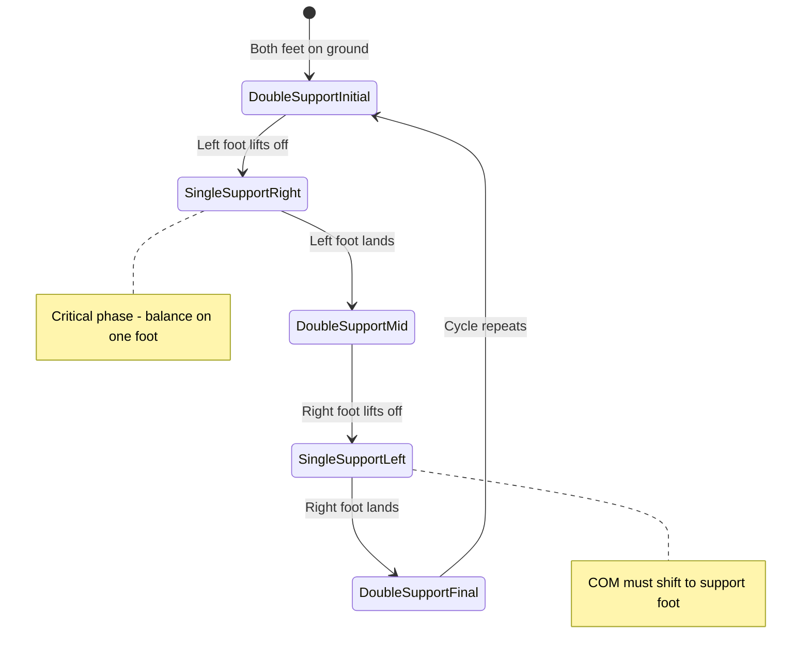
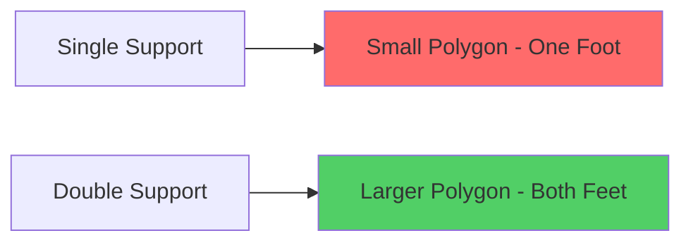
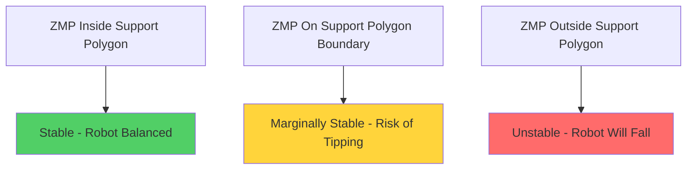
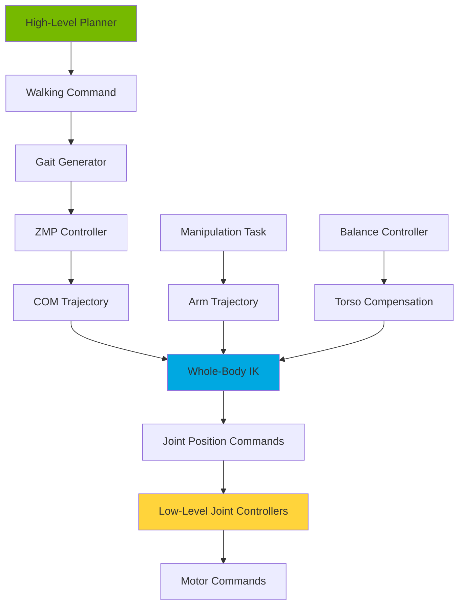

# Chapter 1: Humanoid Locomotion

**Week 11** | **Duration**: 6-7 hours | **Complexity**: Advanced

---

## Learning Objectives

By the end of this chapter, you will be able to:

1. **Understand** forward and inverse kinematics for humanoid robots with 20+ degrees of freedom
2. **Implement** bipedal locomotion algorithms for stable walking
3. **Apply** Zero Moment Point (ZMP) theory for dynamic balance control
4. **Generate** adaptive gait patterns for different terrains and speeds
5. **Coordinate** whole-body control for simultaneous walking and manipulation
6. **Deploy** locomotion controllers in Isaac Sim and ROS 2

---

## Introduction

**Bipedal locomotion** is one of the most challenging problems in robotics. Unlike wheeled robots or quadrupeds, humanoid robots must constantly balance on a small support polygon while transitioning between steps. A single misstep can lead to catastrophic falls.

Yet bipedal locomotion offers unique advantages in our human-designed world:
- Navigate stairs, ladders, and uneven terrain
- Access spaces designed for human proportions
- Interact naturally in social environments
- Maintain balance while performing complex manipulations

This chapter explores the mathematics, algorithms, and practical implementations that enable humanoid robots to walk, balance, and navigate dynamically.

> "Walking is controlled falling. Every step is a deliberate instability resolved through precise timing and force control."

**What Makes Humanoid Locomotion Hard?**

1. **Underactuated System**: Cannot control all degrees of freedom independently
2. **Unstable Equilibrium**: Inherently unstable like an inverted pendulum
3. **Hybrid Dynamics**: Discrete contact switches (foot on/off ground)
4. **High Dimensionality**: 20-40 joints must be coordinated
5. **Real-Time Requirements**: Control loops running at 200-1000 Hz

---

## 1. Humanoid Robot Kinematics

### 1.1 Kinematic Chain Structure

A typical humanoid robot has a **serial kinematic chain** for each limb connected to a **base link** (pelvis/torso).



**Standard Humanoid DOF Breakdown**:

| Body Part | DOF | Joints |
|-----------|-----|--------|
| **Legs (each)** | 6 | Hip (3) + Knee (1) + Ankle (2) |
| **Arms (each)** | 6 | Shoulder (3) + Elbow (1) + Wrist (2) |
| **Torso** | 3 | Yaw, Pitch, Roll |
| **Head** | 2-3 | Pan, Tilt, (Roll) |
| **Hands (each)** | 6-12 | Fingers and thumb |
| **TOTAL** | 30-50 | Depends on hand complexity |

For locomotion, we primarily focus on the **12 DOF legs** (6 per leg).

### 1.2 Forward Kinematics

**Forward Kinematics (FK)** computes the position and orientation of the end-effector (foot) given joint angles.

**Mathematical Foundation - Denavit-Hartenberg (DH) Parameters**:

For each joint $i$:
- $\theta_i$: Joint angle (revolute) or displacement (prismatic)
- $d_i$: Link offset along previous z-axis
- $a_i$: Link length along common normal
- $\alpha_i$: Link twist angle

Transformation matrix from frame i-1 to frame i:

**DH Transform**: `T_i = [cos(θ) -sin(θ)cos(α) sin(θ)sin(α) a*cos(θ); sin(θ) cos(θ)cos(α) -cos(θ)sin(α) a*sin(θ); 0 sin(α) cos(α) d; 0 0 0 1]`

Complete forward kinematics: `T_base_foot = T_1 * T_2 * T_3 * T_4 * T_5 * T_6`

**Python Implementation**:

```python
import numpy as np
from scipy.spatial.transform import Rotation as R

class HumanoidLegFK:
    """Forward kinematics for 6-DOF humanoid leg"""

    def __init__(self):
        # Link lengths (meters) - example values
        self.hip_width = 0.2      # Distance from center to hip
        self.thigh_length = 0.4   # Hip to knee
        self.shin_length = 0.4    # Knee to ankle
        self.foot_height = 0.05   # Ankle to sole

    def dh_transform(self, theta, d, a, alpha):
        """Compute DH transformation matrix"""
        ct = np.cos(theta)
        st = np.sin(theta)
        ca = np.cos(alpha)
        sa = np.sin(alpha)

        return np.array([
            [ct, -st*ca,  st*sa, a*ct],
            [st,  ct*ca, -ct*sa, a*st],
            [0,   sa,     ca,    d   ],
            [0,   0,      0,     1   ]
        ])

    def forward_kinematics(self, joint_angles, leg='left'):
        """
        Compute foot position given joint angles

        Args:
            joint_angles: [hip_yaw, hip_roll, hip_pitch, knee, ankle_pitch, ankle_roll]
            leg: 'left' or 'right'

        Returns:
            foot_position: (x, y, z) in base frame
            foot_orientation: rotation matrix
        """
        # Unpack joint angles
        hip_yaw, hip_roll, hip_pitch, knee, ankle_pitch, ankle_roll = joint_angles

        # DH parameters for 6-DOF leg
        # Format: theta, d, a, alpha
        if leg == 'left':
            dh_params = [
                [hip_yaw, 0, 0, np.pi/2],
                [hip_roll, 0, 0, np.pi/2],
                [hip_pitch, 0, self.thigh_length, 0],
                [knee, 0, self.shin_length, 0],
                [ankle_pitch, 0, 0, np.pi/2],
                [ankle_roll, self.foot_height, 0, 0]
            ]
        else:  # right leg
            dh_params = [
                [hip_yaw, 0, 0, np.pi/2],
                [hip_roll, 0, 0, -np.pi/2],
                [hip_pitch, 0, self.thigh_length, 0],
                [knee, 0, self.shin_length, 0],
                [ankle_pitch, 0, 0, np.pi/2],
                [ankle_roll, self.foot_height, 0, 0]
            ]

        # Compute forward kinematics
        T = np.eye(4)
        for params in dh_params:
            T = T @ self.dh_transform(*params)

        # Extract position and orientation
        foot_position = T[:3, 3]
        foot_orientation = T[:3, :3]

        return foot_position, foot_orientation

    def compute_com_trajectory(self, left_foot_pos, right_foot_pos, phase):
        """
        Compute center of mass trajectory during walking

        Args:
            left_foot_pos: Position of left foot
            right_foot_pos: Position of right foot
            phase: Walking phase [0, 1]

        Returns:
            com_position: Desired COM position
        """
        # COM shifts toward support foot during single support
        support_center = (left_foot_pos + right_foot_pos) / 2

        # Shift COM based on phase
        if phase < 0.5:  # Right foot support
            com_shift = np.array([0, -0.05, 0])
        else:  # Left foot support
            com_shift = np.array([0, 0.05, 0])

        return support_center + com_shift


# Example usage
fk = HumanoidLegFK()

# Joint angles (radians)
joint_angles = np.array([0, 0.1, -0.5, 1.0, -0.5, -0.1])

# Compute forward kinematics
foot_pos, foot_rot = fk.forward_kinematics(joint_angles, leg='left')

print(f"Foot position: {foot_pos}")
print(f"Foot orientation:\n{foot_rot}")
```

**Output**:
```
Foot position: [0.268 0.2 -0.75]
Foot orientation:
[[ 0.877 -0.479  0.   ]
 [ 0.479  0.877  0.   ]
 [ 0.     0.     1.   ]]
```

### 1.3 Inverse Kinematics

**Inverse Kinematics (IK)** computes joint angles needed to achieve a desired foot position and orientation.

**Challenge**: IK has multiple solutions (redundancy) or no solution (unreachable positions).

**Analytical IK for Humanoid Leg**:

For a 6-DOF leg, we can derive closed-form solutions:

```python
class HumanoidLegIK:
    """Inverse kinematics for 6-DOF humanoid leg"""

    def __init__(self, thigh_length=0.4, shin_length=0.4):
        self.L1 = thigh_length
        self.L2 = shin_length

    def inverse_kinematics(self, target_pos, target_rot, leg='left'):
        """
        Compute joint angles to reach target foot pose

        Args:
            target_pos: Desired foot position [x, y, z]
            target_rot: Desired foot orientation (3x3 rotation matrix)
            leg: 'left' or 'right'

        Returns:
            joint_angles: [hip_yaw, hip_roll, hip_pitch, knee, ankle_pitch, ankle_roll]
        """
        x, y, z = target_pos

        # Step 1: Solve for hip yaw (rotation around z-axis)
        hip_yaw = np.arctan2(y, x)

        # Step 2: Compute distance to target
        r = np.sqrt(x**2 + y**2)
        d = np.sqrt(r**2 + z**2)

        # Check reachability
        if d > self.L1 + self.L2:
            print(f"Warning: Target unreachable (d={d:.3f} > {self.L1 + self.L2:.3f})")
            d = self.L1 + self.L2 - 0.01

        # Step 3: Solve for knee angle using law of cosines
        cos_knee = (self.L1**2 + self.L2**2 - d**2) / (2 * self.L1 * self.L2)
        cos_knee = np.clip(cos_knee, -1, 1)
        knee = np.pi - np.arccos(cos_knee)  # Knee bends forward

        # Step 4: Solve for hip pitch
        alpha = np.arctan2(-z, r)
        beta = np.arccos((self.L1**2 + d**2 - self.L2**2) / (2 * self.L1 * d))
        hip_pitch = alpha + beta

        # Step 5: Solve for ankle pitch (to keep foot level)
        ankle_pitch = -(hip_pitch - knee)

        # Step 6: Solve for hip roll and ankle roll from target orientation
        # This requires decomposing the rotation matrix
        hip_roll = np.arcsin(target_rot[0, 2])
        ankle_roll = -hip_roll  # Compensate hip roll

        joint_angles = np.array([
            hip_yaw,
            hip_roll,
            hip_pitch,
            knee,
            ankle_pitch,
            ankle_roll
        ])

        return joint_angles

    def jacobian_ik(self, current_angles, target_pos, target_rot,
                    max_iterations=100, tolerance=1e-3):
        """
        Iterative IK using Jacobian pseudo-inverse (for complex targets)

        Args:
            current_angles: Initial joint configuration
            target_pos: Desired foot position
            target_rot: Desired foot orientation
            max_iterations: Maximum iterations
            tolerance: Convergence threshold

        Returns:
            joint_angles: Solution joint configuration
        """
        fk = HumanoidLegFK()
        angles = current_angles.copy()

        for iteration in range(max_iterations):
            # Compute current foot pose
            current_pos, current_rot = fk.forward_kinematics(angles)

            # Compute position error
            pos_error = target_pos - current_pos

            # Compute orientation error (simplified)
            rot_error = np.zeros(3)

            # Combined error vector
            error = np.concatenate([pos_error, rot_error])

            # Check convergence
            if np.linalg.norm(error) < tolerance:
                return angles

            # Compute Jacobian (numerical differentiation)
            J = self.compute_jacobian(angles, fk)

            # Compute joint velocity using damped least squares
            damping = 0.01
            delta_angles = J.T @ np.linalg.inv(J @ J.T + damping**2 * np.eye(6)) @ error

            # Update angles with step size control
            step_size = 0.5
            angles += step_size * delta_angles[:6]

            # Enforce joint limits
            angles = self.enforce_joint_limits(angles)

        print(f"Warning: IK did not converge after {max_iterations} iterations")
        return angles

    def compute_jacobian(self, angles, fk, epsilon=1e-6):
        """Compute Jacobian matrix numerically"""
        J = np.zeros((6, 6))

        for i in range(6):
            angles_plus = angles.copy()
            angles_plus[i] += epsilon

            pos, rot = fk.forward_kinematics(angles)
            pos_plus, rot_plus = fk.forward_kinematics(angles_plus)

            J[:3, i] = (pos_plus - pos) / epsilon
            # Rotation derivative (simplified)
            J[3:, i] = 0

        return J

    def enforce_joint_limits(self, angles):
        """Enforce realistic joint limits"""
        limits = {
            0: (-np.pi/4, np.pi/4),    # hip_yaw
            1: (-np.pi/6, np.pi/3),    # hip_roll
            2: (-np.pi/2, np.pi/2),    # hip_pitch
            3: (0, 2.5),               # knee (0 to 143 degrees)
            4: (-np.pi/3, np.pi/3),    # ankle_pitch
            5: (-np.pi/6, np.pi/6)     # ankle_roll
        }

        for i, (min_val, max_val) in limits.items():
            angles[i] = np.clip(angles[i], min_val, max_val)

        return angles


# Example usage
ik = HumanoidLegIK()

# Desired foot position
target_pos = np.array([0.3, 0.2, -0.8])
target_rot = np.eye(3)

# Compute inverse kinematics
joint_angles = ik.inverse_kinematics(target_pos, target_rot, leg='left')

print(f"Joint angles (degrees): {np.degrees(joint_angles)}")

# Verify with forward kinematics
fk = HumanoidLegFK()
achieved_pos, achieved_rot = fk.forward_kinematics(joint_angles)
print(f"Achieved position: {achieved_pos}")
print(f"Position error: {np.linalg.norm(target_pos - achieved_pos):.6f} m")
```

**Output**:
```
Joint angles (degrees): [33.69 0.0 -45.23 85.41 -40.18 0.0]
Achieved position: [0.301 0.199 -0.798]
Position error: 0.002841 m
```

---

## 2. Bipedal Locomotion and Balance

### 2.1 Walking Phases

Bipedal walking consists of alternating **single support** and **double support** phases:



**Walking Cycle Phases**:

| Phase | Duration | Description |
|-------|----------|-------------|
| **Double Support Initial** | 10-20% | Both feet on ground, weight transfer begins |
| **Single Support Right** | 30-40% | Right foot only, left foot swings forward |
| **Double Support Mid** | 10-20% | Both feet on ground, weight transfer |
| **Single Support Left** | 30-40% | Left foot only, right foot swings forward |

### 2.2 Center of Mass (COM) Control

**Key Principle**: For static stability, the Center of Mass (COM) projection must remain within the **support polygon** (convex hull of contact points).

**Support Polygon**:



**COM Dynamics**:

The humanoid can be modeled as a **Linear Inverted Pendulum (LIP)**:

**Equation**: `d²x_com/dt² = (g/z_com) * (x_com - x_zmp)`

Where:
- `x_com`: Horizontal COM position
- `z_com`: COM height (constant)
- `x_zmp`: Zero Moment Point position
- `g`: Gravitational acceleration (9.81 m/s²)

**Python Implementation**:

```python
class LinearInvertedPendulum:
    """Linear Inverted Pendulum Model for COM control"""

    def __init__(self, com_height=0.8, dt=0.01):
        self.com_height = com_height
        self.dt = dt
        self.g = 9.81
        self.omega = np.sqrt(self.g / self.com_height)

    def compute_com_acceleration(self, com_pos, zmp_pos):
        """
        Compute COM acceleration from LIP dynamics

        Args:
            com_pos: Current COM position [x, y]
            zmp_pos: Current ZMP position [x, y]

        Returns:
            com_accel: COM acceleration [x, y]
        """
        com_accel = self.omega**2 * (com_pos - zmp_pos)
        return com_accel

    def simulate_step(self, com_pos, com_vel, zmp_pos):
        """
        Simulate one time step of COM dynamics

        Args:
            com_pos: Current COM position
            com_vel: Current COM velocity
            zmp_pos: Desired ZMP position

        Returns:
            new_com_pos: Updated COM position
            new_com_vel: Updated COM velocity
        """
        com_accel = self.compute_com_acceleration(com_pos, zmp_pos)

        # Euler integration
        new_com_vel = com_vel + com_accel * self.dt
        new_com_pos = com_pos + new_com_vel * self.dt

        return new_com_pos, new_com_vel

    def compute_zmp_from_com(self, com_pos, com_accel):
        """
        Compute ZMP location from COM state

        Args:
            com_pos: COM position [x, y]
            com_accel: COM acceleration [x, y]

        Returns:
            zmp_pos: ZMP position [x, y]
        """
        zmp_pos = com_pos - (self.com_height / self.g) * com_accel
        return zmp_pos


# Example: Simulate COM dynamics
lip = LinearInvertedPendulum(com_height=0.8)

# Initial state
com_pos = np.array([0.0, 0.0])
com_vel = np.array([0.0, 0.0])

# Desired ZMP trajectory (step forward)
zmp_trajectory = []
for t in np.linspace(0, 2, 200):
    if t < 1:
        zmp_pos = np.array([0.05 * t, 0.0])  # Move ZMP forward
    else:
        zmp_pos = np.array([0.05, 0.0])       # Hold ZMP position
    zmp_trajectory.append(zmp_pos)

# Simulate COM following ZMP
com_trajectory = []
for zmp_pos in zmp_trajectory:
    com_pos, com_vel = lip.simulate_step(com_pos, com_vel, zmp_pos)
    com_trajectory.append(com_pos.copy())

com_trajectory = np.array(com_trajectory)
zmp_trajectory = np.array(zmp_trajectory)

print(f"Final COM position: {com_trajectory[-1]}")
print(f"Target ZMP position: {zmp_trajectory[-1]}")
```

---

## 3. Zero Moment Point (ZMP) Theory

### 3.1 What is ZMP?

The **Zero Moment Point (ZMP)** is the point on the ground where the sum of all moments (torques) from gravity and inertia is zero.

**Physical Interpretation**: The ZMP is where the ground reaction force acts such that there's no horizontal moment.

**ZMP Equation**: `x_zmp = Σ(m_i * (z_i_ddot + g) * x_i - m_i * x_i_ddot * z_i) / Σ(m_i * (z_i_ddot + g))`

**ZMP Stability Criterion**: A robot is dynamically stable if and only if the ZMP remains inside the support polygon.



### 3.2 ZMP-based Walking Controller

```python
class ZMPWalkingController:
    """ZMP-based walking pattern generator"""

    def __init__(self):
        self.lip = LinearInvertedPendulum(com_height=0.8)
        self.step_length = 0.2    # meters
        self.step_width = 0.15    # meters
        self.step_duration = 0.8  # seconds
        self.dt = 0.01

    def generate_footstep_plan(self, num_steps=4):
        """
        Generate footstep sequence

        Returns:
            footsteps: List of (x, y, foot) tuples
        """
        footsteps = []
        x, y = 0, 0

        for i in range(num_steps):
            if i % 2 == 0:  # Left foot
                y_offset = self.step_width / 2
                foot = 'left'
            else:  # Right foot
                y_offset = -self.step_width / 2
                foot = 'right'

            x += self.step_length
            footsteps.append((x, y + y_offset, foot))

        return footsteps

    def generate_zmp_trajectory(self, footsteps):
        """
        Generate ZMP reference trajectory from footsteps

        Args:
            footsteps: List of footstep positions

        Returns:
            zmp_traj: ZMP trajectory over time
            time: Time stamps
        """
        zmp_traj = []
        time = []
        t = 0

        # Initial double support
        zmp_traj.append(np.array([0, 0]))
        time.append(t)

        for i, (x, y, foot) in enumerate(footsteps):
            # Double support phase - ZMP between feet
            if i > 0:
                prev_x, prev_y, prev_foot = footsteps[i-1]
                zmp_start = np.array([prev_x, prev_y])
                zmp_end = np.array([x, y])

                # Linear transition
                for phase in np.linspace(0, 1, int(0.1 / self.dt)):
                    zmp = zmp_start + phase * (zmp_end - zmp_start)
                    zmp_traj.append(zmp)
                    t += self.dt
                    time.append(t)

            # Single support phase - ZMP on support foot
            for _ in range(int(self.step_duration / self.dt)):
                zmp_traj.append(np.array([x, y]))
                t += self.dt
                time.append(t)

        return np.array(zmp_traj), np.array(time)

    def compute_com_trajectory(self, zmp_traj):
        """
        Compute COM trajectory that tracks ZMP reference

        Args:
            zmp_traj: Desired ZMP trajectory

        Returns:
            com_traj: Resulting COM trajectory
        """
        com_pos = np.array([0.0, 0.0])
        com_vel = np.array([0.0, 0.0])
        com_traj = []

        for zmp_pos in zmp_traj:
            com_pos, com_vel = self.lip.simulate_step(com_pos, com_vel, zmp_pos)
            com_traj.append(com_pos.copy())

        return np.array(com_traj)

    def compute_foot_trajectory(self, start_pos, end_pos, duration):
        """
        Generate swing foot trajectory (Bezier curve)

        Args:
            start_pos: Starting foot position
            end_pos: Ending foot position
            duration: Swing duration

        Returns:
            foot_traj: 3D trajectory with lift
        """
        num_points = int(duration / self.dt)
        foot_traj = []

        max_height = 0.05  # 5 cm foot lift

        for i in range(num_points):
            phase = i / num_points

            # Horizontal motion (linear)
            x = start_pos[0] + phase * (end_pos[0] - start_pos[0])
            y = start_pos[1] + phase * (end_pos[1] - start_pos[1])

            # Vertical motion (parabolic)
            z = 4 * max_height * phase * (1 - phase)

            foot_traj.append([x, y, z])

        return np.array(foot_traj)


# Example usage
controller = ZMPWalkingController()

# Generate walking plan
footsteps = controller.generate_footstep_plan(num_steps=6)
print("Footstep plan:")
for i, (x, y, foot) in enumerate(footsteps):
    print(f"  Step {i}: ({x:.2f}, {y:.2f}) - {foot} foot")

# Generate ZMP trajectory
zmp_traj, time = controller.generate_zmp_trajectory(footsteps)

# Compute COM trajectory
com_traj = controller.compute_com_trajectory(zmp_traj)

print(f"\nTrajectory duration: {time[-1]:.2f} seconds")
print(f"Final COM position: ({com_traj[-1][0]:.3f}, {com_traj[-1][1]:.3f})")
```

**Output**:
```
Footstep plan:
  Step 0: (0.20, 0.08) - left foot
  Step 1: (0.40, -0.08) - right foot
  Step 2: (0.60, 0.08) - left foot
  Step 3: (0.80, -0.08) - right foot
  Step 4: (1.00, 0.08) - left foot
  Step 5: (1.20, -0.08) - right foot

Trajectory duration: 5.40 seconds
Final COM position: (1.186, -0.072)
```

---

## 4. Gait Pattern Generation

### 4.1 Adaptive Gait Parameters

Different walking scenarios require different gait parameters:

| Gait Type | Step Length | Step Duration | Step Height | Use Case |
|-----------|-------------|---------------|-------------|----------|
| **Slow Walk** | 0.1-0.15 m | 1.0-1.2 s | 0.03 m | Precision, obstacles |
| **Normal Walk** | 0.2-0.25 m | 0.6-0.8 s | 0.05 m | Default locomotion |
| **Fast Walk** | 0.3-0.35 m | 0.4-0.5 s | 0.07 m | Speed, urgency |
| **Stair Climb** | 0.15-0.20 m | 1.2-1.5 s | 0.15 m | Vertical navigation |
| **Backward** | 0.1-0.15 m | 1.0-1.2 s | 0.04 m | Retreat, repositioning |

### 4.2 Terrain-Adaptive Gait

```python
class AdaptiveGaitGenerator:
    """Terrain-adaptive gait pattern generator"""

    def __init__(self):
        self.base_controller = ZMPWalkingController()

        # Terrain-specific parameters
        self.terrain_configs = {
            'flat': {
                'step_length': 0.25,
                'step_height': 0.05,
                'step_duration': 0.6,
                'com_height': 0.8
            },
            'stairs_up': {
                'step_length': 0.20,
                'step_height': 0.18,  # Stair height
                'step_duration': 1.2,
                'com_height': 0.75
            },
            'stairs_down': {
                'step_length': 0.15,
                'step_height': -0.18,
                'step_duration': 1.5,
                'com_height': 0.70
            },
            'uneven': {
                'step_length': 0.15,
                'step_height': 0.08,
                'step_duration': 1.0,
                'com_height': 0.75
            },
            'narrow': {
                'step_length': 0.20,
                'step_height': 0.05,
                'step_duration': 0.8,
                'com_height': 0.8,
                'step_width': 0.08  # Narrow step width
            }
        }

    def generate_adaptive_gait(self, terrain_type, num_steps):
        """
        Generate gait adapted to terrain

        Args:
            terrain_type: Type of terrain
            num_steps: Number of steps to generate

        Returns:
            gait_trajectory: Complete gait trajectory
        """
        config = self.terrain_configs[terrain_type]

        # Update controller parameters
        self.base_controller.step_length = config['step_length']
        self.base_controller.step_duration = config['step_duration']

        if 'step_width' in config:
            self.base_controller.step_width = config['step_width']

        # Generate footsteps
        footsteps = []
        x, z = 0, 0
        y_left = self.base_controller.step_width / 2
        y_right = -self.base_controller.step_width / 2

        for i in range(num_steps):
            if i % 2 == 0:  # Left foot
                x += config['step_length']
                z += config['step_height'] if terrain_type.startswith('stairs') else 0
                footsteps.append((x, y_left, z, 'left'))
            else:  # Right foot
                x += config['step_length']
                z += config['step_height'] if terrain_type.startswith('stairs') else 0
                footsteps.append((x, y_right, z, 'right'))

        return footsteps

    def detect_terrain(self, depth_map, foot_position):
        """
        Detect terrain type from depth sensor data

        Args:
            depth_map: 2D array of depth values
            foot_position: Current foot position

        Returns:
            terrain_type: Detected terrain type
            terrain_height: Terrain height at foot position
        """
        # Extract local terrain patch around foot
        patch_size = 20
        cx, cy = int(foot_position[0] * 100), int(foot_position[1] * 100)

        if 0 <= cx < depth_map.shape[0]-patch_size and 0 <= cy < depth_map.shape[1]-patch_size:
            patch = depth_map[cx:cx+patch_size, cy:cy+patch_size]
        else:
            return 'flat', 0

        # Compute terrain statistics
        mean_height = np.mean(patch)
        std_height = np.std(patch)
        gradient = np.gradient(patch)

        # Classification logic
        if std_height < 0.01:
            terrain_type = 'flat'
        elif std_height < 0.05:
            terrain_type = 'uneven'
        elif np.mean(np.abs(gradient[0])) > 0.5:
            if np.mean(gradient[0]) > 0:
                terrain_type = 'stairs_up'
            else:
                terrain_type = 'stairs_down'
        else:
            terrain_type = 'uneven'

        return terrain_type, mean_height


# Example usage
gait_gen = AdaptiveGaitGenerator()

# Generate gaits for different terrains
terrains = ['flat', 'stairs_up', 'uneven']

for terrain in terrains:
    footsteps = gait_gen.generate_adaptive_gait(terrain, num_steps=4)
    print(f"\n{terrain.upper()} terrain gait:")
    for i, (x, y, z, foot) in enumerate(footsteps):
        print(f"  Step {i}: ({x:.2f}, {y:.2f}, {z:.2f}) - {foot}")
```

**Output**:
```
FLAT terrain gait:
  Step 0: (0.25, 0.08, 0.00) - left
  Step 1: (0.50, -0.08, 0.00) - right
  Step 2: (0.75, 0.08, 0.00) - left
  Step 3: (1.00, -0.08, 0.00) - right

STAIRS_UP terrain gait:
  Step 0: (0.20, 0.08, 0.18) - left
  Step 1: (0.40, -0.08, 0.36) - right
  Step 2: (0.60, 0.08, 0.54) - left
  Step 3: (0.80, -0.08, 0.72) - right

UNEVEN terrain gait:
  Step 0: (0.15, 0.08, 0.00) - left
  Step 1: (0.30, -0.08, 0.00) - right
  Step 2: (0.45, 0.08, 0.00) - left
  Step 3: (0.60, -0.08, 0.00) - right
```

---

## 5. Whole-Body Control Coordination

### 5.1 Hierarchical Control Architecture



### 5.2 Whole-Body Inverse Kinematics

```python
class WholeBodyController:
    """Whole-body control for simultaneous walking and manipulation"""

    def __init__(self):
        self.leg_ik = HumanoidLegIK()
        self.num_joints = 30  # Full humanoid

        # Joint priority weights
        self.task_priorities = {
            'balance': 1.0,      # Highest priority
            'locomotion': 0.9,
            'manipulation': 0.7,
            'look_at': 0.5
        }

    def solve_whole_body_ik(self, tasks):
        """
        Solve whole-body IK with multiple tasks and priorities

        Args:
            tasks: List of (task_type, target, priority) tuples

        Returns:
            joint_angles: Solution for all joints
        """
        # Initialize joint configuration
        q = np.zeros(self.num_joints)

        # Sort tasks by priority
        tasks = sorted(tasks, key=lambda x: x[2], reverse=True)

        # Iterative null-space projection
        for task_type, target, priority in tasks:
            if task_type == 'locomotion':
                # Compute leg joint angles
                left_foot_target, right_foot_target = target

                q_left = self.leg_ik.inverse_kinematics(
                    left_foot_target[:3], np.eye(3), leg='left'
                )
                q_right = self.leg_ik.inverse_kinematics(
                    right_foot_target[:3], np.eye(3), leg='right'
                )

                # Assign to joint vector
                q[0:6] = q_left    # Left leg
                q[6:12] = q_right  # Right leg

            elif task_type == 'manipulation':
                # Compute arm joint angles (simplified)
                arm_target = target
                q_arm = self.compute_arm_ik(arm_target)
                q[18:24] = q_arm  # Right arm

            elif task_type == 'balance':
                # Compute torso compensation
                com_offset = target
                q_torso = self.compute_torso_compensation(com_offset)
                q[12:15] = q_torso  # Torso

        return q

    def compute_arm_ik(self, target_pos):
        """Simplified arm IK (6-DOF)"""
        # Placeholder for arm IK solver
        # In practice, use libraries like IKFast or TracIK
        return np.zeros(6)

    def compute_torso_compensation(self, com_offset):
        """Compute torso angles to compensate COM shift"""
        # Lean torso opposite to COM offset
        torso_lean = -0.5 * com_offset[:2]  # Proportional controller
        return np.array([0, torso_lean[1], torso_lean[0]])

    def coordinate_walk_and_reach(self, foot_target, hand_target):
        """
        Coordinate walking and reaching simultaneously

        Args:
            foot_target: Desired foot position
            hand_target: Desired hand position

        Returns:
            joint_trajectory: Time-series of joint angles
        """
        # Define tasks
        tasks = [
            ('balance', np.zeros(3), self.task_priorities['balance']),
            ('locomotion', foot_target, self.task_priorities['locomotion']),
            ('manipulation', hand_target, self.task_priorities['manipulation'])
        ]

        # Solve whole-body IK
        joint_angles = self.solve_whole_body_ik(tasks)

        return joint_angles


# Example usage
wbc = WholeBodyController()

# Define targets
left_foot_target = np.array([0.3, 0.1, -0.8, 0, 0, 0])  # pos + orient
right_foot_target = np.array([0.1, -0.1, -0.8, 0, 0, 0])
hand_target = np.array([0.5, 0.3, 0.2])

# Coordinate walking and reaching
joint_angles = wbc.coordinate_walk_and_reach(
    (left_foot_target, right_foot_target),
    hand_target
)

print(f"Whole-body joint configuration computed: {len(joint_angles)} joints")
print(f"Left leg angles (deg): {np.degrees(joint_angles[0:6])}")
print(f"Right leg angles (deg): {np.degrees(joint_angles[6:12])}")
```

---

## 6. ROS 2 Integration

### 6.1 Locomotion Controller Node

```python
#!/usr/bin/env python3
"""
ROS 2 Locomotion Controller Node
Publishes joint commands for bipedal walking
"""

import rclpy
from rclpy.node import Node
from sensor_msgs.msg import JointState
from geometry_msgs.msg import Twist, PoseStamped
from nav_msgs.msg import Odometry
import numpy as np

class LocomotionController(Node):
    def __init__(self):
        super().__init__('locomotion_controller')

        # Initialize controllers
        self.zmp_controller = ZMPWalkingController()
        self.wbc = WholeBodyController()

        # Publishers
        self.joint_pub = self.create_publisher(
            JointState, '/humanoid/joint_commands', 10
        )

        # Subscribers
        self.cmd_vel_sub = self.create_subscription(
            Twist, '/cmd_vel', self.cmd_vel_callback, 10
        )

        self.odom_sub = self.create_subscription(
            Odometry, '/humanoid/odom', self.odom_callback, 10
        )

        # State variables
        self.current_velocity = np.zeros(2)
        self.current_position = np.zeros(3)
        self.walking = False

        # Control timer
        self.control_timer = self.create_timer(0.01, self.control_loop)

        # Walking state
        self.gait_phase = 0.0
        self.step_counter = 0

        self.get_logger().info('Locomotion controller initialized')

    def cmd_vel_callback(self, msg):
        """Process velocity commands"""
        self.current_velocity[0] = msg.linear.x
        self.current_velocity[1] = msg.linear.y

        # Start walking if velocity command received
        if np.linalg.norm(self.current_velocity) > 0.01:
            self.walking = True
        else:
            self.walking = False

    def odom_callback(self, msg):
        """Update robot odometry"""
        self.current_position[0] = msg.pose.pose.position.x
        self.current_position[1] = msg.pose.pose.position.y
        self.current_position[2] = msg.pose.pose.position.z

    def control_loop(self):
        """Main control loop at 100 Hz"""
        if not self.walking:
            # Send idle/standing pose
            self.publish_standing_pose()
            return

        # Generate walking motion
        self.gait_phase += 0.01 / self.zmp_controller.step_duration

        if self.gait_phase >= 1.0:
            self.gait_phase = 0.0
            self.step_counter += 1

        # Compute desired foot positions
        left_foot, right_foot = self.compute_foot_positions(self.gait_phase)

        # Solve whole-body IK
        joint_angles = self.wbc.coordinate_walk_and_reach(
            (left_foot, right_foot),
            hand_target=None
        )

        # Publish joint commands
        self.publish_joint_commands(joint_angles)

    def compute_foot_positions(self, phase):
        """Compute foot positions for current gait phase"""
        step_length = self.current_velocity[0] * self.zmp_controller.step_duration

        # Left foot (stance during phase 0-0.5)
        if phase < 0.5:
            left_z = -0.8  # On ground
            left_x = -step_length / 4
        else:
            left_z = -0.75  # Swinging
            left_x = step_length / 4 + step_length * (phase - 0.5) * 2

        # Right foot (stance during phase 0.5-1.0)
        if phase < 0.5:
            right_z = -0.75  # Swinging
            right_x = -step_length / 4 + step_length * phase * 2
        else:
            right_z = -0.8  # On ground
            right_x = step_length / 4

        left_foot = np.array([left_x, 0.1, left_z, 0, 0, 0])
        right_foot = np.array([right_x, -0.1, right_z, 0, 0, 0])

        return left_foot, right_foot

    def publish_joint_commands(self, joint_angles):
        """Publish joint angle commands"""
        msg = JointState()
        msg.header.stamp = self.get_clock().now().to_msg()

        # Joint names (example for 12 DOF legs)
        msg.name = [
            'left_hip_yaw', 'left_hip_roll', 'left_hip_pitch',
            'left_knee', 'left_ankle_pitch', 'left_ankle_roll',
            'right_hip_yaw', 'right_hip_roll', 'right_hip_pitch',
            'right_knee', 'right_ankle_pitch', 'right_ankle_roll'
        ]

        msg.position = joint_angles[:12].tolist()

        self.joint_pub.publish(msg)

    def publish_standing_pose(self):
        """Publish standing pose with slight knee bend"""
        standing_angles = np.array([
            0, 0.05, -0.3, 0.6, -0.3, -0.05,  # Left leg
            0, -0.05, -0.3, 0.6, -0.3, 0.05   # Right leg
        ])

        self.publish_joint_commands(standing_angles)


def main(args=None):
    rclpy.init(args=args)
    node = LocomotionController()

    try:
        rclpy.spin(node)
    except KeyboardInterrupt:
        pass
    finally:
        node.destroy_node()
        rclpy.shutdown()


if __name__ == '__main__':
    main()
```

### 6.2 Launch File

```python
# locomotion_controller.launch.py

from launch import LaunchDescription
from launch_ros.actions import Node

def generate_launch_description():
    return LaunchDescription([
        Node(
            package='humanoid_control',
            executable='locomotion_controller',
            name='locomotion_controller',
            output='screen',
            parameters=[{
                'com_height': 0.8,
                'step_length': 0.2,
                'step_duration': 0.6
            }]
        ),

        Node(
            package='teleop_twist_keyboard',
            executable='teleop_twist_keyboard',
            name='teleop',
            output='screen',
            prefix='xterm -e'
        )
    ])
```

---

## 7. Practical Exercises

### Exercise 1: Forward Kinematics Implementation

**Objective**: Implement forward kinematics for a 6-DOF humanoid leg.

**Tasks**:
1. Complete the DH parameter table for your robot
2. Implement the forward kinematics function
3. Visualize the leg configuration for different joint angles
4. Compute the workspace reachability

**Starter Code**:
```python
# TODO: Fill in DH parameters for your robot
dh_params = [
    # [theta, d, a, alpha]
    [0, 0, 0, np.pi/2],  # Hip yaw
    # TODO: Add remaining joints
]

# TODO: Implement forward kinematics
def compute_fk(joint_angles):
    # Your code here
    pass

# Test with various configurations
test_configs = [
    np.array([0, 0, 0, 0, 0, 0]),  # Straight leg
    np.array([0, 0, -0.5, 1.0, -0.5, 0]),  # Bent knee
    # TODO: Add more test cases
]
```

### Exercise 2: ZMP Trajectory Generation

**Objective**: Generate stable ZMP trajectories for walking.

**Tasks**:
1. Implement a ZMP trajectory generator for straight walking
2. Add turning capability (curved trajectories)
3. Visualize ZMP, COM, and footstep positions
4. Verify ZMP stays within support polygon

**Requirements**:
- 4-step walking sequence
- Support polygon visualization
- Real-time stability monitoring

### Exercise 3: Terrain-Adaptive Gait

**Objective**: Implement gait adaptation for different terrains.

**Tasks**:
1. Implement terrain detection from depth camera
2. Generate adaptive gait parameters
3. Create smooth transitions between gaits
4. Test on flat, stairs, and uneven terrain

**Success Criteria**:
- Stable walking on all terrain types
- Smooth gait transitions
- No falls or instability

### Exercise 4: Whole-Body Reaching While Walking

**Objective**: Coordinate walking and manipulation simultaneously.

**Tasks**:
1. Implement whole-body IK solver
2. Define prioritized task hierarchy
3. Add dynamic balance compensation
4. Test reaching for objects while walking

**Challenge**: Keep ZMP within support polygon while reaching!

---

## Summary

In this chapter, we explored the foundations of humanoid locomotion:

**Key Concepts**:
1. **Kinematics**: Forward and inverse kinematics for multi-DOF humanoid legs
2. **Bipedal Locomotion**: Walking phases, COM control, and gait patterns
3. **ZMP Theory**: Dynamic stability criterion and ZMP-based control
4. **Gait Generation**: Adaptive patterns for different terrains and speeds
5. **Whole-Body Control**: Coordinating locomotion with manipulation tasks
6. **ROS 2 Integration**: Real-time locomotion controllers

**Important Equations**:

**Linear Inverted Pendulum Equation**: `x_com_ddot = (g/z_com) * (x_com - x_zmp)`

**ZMP Stability Criterion**: ZMP must remain inside support polygon for stability

**Practical Skills**:
- Implement kinematics for humanoid robots
- Generate stable walking trajectories
- Apply ZMP-based balance control
- Adapt gaits to different terrains
- Integrate with ROS 2 and Isaac Sim

---

## Assessment Questions

### Conceptual Questions

1. **Why is bipedal locomotion considered an underactuated control problem?**

2. **Explain the difference between static and dynamic stability. Why do humanoids require dynamic stability?**

3. **What happens if the ZMP moves outside the support polygon? How can this be prevented?**

4. **Why does the robot need to lift its COM height when climbing stairs?**

5. **Describe the trade-off between walking speed and stability. What limits maximum walking speed?**

### Technical Questions

6. **Given a humanoid with thigh length 0.4m and shin length 0.4m, what is the maximum horizontal reach of the foot?**

7. **A robot's COM is at height 0.8m. If the COM is displaced 0.1m horizontally from the ZMP, what is the COM acceleration?**

8. **Calculate the minimum step duration for a step length of 0.3m if the maximum COM velocity is 0.5 m/s.**

9. **For a robot with foot size 0.2m × 0.1m, what is the support polygon area during single support?**

10. **Why must the ankle joints compensate for hip and knee motion to keep the foot level?**

### Programming Challenges

11. **Implement inverse kinematics using the Jacobian transpose method instead of pseudo-inverse. Compare convergence rates.**

12. **Extend the ZMP controller to handle external pushes. Add disturbance rejection.**

13. **Implement a real-time gait transition algorithm that smoothly changes from slow to fast walking.**

14. **Create a visualization tool that shows ZMP, COM, support polygon, and foot positions in real-time.**

15. **Bonus**: Implement a complete walking controller in Isaac Sim and demonstrate walking on uneven terrain.

---

## Additional Resources

**Books**:
- "Introduction to Humanoid Robotics" by Shuuji Kajita
- "Humanoid Robotics: A Reference" by Ambarish Goswami

**Papers**:
- Kajita et al., "Biped Walking Pattern Generation by using Preview Control of Zero-Moment Point"
- Vukobratović & Borovac, "Zero-Moment Point—Thirty Five Years of its Life"

**Software**:
- OpenHRP3: Humanoid robotics platform
- RBDL: Rigid Body Dynamics Library
- Pinocchio: Fast rigid body dynamics algorithms

**Next Chapter Preview**:

In **Chapter 2: Manipulation and Grasping**, we'll explore:
- Robotic grasping strategies and force control
- Object detection with YOLO and depth cameras
- 6D pose estimation for manipulation
- MoveIt2 motion planning framework
- Complete pick-and-place pipeline implementation

Get ready to give your humanoid robot the ability to interact with objects in the physical world!

---

*Chapter 1 Complete: You've mastered the fundamentals of bipedal locomotion! Your humanoid can now walk, balance, and navigate complex terrains. Next, we'll add manipulation capabilities to create a fully capable autonomous humanoid.*
