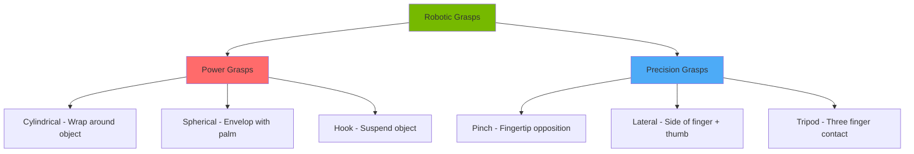
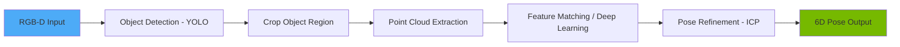

# Chapter 2: Manipulation and Grasping

**Week 12** | **Duration**: 6-7 hours | **Complexity**: Advanced

---

## Learning Objectives

By the end of this chapter, you will be able to:

1. **Understand** robotic grasping fundamentals including power and precision grasp strategies
2. **Implement** force control algorithms for safe and stable manipulation
3. **Deploy** YOLO object detection integrated with depth cameras for 3D object localization
4. **Compute** 6D pose estimation (position + orientation) for precise grasping
5. **Configure** MoveIt2 for humanoid arm motion planning and collision avoidance
6. **Build** a complete pick-and-place pipeline from vision to execution

---

## Introduction

**Manipulation** is what transforms a humanoid robot from a mobile platform into a capable assistant. The ability to grasp, move, and place objects enables robots to perform useful tasks in human environments: serving drinks, cleaning tables, organizing shelves, and assisting with daily activities.

However, manipulation presents unique challenges:
- **High-dimensional control**: 7+ DOF arms with complex workspaces
- **Contact dynamics**: Managing forces during grasping and sliding
- **Uncertainty**: Estimating object pose, friction, weight from noisy sensors
- **Safety**: Avoiding collisions and applying appropriate forces

This chapter builds a complete manipulation system that integrates:
1. **Vision**: Detecting and localizing objects in 3D space
2. **Planning**: Computing collision-free trajectories
3. **Control**: Executing precise, force-controlled motions
4. **Grasping**: Stably holding objects of varying shapes

> "The hand is the visible part of the brain." - Immanuel Kant

---

## 1. Robot Grasping Fundamentals

### 1.1 Grasp Taxonomy

Robotic grasps are categorized by how they constrain the object:



**Power Grasps vs Precision Grasps**:

| Aspect | Power Grasp | Precision Grasp |
|--------|-------------|-----------------|
| **Contact Area** | Large (palm + fingers) | Small (fingertips only) |
| **Force** | High (carrying heavy objects) | Low (delicate manipulation) |
| **Dexterity** | Low (limited reorientation) | High (fine adjustments) |
| **Stability** | Very stable | Less stable |
| **Examples** | Hammer, bottle, box | Pen, needle, small screw |

### 1.2 Grasp Quality Metrics

**Force Closure**: A grasp achieves force closure if it can resist arbitrary external forces and torques.

**Mathematical Definition**:

For `n` contact points with contact forces `f_i` and positions `p_i`:
- `w = Σ [f_i; p_i × f_i]` (6D wrench from each contact)

Force closure requires this wrench space to span R^6 (6-dimensional wrench space).

**Grasp Wrench Space (GWS)**: The set of all wrenches that can be applied to the object.

**Ferrari-Canny Metric**: Measures the largest force/torque that can be resisted in any direction.

**Equation**: `Q = min(||w||=1) max(α_i) || Σ(α_i * w_i) - w ||`

Where `w_i` are primitive wrenches from contact `i`.

### 1.3 Grasp Planning Algorithm

```python
import numpy as np
from scipy.spatial.transform import Rotation as R

class GraspPlanner:
    """Grasp planning for parallel-jaw gripper"""

    def __init__(self, gripper_width=0.08, finger_depth=0.05):
        self.gripper_width = gripper_width  # Maximum opening
        self.finger_depth = finger_depth    # Finger length

    def compute_grasp_candidates(self, point_cloud, normals):
        """
        Generate grasp candidates from point cloud

        Args:
            point_cloud: Nx3 array of 3D points
            normals: Nx3 array of surface normals

        Returns:
            grasps: List of (position, orientation, width, score) tuples
        """
        grasps = []

        # Sample grasp centers
        num_samples = min(100, len(point_cloud))
        indices = np.random.choice(len(point_cloud), num_samples, replace=False)

        for idx in indices:
            center = point_cloud[idx]
            normal = normals[idx]

            # Compute grasp orientation
            # Approach direction = surface normal
            approach = normal / np.linalg.norm(normal)

            # Closing direction perpendicular to approach
            if abs(approach[2]) < 0.9:
                closing = np.cross(approach, [0, 0, 1])
            else:
                closing = np.cross(approach, [1, 0, 0])
            closing = closing / np.linalg.norm(closing)

            # Baseline direction
            baseline = np.cross(approach, closing)

            # Construct rotation matrix
            R_grasp = np.column_stack([closing, baseline, approach])

            # Compute grasp width
            width = self.compute_grasp_width(point_cloud, center, closing)

            # Check feasibility
            if width > self.gripper_width or width < 0.01:
                continue

            # Score grasp
            score = self.score_grasp(point_cloud, center, R_grasp, width)

            grasps.append({
                'position': center,
                'orientation': R_grasp,
                'width': width,
                'score': score
            })

        # Sort by score
        grasps = sorted(grasps, key=lambda g: g['score'], reverse=True)

        return grasps

    def compute_grasp_width(self, point_cloud, center, closing_direction):
        """
        Compute required gripper width

        Args:
            point_cloud: Nx3 points
            center: Grasp center point
            closing_direction: Direction of gripper closing

        Returns:
            width: Required gripper opening
        """
        # Project points onto closing direction
        relative_pos = point_cloud - center
        projections = relative_pos @ closing_direction

        # Find points within grasp region
        along_approach = relative_pos @ np.array([0, 0, 1])
        in_region = np.abs(along_approach) < self.finger_depth

        if np.sum(in_region) == 0:
            return self.gripper_width  # No points, return max

        region_projections = projections[in_region]

        # Width is distance from min to max projection
        width = np.max(region_projections) - np.min(region_projections)

        return width

    def score_grasp(self, point_cloud, center, orientation, width):
        """
        Score grasp quality

        Args:
            point_cloud: Object points
            center: Grasp position
            orientation: Grasp orientation matrix
            width: Grasp width

        Returns:
            score: Grasp quality score [0, 1]
        """
        score = 0.0

        # Factor 1: Antipodal alignment (0.4 weight)
        approach = orientation[:, 2]
        normal_alignment = self.check_antipodal(point_cloud, center, approach)
        score += 0.4 * normal_alignment

        # Factor 2: Force closure approximation (0.3 weight)
        force_closure = self.approximate_force_closure(point_cloud, center, width)
        score += 0.3 * force_closure

        # Factor 3: Grasp stability - prefer wider grasps (0.2 weight)
        stability = min(width / self.gripper_width, 1.0)
        score += 0.2 * stability

        # Factor 4: Object symmetry (0.1 weight)
        symmetry = self.check_symmetry(point_cloud, center, orientation)
        score += 0.1 * symmetry

        return score

    def check_antipodal(self, point_cloud, center, approach):
        """Check if grasp is antipodal (normals oppose each other)"""
        # Find nearest points on both sides
        relative = point_cloud - center
        projections = relative @ approach

        pos_side = point_cloud[projections > 0]
        neg_side = point_cloud[projections < 0]

        if len(pos_side) == 0 or len(neg_side) == 0:
            return 0.0

        # Check if points exist on both sides
        return 1.0 if len(pos_side) > 5 and len(neg_side) > 5 else 0.5

    def approximate_force_closure(self, point_cloud, center, width):
        """Approximate force closure check"""
        # Simplified: check contact on both sides
        relative = point_cloud - center
        distances = np.linalg.norm(relative, axis=1)

        # Points within gripper width have potential contact
        in_contact = distances < width / 2

        return min(np.sum(in_contact) / 10.0, 1.0)

    def check_symmetry(self, point_cloud, center, orientation):
        """Check grasp symmetry"""
        # Project to grasp frame
        relative = point_cloud - center
        local_coords = relative @ orientation

        # Check balance in closing direction
        balance = 1.0 - min(abs(np.mean(local_coords[:, 0])) / 0.1, 1.0)

        return balance

    def visualize_grasp(self, position, orientation, width):
        """Generate gripper mesh for visualization"""
        # Gripper geometry
        finger_length = self.finger_depth
        finger_width = 0.01

        # Left finger
        left_finger = np.array([
            [-width/2, -finger_width/2, 0],
            [-width/2, finger_width/2, 0],
            [-width/2, finger_width/2, finger_length],
            [-width/2, -finger_width/2, finger_length]
        ])

        # Right finger
        right_finger = np.array([
            [width/2, -finger_width/2, 0],
            [width/2, finger_width/2, 0],
            [width/2, finger_width/2, finger_length],
            [width/2, -finger_width/2, finger_length]
        ])

        # Transform to world frame
        left_finger = (orientation @ left_finger.T).T + position
        right_finger = (orientation @ right_finger.T).T + position

        return left_finger, right_finger


# Example usage
planner = GraspPlanner()

# Generate sample point cloud (cube)
points = []
for x in np.linspace(-0.05, 0.05, 10):
    for y in np.linspace(-0.05, 0.05, 10):
        points.append([x, y, 0])
        points.append([x, y, 0.1])

point_cloud = np.array(points)

# Compute normals (simplified)
normals = np.tile([0, 0, 1], (len(point_cloud), 1))

# Generate grasps
grasps = planner.compute_grasp_candidates(point_cloud, normals)

print(f"Generated {len(grasps)} grasp candidates")
if len(grasps) > 0:
    best_grasp = grasps[0]
    print(f"Best grasp score: {best_grasp['score']:.3f}")
    print(f"Position: {best_grasp['position']}")
    print(f"Width: {best_grasp['width']:.3f} m")
```

---

## 2. Force Control for Manipulation

### 2.1 Impedance Control

**Impedance control** allows the robot to behave like a spring-damper system, providing compliant interaction.

**Impedance Equation**: `F = K * (x_d - x) + B * (x_d_dot - x_dot) + M * (x_d_ddot - x_ddot)`

Where:
- `F`: Applied force
- `K`: Stiffness matrix (spring)
- `B`: Damping matrix
- `M`: Inertia matrix (usually small)
- `x_d, x`: Desired and actual position

```python
class ImpedanceController:
    """Impedance controller for compliant manipulation"""

    def __init__(self, dt=0.01):
        self.dt = dt

        # Impedance parameters
        self.K = np.diag([500, 500, 500, 10, 10, 10])  # Stiffness (N/m, Nm/rad)
        self.B = np.diag([50, 50, 50, 1, 1, 1])        # Damping (Ns/m, Nms/rad)
        self.M = np.diag([1, 1, 1, 0.1, 0.1, 0.1])     # Inertia (kg, kg*m^2)

        # State variables
        self.current_pose = np.zeros(6)  # [x, y, z, rx, ry, rz]
        self.current_velocity = np.zeros(6)
        self.current_acceleration = np.zeros(6)

    def compute_force(self, desired_pose, desired_velocity=None, desired_accel=None):
        """
        Compute required force/torque

        Args:
            desired_pose: Target pose [x, y, z, rx, ry, rz]
            desired_velocity: Target velocity (optional)
            desired_accel: Target acceleration (optional)

        Returns:
            force_torque: Required wrench [Fx, Fy, Fz, Tx, Ty, Tz]
        """
        if desired_velocity is None:
            desired_velocity = np.zeros(6)
        if desired_accel is None:
            desired_accel = np.zeros(6)

        # Position error
        pos_error = desired_pose - self.current_pose

        # Velocity error
        vel_error = desired_velocity - self.current_velocity

        # Acceleration error
        accel_error = desired_accel - self.current_acceleration

        # Compute impedance force
        force_torque = (
            self.K @ pos_error +
            self.B @ vel_error +
            self.M @ accel_error
        )

        return force_torque

    def update_state(self, measured_pose, measured_velocity):
        """Update controller state from measurements"""
        # Compute acceleration from velocity
        accel = (measured_velocity - self.current_velocity) / self.dt

        self.current_pose = measured_pose
        self.current_velocity = measured_velocity
        self.current_acceleration = accel

    def set_stiffness(self, stiffness):
        """Adjust stiffness (compliance)"""
        if isinstance(stiffness, (int, float)):
            self.K = np.diag([stiffness] * 6)
        else:
            self.K = np.diag(stiffness)

    def set_damping(self, damping):
        """Adjust damping"""
        if isinstance(damping, (int, float)):
            self.B = np.diag([damping] * 6)
        else:
            self.B = np.diag(damping)


class HybridForcePositionController:
    """
    Hybrid force/position control
    Control force in some directions, position in others
    """

    def __init__(self):
        self.position_controller = ImpedanceController()

        # Selection matrix: 1 = position control, 0 = force control
        self.selection_matrix = np.eye(6)

        # Desired force in force-controlled directions
        self.desired_force = np.zeros(6)

    def compute_control(self, desired_pose, measured_pose, measured_force):
        """
        Compute hybrid control command

        Args:
            desired_pose: Target pose
            measured_pose: Current pose
            measured_force: Measured force/torque

        Returns:
            control_wrench: Control force/torque
        """
        # Update impedance controller
        self.position_controller.update_state(measured_pose, np.zeros(6))

        # Position control in selected directions
        pos_wrench = self.position_controller.compute_force(desired_pose)
        pos_control = self.selection_matrix @ pos_wrench

        # Force control in remaining directions
        force_error = self.desired_force - measured_force
        force_control = (np.eye(6) - self.selection_matrix) @ force_error

        # Combine
        control_wrench = pos_control + force_control

        return control_wrench

    def set_force_control_directions(self, directions):
        """
        Set which directions use force control

        Args:
            directions: List of indices (0-5) for force control
        """
        self.selection_matrix = np.eye(6)
        for idx in directions:
            self.selection_matrix[idx, idx] = 0


# Example: Insertion task (control force in z, position in x,y)
controller = HybridForcePositionController()

# Control force only in z-direction (downward insertion)
controller.set_force_control_directions([2])  # Z-axis
controller.desired_force[2] = -10.0  # Apply 10N downward

# Desired pose
desired_pose = np.array([0.5, 0.2, 0.3, 0, 0, 0])
current_pose = np.array([0.48, 0.19, 0.32, 0, 0, 0])
measured_force = np.array([0, 0, -8.0, 0, 0, 0])

# Compute control
control = controller.compute_control(desired_pose, current_pose, measured_force)

print(f"Control wrench: {control}")
print(f"X-Y position control: {control[0]:.1f}, {control[1]:.1f} N")
print(f"Z force control: {control[2]:.1f} N")
```

---

## 3. Object Detection with YOLO and Depth Cameras

### 3.1 YOLO Integration for Object Detection

```python
import cv2
import numpy as np
from ultralytics import YOLO

class ObjectDetector:
    """Object detection using YOLOv8"""

    def __init__(self, model_path='yolov8n.pt', confidence_threshold=0.5):
        self.model = YOLO(model_path)
        self.confidence_threshold = confidence_threshold

        # Object classes of interest for manipulation
        self.target_classes = [
            'bottle', 'cup', 'bowl', 'apple', 'banana',
            'book', 'cell phone', 'keyboard', 'mouse'
        ]

    def detect_objects(self, rgb_image):
        """
        Detect objects in RGB image

        Args:
            rgb_image: RGB image (H x W x 3)

        Returns:
            detections: List of detection dictionaries
        """
        # Run inference
        results = self.model(rgb_image, verbose=False)[0]

        detections = []
        for box in results.boxes:
            confidence = float(box.conf[0])

            if confidence < self.confidence_threshold:
                continue

            # Get bounding box
            x1, y1, x2, y2 = box.xyxy[0].cpu().numpy()

            # Get class
            class_id = int(box.cls[0])
            class_name = results.names[class_id]

            # Filter to target classes
            if class_name not in self.target_classes:
                continue

            detections.append({
                'class': class_name,
                'confidence': confidence,
                'bbox': [int(x1), int(y1), int(x2), int(y2)],
                'center': [(x1 + x2) / 2, (y1 + y2) / 2]
            })

        return detections

    def draw_detections(self, image, detections):
        """Draw bounding boxes on image"""
        output = image.copy()

        for det in detections:
            x1, y1, x2, y2 = det['bbox']

            # Draw box
            cv2.rectangle(output, (x1, y1), (x2, y2), (0, 255, 0), 2)

            # Draw label
            label = f"{det['class']}: {det['confidence']:.2f}"
            cv2.putText(output, label, (x1, y1 - 10),
                       cv2.FONT_HERSHEY_SIMPLEX, 0.5, (0, 255, 0), 2)

        return output


class DepthIntegration:
    """Integrate depth data with 2D detections"""

    def __init__(self, camera_intrinsics):
        """
        Args:
            camera_intrinsics: Dict with 'fx', 'fy', 'cx', 'cy'
        """
        self.fx = camera_intrinsics['fx']
        self.fy = camera_intrinsics['fy']
        self.cx = camera_intrinsics['cx']
        self.cy = camera_intrinsics['cy']

    def pixel_to_3d(self, u, v, depth):
        """
        Convert pixel coordinates to 3D point

        Args:
            u, v: Pixel coordinates
            depth: Depth value (meters)

        Returns:
            point_3d: [x, y, z] in camera frame
        """
        x = (u - self.cx) * depth / self.fx
        y = (v - self.cy) * depth / self.fy
        z = depth

        return np.array([x, y, z])

    def get_object_3d_position(self, detection, depth_image):
        """
        Compute 3D position of detected object

        Args:
            detection: Detection dictionary with bbox
            depth_image: Depth image (H x W)

        Returns:
            position_3d: Object position in camera frame
            point_cloud: Point cloud of object
        """
        x1, y1, x2, y2 = detection['bbox']

        # Extract depth region
        depth_roi = depth_image[y1:y2, x1:x2]

        # Filter invalid depths
        valid_mask = (depth_roi > 0.1) & (depth_roi < 5.0)

        if np.sum(valid_mask) < 10:
            return None, None

        # Compute median depth (robust to outliers)
        median_depth = np.median(depth_roi[valid_mask])

        # Compute 3D position at object center
        cx_pixel, cy_pixel = detection['center']
        position_3d = self.pixel_to_3d(cx_pixel, cy_pixel, median_depth)

        # Generate point cloud for object
        point_cloud = []
        for v in range(y1, y2, 2):  # Subsample for efficiency
            for u in range(x1, x2, 2):
                depth = depth_image[v, u]
                if 0.1 < depth < 5.0:
                    point_3d = self.pixel_to_3d(u, v, depth)
                    point_cloud.append(point_3d)

        point_cloud = np.array(point_cloud)

        return position_3d, point_cloud


# Example usage
detector = ObjectDetector()

# Camera intrinsics (example values for Intel RealSense D435)
camera_intrinsics = {
    'fx': 615.0,
    'fy': 615.0,
    'cx': 320.0,
    'cy': 240.0
}

depth_integration = DepthIntegration(camera_intrinsics)

# Load test image (replace with actual camera)
# rgb_image = cv2.imread('scene.jpg')
# depth_image = np.load('depth.npy')

# Detect objects
# detections = detector.detect_objects(rgb_image)

# Get 3D positions
# for det in detections:
#     pos_3d, point_cloud = depth_integration.get_object_3d_position(det, depth_image)
#     print(f"{det['class']} at position: {pos_3d}")
```

### 3.2 ROS 2 Integration

```python
#!/usr/bin/env python3
"""
ROS 2 Object Detection Node
"""

import rclpy
from rclpy.node import Node
from sensor_msgs.msg import Image, CameraInfo
from vision_msgs.msg import Detection2DArray, Detection2D, ObjectHypothesisWithPose
from geometry_msgs.msg import PoseStamped, Point
from cv_bridge import CvBridge
import numpy as np

class ObjectDetectionNode(Node):
    def __init__(self):
        super().__init__('object_detection_node')

        # Initialize detector
        self.detector = ObjectDetector()
        self.bridge = CvBridge()
        self.depth_integration = None

        # Subscribers
        self.rgb_sub = self.create_subscription(
            Image, '/camera/color/image_raw', self.rgb_callback, 10
        )

        self.depth_sub = self.create_subscription(
            Image, '/camera/depth/image_rect_raw', self.depth_callback, 10
        )

        self.info_sub = self.create_subscription(
            CameraInfo, '/camera/color/camera_info', self.info_callback, 10
        )

        # Publishers
        self.detection_pub = self.create_publisher(
            Detection2DArray, '/detected_objects', 10
        )

        self.pose_pub = self.create_publisher(
            PoseStamped, '/object_pose', 10
        )

        # State
        self.latest_depth = None
        self.camera_info_received = False

        self.get_logger().info('Object detection node initialized')

    def info_callback(self, msg):
        """Initialize depth integration from camera info"""
        if not self.camera_info_received:
            intrinsics = {
                'fx': msg.k[0],
                'fy': msg.k[4],
                'cx': msg.k[2],
                'cy': msg.k[5]
            }
            self.depth_integration = DepthIntegration(intrinsics)
            self.camera_info_received = True
            self.get_logger().info('Camera intrinsics received')

    def depth_callback(self, msg):
        """Store latest depth image"""
        self.latest_depth = self.bridge.imgmsg_to_cv2(msg, desired_encoding='32FC1')

    def rgb_callback(self, msg):
        """Process RGB image and detect objects"""
        # Convert to OpenCV
        rgb_image = self.bridge.imgmsg_to_cv2(msg, desired_encoding='bgr8')

        # Detect objects
        detections = self.detector.detect_objects(rgb_image)

        if len(detections) == 0:
            return

        # Publish 2D detections
        self.publish_detections(detections, msg.header)

        # Compute 3D positions if depth available
        if self.latest_depth is not None and self.depth_integration is not None:
            for det in detections:
                pos_3d, _ = self.depth_integration.get_object_3d_position(
                    det, self.latest_depth
                )

                if pos_3d is not None:
                    self.publish_object_pose(det['class'], pos_3d, msg.header)

    def publish_detections(self, detections, header):
        """Publish 2D detection array"""
        msg = Detection2DArray()
        msg.header = header

        for det in detections:
            detection = Detection2D()
            detection.header = header

            # Object hypothesis
            hyp = ObjectHypothesisWithPose()
            hyp.hypothesis.class_id = det['class']
            hyp.hypothesis.score = det['confidence']

            detection.results.append(hyp)

            # Bounding box
            x1, y1, x2, y2 = det['bbox']
            detection.bbox.center.position.x = (x1 + x2) / 2
            detection.bbox.center.position.y = (y1 + y2) / 2
            detection.bbox.size_x = float(x2 - x1)
            detection.bbox.size_y = float(y2 - y1)

            msg.detections.append(detection)

        self.detection_pub.publish(msg)

    def publish_object_pose(self, class_name, position_3d, header):
        """Publish 3D object pose"""
        msg = PoseStamped()
        msg.header = header
        msg.header.frame_id = 'camera_color_optical_frame'

        msg.pose.position.x = float(position_3d[0])
        msg.pose.position.y = float(position_3d[1])
        msg.pose.position.z = float(position_3d[2])

        # Identity orientation (will be refined with pose estimation)
        msg.pose.orientation.w = 1.0

        self.pose_pub.publish(msg)
        self.get_logger().info(f'{class_name} at ({position_3d[0]:.2f}, {position_3d[1]:.2f}, {position_3d[2]:.2f})')


def main(args=None):
    rclpy.init(args=args)
    node = ObjectDetectionNode()

    try:
        rclpy.spin(node)
    except KeyboardInterrupt:
        pass
    finally:
        node.destroy_node()
        rclpy.shutdown()


if __name__ == '__main__':
    main()
```

---

## 4. 6D Pose Estimation

### 4.1 Pose Estimation Pipeline

6D pose estimation computes the full pose (3D position + 3D orientation) of objects.



**Methods**:
1. **Template Matching**: Match against known 3D models
2. **Feature-based**: Extract and match 3D keypoints
3. **Deep Learning**: CNN regression (PoseCNN, DenseFusion)
4. **ICP Refinement**: Iterative Closest Point for fine alignment

```python
import open3d as o3d

class PoseEstimator:
    """6D pose estimation using ICP and feature matching"""

    def __init__(self):
        self.object_models = {}  # CAD models of known objects

    def load_object_model(self, class_name, mesh_path):
        """Load CAD model for object"""
        mesh = o3d.io.read_triangle_mesh(mesh_path)
        mesh.compute_vertex_normals()

        # Convert to point cloud
        pcd = mesh.sample_points_uniformly(number_of_points=1000)

        self.object_models[class_name] = pcd

    def estimate_pose_icp(self, object_points, class_name, initial_pose=None):
        """
        Estimate 6D pose using ICP

        Args:
            object_points: Observed point cloud (Nx3)
            class_name: Object class
            initial_pose: Initial transformation guess

        Returns:
            pose: 4x4 transformation matrix
            fitness: Alignment quality metric
        """
        if class_name not in self.object_models:
            return None, 0.0

        # Convert to Open3D point cloud
        source = o3d.geometry.PointCloud()
        source.points = o3d.utility.Vector3dVector(object_points)

        target = self.object_models[class_name]

        # Initial alignment
        if initial_pose is None:
            initial_pose = np.eye(4)

        # ICP registration
        threshold = 0.02  # 2cm
        reg_result = o3d.pipelines.registration.registration_icp(
            source, target, threshold, initial_pose,
            o3d.pipelines.registration.TransformationEstimationPointToPoint(),
            o3d.pipelines.registration.ICPConvergenceCriteria(max_iteration=100)
        )

        return reg_result.transformation, reg_result.fitness

    def estimate_pose_pca(self, object_points):
        """
        Estimate orientation using PCA (for symmetric objects)

        Args:
            object_points: Nx3 point cloud

        Returns:
            rotation: 3x3 rotation matrix
            center: 3D center position
        """
        # Center the points
        center = np.mean(object_points, axis=0)
        centered_points = object_points - center

        # PCA
        cov_matrix = np.cov(centered_points.T)
        eigenvalues, eigenvectors = np.linalg.eig(cov_matrix)

        # Sort by eigenvalue (principal components)
        idx = eigenvalues.argsort()[::-1]
        eigenvectors = eigenvectors[:, idx]

        # Ensure right-handed coordinate system
        if np.linalg.det(eigenvectors) < 0:
            eigenvectors[:, 2] *= -1

        rotation = eigenvectors

        return rotation, center

    def refine_pose_with_depth(self, initial_pose, object_points, target_model):
        """
        Refine pose using depth consistency

        Args:
            initial_pose: Initial 4x4 transformation
            object_points: Observed points
            target_model: Target point cloud

        Returns:
            refined_pose: Optimized transformation
        """
        # Convert to Open3D
        source = o3d.geometry.PointCloud()
        source.points = o3d.utility.Vector3dVector(object_points)

        # Colored ICP for better convergence
        threshold = 0.01

        reg_result = o3d.pipelines.registration.registration_colored_icp(
            source, target_model, threshold, initial_pose,
            o3d.pipelines.registration.TransformationEstimationForColoredICP(),
            o3d.pipelines.registration.ICPConvergenceCriteria(
                relative_fitness=1e-6,
                relative_rmse=1e-6,
                max_iteration=50
            )
        )

        return reg_result.transformation


# Example usage
pose_estimator = PoseEstimator()

# Load object model
# pose_estimator.load_object_model('bottle', 'models/bottle.ply')

# Estimate pose from observed points
# object_points = np.random.rand(500, 3)  # Replace with actual points
# pose, fitness = pose_estimator.estimate_pose_icp(object_points, 'bottle')

# print(f"Estimated pose:\n{pose}")
# print(f"Fitness: {fitness:.3f}")
```

---

## 5. MoveIt2 for Motion Planning

### 5.1 MoveIt2 Configuration

```python
#!/usr/bin/env python3
"""
MoveIt2 Motion Planning Interface
"""

import rclpy
from rclpy.node import Node
from moveit_msgs.msg import MoveItErrorCodes
from moveit.planning import MoveItPy
from moveit.core.kinematic_constraints import construct_joint_constraint
from geometry_msgs.msg import PoseStamped
import numpy as np

class MoveItPlanner(Node):
    def __init__(self):
        super().__init__('moveit_planner')

        # Initialize MoveItPy
        self.moveit = MoveItPy(node_name="moveit_py_node")

        # Get planning components
        self.robot_model = self.moveit.get_robot_model()
        self.planning_scene = self.moveit.get_planning_scene_monitor().planning_scene

        # Arm planning group
        self.arm_group = "right_arm"
        self.gripper_group = "right_gripper"

        self.get_logger().info('MoveIt2 planner initialized')

    def plan_to_pose(self, target_pose, group_name=None):
        """
        Plan to target pose

        Args:
            target_pose: PoseStamped message
            group_name: Planning group name

        Returns:
            trajectory: Planned trajectory
            success: Planning success flag
        """
        if group_name is None:
            group_name = self.arm_group

        # Create planning component
        planning_component = self.moveit.get_planning_component(group_name)

        # Set pose goal
        planning_component.set_goal_state(pose_stamped_msg=target_pose, pose_link="hand_link")

        # Plan
        plan_result = planning_component.plan()

        if plan_result:
            self.get_logger().info(f'Planning succeeded in {len(plan_result.trajectory.joint_trajectory.points)} points')
            return plan_result.trajectory, True
        else:
            self.get_logger().error('Planning failed')
            return None, False

    def plan_cartesian_path(self, waypoints, group_name=None):
        """
        Plan straight-line Cartesian path

        Args:
            waypoints: List of PoseStamped waypoints
            group_name: Planning group

        Returns:
            trajectory: Cartesian trajectory
            fraction: Fraction of path achieved
        """
        if group_name is None:
            group_name = self.arm_group

        planning_component = self.moveit.get_planning_component(group_name)

        # Compute Cartesian path
        result = planning_component.compute_cartesian_path(
            waypoints=waypoints,
            max_step=0.01,  # 1cm resolution
            jump_threshold=0.0
        )

        if result[1] > 0.95:  # 95% of path achieved
            self.get_logger().info(f'Cartesian path computed: {result[1]*100:.1f}% complete')
            return result[0], result[1]
        else:
            self.get_logger().warn(f'Cartesian path only {result[1]*100:.1f}% complete')
            return None, result[1]

    def execute_trajectory(self, trajectory):
        """Execute planned trajectory"""
        # Get controller
        robot = self.moveit.get_robot()

        # Execute
        success = robot.execute(trajectory, controllers=[])

        if success:
            self.get_logger().info('Trajectory execution succeeded')
        else:
            self.get_logger().error('Trajectory execution failed')

        return success

    def add_collision_object(self, name, pose, size):
        """
        Add collision object to planning scene

        Args:
            name: Object name
            pose: PoseStamped
            size: [length, width, height]
        """
        from moveit.core.planning_scene import PlanningScene
        from geometric_shapes import SolidPrimitive, Plane
        from geometry_msgs.msg import Pose

        # Create collision object
        # Implementation depends on MoveItPy API version
        self.get_logger().info(f'Added collision object: {name}')

    def open_gripper(self):
        """Open gripper"""
        planning_component = self.moveit.get_planning_component(self.gripper_group)

        # Set joint goal (open position)
        planning_component.set_goal_state(configuration_name="open")

        plan_result = planning_component.plan()
        if plan_result:
            robot = self.moveit.get_robot()
            return robot.execute(plan_result.trajectory, controllers=[])

        return False

    def close_gripper(self):
        """Close gripper"""
        planning_component = self.moveit.get_planning_component(self.gripper_group)

        # Set joint goal (closed position)
        planning_component.set_goal_state(configuration_name="closed")

        plan_result = planning_component.plan()
        if plan_result:
            robot = self.moveit.get_robot()
            return robot.execute(plan_result.trajectory, controllers=[])

        return False


def main(args=None):
    rclpy.init(args=args)
    planner = MoveItPlanner()

    # Example: Plan to target pose
    target = PoseStamped()
    target.header.frame_id = "base_link"
    target.pose.position.x = 0.5
    target.pose.position.y = 0.2
    target.pose.position.z = 0.3
    target.pose.orientation.w = 1.0

    trajectory, success = planner.plan_to_pose(target)

    if success:
        planner.execute_trajectory(trajectory)

    rclpy.shutdown()


if __name__ == '__main__':
    main()
```

---

## 6. Complete Pick-and-Place Pipeline

### 6.1 Integrated System

```python
#!/usr/bin/env python3
"""
Complete Pick-and-Place Pipeline
Integrates vision, planning, and control
"""

import rclpy
from rclpy.node import Node
from geometry_msgs.msg import PoseStamped, Pose
import numpy as np
from scipy.spatial.transform import Rotation as R

class PickAndPlaceController(Node):
    def __init__(self):
        super().__init__('pick_and_place_controller')

        # Initialize components
        self.detector = ObjectDetector()
        self.grasp_planner = GraspPlanner()
        self.moveit_planner = MoveItPlanner()

        # State machine
        self.state = 'IDLE'
        self.target_object = None
        self.grasp_pose = None

        # Timer for state machine
        self.timer = self.create_timer(0.1, self.state_machine_update)

        self.get_logger().info('Pick-and-place controller ready')

    def state_machine_update(self):
        """State machine for pick-and-place"""

        if self.state == 'IDLE':
            # Wait for command
            pass

        elif self.state == 'DETECT':
            self.detect_objects()

        elif self.state == 'PLAN_GRASP':
            self.plan_grasp()

        elif self.state == 'APPROACH':
            self.approach_object()

        elif self.state == 'GRASP':
            self.grasp_object()

        elif self.state == 'LIFT':
            self.lift_object()

        elif self.state == 'TRANSPORT':
            self.transport_object()

        elif self.state == 'PLACE':
            self.place_object()

        elif self.state == 'RETREAT':
            self.retreat_from_object()

        elif self.state == 'DONE':
            self.get_logger().info('Pick-and-place complete!')
            self.state = 'IDLE'

    def detect_objects(self):
        """Detect objects in scene"""
        self.get_logger().info('Detecting objects...')

        # Get RGB-D image
        rgb_image, depth_image = self.get_camera_images()

        # Detect objects
        detections = self.detector.detect_objects(rgb_image)

        if len(detections) > 0:
            # Select first detection
            self.target_object = detections[0]

            # Get 3D position
            depth_int = DepthIntegration(self.get_camera_intrinsics())
            pos_3d, point_cloud = depth_int.get_object_3d_position(
                self.target_object, depth_image
            )

            self.target_object['position_3d'] = pos_3d
            self.target_object['point_cloud'] = point_cloud

            self.get_logger().info(f"Detected {self.target_object['class']} at {pos_3d}")

            self.state = 'PLAN_GRASP'
        else:
            self.get_logger().warn('No objects detected')

    def plan_grasp(self):
        """Plan grasp approach"""
        self.get_logger().info('Planning grasp...')

        # Get object point cloud
        point_cloud = self.target_object['point_cloud']

        # Compute normals
        normals = self.estimate_normals(point_cloud)

        # Generate grasp candidates
        grasps = self.grasp_planner.compute_grasp_candidates(point_cloud, normals)

        if len(grasps) > 0:
            # Select best grasp
            best_grasp = grasps[0]

            # Create grasp pose
            self.grasp_pose = PoseStamped()
            self.grasp_pose.header.frame_id = 'base_link'

            pos = best_grasp['position']
            self.grasp_pose.pose.position.x = float(pos[0])
            self.grasp_pose.pose.position.y = float(pos[1])
            self.grasp_pose.pose.position.z = float(pos[2])

            # Convert rotation matrix to quaternion
            rot = R.from_matrix(best_grasp['orientation'])
            quat = rot.as_quat()  # [x, y, z, w]

            self.grasp_pose.pose.orientation.x = quat[0]
            self.grasp_pose.pose.orientation.y = quat[1]
            self.grasp_pose.pose.orientation.z = quat[2]
            self.grasp_pose.pose.orientation.w = quat[3]

            self.state = 'APPROACH'
        else:
            self.get_logger().error('No valid grasps found')
            self.state = 'IDLE'

    def approach_object(self):
        """Move to pre-grasp pose"""
        self.get_logger().info('Approaching object...')

        # Create pre-grasp pose (10cm back from grasp)
        pre_grasp = PoseStamped()
        pre_grasp.header = self.grasp_pose.header
        pre_grasp.pose = self.grasp_pose.pose

        # Offset along approach direction
        approach_offset = 0.10  # 10cm
        pre_grasp.pose.position.z += approach_offset

        # Plan and execute
        trajectory, success = self.moveit_planner.plan_to_pose(pre_grasp)

        if success:
            self.moveit_planner.execute_trajectory(trajectory)
            self.state = 'GRASP'
        else:
            self.get_logger().error('Approach planning failed')
            self.state = 'IDLE'

    def grasp_object(self):
        """Execute grasp motion"""
        self.get_logger().info('Grasping object...')

        # Open gripper
        self.moveit_planner.open_gripper()

        # Move to grasp pose (Cartesian path)
        waypoints = [self.grasp_pose]
        trajectory, fraction = self.moveit_planner.plan_cartesian_path(waypoints)

        if fraction > 0.95:
            self.moveit_planner.execute_trajectory(trajectory)

            # Close gripper
            self.moveit_planner.close_gripper()

            self.state = 'LIFT'
        else:
            self.get_logger().error('Grasp motion failed')
            self.state = 'RETREAT'

    def lift_object(self):
        """Lift object"""
        self.get_logger().info('Lifting object...')

        # Create lift pose (10cm up)
        lift_pose = PoseStamped()
        lift_pose.header = self.grasp_pose.header
        lift_pose.pose = self.grasp_pose.pose
        lift_pose.pose.position.z += 0.10

        # Cartesian lift
        waypoints = [lift_pose]
        trajectory, fraction = self.moveit_planner.plan_cartesian_path(waypoints)

        if fraction > 0.95:
            self.moveit_planner.execute_trajectory(trajectory)
            self.state = 'TRANSPORT'
        else:
            self.get_logger().error('Lift failed')
            self.state = 'PLACE'  # Try to place anyway

    def transport_object(self):
        """Transport to placement location"""
        self.get_logger().info('Transporting object...')

        # Define placement pose
        place_pose = PoseStamped()
        place_pose.header.frame_id = 'base_link'
        place_pose.pose.position.x = 0.3
        place_pose.pose.position.y = -0.3
        place_pose.pose.position.z = 0.5
        place_pose.pose.orientation.w = 1.0

        # Plan and execute
        trajectory, success = self.moveit_planner.plan_to_pose(place_pose)

        if success:
            self.moveit_planner.execute_trajectory(trajectory)
            self.state = 'PLACE'
        else:
            self.get_logger().error('Transport planning failed')
            self.state = 'PLACE'  # Try to place at current location

    def place_object(self):
        """Place object down"""
        self.get_logger().info('Placing object...')

        # Lower (Cartesian)
        # Implementation similar to lift

        # Open gripper
        self.moveit_planner.open_gripper()

        self.state = 'RETREAT'

    def retreat_from_object(self):
        """Retreat to safe position"""
        self.get_logger().info('Retreating...')

        # Move to home position
        # Implementation depends on robot configuration

        self.state = 'DONE'

    def get_camera_images(self):
        """Get RGB-D images from camera"""
        # Placeholder - implement with ROS 2 subscriptions
        return None, None

    def get_camera_intrinsics(self):
        """Get camera calibration"""
        return {
            'fx': 615.0,
            'fy': 615.0,
            'cx': 320.0,
            'cy': 240.0
        }

    def estimate_normals(self, point_cloud):
        """Estimate surface normals"""
        # Simplified - use Open3D for real implementation
        return np.tile([0, 0, 1], (len(point_cloud), 1))


def main(args=None):
    rclpy.init(args=args)
    controller = PickAndPlaceController()

    # Start pick-and-place
    controller.state = 'DETECT'

    try:
        rclpy.spin(controller)
    except KeyboardInterrupt:
        pass
    finally:
        controller.destroy_node()
        rclpy.shutdown()


if __name__ == '__main__':
    main()
```

---

## 7. Practical Exercises

### Exercise 1: Grasp Planning

**Objective**: Implement and test grasp planning for different objects.

**Tasks**:
1. Generate point clouds for cube, cylinder, sphere
2. Implement grasp scoring for each shape
3. Visualize top 5 grasp candidates
4. Compare grasp quality metrics

### Exercise 2: Force-Controlled Insertion

**Objective**: Implement peg-in-hole insertion with force feedback.

**Tasks**:
1. Set up hybrid force/position controller
2. Implement search strategy for hole localization
3. Add force monitoring for success detection
4. Test with different tolerances

### Exercise 3: Vision-Based Pick-and-Place

**Objective**: Build complete vision-guided manipulation.

**Tasks**:
1. Integrate YOLOv8 with ROS 2
2. Calibrate RGB-D camera
3. Implement pick-and-place state machine
4. Test on multiple object types

### Exercise 4: MoveIt2 Integration

**Objective**: Configure MoveIt2 for your robot.

**Tasks**:
1. Create MoveIt2 configuration package
2. Set up motion planning pipeline
3. Add collision objects
4. Plan and execute Cartesian trajectories

---

## Summary

This chapter covered robotic manipulation from perception to execution:

**Key Concepts**:
1. **Grasping Theory**: Power vs precision grasps, force closure, grasp quality metrics
2. **Force Control**: Impedance control, hybrid force/position control
3. **Object Detection**: YOLO integration with depth cameras for 3D localization
4. **Pose Estimation**: 6D pose computation using ICP and feature matching
5. **Motion Planning**: MoveIt2 configuration for collision-free trajectories
6. **Integration**: Complete pick-and-place pipeline

**Practical Skills**:
- Plan stable grasps for various objects
- Implement compliant force control
- Integrate vision for object detection
- Use MoveIt2 for motion planning
- Build end-to-end manipulation systems

---

## Assessment Questions

### Conceptual Questions

1. **What is the difference between force closure and form closure in grasping?**

2. **Why is impedance control preferred over position control for contact-rich tasks?**

3. **Explain why YOLO alone is insufficient for robotic manipulation. What additional information is needed?**

4. **What are the advantages of 6D pose estimation over 3D position estimation?**

5. **Why does MoveIt2 require collision checking during motion planning?**

### Technical Questions

6. **For a parallel-jaw gripper with 8cm maximum opening, what is the maximum graspable cylinder diameter?**

7. **In impedance control with K=500 N/m, what force results from 2cm position error?**

8. **Given camera intrinsics fx=600, cx=320, and pixel location (400, 240) at depth 0.5m, compute the 3D position.**

9. **How many DOF does a 7-DOF arm have when constrained to a specific end-effector pose (6 DOF)?**

10. **Why is Cartesian path planning sometimes preferred over joint-space planning for manipulation?**

---

## Additional Resources

**Books**:
- "Robotics: Modelling, Planning and Control" by Siciliano et al.
- "Robot Grasping and Manipulation" by Murray et al.

**Software**:
- MoveIt2: https://moveit.ros.org/
- GraspIt!: Grasp planning simulator
- Dex-Net: Deep learning for grasp planning

**Papers**:
- "Dex-Net 2.0: Deep Learning to Plan Robust Grasps"
- "PoseCNN: A Convolutional Neural Network for 6D Object Pose Estimation"

**Next Chapter Preview**:

In **Chapter 3: Conversational Robotics & Capstone Project**, we'll integrate everything:
- GPT-powered natural language control
- Speech recognition with Whisper
- Voice-to-Action complete pipeline
- **THE CAPSTONE**: Autonomous Humanoid system integrating locomotion, navigation, vision, and manipulation!

---

*Chapter 2 Complete: Your humanoid can now see, grasp, and manipulate objects! Next, we'll add conversational AI and build the ultimate autonomous humanoid system.*
