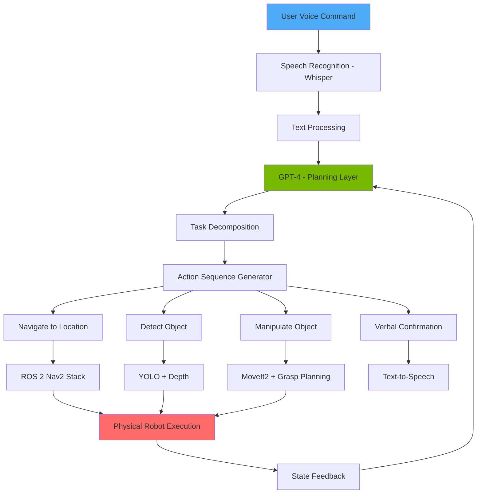
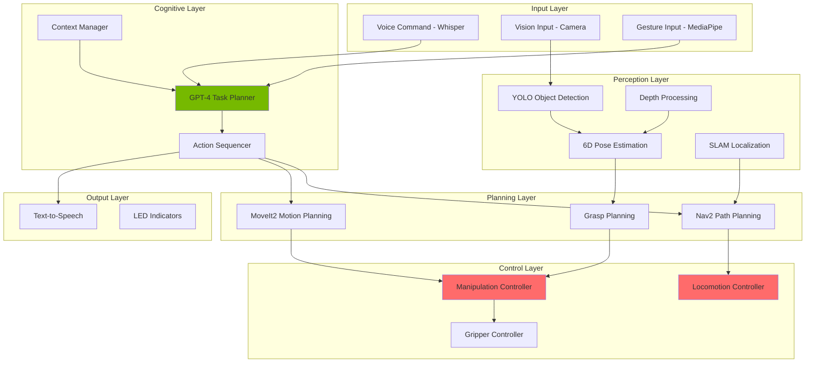

# Chapter 3: Conversational Robotics & Capstone Project

**Week 13** | **Duration**: 8-10 hours | **Complexity**: Advanced

---

## Learning Objectives

By the end of this chapter, you will be able to:

1. **Integrate** GPT models for natural language understanding and robot control planning
2. **Implement** speech recognition using OpenAI Whisper for voice command interfaces
3. **Build** natural language to ROS 2 action translation systems
4. **Design** multi-modal interaction systems combining speech, vision, and gesture
5. **Deploy** complete Voice-to-Action pipelines in real-time
6. **Develop** the full capstone project: An autonomous humanoid integrating all course modules

---

## Introduction

**Conversational Robotics** represents the pinnacle of human-robot interaction. Instead of programming specific behaviors or using complex interfaces, users interact with robots naturally through speech, just as they would with another person.

This paradigm shift enables:
- **Natural Interaction**: "Bring me the red cup from the table"
- **Adaptive Behavior**: Robot interprets context and intent
- **Error Recovery**: "No, the other cup" - robot understands corrections
- **Explanation**: Robot can explain its actions and limitations

The integration of Large Language Models (LLMs) with robotics creates **embodied AI agents** that understand language, perceive the world, reason about actions, and execute physical tasks.

> "The goal is not to make robots that understand humans, but to make robots that humans understand." - Cynthia Breazeal

**What Makes Conversational Robotics Revolutionary?**

1. **Natural Language Interface**: No training required for users
2. **Task Abstraction**: High-level commands, low-level execution
3. **Context Awareness**: Understanding implicit information
4. **Learning from Interaction**: Improving through conversation
5. **Explainable Actions**: Robot can justify its decisions

This chapter builds toward the **capstone project**: a fully autonomous humanoid that accepts voice commands, plans actions, navigates environments, detects objects, manipulates them, and provides verbal confirmation.

---

## 1. Integrating GPT Models for Robot Control

### 1.1 LLM-Robot Architecture



### 1.2 GPT as Task Planner

```python
import openai
import json
from typing import List, Dict

class RobotGPTPlanner:
    """GPT-4 based high-level task planner for robot control"""

    def __init__(self, api_key: str):
        openai.api_key = api_key
        self.model = "gpt-4-turbo"

        # System prompt defining robot capabilities
        self.system_prompt = """You are a task planning AI for a humanoid robot with the following capabilities:

1. NAVIGATION: Move to named locations (kitchen, living_room, bedroom, table_1, etc.)
2. DETECTION: Detect and localize objects using vision (bottle, cup, book, phone, etc.)
3. MANIPULATION: Pick up, place, and hand objects to humans
4. COMMUNICATION: Speak to confirm actions or report status

Given a natural language command, generate a JSON action sequence.

Action format:
{
    "actions": [
        {"type": "navigate", "target": "location_name"},
        {"type": "detect", "object": "object_class"},
        {"type": "pick", "object": "object_class"},
        {"type": "place", "location": "location_name"},
        {"type": "speak", "message": "confirmation_text"}
    ]
}

Always include speak actions for user feedback.
If a task is impossible, return {"error": "explanation"}.
"""

        self.conversation_history = []

    def plan_task(self, user_command: str, context: Dict = None) -> Dict:
        """
        Convert natural language command to robot action sequence

        Args:
            user_command: Natural language instruction
            context: Optional context (robot state, known objects, etc.)

        Returns:
            action_plan: Dictionary with action sequence or error
        """
        # Build context message
        context_str = ""
        if context:
            context_str = f"\n\nCurrent context:\n"
            if "location" in context:
                context_str += f"- Robot location: {context['location']}\n"
            if "holding" in context:
                context_str += f"- Holding: {context['holding']}\n"
            if "visible_objects" in context:
                context_str += f"- Visible objects: {', '.join(context['visible_objects'])}\n"

        # Create prompt
        user_message = f"{user_command}{context_str}"

        # Call GPT-4
        messages = [
            {"role": "system", "content": self.system_prompt}
        ]

        # Add conversation history for context
        messages.extend(self.conversation_history[-6:])  # Last 3 exchanges

        messages.append({"role": "user", "content": user_message})

        try:
            response = openai.chat.completions.create(
                model=self.model,
                messages=messages,
                temperature=0.3,  # Lower temperature for consistent planning
                response_format={"type": "json_object"}
            )

            # Parse response
            plan_json = response.choices[0].message.content
            action_plan = json.loads(plan_json)

            # Update conversation history
            self.conversation_history.append({"role": "user", "content": user_message})
            self.conversation_history.append({"role": "assistant", "content": plan_json})

            return action_plan

        except Exception as e:
            return {"error": f"Planning failed: {str(e)}"}

    def validate_action_sequence(self, action_plan: Dict) -> bool:
        """Validate that action sequence is feasible"""
        if "error" in action_plan:
            return False

        if "actions" not in action_plan:
            return False

        valid_action_types = ["navigate", "detect", "pick", "place", "speak", "wait"]

        for action in action_plan["actions"]:
            if "type" not in action:
                return False
            if action["type"] not in valid_action_types:
                return False

        return True

    def handle_correction(self, correction: str, previous_plan: Dict) -> Dict:
        """
        Handle user corrections to previous plan

        Args:
            correction: Correction instruction (e.g., "No, the red cup")
            previous_plan: Previous action plan

        Returns:
            updated_plan: Corrected action plan
        """
        context_msg = f"The previous plan was: {json.dumps(previous_plan)}. User correction: {correction}"

        return self.plan_task(context_msg)


# Example usage
planner = RobotGPTPlanner(api_key="your_openai_api_key")

# Test commands
commands = [
    "Go to the kitchen and bring me a water bottle",
    "Pick up the book on the table and bring it here",
    "Find my phone and tell me where it is",
    "Clear the table by putting all objects on the counter"
]

for cmd in commands:
    print(f"\nCommand: {cmd}")

    # Generate plan
    plan = planner.plan_task(cmd, context={"location": "living_room"})

    print(f"Plan: {json.dumps(plan, indent=2)}")

    # Validate
    valid = planner.validate_action_sequence(plan)
    print(f"Valid: {valid}")
```

**Example Output**:
```json
Command: "Go to the kitchen and bring me a water bottle"
Plan: {
  "actions": [
    {"type": "speak", "message": "Going to the kitchen to find a water bottle"},
    {"type": "navigate", "target": "kitchen"},
    {"type": "detect", "object": "bottle"},
    {"type": "pick", "object": "bottle"},
    {"type": "navigate", "target": "living_room"},
    {"type": "speak", "message": "Here is your water bottle"}
  ]
}
Valid: True
```

### 1.3 Function Calling for Robot Actions

```python
class RobotGPTFunctionCaller:
    """GPT-4 with function calling for direct robot control"""

    def __init__(self, api_key: str):
        openai.api_key = api_key
        self.model = "gpt-4-turbo"

        # Define available robot functions
        self.functions = [
            {
                "name": "navigate_to",
                "description": "Navigate robot to a named location",
                "parameters": {
                    "type": "object",
                    "properties": {
                        "location": {
                            "type": "string",
                            "description": "Target location name (e.g., 'kitchen', 'table_1')"
                        }
                    },
                    "required": ["location"]
                }
            },
            {
                "name": "detect_object",
                "description": "Detect and localize specific object class",
                "parameters": {
                    "type": "object",
                    "properties": {
                        "object_class": {
                            "type": "string",
                            "description": "Object class to detect (e.g., 'bottle', 'cup')"
                        }
                    },
                    "required": ["object_class"]
                }
            },
            {
                "name": "pick_object",
                "description": "Pick up detected object",
                "parameters": {
                    "type": "object",
                    "properties": {
                        "object_id": {
                            "type": "string",
                            "description": "Detected object identifier"
                        }
                    },
                    "required": ["object_id"]
                }
            },
            {
                "name": "place_object",
                "description": "Place held object at location",
                "parameters": {
                    "type": "object",
                    "properties": {
                        "location": {
                            "type": "string",
                            "description": "Placement location"
                        }
                    },
                    "required": ["location"]
                }
            },
            {
                "name": "speak",
                "description": "Speak text to user",
                "parameters": {
                    "type": "object",
                    "properties": {
                        "text": {
                            "type": "string",
                            "description": "Text to speak"
                        }
                    },
                    "required": ["text"]
                }
            }
        ]

        # Function implementation mapping
        self.function_implementations = {
            "navigate_to": self.execute_navigation,
            "detect_object": self.execute_detection,
            "pick_object": self.execute_pick,
            "place_object": self.execute_place,
            "speak": self.execute_speak
        }

    def process_command(self, user_command: str) -> List[Dict]:
        """Process command and execute function calls"""
        messages = [
            {
                "role": "system",
                "content": "You are a robot control assistant. Use the available functions to execute user commands."
            },
            {"role": "user", "content": user_command}
        ]

        execution_log = []

        # Iterative function calling
        while True:
            response = openai.chat.completions.create(
                model=self.model,
                messages=messages,
                functions=self.functions,
                function_call="auto"
            )

            message = response.choices[0].message

            # Check if function call requested
            if message.function_call:
                function_name = message.function_call.name
                function_args = json.loads(message.function_call.arguments)

                print(f"Calling: {function_name}({function_args})")

                # Execute function
                result = self.function_implementations[function_name](**function_args)

                execution_log.append({
                    "function": function_name,
                    "arguments": function_args,
                    "result": result
                })

                # Add function result to conversation
                messages.append({
                    "role": "function",
                    "name": function_name,
                    "content": json.dumps(result)
                })

            else:
                # No more function calls - task complete
                print(f"Response: {message.content}")
                break

        return execution_log

    # Function implementations (placeholders)
    def execute_navigation(self, location: str) -> Dict:
        """Execute navigation command"""
        print(f"→ Navigating to {location}...")
        # Call ROS 2 Nav2 here
        return {"success": True, "location": location}

    def execute_detection(self, object_class: str) -> Dict:
        """Execute object detection"""
        print(f"→ Detecting {object_class}...")
        # Call YOLO detection here
        return {"success": True, "detected": True, "object_id": f"{object_class}_001"}

    def execute_pick(self, object_id: str) -> Dict:
        """Execute pick action"""
        print(f"→ Picking {object_id}...")
        # Call MoveIt2 + grasp planner here
        return {"success": True, "holding": object_id}

    def execute_place(self, location: str) -> Dict:
        """Execute place action"""
        print(f"→ Placing object at {location}...")
        # Call MoveIt2 place planner here
        return {"success": True}

    def execute_speak(self, text: str) -> Dict:
        """Execute speech"""
        print(f"→ Speaking: '{text}'")
        # Call TTS here
        return {"success": True}


# Example usage
caller = RobotGPTFunctionCaller(api_key="your_openai_api_key")

command = "Go to the kitchen, find a bottle, pick it up, and bring it to the living room"
execution_log = caller.process_command(command)

print("\nExecution Summary:")
for entry in execution_log:
    print(f"  {entry['function']}: {entry['result']}")
```

---

## 2. Speech Recognition with OpenAI Whisper

### 2.1 Whisper Integration

```python
import whisper
import numpy as np
import sounddevice as sd
from scipy.io.wavfile import write
import threading
import queue

class SpeechRecognizer:
    """Real-time speech recognition using OpenAI Whisper"""

    def __init__(self, model_size="base", language="en"):
        """
        Args:
            model_size: Whisper model size (tiny, base, small, medium, large)
            language: Target language code
        """
        print(f"Loading Whisper {model_size} model...")
        self.model = whisper.load_model(model_size)
        self.language = language

        # Audio parameters
        self.sample_rate = 16000
        self.channels = 1
        self.chunk_duration = 5  # seconds per chunk

        # State
        self.is_listening = False
        self.audio_queue = queue.Queue()
        self.transcript_callback = None

    def transcribe_audio(self, audio_data: np.ndarray) -> Dict:
        """
        Transcribe audio using Whisper

        Args:
            audio_data: Audio samples (16kHz, mono)

        Returns:
            result: Dictionary with text and metadata
        """
        # Normalize audio
        audio_data = audio_data.astype(np.float32) / 32768.0

        # Transcribe
        result = self.model.transcribe(
            audio_data,
            language=self.language,
            task="transcribe",
            fp16=False  # Set True if using CUDA
        )

        return result

    def transcribe_file(self, audio_path: str) -> str:
        """Transcribe audio file"""
        result = self.model.transcribe(audio_path, language=self.language)
        return result["text"]

    def start_continuous_recognition(self, callback=None):
        """Start continuous speech recognition"""
        self.is_listening = True
        self.transcript_callback = callback

        # Start audio capture thread
        capture_thread = threading.Thread(target=self._audio_capture_loop)
        capture_thread.daemon = True
        capture_thread.start()

        # Start processing thread
        process_thread = threading.Thread(target=self._audio_process_loop)
        process_thread.daemon = True
        process_thread.start()

        print("Listening... (Press Ctrl+C to stop)")

    def stop_continuous_recognition(self):
        """Stop continuous recognition"""
        self.is_listening = False

    def _audio_capture_loop(self):
        """Capture audio in chunks"""
        chunk_samples = int(self.sample_rate * self.chunk_duration)

        while self.is_listening:
            # Record chunk
            audio_chunk = sd.rec(
                chunk_samples,
                samplerate=self.sample_rate,
                channels=self.channels,
                dtype='int16'
            )
            sd.wait()

            # Add to queue
            self.audio_queue.put(audio_chunk.flatten())

    def _audio_process_loop(self):
        """Process audio chunks"""
        while self.is_listening:
            if not self.audio_queue.empty():
                audio_chunk = self.audio_queue.get()

                # Transcribe
                result = self.transcribe_audio(audio_chunk)

                text = result["text"].strip()

                if len(text) > 0:
                    print(f"Recognized: {text}")

                    # Call callback if provided
                    if self.transcript_callback:
                        self.transcript_callback(text, result)

    def record_command(self, duration=5) -> str:
        """
        Record single command

        Args:
            duration: Recording duration in seconds

        Returns:
            transcript: Recognized text
        """
        print(f"Recording for {duration} seconds...")

        # Record
        audio_data = sd.rec(
            int(duration * self.sample_rate),
            samplerate=self.sample_rate,
            channels=self.channels,
            dtype='int16'
        )
        sd.wait()

        print("Processing...")

        # Transcribe
        result = self.transcribe_audio(audio_data.flatten())

        return result["text"]


class VoiceActivityDetection:
    """Simple voice activity detection"""

    def __init__(self, threshold=0.02, min_duration=0.3):
        self.threshold = threshold
        self.min_duration = min_duration

    def detect_speech(self, audio: np.ndarray, sample_rate: int) -> bool:
        """
        Detect if audio contains speech

        Args:
            audio: Audio samples
            sample_rate: Sample rate

        Returns:
            has_speech: True if speech detected
        """
        # Compute energy
        audio_float = audio.astype(np.float32) / 32768.0
        energy = np.mean(audio_float ** 2)

        # Check duration
        duration = len(audio) / sample_rate

        return energy > self.threshold and duration > self.min_duration


# Example usage
recognizer = SpeechRecognizer(model_size="base")

# Single command recognition
command = recognizer.record_command(duration=5)
print(f"Command: {command}")

# Continuous recognition with callback
def on_transcript(text, result):
    print(f"Confidence: {result.get('language_probability', 0):.2f}")
    # Process command here
    pass

# recognizer.start_continuous_recognition(callback=on_transcript)
# Keep running...
```

### 2.2 Wake Word Detection

```python
import pvporcupine
import struct

class WakeWordDetector:
    """Wake word detection using Porcupine"""

    def __init__(self, access_key: str, keyword="jarvis"):
        """
        Args:
            access_key: Porcupine access key
            keyword: Wake word (jarvis, computer, hey siri, etc.)
        """
        self.porcupine = pvporcupine.create(
            access_key=access_key,
            keywords=[keyword]
        )

        self.sample_rate = self.porcupine.sample_rate
        self.frame_length = self.porcupine.frame_length

        self.is_active = False
        self.detection_callback = None

    def start_detection(self, callback=None):
        """Start wake word detection"""
        self.is_active = True
        self.detection_callback = callback

        print(f"Listening for wake word... (sample_rate={self.sample_rate})")

        # Audio stream
        import pyaudio

        pa = pyaudio.PyAudio()
        audio_stream = pa.open(
            rate=self.sample_rate,
            channels=1,
            format=pyaudio.paInt16,
            input=True,
            frames_per_buffer=self.frame_length
        )

        try:
            while self.is_active:
                pcm = audio_stream.read(self.frame_length)
                pcm_unpacked = struct.unpack_from("h" * self.frame_length, pcm)

                keyword_index = self.porcupine.process(pcm_unpacked)

                if keyword_index >= 0:
                    print("Wake word detected!")

                    if self.detection_callback:
                        self.detection_callback()

        finally:
            audio_stream.close()
            pa.terminate()

    def stop_detection(self):
        """Stop detection"""
        self.is_active = False
        self.porcupine.delete()


# Example usage
def on_wake_word():
    print("Robot activated! Listening for command...")
    # Start command recognition

# detector = WakeWordDetector(access_key="your_key", keyword="jarvis")
# detector.start_detection(callback=on_wake_word)
```

---

## 3. Natural Language to ROS 2 Action Translation

### 3.1 Action Executor

```python
#!/usr/bin/env python3
"""
Natural Language to ROS 2 Action Translator
"""

import rclpy
from rclpy.node import Node
from rclpy.action import ActionClient
from nav2_msgs.action import NavigateToPose
from geometry_msgs.msg import PoseStamped
from std_msgs.msg import String
import json

class NLActionExecutor(Node):
    def __init__(self):
        super().__init__('nl_action_executor')

        # GPT planner
        self.planner = RobotGPTPlanner(api_key="your_key")

        # Action clients
        self.nav_client = ActionClient(self, NavigateToPose, 'navigate_to_pose')

        # Speech recognizer
        self.recognizer = SpeechRecognizer()

        # Publishers
        self.speech_pub = self.create_publisher(String, '/robot_speech', 10)

        # Known locations
        self.locations = {
            'kitchen': {'x': 2.0, 'y': 1.0, 'yaw': 0.0},
            'living_room': {'x': 0.0, 'y': 0.0, 'yaw': 0.0},
            'bedroom': {'x': 3.0, 'y': 3.0, 'yaw': 1.57},
            'table_1': {'x': 1.5, 'y': 0.5, 'yaw': 0.0}
        }

        # State
        self.current_location = 'living_room'
        self.holding_object = None

        self.get_logger().info('NL Action Executor ready')

    def execute_voice_command(self, voice_input: str):
        """
        Execute natural language command

        Args:
            voice_input: Recognized speech text
        """
        self.get_logger().info(f"Command received: {voice_input}")

        # Get context
        context = {
            'location': self.current_location,
            'holding': self.holding_object
        }

        # Plan with GPT
        action_plan = self.planner.plan_task(voice_input, context)

        if "error" in action_plan:
            self.speak(f"Sorry, I cannot do that: {action_plan['error']}")
            return

        # Execute action sequence
        self.execute_action_sequence(action_plan['actions'])

    def execute_action_sequence(self, actions: List[Dict]):
        """Execute sequence of actions"""
        for action in actions:
            action_type = action['type']

            self.get_logger().info(f"Executing: {action_type}")

            if action_type == 'navigate':
                success = self.execute_navigation(action['target'])
            elif action_type == 'detect':
                success = self.execute_detection(action['object'])
            elif action_type == 'pick':
                success = self.execute_pick(action['object'])
            elif action_type == 'place':
                success = self.execute_place(action['location'])
            elif action_type == 'speak':
                self.speak(action['message'])
                success = True
            elif action_type == 'wait':
                self.get_clock().sleep_for(rclpy.duration.Duration(seconds=action.get('duration', 1)))
                success = True
            else:
                self.get_logger().warn(f"Unknown action: {action_type}")
                success = False

            if not success:
                self.speak(f"Failed to complete action: {action_type}")
                break

    def execute_navigation(self, target_location: str) -> bool:
        """Execute navigation action"""
        if target_location not in self.locations:
            self.get_logger().error(f"Unknown location: {target_location}")
            return False

        # Create goal
        goal_msg = NavigateToPose.Goal()
        goal_msg.pose = PoseStamped()
        goal_msg.pose.header.frame_id = 'map'
        goal_msg.pose.header.stamp = self.get_clock().now().to_msg()

        loc = self.locations[target_location]
        goal_msg.pose.pose.position.x = loc['x']
        goal_msg.pose.pose.position.y = loc['y']

        # Quaternion from yaw
        from scipy.spatial.transform import Rotation as R
        quat = R.from_euler('z', loc['yaw']).as_quat()
        goal_msg.pose.pose.orientation.x = quat[0]
        goal_msg.pose.pose.orientation.y = quat[1]
        goal_msg.pose.pose.orientation.z = quat[2]
        goal_msg.pose.pose.orientation.w = quat[3]

        # Send goal
        self.get_logger().info(f"Navigating to {target_location}...")
        self.nav_client.wait_for_server()

        future = self.nav_client.send_goal_async(goal_msg)
        rclpy.spin_until_future_complete(self, future)

        goal_handle = future.result()

        if not goal_handle.accepted:
            self.get_logger().error("Navigation goal rejected")
            return False

        # Wait for completion
        result_future = goal_handle.get_result_async()
        rclpy.spin_until_future_complete(self, result_future)

        result = result_future.result()

        if result.status == 4:  # SUCCEEDED
            self.current_location = target_location
            self.get_logger().info(f"Arrived at {target_location}")
            return True
        else:
            self.get_logger().error("Navigation failed")
            return False

    def execute_detection(self, object_class: str) -> bool:
        """Execute object detection"""
        # Call detection service
        self.get_logger().info(f"Detecting {object_class}...")
        # Implementation using YOLO service
        return True

    def execute_pick(self, object_id: str) -> bool:
        """Execute pick action"""
        self.get_logger().info(f"Picking {object_id}...")
        # Call MoveIt2 pick service
        self.holding_object = object_id
        return True

    def execute_place(self, location: str) -> bool:
        """Execute place action"""
        self.get_logger().info(f"Placing at {location}...")
        # Call MoveIt2 place service
        self.holding_object = None
        return True

    def speak(self, text: str):
        """Speak text"""
        self.get_logger().info(f"Speaking: {text}")
        msg = String()
        msg.data = text
        self.speech_pub.publish(msg)

    def listen_for_commands(self):
        """Start listening loop"""
        def on_command(text, _):
            self.execute_voice_command(text)

        self.recognizer.start_continuous_recognition(callback=on_command)


def main(args=None):
    rclpy.init(args=args)
    executor = NLActionExecutor()

    # Start voice listening
    executor.listen_for_commands()

    try:
        rclpy.spin(executor)
    except KeyboardInterrupt:
        pass
    finally:
        executor.destroy_node()
        rclpy.shutdown()


if __name__ == '__main__':
    main()
```

---

## 4. Multi-Modal Interaction

### 4.1 Gesture Recognition

```python
import cv2
import mediapipe as mp

class GestureRecognizer:
    """Hand gesture recognition using MediaPipe"""

    def __init__(self):
        self.mp_hands = mp.solutions.hands
        self.hands = self.mp_hands.Hands(
            static_image_mode=False,
            max_num_hands=2,
            min_detection_confidence=0.5
        )

        self.mp_draw = mp.solutions.drawing_utils

    def recognize_gesture(self, image):
        """
        Recognize hand gestures

        Args:
            image: RGB image

        Returns:
            gestures: List of recognized gestures
        """
        # Convert to RGB
        image_rgb = cv2.cvtColor(image, cv2.COLOR_BGR2RGB)

        # Process
        results = self.hands.process(image_rgb)

        gestures = []

        if results.multi_hand_landmarks:
            for hand_landmarks in results.multi_hand_landmarks:
                gesture = self.classify_gesture(hand_landmarks)
                gestures.append(gesture)

                # Draw landmarks
                self.mp_draw.draw_landmarks(
                    image, hand_landmarks, self.mp_hands.HAND_CONNECTIONS
                )

        return gestures, image

    def classify_gesture(self, landmarks):
        """Classify gesture from landmarks"""
        # Extract finger states
        fingers_up = self.count_fingers_up(landmarks)

        # Gesture mapping
        if fingers_up == 0:
            return "FIST"
        elif fingers_up == 1:
            return "POINT"
        elif fingers_up == 2:
            return "PEACE"
        elif fingers_up == 5:
            return "OPEN_HAND"
        else:
            return "UNKNOWN"

    def count_fingers_up(self, landmarks):
        """Count extended fingers"""
        # Simplified finger counting
        finger_tips = [4, 8, 12, 16, 20]  # Thumb, Index, Middle, Ring, Pinky
        finger_pips = [2, 6, 10, 14, 18]

        count = 0

        for tip, pip in zip(finger_tips, finger_pips):
            tip_y = landmarks.landmark[tip].y
            pip_y = landmarks.landmark[pip].y

            if tip_y < pip_y:  # Finger extended
                count += 1

        return count


class MultiModalController:
    """Multi-modal interaction controller"""

    def __init__(self):
        self.gesture_recognizer = GestureRecognizer()
        self.speech_recognizer = SpeechRecognizer()

        # Gesture commands
        self.gesture_commands = {
            "POINT": "come_here",
            "OPEN_HAND": "stop",
            "PEACE": "confirm",
            "FIST": "cancel"
        }

    def process_frame(self, image):
        """Process video frame for gestures"""
        gestures, annotated_image = self.gesture_recognizer.recognize_gesture(image)

        for gesture in gestures:
            if gesture in self.gesture_commands:
                command = self.gesture_commands[gesture]
                print(f"Gesture command: {command}")
                # Execute command

        return annotated_image

    def fuse_speech_and_gesture(self, speech_text, gesture):
        """Combine speech and gesture for richer interaction"""
        # Example: "Bring me that" + POINT gesture = point-based navigation
        if "that" in speech_text.lower() and gesture == "POINT":
            return "bring_pointed_object"
        elif "stop" in speech_text.lower() or gesture == "OPEN_HAND":
            return "emergency_stop"

        return None
```

---

## 5. CAPSTONE PROJECT: The Autonomous Humanoid

### 5.1 Project Overview

**Objective**: Build a fully autonomous humanoid robot system that:
1. Accepts natural voice commands
2. Plans multi-step actions using GPT-4
3. Navigates to target locations
4. Detects and localizes objects using vision
5. Picks up and manipulates objects
6. Provides verbal feedback

**System Architecture**:



### 5.2 Complete System Implementation

```python
#!/usr/bin/env python3
"""
CAPSTONE: Autonomous Humanoid System
Complete integration of all modules
"""

import rclpy
from rclpy.node import Node
from rclpy.action import ActionClient
from nav2_msgs.action import NavigateToPose
from geometry_msgs.msg import PoseStamped, Pose
from sensor_msgs.msg import Image, JointState
from std_msgs.msg import String
from cv_bridge import CvBridge
import numpy as np
import json
from enum import Enum

class RobotState(Enum):
    IDLE = 0
    LISTENING = 1
    PLANNING = 2
    NAVIGATING = 3
    DETECTING = 4
    APPROACHING = 5
    GRASPING = 6
    TRANSPORTING = 7
    PLACING = 8
    CONFIRMING = 9
    ERROR = 10

class AutonomousHumanoid(Node):
    """Complete autonomous humanoid system"""

    def __init__(self):
        super().__init__('autonomous_humanoid')

        # ============= COGNITIVE COMPONENTS =============
        self.gpt_planner = RobotGPTPlanner(api_key="your_key")
        self.speech_recognizer = SpeechRecognizer(model_size="base")

        # ============= PERCEPTION COMPONENTS =============
        self.object_detector = ObjectDetector()
        self.depth_integration = None
        self.bridge = CvBridge()

        # ============= PLANNING COMPONENTS =============
        self.grasp_planner = GraspPlanner()
        # MoveIt2 planner would be initialized here

        # ============= ROS 2 INTERFACES =============

        # Action clients
        self.nav_client = ActionClient(self, NavigateToPose, 'navigate_to_pose')

        # Subscribers
        self.rgb_sub = self.create_subscription(
            Image, '/camera/color/image_raw', self.rgb_callback, 10
        )
        self.depth_sub = self.create_subscription(
            Image, '/camera/depth/image_rect_raw', self.depth_callback, 10
        )

        # Publishers
        self.speech_pub = self.create_publisher(String, '/robot_speech', 10)
        self.joint_pub = self.create_publisher(JointState, '/joint_commands', 10)

        # ============= STATE MANAGEMENT =============
        self.state = RobotState.IDLE
        self.current_plan = None
        self.current_action_index = 0

        self.current_location = "living_room"
        self.holding_object = None
        self.detected_objects = []

        self.latest_rgb = None
        self.latest_depth = None

        # Known locations
        self.locations = {
            'kitchen': Pose(position={'x': 2.0, 'y': 1.0, 'z': 0.0}),
            'living_room': Pose(position={'x': 0.0, 'y': 0.0, 'z': 0.0}),
            'bedroom': Pose(position={'x': 3.0, 'y': 3.0, 'z': 0.0}),
            'table': Pose(position={'x': 1.5, 'y': 0.5, 'z': 0.0})
        }

        # ============= MAIN CONTROL LOOP =============
        self.timer = self.create_timer(0.1, self.main_loop)

        self.get_logger().info("========================================")
        self.get_logger().info("  AUTONOMOUS HUMANOID SYSTEM ONLINE")
        self.get_logger().info("========================================")
        self.get_logger().info("Ready to receive voice commands!")

    # ============= MAIN STATE MACHINE =============

    def main_loop(self):
        """Main control loop"""

        if self.state == RobotState.IDLE:
            # Wait for voice command
            pass

        elif self.state == RobotState.PLANNING:
            self.execute_planning()

        elif self.state == RobotState.NAVIGATING:
            # Navigation handled by action server
            pass

        elif self.state == RobotState.DETECTING:
            self.execute_detection()

        elif self.state == RobotState.APPROACHING:
            self.execute_approach()

        elif self.state == RobotState.GRASPING:
            self.execute_grasp()

        elif self.state == RobotState.TRANSPORTING:
            # Navigation to placement location
            pass

        elif self.state == RobotState.PLACING:
            self.execute_place()

        elif self.state == RobotState.CONFIRMING:
            self.execute_confirmation()

        elif self.state == RobotState.ERROR:
            self.handle_error()

    def process_voice_command(self, command_text: str):
        """Process incoming voice command"""
        self.get_logger().info(f"Received command: '{command_text}'")

        self.speak("I understood. Let me plan how to do that.")

        # Change to planning state
        self.state = RobotState.PLANNING

        # Get context
        context = {
            'location': self.current_location,
            'holding': self.holding_object,
            'visible_objects': [obj['class'] for obj in self.detected_objects]
        }

        # Plan with GPT
        self.current_plan = self.gpt_planner.plan_task(command_text, context)
        self.current_action_index = 0

    def execute_planning(self):
        """Execute current action in plan"""
        if self.current_plan is None:
            self.state = RobotState.ERROR
            return

        if "error" in self.current_plan:
            self.speak(f"I cannot do that: {self.current_plan['error']}")
            self.state = RobotState.IDLE
            return

        if self.current_action_index >= len(self.current_plan['actions']):
            # Plan complete
            self.speak("Task completed successfully!")
            self.state = RobotState.IDLE
            self.current_plan = None
            return

        # Get current action
        action = self.current_plan['actions'][self.current_action_index]
        action_type = action['type']

        self.get_logger().info(f"Executing action {self.current_action_index}: {action_type}")

        # Dispatch to appropriate handler
        if action_type == 'navigate':
            self.start_navigation(action['target'])
        elif action_type == 'detect':
            self.start_detection(action['object'])
        elif action_type == 'pick':
            self.start_pick_sequence()
        elif action_type == 'place':
            self.start_place_sequence(action.get('location'))
        elif action_type == 'speak':
            self.speak(action['message'])
            self.current_action_index += 1
        elif action_type == 'wait':
            duration = action.get('duration', 1.0)
            self.get_clock().sleep_for(rclpy.duration.Duration(seconds=duration))
            self.current_action_index += 1

    # ============= NAVIGATION =============

    def start_navigation(self, target_location: str):
        """Start navigation to location"""
        if target_location not in self.locations:
            self.get_logger().error(f"Unknown location: {target_location}")
            self.state = RobotState.ERROR
            return

        self.speak(f"Navigating to {target_location}")

        goal_msg = NavigateToPose.Goal()
        goal_msg.pose = PoseStamped()
        goal_msg.pose.header.frame_id = 'map'
        goal_msg.pose.header.stamp = self.get_clock().now().to_msg()
        goal_msg.pose.pose = self.locations[target_location]

        # Send goal
        self.state = RobotState.NAVIGATING

        self.nav_client.wait_for_server()
        future = self.nav_client.send_goal_async(
            goal_msg,
            feedback_callback=self.nav_feedback_callback
        )
        future.add_done_callback(lambda f: self.nav_goal_response_callback(f, target_location))

    def nav_feedback_callback(self, feedback_msg):
        """Navigation feedback"""
        # Could display progress here
        pass

    def nav_goal_response_callback(self, future, target_location):
        """Navigation goal accepted"""
        goal_handle = future.result()

        if not goal_handle.accepted:
            self.get_logger().error("Navigation goal rejected")
            self.state = RobotState.ERROR
            return

        result_future = goal_handle.get_result_async()
        result_future.add_done_callback(lambda f: self.nav_result_callback(f, target_location))

    def nav_result_callback(self, future, target_location):
        """Navigation complete"""
        result = future.result()

        if result.status == 4:  # SUCCEEDED
            self.current_location = target_location
            self.speak(f"Arrived at {target_location}")
            self.current_action_index += 1
            self.state = RobotState.PLANNING
        else:
            self.get_logger().error("Navigation failed")
            self.state = RobotState.ERROR

    # ============= OBJECT DETECTION =============

    def start_detection(self, object_class: str):
        """Start object detection"""
        self.speak(f"Looking for {object_class}")
        self.state = RobotState.DETECTING
        self.target_object_class = object_class

    def execute_detection(self):
        """Perform object detection"""
        if self.latest_rgb is None or self.latest_depth is None:
            return

        # Detect objects
        detections = self.object_detector.detect_objects(self.latest_rgb)

        # Filter to target class
        target_detections = [d for d in detections if d['class'] == self.target_object_class]

        if len(target_detections) > 0:
            self.speak(f"Found {self.target_object_class}")

            # Get 3D position
            det = target_detections[0]
            pos_3d, point_cloud = self.depth_integration.get_object_3d_position(
                det, self.latest_depth
            )

            if pos_3d is not None:
                det['position_3d'] = pos_3d
                det['point_cloud'] = point_cloud

                self.detected_objects = [det]

                # Move to next action
                self.current_action_index += 1
                self.state = RobotState.PLANNING
            else:
                self.speak("Could not determine object position")
                self.state = RobotState.ERROR
        else:
            self.speak(f"Could not find {self.target_object_class}")
            self.state = RobotState.ERROR

    # ============= MANIPULATION =============

    def start_pick_sequence(self):
        """Start pick sequence"""
        if len(self.detected_objects) == 0:
            self.speak("No object detected to pick")
            self.state = RobotState.ERROR
            return

        self.speak("Approaching object")
        self.state = RobotState.APPROACHING

    def execute_approach(self):
        """Approach detected object"""
        obj = self.detected_objects[0]
        point_cloud = obj['point_cloud']

        # Compute grasp
        normals = self.estimate_normals(point_cloud)
        grasps = self.grasp_planner.compute_grasp_candidates(point_cloud, normals)

        if len(grasps) == 0:
            self.speak("Could not find valid grasp")
            self.state = RobotState.ERROR
            return

        # Select best grasp
        self.target_grasp = grasps[0]

        # Transition to grasping
        self.state = RobotState.GRASPING

    def execute_grasp(self):
        """Execute grasp"""
        self.speak("Grasping object")

        # Here would be MoveIt2 + force control integration
        # For now, simulate
        self.get_logger().info("Executing grasp motion...")

        # Simulate successful grasp
        self.holding_object = self.detected_objects[0]['class']
        self.detected_objects = []

        self.speak(f"Picked up {self.holding_object}")

        # Move to next action
        self.current_action_index += 1
        self.state = RobotState.PLANNING

    def start_place_sequence(self, location=None):
        """Start place sequence"""
        if self.holding_object is None:
            self.speak("Not holding anything to place")
            self.state = RobotState.ERROR
            return

        self.speak(f"Placing {self.holding_object}")
        self.state = RobotState.PLACING

    def execute_place(self):
        """Execute place"""
        # MoveIt2 place motion
        self.get_logger().info("Executing place motion...")

        # Simulate
        placed_object = self.holding_object
        self.holding_object = None

        self.speak(f"Placed {placed_object}")

        # Move to next action
        self.current_action_index += 1
        self.state = RobotState.PLANNING

    # ============= COMMUNICATION =============

    def speak(self, text: str):
        """Speak text"""
        self.get_logger().info(f"Robot: {text}")
        msg = String()
        msg.data = text
        self.speech_pub.publish(msg)

    def execute_confirmation(self):
        """Confirm task completion"""
        self.speak("Task completed. Returning to idle state.")
        self.state = RobotState.IDLE

    # ============= ERROR HANDLING =============

    def handle_error(self):
        """Handle error state"""
        self.speak("I encountered an error. Stopping.")
        self.state = RobotState.IDLE
        self.current_plan = None

    # ============= SENSOR CALLBACKS =============

    def rgb_callback(self, msg):
        """RGB image callback"""
        self.latest_rgb = self.bridge.imgmsg_to_cv2(msg, desired_encoding='bgr8')

    def depth_callback(self, msg):
        """Depth image callback"""
        self.latest_depth = self.bridge.imgmsg_to_cv2(msg, desired_encoding='32FC1')

    # ============= UTILITIES =============

    def estimate_normals(self, point_cloud):
        """Estimate surface normals"""
        # Simplified - use Open3D for real implementation
        return np.tile([0, 0, 1], (len(point_cloud), 1))


def main(args=None):
    rclpy.init(args=args)

    # Create autonomous humanoid
    robot = AutonomousHumanoid()

    # Start voice listening
    def on_voice_command(text, _):
        robot.process_voice_command(text)

    robot.speech_recognizer.start_continuous_recognition(callback=on_voice_command)

    try:
        rclpy.spin(robot)
    except KeyboardInterrupt:
        pass
    finally:
        robot.destroy_node()
        rclpy.shutdown()


if __name__ == '__main__':
    main()
```

### 5.3 Launch Configuration

```python
# autonomous_humanoid.launch.py

from launch import LaunchDescription
from launch_ros.actions import Node
from launch.actions import IncludeLaunchDescription
from launch.launch_description_sources import PythonLaunchDescriptionSource
from ament_index_python.packages import get_package_share_directory
import os

def generate_launch_description():
    return LaunchDescription([
        # Isaac Sim (if using simulation)
        # Or physical robot drivers

        # Navigation stack
        IncludeLaunchDescription(
            PythonLaunchDescriptionSource([
                os.path.join(get_package_share_directory('nav2_bringup'), 'launch'),
                '/bringup_launch.py'
            ])
        ),

        # MoveIt2
        IncludeLaunchDescription(
            PythonLaunchDescriptionSource([
                os.path.join(get_package_share_directory('humanoid_moveit_config'), 'launch'),
                '/moveit.launch.py'
            ])
        ),

        # Object detection
        Node(
            package='humanoid_perception',
            executable='object_detection_node',
            name='object_detector',
            output='screen'
        ),

        # Autonomous humanoid system
        Node(
            package='autonomous_humanoid',
            executable='autonomous_humanoid',
            name='autonomous_humanoid',
            output='screen',
            parameters=[{
                'gpt_api_key': os.environ.get('OPENAI_API_KEY', ''),
                'whisper_model': 'base'
            }]
        ),

        # Text-to-speech
        Node(
            package='humanoid_speech',
            executable='tts_node',
            name='text_to_speech',
            output='screen'
        )
    ])
```

### 5.4 Testing and Evaluation

**Test Scenarios**:

1. **Simple Fetch**:
   - Command: "Go to the kitchen and bring me a bottle"
   - Expected: Navigate → Detect → Pick → Return → Confirm

2. **Multi-Step Task**:
   - Command: "Clean the table by putting everything on the counter"
   - Expected: Detect all objects → Pick each → Place on counter → Confirm

3. **Clarification**:
   - Command: "Bring me that cup"
   - Expected: Request clarification or use gesture input

4. **Error Recovery**:
   - Command: "Bring me a sandwich"
   - Expected: "I cannot find a sandwich" (if not present)

**Performance Metrics**:

| Metric | Target | Measurement |
|--------|--------|-------------|
| **Voice Recognition Accuracy** | >90% | Word Error Rate |
| **Task Completion Rate** | >80% | Successful tasks / Total tasks |
| **Navigation Success** | >95% | Arrivals / Attempts |
| **Grasp Success** | >75% | Successful grasps / Attempts |
| **Average Task Time** | less than 180s | Time from command to completion |

---

## 6. Practical Exercises

### Exercise 1: Voice Command Parser

**Objective**: Implement robust voice command parsing.

**Tasks**:
1. Handle different phrasings of same command
2. Extract parameters (objects, locations, actions)
3. Handle ambiguous commands
4. Implement correction mechanism

### Exercise 2: Multi-Modal Integration

**Objective**: Combine speech and gesture.

**Tasks**:
1. Implement point-based object selection
2. Use gestures for confirmation/cancellation
3. Handle simultaneous speech and gesture
4. Create fusion logic

### Exercise 3: Error Recovery

**Objective**: Build robust error handling.

**Tasks**:
1. Detect navigation failures
2. Handle "object not found" scenarios
3. Implement retry logic
4. Provide helpful error messages

### Exercise 4: Complete Capstone

**Objective**: Deploy full autonomous humanoid system.

**Tasks**:
1. Integrate all modules
2. Test on real/simulated robot
3. Perform 10 different task scenarios
4. Measure performance metrics
5. Create demonstration video

---

## Summary

This chapter completed the journey to autonomous humanoid robotics:

**Key Achievements**:
1. **Conversational AI**: GPT-4 integration for natural language control
2. **Speech Interface**: Whisper-based voice command recognition
3. **Action Translation**: Natural language to ROS 2 action mapping
4. **Multi-Modal**: Speech + vision + gesture integration
5. **Capstone System**: Fully autonomous humanoid integrating all modules

**Complete Capability Stack**:

```
Voice Command → Speech Recognition → Language Understanding → Task Planning
        ↓
Navigation + Object Detection + Pose Estimation + Grasp Planning
        ↓
Locomotion + Manipulation + Force Control + Verbal Feedback
        ↓
Autonomous Task Execution in Human Environments
```

**What You've Built**:
- A humanoid that understands natural language
- A system that perceives the 3D world
- A robot that plans and executes complex tasks
- An embodied AI agent that interacts naturally with humans

---

## Assessment Questions

### Conceptual Questions

1. **Why are Large Language Models well-suited for robot task planning?**

2. **What are the advantages of using OpenAI Whisper over traditional ASR systems?**

3. **Explain the difference between task-level planning (GPT) and motion-level planning (MoveIt2).**

4. **Why is multi-modal interaction (speech + gesture) more robust than speech alone?**

5. **What are the main challenges in deploying LLMs on physical robots?**

### Technical Questions

6. **How does function calling in GPT-4 differ from traditional prompt-based responses?**

7. **What latency is acceptable for voice-to-action systems? Why?**

8. **How can context (robot state, environment) improve GPT planning?**

9. **Why is error handling critical in autonomous systems?**

10. **What are the privacy implications of cloud-based speech recognition?**

### System Design Questions

11. **Design a fail-safe system for the autonomous humanoid. What safety mechanisms are essential?**

12. **How would you handle network failures in a cloud-dependent system?**

13. **Design an evaluation protocol for the capstone system.**

14. **How would you extend the system to handle multi-robot coordination?**

15. **Propose improvements to reduce task execution time by 50%.**

---

## Final Project Deliverables

### Required Components

1. **Source Code**:
   - Complete ROS 2 package
   - All nodes and launch files
   - Configuration files

2. **Documentation**:
   - System architecture diagram
   - API documentation
   - Setup and deployment guide

3. **Demonstration**:
   - Video showing 5 different task completions
   - Performance metrics report
   - Failure case analysis

4. **Report** (10-15 pages):
   - System design decisions
   - Integration challenges and solutions
   - Performance evaluation
   - Future improvements

### Evaluation Criteria

| Category | Weight | Criteria |
|----------|--------|----------|
| **Functionality** | 40% | System works end-to-end |
| **Integration** | 20% | All modules properly integrated |
| **Code Quality** | 15% | Clean, documented, maintainable |
| **Performance** | 15% | Meets target metrics |
| **Innovation** | 10% | Creative solutions, extensions |

---

## Congratulations!

You've completed the **Physical AI & Humanoid Robotics** course!

**You've Mastered**:
- ROS 2 for robot control
- Gazebo and Isaac Sim for simulation
- Nav2 for autonomous navigation
- Computer vision for object detection
- MoveIt2 for motion planning
- GPT-4 for conversational robotics
- Complete system integration

**You Can Now**:
- Design humanoid robot systems
- Implement locomotion and manipulation
- Build vision-guided behaviors
- Create voice-controlled robots
- Deploy embodied AI agents

**Next Steps**:
1. Deploy on real humanoid hardware
2. Contribute to open-source robotics
3. Research advanced topics (learning from demonstration, sim-to-real transfer)
4. Join robotics companies or research labs
5. Build your own autonomous robot startup!

---

## Additional Resources

**Courses & Tutorials**:
- NVIDIA Isaac Sim Tutorials
- ROS 2 Advanced Patterns
- OpenAI GPT-4 for Robotics

**Research Papers**:
- "PaLM-E: An Embodied Multimodal Language Model"
- "RT-2: Vision-Language-Action Models"
- "Code as Policies: Language Model Programs for Embodied Control"

**Community**:
- ROS Discourse
- NVIDIA Isaac Forums
- Humanoid Robotics Slack

**Open Source Projects**:
- RT-1 / RT-2 (Google Robotics)
- MobilityGPT
- RoboAgent

---

## Appendix: Complete System Checklist

**Hardware**:
- [ ] RTX GPU workstation
- [ ] RealSense D435i camera
- [ ] Microphone array
- [ ] Humanoid robot (sim or physical)

**Software**:
- [ ] Ubuntu 22.04
- [ ] ROS 2 Humble
- [ ] NVIDIA Isaac Sim
- [ ] YOLOv8
- [ ] OpenAI Whisper
- [ ] GPT-4 API access
- [ ] MoveIt2

**Implementation**:
- [ ] Voice recognition node
- [ ] GPT planner node
- [ ] Object detection node
- [ ] Navigation interface
- [ ] Manipulation controller
- [ ] Text-to-speech node
- [ ] Main orchestrator
- [ ] Launch files
- [ ] Configuration files

**Testing**:
- [ ] Voice command accuracy
- [ ] Navigation success rate
- [ ] Object detection accuracy
- [ ] Grasp success rate
- [ ] End-to-end task completion
- [ ] Error recovery
- [ ] Performance metrics

**Documentation**:
- [ ] Setup guide
- [ ] API documentation
- [ ] Demo video
- [ ] Final report

---

*Course Complete! You are now equipped to build the future of embodied AI and humanoid robotics. Go forth and create amazing autonomous systems!*

**Welcome to the era of Physical AI.** 🤖✨
